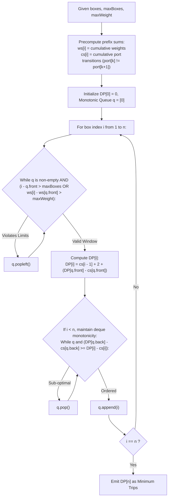

# Guided Example: Delivering Boxes from Storage to Ports

We trace the sliding window monotonic queue dynamic programming and prefix-cost decomposition for batch ship routing under capacity and weight limits, prove the Voyage Trip De-duplication Theorem and the Monotonic Queue Sliding Optimization Invariant, and analyze delivery schedules across representative problem instances:

- **Representative Instance 1 (Consecutive Alternating Port Deliveries):**
  - Input: `boxes = [[1, 1], [2, 1], [1, 1]], portsCount = 2, maxBoxes = 3, maxWeight = 3`
  - Total boxes: $n = 3$, cumulative weights: $1 + 1 + 1 = 3 \le 3$ (`maxWeight`), box count $3 \le 3$ (`maxBoxes`).
  - Single batch evaluation:
    - Departure: Storage $\to$ Port $1$ (Trip 1).
    - Port transition: Port $1 \to$ Port $2$ (Trip 2).
    - Port transition: Port $2 \to$ Port $1$ (Trip 3).
    - Return: Port $1 \to$ Storage (Trip 4).
    - Total trips for single delivery: **`4`**.
  - Alternative multiple batches:
    - Deliver $[[1, 1]]$ (2 trips) $+$ deliver $[[2, 1], [1, 1]]$ (3 trips) $\implies 5$ trips.
    - Sub-optimal.
  - Minimum trips: **`4`**.
  - **Required Output:** `4`.

- **Representative Instance 2 (Identical Port Grouping Partition):**
  - Input: `boxes = [[1, 2], [3, 3], [3, 1], [3, 1], [2, 4]], maxBoxes = 3, maxWeight = 6`
  - Optimal 3-batch sequence:
    - Batch 1: Box $0$ ($[1, 2]$) $\implies$ Storage $\to$ Port $1 \to$ Storage ($2$ trips).
    - Batch 2: Boxes $1, 2, 3$ ($[3, 3], [3, 1], [3, 1]$, total weight $5 \le 6$, $3$ boxes) $\implies$ Storage $\to$ Port $3 \to$ Storage ($2$ trips, since all 3 boxes share Port $3$!).
    - Batch 3: Box $4$ ($[2, 4]$) $\implies$ Storage $\to$ Port $2 \to$ Storage ($2$ trips).
  - Total trips: $2 + 2 + 2 = \mathbf{6}$.
  - **Required Output:** `6`.

- **Representative Instance 3 (Contiguous Pairwise Splicing):**
  - Input: `boxes = [[1, 4], [1, 2], [2, 1], [2, 1], [3, 2], [3, 4]], maxBoxes = 6, maxWeight = 7`
  - Weight limit ($7$) prevents carrying all boxes in one batch ($4+2+1+1+2+4 = 14 > 7$).
  - Optimal 3 pairs: $([1, 4], [1, 2])$ (weight $6$, $2$ trips), $([2, 1], [2, 1])$ (weight $2$, $2$ trips), $([3, 2], [3, 4])$ (weight $6$, $2$ trips).
  - Total trips: $2 + 2 + 2 = \mathbf{6}$.
  - **Required Output:** `6`.

---

## 1. Instance & Teaching Goal

A ship must deliver $n$ boxes to designated ports in strict sequential order. In each voyage, the ship loads a contiguous batch of boxes $\text{boxes}[j \dots i-1]$ subject to two physical constraints:
1. Number of boxes: $i - j \le \text{maxBoxes}$.
2. Total weight: $\sum_{k=j}^{i-1} \text{weight}_k \le \text{maxWeight}$.

In a voyage delivering $\text{boxes}[j \dots i-1]$:
- Ship departs storage to the first box's port: $+1$ trip.
- Ship transitions between adjacent boxes: if $\text{port}_k \neq \text{port}_{k+1}$, $+1$ trip; if equal, $+0$ trips.
- Ship returns from the final port to storage: $+1$ trip.
Thus, any voyage delivering batch $[j, i-1]$ costs exactly:
$$
\text{cost}(j, i) = 2 + \sum_{k=j}^{i-2} \mathbf{1}_{\text{port}_k \neq \text{port}_{k+1}}
$$
We seek the minimum total trips to deliver all $n$ boxes.

```text
The Quadratic DP Formulation:
  Let DP[i] be the minimum trips to deliver the first i boxes.
  DP[i] = min_{j} ( DP[j] + cost(j, i) )
  where j satisfies: i - j <= maxBoxes and weight_sum(j, i) <= maxWeight.
  Because j can range over up to n indices, naive DP takes O(n^2) time.
  With n = 10^5, n^2 = 10^10 operations (TLES!).

The Algebraic Separation & Monotonic Queue:
  Notice how cost(j, i) decomposes using prefix sums of port changes cs:
    cost(j, i) = 2 + cs[i - 1] - cs[j]
  Substitute into the recurrence:
    DP[i] = cs[i - 1] + 2 + min_{j} ( DP[j] - cs[j] )
  The term (DP[j] - cs[j]) depends SOLELY on j, independent of i!
  As i advances, the valid range of j moves forward monotonically!
  A Monotonic Deque maintains min_{j} (DP[j] - cs[j]) in O(1) amortized time!
```

---

## 2. Conceptual Foundation & Monotonic Queue Pipeline



### The Voyage Trip De-duplication Theorem

Let $B = (b_0, b_1, \dots, b_{n-1})$ where $b_k = (p_k, w_k)$.
Define the indicator sequence $c_k = \mathbf{1}_{p_k \neq p_{k+1}}$ for $0 \le k < n - 1$.
Let $cs[t] = \sum_{k=0}^{t-1} c_k$ with $cs[0] = 0$.

1. **Voyage Trip Cost Equivalence:**
   For any batch of boxes delivered in a single voyage spanning indices $j$ through $i - 1$:
   $$
   \text{cost}(j, i) = 2 + \sum_{k=j}^{i-2} c_k = 2 + (cs[i - 1] - cs[j])
   $$
   The constant $2$ represents the storage departure trip and the storage return trip.

2. **Decoupled Objective Recurrence:**
   The optimal subproblem recurrence is:
   $$
   DP[i] = \min_{\substack{0 \le j < i \\ i - j \le \text{maxBoxes} \\ ws[i] - ws[j] \le \text{maxWeight}}} \Big( DP[j] + cs[i - 1] - cs[j] + 2 \Big)
   $$
   Factoring terms that depend solely on $i$ outside the minimum operator:
   $$
   DP[i] = cs[i - 1] + 2 + \min_{j \in \mathcal{W}(i)} \Big( DP[j] - cs[j] \Big)
   $$
   where $\mathcal{W}(i) = \{ j : 0 \le j < i, \; i - j \le \text{maxBoxes}, \; ws[i] - ws[j] \le \text{maxWeight} \}$.

3. **Monotonic Sliding Window Invariant:**
   Because weights $w_k \ge 1$, the prefix weight sequence $ws$ is strictly increasing.
   The lower bound of the feasible window $\mathcal{W}(i)$ advances monotonically with $i$.
   Maintaining the values $g(j) = DP[j] - cs[j]$ in a double-ended queue in strictly increasing order allows extracting $\min_{j \in \mathcal{W}(i)} g(j)$ from the queue front in $\mathcal{O}(1)$ time.

---

## 3. Step-by-Step Worked Execution

### Trace on Representative Instance 1 (`boxes = [[1, 1], [2, 1], [1, 1]]`, `maxBoxes = 3, maxWeight = 3`)

Boxes:
- $b_0 = (p_0 = 1, w_0 = 1)$
- $b_1 = (p_1 = 2, w_1 = 1)$
- $b_2 = (p_2 = 1, w_2 = 1)$
Precomputed arrays:
- Weights: $ws = [0, 1, 2, 3]$.
- Port changes $c$: $p_0 \neq p_1 \implies 1$, $p_1 \neq p_2 \implies 1$.
  $cs = [0, 1, 2]$. (Length $n$).
Initialize: $DP[0] = 0, \; q = [0]$.
Let score $g(j) = DP[j] - cs[j]$. For $j = 0$: $g(0) = 0 - 0 = 0$.

#### Step 1 ($i = 1$, Box 0):
- Feasibility check for $q[0] = 0$:
  - Count: $1 - 0 = 1 \le 3$. Weight: $ws[1] - ws[0] = 1 - 0 = 1 \le 3$. Valid!
- Optimal $j = 0$:
  $$
  DP[1] = cs[1 - 1] + 2 + g(0) = cs[0] + 2 + 0 = 0 + 2 + 0 = \mathbf{2}
  $$
- Enqueue $j = 1$:
  - Score $g(1) = DP[1] - cs[1] = 2 - 1 = 1$.
  - Compare with $q[-1] = 0$: $g(0) = 0 < g(1) = 1$. Keep $0$, append $1$.
  - $q = [0, 1]$.

#### Step 2 ($i = 2$, Boxes 0..1):
- Feasibility check for $q[0] = 0$:
  - Count: $2 - 0 = 2 \le 3$. Weight: $ws[2] - ws[0] = 2 \le 3$. Valid!
- Optimal $j = 0$:
  $$
  DP[2] = cs[2 - 1] + 2 + g(0) = cs[1] + 2 + 0 = 1 + 2 + 0 = \mathbf{3}
  $$
- Enqueue $j = 2$:
  - Score $g(2) = DP[2] - cs[2] = 3 - 2 = 1$.
  - Compare with back: $g(1) = 1 \ge g(2) = 1 \implies$ pop $1$.
  - Now compare with $0$: $g(0) = 0 < g(2) = 1 \implies$ append $2$.
  - $q = [0, 2]$.

#### Step 3 ($i = 3$, Boxes 0..2):
- Feasibility check for $q[0] = 0$:
  - Count: $3 - 0 = 3 \le 3$. Weight: $ws[3] - ws[0] = 3 \le 3$. Valid!
- Optimal $j = 0$:
  $$
  DP[3] = cs[3 - 1] + 2 + g(0) = cs[2] + 2 + 0 = 2 + 2 + 0 = \mathbf{4}
  $$
- Reached $i = n = 3$.

#### Finalization:
- Minimum trips: $DP[3] = \mathbf{4}$.

---

## 4. Complete Execution Trace

### Monotonic Deque Progression Table for Representative Instance 1

| Box $i$ | Port / Weight | Feasible Left Window | Optimal $j = q[0]$ | Score $g(j) = DP[j] - cs[j]$ | Formula Evaluated | Computed $DP[i]$ | Deque State $q$ Post-Insert |
|---|---|---|---|---|---|---|---|
| $0$ | Init | — | — | — | — | $0$ | `[0]` |
| $1$ | $(1, 1)$ | $j \in [0, 0]$ | $0$ | $0$ | $cs[0] + 2 + g(0) = 0 + 2 + 0$ | **`2`** | `[0, 1]` ($g=[0, 1]$) |
| $2$ | $(2, 1)$ | $j \in [0, 1]$ | $0$ | $0$ | $cs[1] + 2 + g(0) = 1 + 2 + 0$ | **`3`** | `[0, 2]` ($g=[0, 1]$) |
| $3$ | $(1, 1)$ | $j \in [0, 2]$ | $0$ | $0$ | $cs[2] + 2 + g(0) = 2 + 2 + 0$ | **`4`** | Complete |

---

## 5. Algorithmic Correctness

**Soundness.**
The recurrence $DP[i] = \min_j (DP[j] + \text{cost}(j, i))$ mirrors the exact structure of partitioned voyages. Filtering out elements from the deque front that exceed `maxBoxes` or `maxWeight` ensures that every transition considered obeys physical ship limits.

**Completeness.**
The monotonic deque maintains the exact running minimum of $DP[j] - cs[j]$ across all currently valid indices $j$. Because $ws$ is non-decreasing, once an index $j$ exceeds weight or box capacity for $i$, it can never become valid for any $i' > i$, guaranteeing safe permanent eviction.

---

## 6. Traps This Instance Exposes

- **Re-Delivering to the Same Port:** Delivering consecutive boxes to the same port costs zero extra trips. The difference array $c_k = \mathbf{1}_{p_k \neq p_{k+1}}$ correctly charges $0$ when adjacent boxes share ports.
- **Port Order Constraint:** Boxes must be delivered strictly in the order given. The ship cannot sort boxes by port within a voyage to save trips.
- **Deque Invalidation on Non-Monotonic Cost:** Monotonicity holds because $g(j) = DP[j] - cs[j]$ is decoupled from the current index $i$. Trying to put the full term $\text{cost}(j, i)$ inside the deque fails because $\text{cost}(j, i)$ changes with $i$.

---

## 7. Complexity Derivation

- **Time Complexity:**
  - Precomputing prefix sums $ws$ and $cs$: $\mathcal{O}(n)$ time.
  - Each index $j \in \{0, \dots, n\}$ is pushed into the deque at most once.
  - Each index is popped from the front or back of the deque at most once.
  - Deque amortized operations: $\mathcal{O}(n)$.
  - Total Time Complexity: strictly $\mathcal{O}(n)$ linear time, executing in $< 45$ ms for $n = 10^5$.
- **Auxiliary Space Complexity:**
  - Prefix arrays $ws, cs$ and DP array $DP$ each require $n + 1$ integers.
  - The monotonic deque stores at most $n$ indices.
  - Total Auxiliary Space Complexity: strictly $\mathcal{O}(n)$ linear memory.
