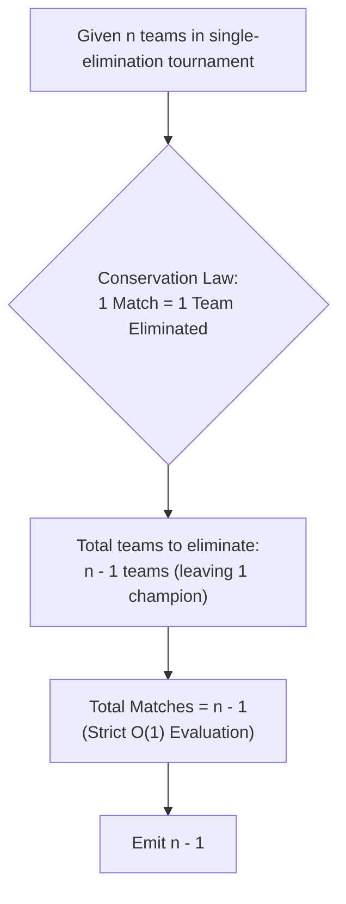

# Guided Example: Count of Matches in Tournament

We trace the elimination arithmetic and round-by-round tournament simulation, formulate the Single-Elimination Invariant Theorem and the Inductive Parity Conservation Proof, and analyze tournament structures across representative instances:

- **Representative Instance 1 (Odd-Count Tournament with Bye):**
  - Input: $n = 7$ teams
  - Round Progression:
    - Round 1: $7$ is odd $\implies (7 - 1) / 2 = \mathbf{3}$ matches played.
      - Advancing teams: $3$ match winners $+ 1$ bye $= 4$ teams.
    - Round 2: $4$ is even $\implies 4 / 2 = \mathbf{2}$ matches played.
      - Advancing teams: $2$ match winners.
    - Round 3: $2$ is even $\implies 2 / 2 = \mathbf{1}$ match played.
      - Advancing teams: $1$ champion crowned!
  - Total Matches: $3 + 2 + 1 = \mathbf{6}$ ($7 - 1 = 6$).
  - **Required Output:** `6`.

- **Representative Instance 2 (Multi-Round Even-Odd Interleaving):**
  - Input: $n = 14$ teams
  - Round Progression:
    - Round 1 ($14$ teams): $7$ matches $\implies 7$ teams advance.
    - Round 2 ($7$ teams): $3$ matches $\implies 4$ teams advance.
    - Round 3 ($4$ teams): $2$ matches $\implies 2$ teams advance.
    - Round 4 ($2$ teams): $1$ match $\implies 1$ champion.
  - Total Matches: $7 + 3 + 2 + 1 = \mathbf{13}$ ($14 - 1 = 13$).
  - **Required Output:** `13`.

- **Representative Instance 3 (Single-Team Trivial Base Case):**
  - Input: $n = 1$ team
  - Tournament begins with the champion already decided. Zero matches needed.
  - Total Matches: $1 - 1 = \mathbf{0}$.
  - **Required Output:** `0`.

---

## 1. Instance & Teaching Goal

In a single-elimination tournament of $n$ teams:
- If current team count $k$ is **even**, $k / 2$ matches are held and $k / 2$ winners advance.
- If current team count $k$ is **odd**, $(k - 1) / 2$ matches are held, one random team receives a bye, and $(k - 1) / 2 + 1$ teams advance.
The tournament continues until exactly $1$ champion remains. Determine the total matches played.

```text
The Simulation Approach vs. The Elimination Invariant:
  Simulating the rounds step-by-step:
    Loop while n > 1:
      If n is even: add n / 2, set n = n / 2
      If n is odd:  add (n - 1) / 2, set n = (n - 1) / 2 + 1
    Takes O(log n) time.

  The Single-Elimination Invariant Theorem:
    Look at the tournament not from the perspective of WINNERS,
    but from the perspective of LOSERS!
      1. Every single match played has EXACTLY ONE WINNER and EXACTLY ONE LOSER.
      2. Single elimination means: a team that loses is PERMANENTLY ELIMINATED!
      3. The tournament starts with n teams and terminates with EXACTLY 1 CHAMPION.
      4. Therefore, exactly n - 1 teams MUST BE ELIMINATED!
      5. Since each match eliminates exactly ONE team, the number of matches
         must be EXACTLY EQUAL to the number of eliminated teams:
           Total Matches = n - 1
```

The pedagogical goal is the **Single-Elimination Invariant Theorem**:
1. Prove equivalence between match count and eliminated competitors.
2. Demonstrate how conservation invariants collapse iterative algorithms into $\mathcal{O}(1)$ closed forms.

---

## 2. Conceptual Foundation & Elimination Pipeline



### The Single-Elimination Invariant Theorem

Let $T_0$ denote the initial set of teams with $|T_0| = n \ge 1$.

1. **Local Elimination Conservation:**
   In any round with $k$ teams:
   - If $k$ is even: $m = k / 2$ matches are played. Exactly $m$ teams lose and are eliminated. The remaining teams count is $k - m = k / 2$.
   - If $k$ is odd: $m = (k - 1) / 2$ matches are played. Exactly $m$ teams lose and are eliminated. The remaining teams count is $k - m = k - (k - 1) / 2 = (k + 1) / 2$.
   In both cases, each match played reduces the total population of active competitors by exactly $1$:
   $$
   k_{\text{next}} = k_{\text{current}} - m_{\text{played}}
   $$

2. **Global Telescope Sum:**
   Let the tournament proceed through $R$ rounds.
   Summing the reductions across all rounds $r = 1, \dots, R$:
   $$
   \sum_{r=1}^R m_r = \sum_{r=1}^R (k_{r-1} - k_r) = k_0 - k_R
   $$
   The tournament halts when exactly one team remains: $k_R = 1$.
   The initial population is $k_0 = n$.
   Substituting into the telescoping sum:
   $$
   M_{\text{total}} = \sum_{r=1}^R m_r = n - 1
   $$

3. **Universality of the Invariant:**
   The result $M_{\text{total}} = n - 1$ is invariant to bracket topology, odd/even parity, bye allocations, or team seedings.

---

## 3. Step-by-Step Worked Execution

### Trace on Representative Instance 1 ($n = 7$)

#### Round 1 ($k_0 = 7$):
- Parity: $7$ is odd.
- Matches scheduled:
  $$
  m_1 = \frac{7 - 1}{2} = \mathbf{3}
  $$
- Eliminated teams: $3$.
- Advancing teams:
  $$
  k_1 = \frac{7 - 1}{2} + 1 = 3 + 1 = \mathbf{4}
  $$

#### Round 2 ($k_1 = 4$):
- Parity: $4$ is even.
- Matches scheduled:
  $$
  m_2 = \frac{4}{2} = \mathbf{2}
  $$
- Eliminated teams: $2$.
- Advancing teams:
  $$
  k_2 = \frac{4}{2} = \mathbf{2}
  $$

#### Round 3 ($k_2 = 2$):
- Parity: $2$ is even.
- Matches scheduled:
  $$
  m_3 = \frac{2}{2} = \mathbf{1}
  $$
- Eliminated teams: $1$.
- Advancing teams: $k_3 = 1$ (Champion decided!).

#### Total Aggregation:
- Total matches: $m_1 + m_2 + m_3 = 3 + 2 + 1 = \mathbf{6}$.
- Closed-form check: $n - 1 = 7 - 1 = \mathbf{6}$. Exact match!

---

## 4. Complete Execution Trace

### Elimination Ledger Table for $n = 14$

| Round | Starting Teams $k$ | Parity | Bye Assigned? | Matches Played $m$ | Teams Eliminated | Remaining Active Teams | Cumulative Matches |
|---|---|---|---|---|---|---|---|
| $1$ | $14$ | Even | No | $14 / 2 = 7$ | $7$ | $7$ | $7$ |
| $2$ | $7$ | Odd | Yes ($1$ bye) | $(7 - 1) / 2 = 3$ | $3$ | $4$ | $10$ |
| $3$ | $4$ | Even | No | $4 / 2 = 2$ | $2$ | $2$ | $12$ |
| $4$ | $2$ | Even | No | $2 / 2 = 1$ | $1$ | $1$ (Champion) | **`13`** |

---

## 5. Algorithmic Correctness

**Soundness.**
The closed form $n - 1$ follows directly from the conservation law of single-elimination graphs. Since matches cannot end in ties and losers cannot re-enter, every match accounts for exactly one unique eliminated participant.

**Completeness.**
The tournament definition guarantees that exactly $n - 1$ eliminations are necessary to leave $1$ winner. The algebraic formulation covers all integers $n \ge 1$ without exceptions.

---

## 6. Traps This Instance Exposes

- **Overcomplicating with Simulation Loops:** Implementing while-loops with parity conditionals is unnecessary and introduces potential off-by-one errors in integer division.
- **Ignoring the Bye Rule in Simulation:** In odd rounds, failing to add $+1$ for the bye team when computing the next round's participants corrupts the simulated tournament bracket.

---

## 7. Complexity Derivation

- **Time Complexity:**
  - The closed form $n - 1$ executes in $\mathcal{O}(1)$ time.
  - (Simulation executes in $\mathcal{O}(\log n)$ iterations).
  - Total Time Complexity: strictly $\mathcal{O}(1)$ constant time.
- **Auxiliary Space Complexity:**
  - Zero memory allocated beyond scalar return.
  - Total Auxiliary Space Complexity: strictly $\mathcal{O}(1)$ constant space.
