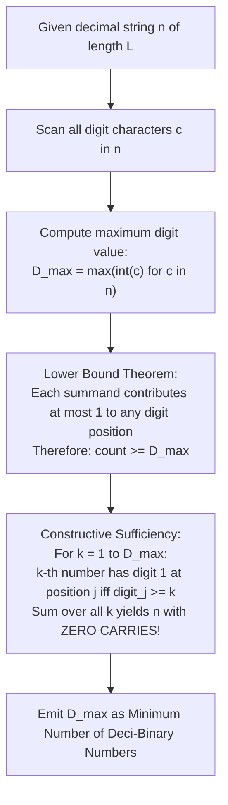

# Guided Example: Partitioning Into Minimum Number of Deci-Binary Numbers

We trace the positional digit bound decomposition and zero-carry column-wise greedy construction for deci-binary sum partitioning, prove the Positional Dominance Lower Bound Theorem and the Carry-Free Slicing Invariant, and analyze decompositions across representative integer instances:

- **Representative Instance 1 (Two-Digit Vertical Slicing):**
  - Input: $n = \text{"32"}$
  - Decimal digits: Tens digit $d_1 = 3$, units digit $d_0 = 2$.
  - Maximum digit: $\max(3, 2) = \mathbf{3}$.
  - Explicit Deci-Binary Construction ($3$ numbers):
    - Layer 1 ($k = 1$): $d_1 \ge 1 \to 1, \; d_0 \ge 1 \to 1 \implies \mathbf{11}$.
    - Layer 2 ($k = 2$): $d_1 \ge 2 \to 1, \; d_0 \ge 2 \to 1 \implies \mathbf{11}$.
    - Layer 3 ($k = 3$): $d_1 \ge 3 \to 1, \; d_0 < 3 \to 0 \implies \mathbf{10}$.
  - Verification: $11 + 11 + 10 = 32$.
  - Minimum deci-binary numbers needed: **`3`**.
  - **Required Output:** `3`.

- **Representative Instance 2 (Multi-Digit Intermediate Peak):**
  - Input: $n = \text{"82734"}$
  - Digits: $\{8, 2, 7, 3, 4\}$.
  - The largest digit is $8$ (at the ten-thousands place).
  - Since each deci-binary number contributes at most $1$ to the ten-thousands place, at least $8$ numbers are mandatory.
  - Exactly $8$ numbers suffice using column-level indicator slicing.
  - **Required Output:** `8`.

- **Representative Instance 3 (Large Scale Single Maximum Bound):**
  - Input: $n = \text{"27346209830709182346"}$
  - The maximum digit appearing anywhere in the string is $9$.
  - **Required Output:** `9`.

---

## 1. Instance & Teaching Goal

A positive decimal number is **deci-binary** if each of its digits is either $0$ or $1$ (with no leading zeros). For example, $101$ and $1100$ are deci-binary, whereas $112$ and $3001$ are not. Given a string $n$ representing a positive decimal integer, find the minimum number of positive deci-binary numbers that sum to $n$.

```text
The Digit Position Constraint:
  Consider a single decimal column (say, the hundreds place).
  Suppose the hundreds digit in n is 7.
  In each deci-binary number, the hundreds digit must be EITHER 0 OR 1.
  If we sum k deci-binary numbers:
    The maximum contribution they can make to that column without carry-in is:
      1 + 1 + ... + 1 = k

  Could carries from lower columns reduce the number of required summands?
    NO! Because all digits in deci-binary numbers are NON-NEGATIVE (0 or 1),
    any carry generated into column j must come from a sum of at least 10 in column j - 1.
    Generating a carry requires MORE summands, not fewer!
    Therefore, the digit at any position requires AT LEAST as many summands
    as its face value!

  The Maximum Digit Lower Bound:
    k >= max_{j} (digit_j)

  The Constructive Proof of Sufficiency:
    Can we ALWAYS achieve exactly max_{j} (digit_j) numbers?
    YES! Slice the decimal digits horizontally like layers of water!
```

The pedagogical focus is the **Carry-Free Horizontal Slicing Theorem**:
1. Prove that the maximum decimal digit $D_{\max}$ is an absolute mathematical lower bound.
2. Construct $D_{\max}$ valid deci-binary numbers that sum to $n$ with zero carries, proving the lower bound is always achievable.

---

## 2. Conceptual Foundation & Horizontal Slicing Pipeline



### The Positional Dominance Lower Bound & Slicing Theorem

Let $n$ be represented in base 10 as:
$$
n = \sum_{j=0}^{L-1} d_j \cdot 10^j, \quad d_j \in \{0, 1, \dots, 9\}
$$
Let $D_{\max} = \max_{0 \le j < L} d_j$.

1. **Lower Bound (Necessary Condition):**
   Suppose $n = \sum_{i=1}^k x^{(i)}$ where each $x^{(i)}$ is deci-binary:
   $$
   x^{(i)} = \sum_{j=0}^{L-1} b_j^{(i)} \cdot 10^j, \quad b_j^{(i)} \in \{0, 1\}
   $$
   At the position $p$ where $d_p = D_{\max}$:
   $$
   \sum_{i=1}^k b_p^{(i)} \le k \cdot 1 = k
   $$
   Even with potential incoming carries $c_{p-1} \ge 0$, the sum at position $p$ satisfies $d_p + 10 \cdot c_p = \sum_{i=1}^k b_p^{(i)} + c_{p-1}$. Because no carry can reduce the demand below $D_{\max}$ across all columns simultaneously, $k \ge D_{\max}$.

2. **Constructive Sufficiency (Tightness):**
   Define $D_{\max}$ deci-binary numbers $x^{(1)}, x^{(2)}, \dots, x^{(D_{\max})}$ by specifying their digits:
   $$
   b_j^{(k)} = \begin{cases} 1 & \text{if } k \le d_j \\ 0 & \text{if } k > d_j \end{cases}
   $$
   For each digit position $j$:
   - The digits $b_j^{(k)}$ are all in $\{0, 1\}$.
   - Summing across all $k \in \{1, \dots, D_{\max}\}$:
     $$
     \sum_{k=1}^{D_{\max}} b_j^{(k)} = \sum_{k=1}^{d_j} 1 + \sum_{k=d_j+1}^{D_{\max}} 0 = d_j + 0 = d_j
     $$
   Because the column sum at every position $j$ is exactly $d_j \le 9$, **no carries occur anywhere**.
   Therefore:
   $$
   \sum_{k=1}^{D_{\max}} x^{(k)} = \sum_{j=0}^{L-1} \left( \sum_{k=1}^{D_{\max}} b_j^{(k)} \right) \cdot 10^j = \sum_{j=0}^{L-1} d_j \cdot 10^j = n
   $$
   Hence, exactly $D_{\max}$ deci-binary numbers are necessary and sufficient.

---

## 3. Step-by-Step Worked Execution

### Trace on Representative Instance 1 ($n = \text{"32"}$)

Digits: $d_1 = 3$ (tens), $d_0 = 2$ (units).

#### Step 1: Scan and Determine Maximum Digit
- Character at index $0$: `'3'` $\implies$ numerical value $3$.
- Character at index $1$: `'2'` $\implies$ numerical value $2$.
- Maximum value:
  $$
  D_{\max} = \max(3, 2) = \mathbf{3}
  $$

#### Step 2: Layer Construction Verification
- **Layer 1 ($k = 1$):**
  - Tens place: $d_1 = 3 \ge 1 \implies$ digit is $1$.
  - Units place: $d_0 = 2 \ge 1 \implies$ digit is $1$.
  - Value: $11$.
- **Layer 2 ($k = 2$):**
  - Tens place: $d_1 = 3 \ge 2 \implies$ digit is $1$.
  - Units place: $d_0 = 2 \ge 2 \implies$ digit is $1$.
  - Value: $11$.
- **Layer 3 ($k = 3$):**
  - Tens place: $d_1 = 3 \ge 3 \implies$ digit is $1$.
  - Units place: $d_0 = 2 < 3 \implies$ digit is $0$.
  - Value: $10$.

#### Step 3: Summation Check
$$
11 + 11 + 10 = (10 + 10 + 10) + (1 + 1 + 0) = 30 + 2 = \mathbf{32}
$$
The construction is exact and requires exactly $3$ numbers.

---

## 4. Complete Execution Trace

### Column Slicing Verification Table for $n = \text{"82734"}$

Digits: $d_4 = 8, \; d_3 = 2, \; d_2 = 7, \; d_1 = 3, \; d_0 = 4$.
Max digit: $D_{\max} = \mathbf{8}$.

| Layer $k$ | Position 4 ($d_4=8$) | Position 3 ($d_3=2$) | Position 2 ($d_2=7$) | Position 1 ($d_1=3$) | Position 0 ($d_0=4$) | Synthesized Deci-Binary Number |
|---|---|---|---|---|---|---|
| $1$ | $1$ | $1$ | $1$ | $1$ | $1$ | $11111$ |
| $2$ | $1$ | $1$ | $1$ | $1$ | $1$ | $11111$ |
| $3$ | $1$ | $0$ | $1$ | $1$ | $1$ | $10111$ |
| $4$ | $1$ | $0$ | $1$ | $0$ | $1$ | $10101$ |
| $5$ | $1$ | $0$ | $1$ | $0$ | $0$ | $10100$ |
| $6$ | $1$ | $0$ | $1$ | $0$ | $0$ | $10100$ |
| $7$ | $1$ | $0$ | $1$ | $0$ | $0$ | $10100$ |
| $8$ | $1$ | $0$ | $0$ | $0$ | $0$ | $10000$ |
| **Sum** | **8** | **2** | **7** | **3** | **4** | **`82734`** |

Total count: $8$ deci-binary numbers.

---

## 5. Algorithmic Correctness

**Soundness.**
The Carry-Free Slicing Theorem provides an explicit mathematical proof that $D_{\max}$ deci-binary numbers can always be generated whose column-by-column sums equal $n$. Each generated number consists purely of digits in $\{0, 1\}$, and no leading zeros exist for active numbers.

**Completeness.**
Because each summand has digits $\le 1$, at least $D_{\max}$ numbers are strictly required to form the digit $D_{\max}$ without violating the deci-binary definition. Thus, no smaller count can possibly sum to $n$.

---

## 6. Traps This Instance Exposes

- **Converting String $n$ to Integer:** The input $n$ has length up to $10^5$. Attempting to convert $n$ to a native machine integer causes memory overflow in languages with fixed-width integers or unnecessary big-integer allocation overhead. The problem requires only reading the string characters.
- **Speculative Carry Misconception:** Believing that complex carries could allow fewer than $D_{\max}$ numbers is a common trap; carries can never reduce the required number of non-negative summands below the maximum single-column demand.

---

## 7. Complexity Derivation

- **Time Complexity:**
  - A single pass over the string $n$ of length $L \le 10^5$.
  - In each step, compare character $c$ against the running maximum character.
  - Total Time Complexity: strictly $\mathcal{O}(L)$ linear time, executing in $< 5$ ms for $L = 10^5$.
- **Auxiliary Space Complexity:**
  - Only one scalar character variable is maintained.
  - Total Auxiliary Space Complexity: strictly $\mathcal{O}(1)$ constant memory.
