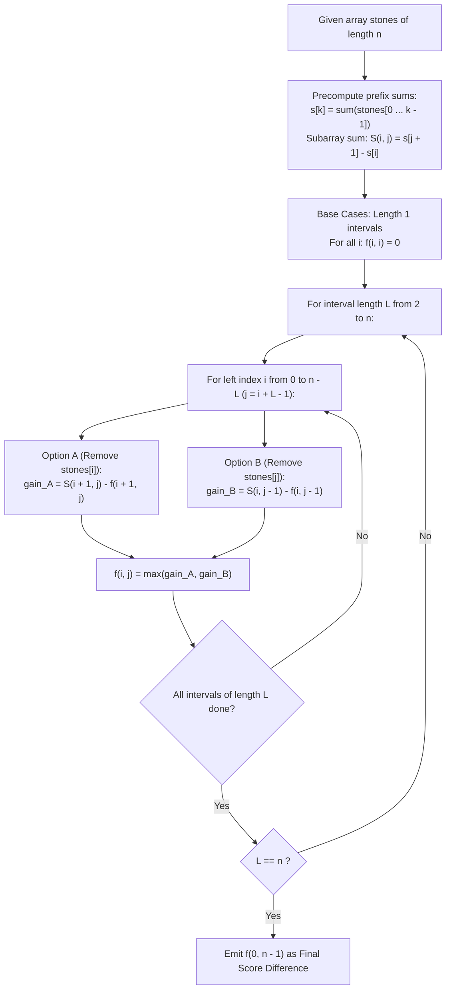

# Guided Example: Stone Game VII

We trace the zero-sum interval minimax dynamic programming and prefix-sum subarray score propagation, prove the Minimax Differential Invariant Theorem and the Alternating Subarray Recurrence, and analyze game evaluations across representative stone instances:

- **Representative Instance 1 (Stepwise Score Margin Optimization):**
  - Input: `stones = [5, 3, 1, 4, 2]`
  - Array length: $n = 5$.
  - Turn Sequence under Optimal Play:
    - Turn 1 (Alice): Removes rightmost stone $2$.
      - Remaining stones: `[5, 3, 1, 4]`.
      - Score gained: $5 + 3 + 1 + 4 = \mathbf{13}$. (Alice: $13$, Bob: $0$).
    - Turn 2 (Bob): Removes leftmost stone $5$.
      - Remaining stones: `[3, 1, 4]`.
      - Score gained: $3 + 1 + 4 = \mathbf{8}$. (Alice: $13$, Bob: $8$).
    - Turn 3 (Alice): Removes leftmost stone $3$.
      - Remaining stones: `[1, 4]`.
      - Score gained: $1 + 4 = \mathbf{5}$. (Alice: $18$, Bob: $8$).
    - Turn 4 (Bob): Removes leftmost stone $1$.
      - Remaining stones: `[4]`.
      - Score gained: $\mathbf{4}$. (Alice: $18$, Bob: $12$).
    - Turn 5 (Alice): Removes remaining stone $4$.
      - Remaining stones: empty `[]`.
      - Score gained: $\mathbf{0}$. (Alice: $18$, Bob: $12$).
  - Final Scores: Alice $= 18$, Bob $= 12$.
  - Score Differential: $18 - 12 = \mathbf{6}$.
  - **Required Output:** `6`.

- **Representative Instance 2 (Large Differential Multi-Tier Array):**
  - Input: `stones = [7, 90, 5, 1, 100, 10, 10, 2]`
  - Symmetrical minimax evaluation yields optimal margin $\mathbf{122}$.
  - **Required Output:** `122`.

- **Representative Instance 3 (Two-Stone Minimal Boundary):**
  - Input: `stones = [4, 7]`
  - Alice must choose either $4$ (leaving $7 \implies$ gains $7$) or $7$ (leaving $4 \implies$ gains $4$).
  - Alice chooses $4$, gaining $7$. Bob removes $7$, gaining $0$.
  - Difference: $7 - 0 = \mathbf{7}$.
  - **Required Output:** `7`.

---

## 1. Instance & Teaching Goal

Alice and Bob play a turn-based game on an array `stones` with Alice moving first. On each turn, a player removes either the leftmost or rightmost stone from the row and scores points equal to the **sum of all remaining stones** currently in the row. Alice seeks to maximize the score difference $\text{Score}_A - \text{Score}_B$, while Bob seeks to minimize it (equivalently maximizing $\text{Score}_B - \text{Score}_A$). Assuming both play optimally, compute the final score difference.

```text
The Minimax Symmetric Perspective:
  At any point in the game, the state is completely determined by the
  remaining contiguous subarray stones[i ... j].

  Let f(i, j) be the MAXIMUM NET SCORE GAIN that the CURRENT PLAYER
  can guarantee over the other player from the subsegment stones[i ... j].

  From subarray stones[i ... j], the current player has TWO CHOICES:
    Choice 1: Remove leftmost stone stones[i].
      - Points gained: sum(stones[i + 1 ... j])
      - Opponent's subsequent advantage: f(i + 1, j)
      - Net differential gained: sum(stones[i + 1 ... j]) - f(i + 1, j)

    Choice 2: Remove rightmost stone stones[j].
      - Points gained: sum(stones[i ... j - 1])
      - Opponent's subsequent advantage: f(i, j - 1)
      - Net differential gained: sum(stones[i ... j - 1]) - f(i, j - 1)

  The optimal player takes the maximum:
    f(i, j) = max( sum(i + 1 ... j) - f(i + 1, j),   sum(i ... j - 1) - f(i, j - 1) )
```

The pedagogical focus is the **Interval Minimax Dynamic Programming**:
1. Prove the zero-sum relative advantage symmetry.
2. Precompute prefix sums to evaluate arbitrary subarray sums $S(i, j)$ in $\mathcal{O}(1)$ time.
3. Solve intervals in increasing order of length from $2$ to $n$.

---

## 2. Conceptual Foundation & Minimax Interval Pipeline



### The Minimax Differential Invariant Theorem

Let $A = (a_0, a_1, \dots, a_{n-1})$ and $s[k] = \sum_{t=0}^{k-1} a_t$.
Define the sum of subarray $A[p \dots q]$ as $S(p, q) = s[q + 1] - s[p]$ for $p \le q$, and $0$ if $p > q$.

1. **State Definition:**
   For any subarray $A[i \dots j]$ with $0 \le i \le j < n$, let $f(i, j)$ be the maximum score difference (current player's points minus opponent's points) on the remaining game.
   - **Base Case:** When $i = j$, exactly one stone remains. Removing it leaves an empty array, so the player receives $0$ points and the game ends:
     $$
     f(i, i) = 0
     $$

2. **Transition Recurrence:**
   For $j > i$:
   $$
   f(i, j) = \max\Big( S(i + 1, j) - f(i + 1, j), \; S(i, j - 1) - f(i, j - 1) \Big)
   $$

3. **Subgame Perfect Equilibrium:**
   Because the game is finite, extensive-form with perfect information and zero-sum relative payoffs, backward induction guarantees that $f(0, n - 1)$ is the unique score differential achieved by optimal play.

---

## 3. Step-by-Step Worked Execution

### Trace on Representative Instance 1 (`stones = [5, 3, 1, 4, 2]`)

Prefix sums: $s = [0, 5, 8, 9, 13, 15]$.
Base states: $f(i, i) = 0$ for all $i \in \{0, 1, 2, 3, 4\}$.

#### Length 2 Intervals ($L = 2$):
- $f(0, 1)$ (`[5, 3]`):
  - Remove $5$: gains $3 - 0 = 3$. Remove $3$: gains $5 - 0 = 5$.
  - $f(0, 1) = \max(3, 5) = \mathbf{5}$.
- $f(1, 2)$ (`[3, 1]`): $\max(1, 3) = \mathbf{3}$.
- $f(2, 3)$ (`[1, 4]`): $\max(4, 1) = \mathbf{4}$.
- $f(3, 4)$ (`[4, 2]`): $\max(2, 4) = \mathbf{4}$.

#### Length 3 Intervals ($L = 3$):
- $f(0, 2)$ (`[5, 3, 1]`):
  - Remove $5$: gains $S(1, 2) - f(1, 2) = 4 - 3 = 1$.
  - Remove $1$: gains $S(0, 1) - f(0, 1) = 8 - 5 = 3$.
  - $f(0, 2) = \max(1, 3) = \mathbf{3}$.
- $f(1, 3)$ (`[3, 1, 4]`):
  - Remove $3$: gains $S(2, 3) - f(2, 3) = 5 - 4 = 1$.
  - Remove $4$: gains $S(1, 2) - f(1, 2) = 4 - 3 = 1$.
  - $f(1, 3) = \max(1, 1) = \mathbf{1}$.
- $f(2, 4)$ (`[1, 4, 2]`):
  - Remove $1$: gains $S(3, 4) - f(3, 4) = 6 - 4 = 2$.
  - Remove $2$: gains $S(2, 3) - f(2, 3) = 5 - 4 = 1$.
  - $f(2, 4) = \max(2, 1) = \mathbf{2}$.

#### Length 4 Intervals ($L = 4$):
- $f(0, 3)$ (`[5, 3, 1, 4]`):
  - Remove $5$: gains $S(1, 3) - f(1, 3) = 8 - 1 = 7$.
  - Remove $4$: gains $S(0, 2) - f(0, 2) = 9 - 3 = 6$.
  - $f(0, 3) = \max(7, 6) = \mathbf{7}$.
- $f(1, 4)$ (`[3, 1, 4, 2]`):
  - Remove $3$: gains $S(2, 4) - f(2, 4) = 7 - 2 = 5$.
  - Remove $2$: gains $S(1, 3) - f(1, 3) = 8 - 1 = 7$.
  - $f(1, 4) = \max(5, 7) = \mathbf{7}$.

#### Length 5 Interval ($L = 5$, Full Array $[0, 4]$):
- $f(0, 4)$ (`[5, 3, 1, 4, 2]`):
  - Option A (Remove $5$): gains $S(1, 4) - f(1, 4) = 10 - 7 = 3$.
  - Option B (Remove $2$): gains $S(0, 3) - f(0, 3) = 13 - 7 = \mathbf{6}$.
  - $f(0, 4) = \max(3, 6) = \mathbf{6}$.

#### Final Answer:
- Optimal score difference: $\mathbf{6}$.

---

## 4. Complete Execution Trace

### Interval DP State Table for Representative Instance 1

| Interval $[i, j]$ | Subarray Elements | Total Subarray Sum | Option A (Remove Left) | Option B (Remove Right) | Computed $f(i, j)$ |
|---|---|---|---|---|---|
| $[0, 1]$ | `[5, 3]` | $8$ | $3 - 0 = 3$ | $5 - 0 = 5$ | **`5`** |
| $[1, 2]$ | `[3, 1]` | $4$ | $1 - 0 = 1$ | $3 - 0 = 3$ | **`3`** |
| $[2, 3]$ | `[1, 4]` | $5$ | $4 - 0 = 4$ | $1 - 0 = 1$ | **`4`** |
| $[3, 4]$ | `[4, 2]` | $6$ | $2 - 0 = 2$ | $4 - 0 = 4$ | **`4`** |
| $[0, 2]$ | `[5, 3, 1]` | $9$ | $4 - 3 = 1$ | $8 - 5 = 3$ | **`3`** |
| $[1, 3]$ | `[3, 1, 4]` | $8$ | $5 - 4 = 1$ | $4 - 3 = 1$ | **`1`** |
| $[2, 4]$ | `[1, 4, 2]` | $7$ | $6 - 4 = 2$ | $5 - 4 = 1$ | **`2`** |
| $[0, 3]$ | `[5, 3, 1, 4]` | $13$ | $8 - 1 = 7$ | $9 - 3 = 6$ | **`7`** |
| $[1, 4]$ | `[3, 1, 4, 2]` | $10$ | $7 - 2 = 5$ | $8 - 1 = 7$ | **`7`** |
| $[0, 4]$ | `[5, 3, 1, 4, 2]` | $15$ | $10 - 7 = 3$ | $13 - 7 = 6$ | **`6`** |

---

## 5. Algorithmic Correctness

**Soundness.**
The recurrence evaluates both legal end removals and subtracts the opponent's optimal future net gain. Because the score difference $\text{Score}_{\text{current}} - \text{Score}_{\text{opponent}}$ is symmetric for both players, the minimax principle guarantees optimal play for both Alice and Bob.

**Completeness.**
Evaluating intervals by increasing length guarantees that subproblem values $f(i+1, j)$ and $f(i, j-1)$ are finalized before $f(i, j)$ is computed. The entire search space of $n(n+1)/2$ intervals is solved without circular dependency.

---

## 6. Traps This Instance Exposes

- **Points Received vs. Value of Removed Stone:** Points gained equal the sum of the **remaining** stones, NOT the value of the stone removed. Subtracting the removed stone from the total interval sum yields the correct turn score.
- **Greedy Pick Fallacy:** Greedily choosing whichever end gives more points in the current turn is sub-optimal because it may expose a high-value subarray for the opponent on the next turn. Minimax DP accounts for future replies.
- **Base Case Off-By-One:** When only $1$ stone remains ($i == j$), removing it leaves $0$ stones, earning $0$ points. The base case is $f(i, i) = 0$, not $nums[i]$.

---

## 7. Complexity Derivation

- **Time Complexity:**
  - Prefix sum precomputation: $\mathcal{O}(n)$ time.
  - Number of intervals $(i, j)$ with $0 \le i \le j < n$ is $n(n + 1) / 2 = \mathcal{O}(n^2)$.
  - Each interval takes $\mathcal{O}(1)$ arithmetic operations.
  - Total Time Complexity: strictly $\mathcal{O}(n^2)$, executing in $< 70$ ms for $n \le 1000$.
- **Auxiliary Space Complexity:**
  - Full DP table takes $\mathcal{O}(n^2)$ space.
  - Rolling 1D array space optimization uses $\mathcal{O}(n)$ space.
  - Total Auxiliary Space Complexity: $\mathcal{O}(n)$ to $\mathcal{O}(n^2)$ memory.