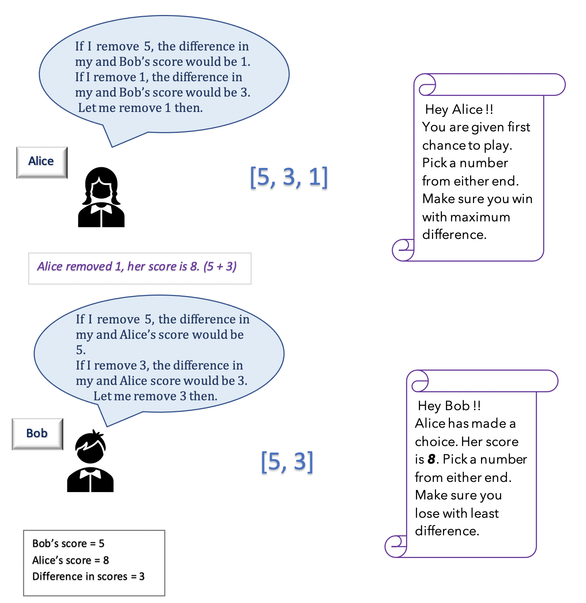
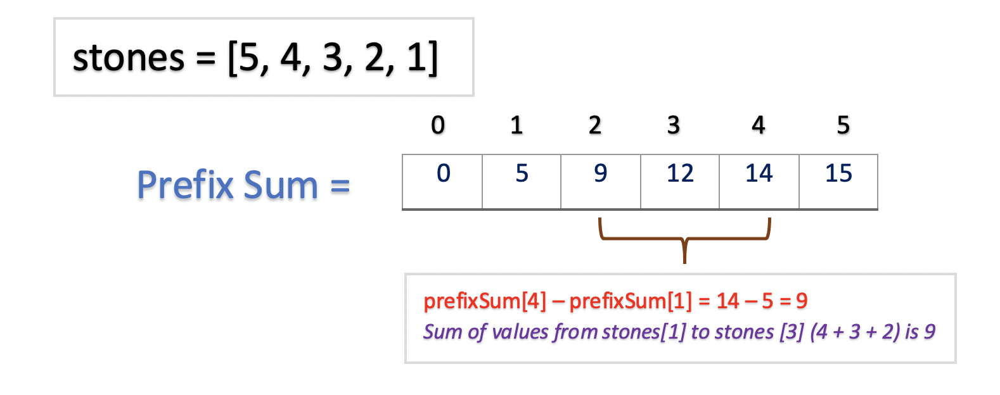
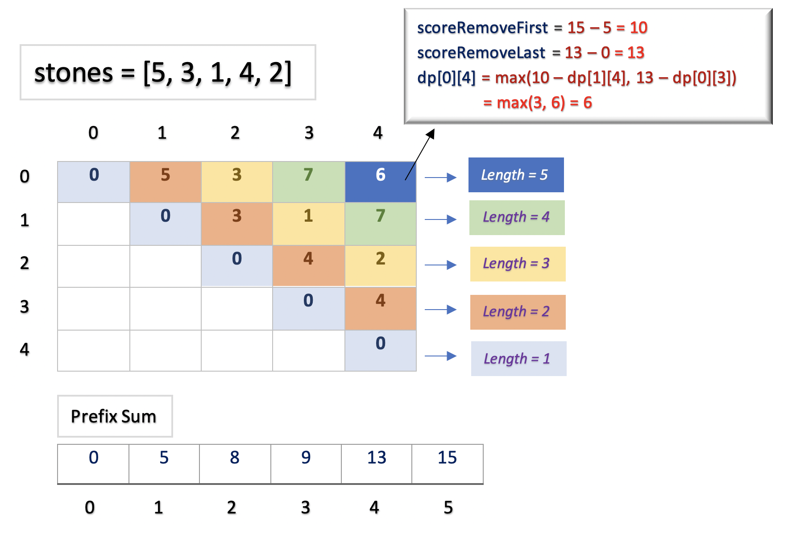

[TOC]

## Solution
---

#### Overview ####

There are multiple variations of this problem [Stone Game I](https://leetcode.com/problems/stone-game/), [Stone Game II](https://leetcode.com/problems/stone-game-ii/), etc. In this problem, there are $2$ players, _Alice_ and _Bob_, each player having a different goal. _Alice_ wants to maximize her score difference with _Bob_ and _Bob_ wants to minimize his score difference with _Alice_.

Each player tries to make the best choice and play optimally. _Alice_ wants to know what would be _Bob_'s score if she makes a particular choice and vice versa. Hence, this problem cannot be implemented greedily. This is a perfect problem to understand the concepts of _Dynamic Programming_. We would recommend the reader to read all the approaches to understand how a recursive problem can be implemented using _Dynamic Programming_ paradigms.

---

#### Approach 1: Brute Force Using Recursion

**Intuition**

The naive solution to solve the problem would be that at every point when either of the players Alice or Bob have to make a choice, they know what would be the best choice.

- For Alice, the best choice would be the one that makes her win with maximum score.

- For Bob, the best choice would be the one that makes him loose with the minimum difference in score with Alice.

At every turn, the players could remove either the first stone (leftmost) or the last stone (rightmost). The players must know what would be their score on picking up either of the stones.

Let's take an example, array = `[5, 3, 1]`. Here's how each of the players will make a choice.



- Alice knows that Bob is trying to be as close as possible to her.

> Alice :   _" If I remove $5$, I will get score $4$ (3 + 1). From the remaining stones $[3, 1]$, Bob will remove $1$ and get the score $3$. Then the difference between our scores would be $1$._
>
>_And If I remove $1$, I will get a score of $8$ (5 + 3). From the remaining stones $[5, 3]$, Bob will remove $3$ and get the score $5$. Then the difference between our scores would be $3$"_

Based on her analysis, Alice removes $1$ and gains a score of $8$.

- Now the remaining stone are $[5,3]$. Bob has to remove $3$, to get the score $5$ and minimize the difference with Alice.

> Fun fact: Alice had already predicated what choice Bob is going to make.

Let's understand how can we implement the above idea.

**Algorithm**

If we look at the problem, for each player to know the best choice, it must solve the game till the end and find the score for each choice.

_Step 1:_

Given an array `stones`, starting at index `start` and ending at index `end`, if either player removes first stone at index `start` i.e $\text{stones}[start]$ the score obtained would be sum of stone values from $stones[start + 1]$ to $\text{stones}[end]$. Let the score obtained by removing the first stone be `scoreRemoveFirst`, given by,

```
scoreRemoveFirst = sum(stones[start + 1] to stones[end])
```

Similarly, the score obtained on removing last stone at index `end` i.e stone[end] would be given by,

```
scoreRemoveLast = sum(stones[start] to stones[end - 1])
```

> Note: Instead of finding the sum every time for a given range, we could pre-calculate the prefix sum till every index. Example, $\text{prefixSum}[i]$ would be sum of all the values in array `stone` from index $0$ to $i$. Now, to calculate the sum of all the values from index $1$ to $i$, we could simply calculate as $\text{prefixSum}[i] - \text{prefixSum}[0]$.



_Step 2:_

Now, we know what score a player would obtain on removing either first or last stone. But we cannot be greedy here and just take the maximum score out of these. We must know the difference in score with the opponent player for both choices. How would we know the total difference with the opponent until now?

Let each player return the difference in stone values after making their choice. Every player would subtract the difference returned by an opponent player from their current score to get the total difference.

- For Bob, he will try to return the maximum negative value. So that the difference between his and Alice's score is minimum.

- For Alice, she will try to return the maximum positive value. So that the difference between her and Bob's score is maximum.

Let `findDifference(start, end, alice)` return the difference in score for a player in array `stones`, starting at index `start` and ending at index `end`.`alice` is a boolean variable that would be `true` for Alice and `false` for Bob.
Each player would recursively calculate the difference that another player would return.

-  Bob's goal is to return the maximum negative value.
> Bob's difference = Alice's difference - Current Score

_Note: Since we are finding the maximum of negative values, we would use min()_

```
   findDifference(start, end, false) = min(
   // if Bob removes first stone
   findDifference(start + 1, end, true) - scoreRemoveFirst
   // if Bob removes last stone
   findDifference(start , end - 1, true) - scoreRemoveLast
  )
```

-  Alice's goal is to return the maximum positive value.
> Alice's difference = Bob's Difference + Current Score

_Note: Since Bob's difference would be a negative value, we would add the Current Score of Alice to find the maximum positive difference._

```
   findDifference(start, end, false) = max(
   // if Alice removes first stone
   findDifference(start + 1, end, false) + scoreRemoveFirst
   // if Alice removes last stone
   findDifference(start , end - 1, false) + scoreRemoveLast
  )
```

_Base Case_

As we are recursively calculating the difference for each of the players, we must terminate our search at a certain point i.e at the base case. In our search, we would reach a point when there is a single element in the array, that is, the `start` and `end` index would be the same. The player would remove that stone and obtain the `0` difference in that case.

**Implementation**

```cpp
class Solution {
public:
    int stoneGameVII(vector<int>& stones) {
        int n = stones.size();
        vector<int> prefixSum(n + 1);
        for (int i = 0; i < n; i++) {
            prefixSum[i + 1] = prefixSum[i] + stones[i];
        }
        return abs(findDifference(prefixSum, 0, n - 1, true));
    }

    int findDifference(vector<int>& prefixSum, int start, int end, bool alice) {
        if (start == end) {
            return 0;
        }
        int difference;
        int scoreRemoveFirst = prefixSum[end + 1] - prefixSum[start + 1];
        int scoreRemoveLast = prefixSum[end] - prefixSum[start];

        if (alice) {
            difference = max(findDifference(prefixSum, start + 1, end, !alice) +
                                 scoreRemoveFirst,
                             findDifference(prefixSum, start, end - 1, !alice) +
                                 scoreRemoveLast);
        } else {
            difference = min(findDifference(prefixSum, start + 1, end, !alice) -
                                 scoreRemoveFirst,
                             findDifference(prefixSum, start, end - 1, !alice) -
                                 scoreRemoveLast);
        }
        return difference;
    }
};
```

**Complexity Analysis**

Let $n$ be the length of array `stones`.

- Time Complexity : $\mathcal{O}(2^{n})$. We fill the array `prefixSum` of size `n` by iterating `n` times. The time complexity would be $\mathcal{O}(n)$.

   For every array element in `stones`, there are 2 choices, either we remove it or keep it. Thus, the recursive tree takes the form of binary tree having roughly $2^{n}$ nodes. The time complexity would be $\mathcal{O}(2^{n})$.

  This would give us total time complexity as $\mathcal{O}(n) + \mathcal{O}(2^{n}) =  \mathcal{O}(2^{n})$.

   _This approach is exhaustive and results in Time Limit Exceeded (TLE)_

- Space Complexity: $\mathcal{O}(n)$, as we build an array `prefixSum` of size $n$.

---

#### Approach 2: Top Down Dynamic Programming - Memoization

**Intuition**

In the above approach, we observe that the same subproblem is computed and solved multiple times. Can we optimize that?

Of course !! If you are familiar with [Dynamic Programming](https://en.wikipedia.org/wiki/Dynamic_programming), you would know that this problem has [Overlapping Subproblems](https://en.wikipedia.org/wiki/Overlapping_subproblems)
. Alice calculates the difference that Bob would return and vice versa. If both players store these calculated values, it could be used in the future if a difference for the same values is required.

**Algorithm**

The algorithm is the same as _Approach 1_ with an additional step. We could store the results of our computation for the first time and use them later. This technique of computing once and returning the stored value is called [Memoization](https://en.wikipedia.org/wiki/Memoization). We use a two-dimensional array $\text{memo}$ and follow the following steps in each recursive call for `findDifference(start, end, alice)`:

- Check if difference for the given range $\text{start}..\text{end}$ is present in $\text{memo}$ to see if we can avoid computing the answer and return the result stored in $\text{memo}$.
- Save the results of any calculations to $\text{memo}$.

**Implementation**

```cpp
class Solution {
public:
    int stoneGameVII(vector<int> &stones) {
        int n = stones.size();
        vector<int> prefixSum(n + 1);
        vector<vector<int>> memo(n, vector<int>(n, INT_MAX));
        for (int i = 0; i < n; i++) {
            prefixSum[i + 1] = prefixSum[i] + stones[i];
        }
        return abs(findDifference(memo, prefixSum, 0, n - 1, true));
    }

    int findDifference(vector<vector<int>> &memo, vector<int> &prefixSum,
                       int start, int end, bool alice) {
        if (start == end) {
            return 0;
        }
        if (memo[start][end] != INT_MAX) {
            return memo[start][end];
        }
        int difference;
        int scoreRemoveFirst = prefixSum[end + 1] - prefixSum[start + 1];
        int scoreRemoveLast = prefixSum[end] - prefixSum[start];

        if (alice) {
            difference =
                max(findDifference(memo, prefixSum, start + 1, end, !alice) +
                        scoreRemoveFirst,
                    findDifference(memo, prefixSum, start, end - 1, !alice) +
                        scoreRemoveLast);
        } else {
            difference =
                min(findDifference(memo, prefixSum, start + 1, end, !alice) -
                        scoreRemoveFirst,
                    findDifference(memo, prefixSum, start, end - 1, !alice) -
                        scoreRemoveLast);
        }
        memo[start][end] = difference;

        return difference;
    }
};
```

**Complexity Analysis**

Let $n$ be the length of array `stones`.

- Time Complexity : $\mathcal{O}(n^{2})$. For all possible subarrays in array `stones`, we calculate it's result only once. Since there are $n^{2}$ possible subarrays for an array of length $n$, the time complexity would be $\mathcal{O}(n^{2})$.

- Space Complexity: $\mathcal{O}(n^{2})$. We use an array `memo` of size $n \cdot n$ and `prefixSum` of size $n$. This gives us space complexity as $\mathcal{O}(n^{2}) + \mathcal{O}(n) =  \mathcal{O}(n^{2})$.

---

#### Approach 3: Optimised Memoization Approach

**Intuition**

There is another way of thinking about the problem,

_Both Bob and Alice are trying to maximize their score. Alice is trying to get the maximum score so that she has a maximum difference from Bob's score. Bob is also trying to get the maximum score so that he is as close to Alice as possible._

If both players want to maximize their score, they must return the maximum difference to the other player. To calculate the current difference, each player would subtract the difference returned by the opponent from the current score.

> The more is the difference returned by the current player, the lesser is the score for the opponent and the higher is the score of the current player.

So, the difference calculations of Alice and Bob can be given by,
> If the current player is Bob,
>
> Difference = Current Score - Difference returned by Alice
>
> If the current player is Alice,
>
> Difference = Current Score - Difference returned by Bob

**Algorithm**

The algorithm is similar to _Approach 2_. Now, that both players have a common goal, that is, to return _maximum difference_ value to the opponent. We don't care who is the current player. Each of the players will perform the following steps.

- Calculate the current score after removing the first or last stone given by `scoreRemoveFirst` and `scoreRemoveLast` respectively. The calculations of these scores are the same as in _Approach 1_.

- Find the maximum difference for the opponent player to minimize their total score. The difference can be calculated recursively as follows,

```
   findDifference(start, end) = max(
   // if player removes first stone
   scoreRemoveFirst - findDifference(start + 1, end)
   // if player removes last stone
   scoreRemoveLast - findDifference(start , end - 1)
  )
```

- At the end, the total difference for removing a stone from array `stones` starting at index `0` and ending at index $n - 1$ would be returned.

**Implementation**

```cpp
class Solution {
public:
    int stoneGameVII(vector<int>& stones) {
        int n = stones.size();
        vector<int> prefixSum(n + 1);
        vector<vector<int>> memo(n, vector<int>(n, INT_MAX));
        for (int i = 0; i < n; i++) {
            prefixSum[i + 1] = prefixSum[i] + stones[i];
        }
        return abs(findDifference(memo, prefixSum, 0, n - 1, stones));
    }

    int findDifference(vector<vector<int>>& memo, vector<int>& prefixSum,
                       int start, int end, vector<int>& stones) {
        if (start == end) {
            return 0;
        }
        if (memo[start][end] != INT_MAX) {
            return memo[start][end];
        }
        int scoreRemoveFirst = prefixSum[end + 1] - prefixSum[start + 1];
        int scoreRemoveLast = prefixSum[end] - prefixSum[start];

        memo[start][end] =
            max(scoreRemoveFirst -
                    findDifference(memo, prefixSum, start + 1, end, stones),
                scoreRemoveLast -
                    findDifference(memo, prefixSum, start, end - 1, stones));

        return memo[start][end];
    }
};
```

**Complexity Analysis**

Let $n$ be the length of array `stones`.

- Time Complexity : $\mathcal{O}(n^{2})$. For all possible subarray in array `stones`, we calculate it's result only once. Since there are $n^{2}$ possible subarrays for an array of length $n$, the time complexity would be $\mathcal{O}(n^{2})$.

- Space Complexity: $\mathcal{O}(n^{2})$. We use an array `memo` of size $n \cdot n$ and `prefixSum` of size $n$. This gives us space complexity as $\mathcal{O}(n^{2}) + \mathcal{O}(n) =  \mathcal{O}(n^{2})$.

---

#### Approach 4: Bottom Up Dynamic Programming - Tabulation

**Intuition**

This is another approach to solve Dynamic Programming problems. We can use the iterative approach and store the result of subproblems in a bottom-up fashion also known as _Tabulation_.

Instead of recursively finding the solution for the original problem, we would start by finding the solution starting from the smallest subproblem and iteratively move towards a larger subproblem.

Example, to find the result for given array `stones` = `[5, 3, 1, 4]`,
- The smallest subproblem would be when the `stones` array has a single element. So we will find the result for subarrays of length $1$- `[5]`, `[3]`, `[1]`, `[4]`.
- Now, we would progress towards finding result for subarrays of length $2$ -`[5, 3]`, `[3, 1]`, `[1, 4]`. It must be noted that at this point we could use the results from previous calculations.

  For example, to calculate the result for subarray `[5, 3]`, we could use the result calculated for subarrays `[5]` and `[3]`.

   In this way, we could calculate the results of subarrays for each length. At last we would calculate the result for the length of $4$ which would be the final result.

Let's look at the algorithm in detail.

**Algorithm**

We maintain a 2D array. For the `stones` array starting at index `start` and ending at index `end`, $\text{dp}[start][end]$ would store the difference obtained after making the best choice by any of the players.

- We would build the `prefixSum` as we did in previous approaches, to obtain the current score.

- We know that if the index `start` is equal to index `end`, there must be a single element in array `stones` and the difference obtained would be $0$. Thus, we must start by finding results for subarrays of the length of $2$. We must stop when we find a result for subarray of size $n$, where $n$ is the length of array `stones`.

- As we want to find the result for subarrays with length $i$, then $i+1$ and so on, we must traverse the array diagonally. The outer loop will iterate for each `length` and the inner loop will find the result of subarrays of size `length`.

- At the end, we must return the result for the `stones` array, starting at index `0` and ending at `n-1`.

The following figure illustrates the idea for the given array $stones = [5, 3, 1, 4, 2]$.



**Implementation**

```cpp
class Solution {
public:
    int stoneGameVII(vector<int>& stones) {
        int n = stones.size();
        vector<int> prefixSum(n + 1);
        vector<vector<int>> dp(n, vector<int>(n, 0));
        for (int i = 0; i < n; i++) {
            prefixSum[i + 1] = prefixSum[i] + stones[i];
        }
        for (int length = 2; length <= n; length++) {
            for (int start = 0; start + length - 1 < n; start++) {
                int end = start + length - 1;
                int scoreRemoveFirst =
                    prefixSum[end + 1] - prefixSum[start + 1];
                int scoreRemoveLast = prefixSum[end] - prefixSum[start];
                dp[start][end] = max(scoreRemoveFirst - dp[start + 1][end],
                                     scoreRemoveLast - dp[start][end - 1]);
            }
        }
        return dp[0][n - 1];
    }
};
```

**Complexity Analysis**

Let $n$ be the length of array `stones`.

- Time Complexity : $\mathcal{O}(n^{2})$, as we iterate over a 2D array of size $n \cdot n$.

- Space Complexity: $\mathcal{O}(n^{2})$, as we use an array `dp` of size $n \cdot n$ and `prefixSum` of size $n$. This gives us space complexity as $\mathcal{O}(n^{2}) + \mathcal{O}(n) =  \mathcal{O}(n^{2})$.

---

#### Approach 5: Another Approach using Tabulation

**Intuition**

There is another way of solving the problem using _Tabulation_. This is just a different way of traversing and filling the 2D array. Instead of traversing diagonally to find the results of subarrays for each length, we would fix our `start` index at a certain point. And now the `end` index would incrementally add an element to the subarray and find the results.

For example, for array = `[5, 3, 2, 1]`, we could fix our start index at `[5]`, end index would incrementally calculate the result for subarrays `[5, 3]`, `[5, 3, 2]`  and `[5, 3, 2, 1]`.

However, it must be noted that for calculating the result for `[5, 3]`, we must know the result for `[3]` as well. Similarly, to get the result for `[5, 3, 2]`, we must know the result for `[3, 2]` and `[2]`. The trick to solving this problem is by iterating from backward.

**Algorithm**

We maintain a 2D array. For the stones array starting at index `start` and ending at index `end`, $\text{dp}[start][end]$ would store the difference obtained after making the best choice by any of the players.

- We would build the `prefixSum` as we did in previous approaches, to obtain the current score.

- We know that if the index `start` is equal to index `end`, there must be a single element in array `stones` and the difference obtained would be $0$. Thus, we must start by finding results for subarrays of the length of $2$. Thus we begin by fixing the `start` index at the `n-2` position and decrement until it reaches the $0^{th}$ index.  And `end` begins from $start + 1$ index and increment until it reaches $n^{th}$ index.

- The outer loop fixes the `start` index and the inner loop fixes the `end` index. For every subarray starting at index `start` and ending at index `end`, we would calculate the difference as in _Approach 4_.

- At the end, we must return the result for the `stones` array, starting at index `0` and ending at `n-1`.

**Implementation**

```cpp
class Solution {
public:
    int stoneGameVII(vector<int>& stones) {
        int n = stones.size();
        vector<int> prefixSum(n + 1);
        vector<vector<int>> dp(n, vector<int>(n, 0));
        for (int i = 0; i < n; i++) {
            prefixSum[i + 1] = prefixSum[i] + stones[i];
        }
        for (int start = n - 2; start >= 0; start--) {
            for (int end = start + 1; end < n; end++) {
                int scoreRemoveFirst =
                    prefixSum[end + 1] - prefixSum[start + 1];
                int scoreRemoveLast = prefixSum[end] - prefixSum[start];
                dp[start][end] = max(scoreRemoveFirst - dp[start + 1][end],
                                     scoreRemoveLast - dp[start][end - 1]);
            }
        }
        return dp[0][n - 1];
    }
};
```

**Complexity Analysis**

Let $n$ be the length of array `stones`.

- Time Complexity : $\mathcal{O}(n^{2})$, as we iterate over a 2D array of size $n \cdot n$.

- Space Complexity: $\mathcal{O}(n^{2})$, as we use an array `dp` of size $n \cdot n$ and `prefixSum` of size $n$. This gives us space complexity as $\mathcal{O}(n^{2}) + \mathcal{O}(n) =  \mathcal{O}(n^{2})$.