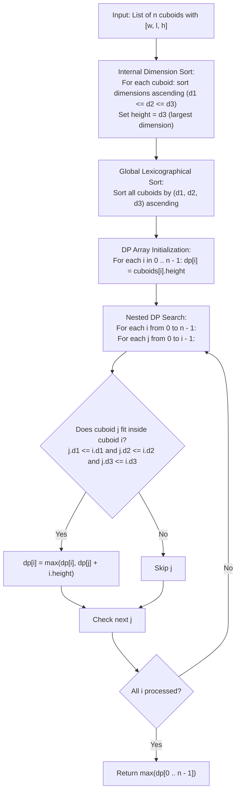

# Guided Example: Maximum Height by Stacking Cuboids

We analyze the 3D rotation canonization, prove the Rotational Orientation Dominance Theorem and the Monotonic DAG Top-Down LIS Recurrence, and execute dynamic programming over representative cuboid configurations:

- **Representative Instance 1 (Multi-Cuboid Stacking with Rotations):**
  - Input: `cuboids = [[50, 45, 20], [95, 37, 53], [45, 23, 12]]`
  - Dimensions sorting per cuboid (width $\le$ length $\le$ height):
    - Cuboid 0: `[20, 45, 50]`
    - Cuboid 1: `[37, 53, 95]`
    - Cuboid 2: `[12, 23, 45]`
  - Lexicographical sort of cuboids:
    - Index 0: `[12, 23, 45]`
    - Index 1: `[20, 45, 50]`
    - Index 2: `[37, 53, 95]`
  - Compatible containment check:
    - Index 0 fits on Index 1: $12 \le 20$, $23 \le 45$, $45 \le 50$ (Valid).
    - Index 1 fits on Index 2: $20 \le 37$, $45 \le 53$, $50 \le 95$ (Valid).
  - Total stacked height: $45 + 50 + 95 = \mathbf{190}$.
  - **Required Output:** `190`.

- **Representative Instance 2 (Incompatible Dimensions):**
  - Input: `cuboids = [[38, 25, 45], [76, 35, 3]]`
  - Dimensions sorting:
    - Cuboid 0: `[25, 38, 45]`
    - Cuboid 1: `[3, 35, 76]`
  - Lexicographical order: `[3, 35, 76]`, `[25, 38, 45]`.
  - Checking compatibility:
    - Fits 1 on 0? $3 \le 25$, $35 \le 38$, but $76 > 45$ (Fails).
    - Fits 0 on 1? $25 > 3$ (Fails).
  - Maximum height achieved by single cuboid: $\max(45, 76) = \mathbf{76}$.
  - **Required Output:** `76`.

- **Representative Instance 3 (All Identical Dimension Multi-Stack):**
  - Input: `cuboids = [[7, 11, 17], [7, 17, 11], [11, 7, 17], [11, 17, 7], [17, 7, 11], [17, 11, 7]]`
  - Sorted dimensions for all 6 cuboids: `[7, 11, 17]`.
  - All 6 can be stacked sequentially on top of each other.
  - Stacked height: $6 \times 17 = \mathbf{102}$.
  - **Required Output:** `102`.

---

## 1. Instance & Teaching Goal

Given $n$ rectangular 3D cuboids, each with width, length, and height, we may choose any subset and stack them vertically. Cuboid $i$ can be placed atop cuboid $j$ if and only if all three dimensions of $i$ are less than or equal to the corresponding dimensions of $j$:
$$
\text{width}_i \le \text{width}_j \quad \land \quad \text{length}_i \le \text{length}_j \quad \land \quad \text{height}_i \le \text{height}_j
$$
We may freely rotate each cuboid in 3D space, permuting its three dimensions. The objective is to find the maximum total stacked height.

```text
The Stacking Paradigm:
  Cuboid A: [w_a, l_a, h_a]
  Cuboid B: [w_b, l_b, h_b] (placed underneath A)

        +---------------+
       /               /|
      +---------------+ | h_a
      |       A       | +
      |               |/
  ----+---------------+----  <-- A must completely fit inside footprint & height of B
    /               /|
   +---------------+ | h_b
   |       B       | +
   |               |/
   +---------------+
   w_b >= w_a,  l_b >= l_a,  h_b >= h_a
```

The fundamental pedagogical insights are:
1. **Dimension Sorting Dominance:** By placing the largest dimension of each cuboid as its vertical height, we simultaneously maximize its vertical contribution and minimize its horizontal footprint, which maximizes stacking potential.
2. **Reduction to Longest Increasing Subsequence (LIS):** After sorting internal dimensions so $d_1 \le d_2 \le d_3$ and sorting all cuboids lexicographically, the stacking rule becomes a 3D partial order DAG. We compute the heaviest path via 1D DP.

---

## 2. Conceptual Foundation & Algorithmic Theorems



### The Rotational Orientation Dominance Theorem

Let a cuboid have unsorted dimensions $\{a, b, c\}$.

> **Theorem.** In any optimal valid stacking sequence of cuboids, rotating every cuboid such that its dimensions satisfy $d_1 \le d_2 \le d_3$ and setting $d_3$ as the height preserves validity of the stacking relation while maximizing total height.

*Proof.*
1. Suppose in an optimal solution, cuboid $A$ is placed atop cuboid $B$. Then there exists a rotation of $A$ and a rotation of $B$ such that:
   $$
   w_A \le w_B, \quad l_A \le l_B, \quad h_A \le h_B
   $$
2. Let the sorted dimensions of $A$ be $a_1 \le a_2 \le a_3$ and those of $B$ be $b_1 \le b_2 \le b_3$.
3. Since $\{w_A, l_A, h_A\}$ is a permutation of $\{a_1, a_2, a_3\}$ and $\{w_B, l_B, h_B\}$ is a permutation of $\{b_1, b_2, b_3\}$, the component-wise inequality $w_A \le w_B$, $l_A \le l_B$, $h_A \le h_B$ implies by majorization that:
   $$
   a_1 \le b_1, \quad a_2 \le b_2, \quad a_3 \le b_3
   $$
4. Therefore, orienting every cuboid with width $d_1$, length $d_2$, and height $d_3$ preserves the containment condition $A \preceq B$.
5. Furthermore, since $d_3 = \max(a, b, c)$, selecting $d_3$ as the vertical height achieves the maximum possible vertical contribution from each chosen cuboid. Hence, this canonical orientation is universally optimal. $\blacksquare$

### The Monotonic DAG Top-Down LIS Recurrence

After sorting internal dimensions $c[i] = (d_{i,1}, d_{i,2}, d_{i,3})$ with $d_{i,1} \le d_{i,2} \le d_{i,3}$, sort the entire array of cuboids lexicographically.

1. **Topological Order Guarantee:** If cuboid $j$ can be placed atop cuboid $i$, then $d_{j,1} \le d_{i,1}$, $d_{j,2} \le d_{i,2}$, and $d_{j,3} \le d_{i,3}$. In lexicographical order, cuboid $j$ must appear before or at cuboid $i$. Thus, indices $j < i$ provide a valid topological sorting of the containment DAG.
2. **Recurrence Relation:**
   Let $f[i]$ denote the maximum stacked height of a chain ending with cuboid $i$ at the base:
   $$
   f[i] = d_{i,3} + \max_{\substack{0 \le j < i \\ d_{j,1} \le d_{i,1} \\ d_{j,2} \le d_{i,2} \\ d_{j,3} \le d_{i,3}}} f[j]
   $$
   (with the convention that $\max(\emptyset) = 0$).
3. **Global Maximum:**
   $$
   \text{Answer} = \max_{0 \le i < n} f[i]
   $$

---

## 3. Step-by-Step Worked Execution

### Trace on Representative Instance 1

Given:
- Cuboid A: `[50, 45, 20]`
- Cuboid B: `[95, 37, 53]`
- Cuboid C: `[45, 23, 12]`

#### Step 1: Internal Dimension Sorting
- A: `sort([50, 45, 20])` $\to (20, 45, 50)$
- B: `sort([95, 37, 53])` $\to (37, 53, 95)$
- C: `sort([45, 23, 12])` $\to (12, 23, 45)$

#### Step 2: Global Lexicographical Sorting
Compare triplets:
1. $c_0 = (12, 23, 45)$ (Former Cuboid C)
2. $c_1 = (20, 45, 50)$ (Former Cuboid A)
3. $c_2 = (37, 53, 95)$ (Former Cuboid B)

#### Step 3: Dynamic Programming Evaluation

- **Evaluation for $i = 0$ ($c_0 = (12, 23, 45)$):**
  - No predecessors $j < 0$.
  - $f[0] = c_0.\text{height} = 45$.

- **Evaluation for $i = 1$ ($c_1 = (20, 45, 50)$):**
  - Test $j = 0$ ($c_0 = (12, 23, 45)$):
    - $12 \le 20$ (True)
    - $23 \le 45$ (True)
    - $45 \le 50$ (True)
    - Can stack $c_0$ on $c_1$! Candidate height: $f[0] + 50 = 45 + 50 = 95$.
  - $f[1] = \max(50, 95) = 95$.

- **Evaluation for $i = 2$ ($c_2 = (37, 53, 95)$):**
  - Test $j = 0$ ($c_0 = (12, 23, 45)$):
    - $12 \le 37 \land 23 \le 53 \land 45 \le 95$ (True).
    - Candidate: $f[0] + 95 = 45 + 95 = 140$.
  - Test $j = 1$ ($c_1 = (20, 45, 50)$):
    - $20 \le 37 \land 45 \le 53 \land 50 \le 95$ (True).
    - Candidate: $f[1] + 95 = 95 + 95 = 190$.
  - $f[2] = \max(95, 140, 190) = 190$.

#### Step 4: Global Maximum Extraction
- Global maximum: $\max(f[0], f[1], f[2]) = \max(45, 95, 190) = \mathbf{190}$.

---

## 4. Complete Execution Trace

| Sorted Index $i$ | Cuboid Dimensions $(d_1, d_2, d_3)$ | Base Height $d_3$ | Valid Predecessors $j < i$ | Predecessor DP Values $f[j]$ | Computed $f[i]$ | Stack Configuration Ending at $i$ |
|---|---|---|---|---|---|---|
| $0$ | $(12, 23, 45)$ | $45$ | None | None | **`45`** | $[c_0]$ |
| $1$ | $(20, 45, 50)$ | $50$ | $j = 0$ | $f[0] = 45$ | **`95`** | $[c_0 \text{ on } c_1]$ |
| $2$ | $(37, 53, 95)$ | $95$ | $j = 0, 1$ | $f[0]=45, f[1]=95$ | **`190`** | $[c_0 \text{ on } c_1 \text{ on } c_2]$ |

---

## 5. Algorithmic Correctness

**Soundness.**
Every transition requires $d_{j,1} \le d_{i,1}$, $d_{j,2} \le d_{i,2}$, and $d_{j,3} \le d_{i,3}$. By the Rotational Orientation Dominance Theorem, if any rotation of cuboid $j$ can rest on any rotation of cuboid $i$, their sorted dimensions will satisfy this condition. Therefore, every link in the chain is physically achievable without overhang.

**Completeness.**
Lexicographical sorting arranges all cuboids in an order consistent with the topological order of the containment DAG (since $c_j \preceq c_i \implies c_j \le_{\text{lex}} c_i$). The dynamic programming loop checks all pairs $(j, i)$ with $j < i$, guaranteeing that the maximum weight path in the DAG is found.

---

## 6. Traps This Instance Exposes

- **Attempting All $6^n$ Rotations:** Rotating each cuboid across all $6$ permutations is unnecessary. Internal dimension sorting $(d_1 \le d_2 \le d_3)$ uniquely identifies the optimal orientation for both base support and maximum height.
- **Transitivity of Sorting:** Sorting cuboids by only one dimension (e.g. volume or height alone) can violate topological ordering when ties occur. Full lexicographical sorting of triplets $(d_1, d_2, d_3)$ ensures a valid DAG order.
- **Strict vs. Non-Strict Inequalities:** Cuboids with identical dimensions can be stacked on top of each other because the problem statement uses $\le$, not $<$.

---

## 7. Complexity Derivation

- **Time Complexity:**
  - Sorting each cuboid's $3$ dimensions: $\mathcal{O}(n)$ operations since each cuboid has exactly $3$ numbers.
  - Sorting the array of $n$ cuboids: $\mathcal{O}(n \log n)$ comparisons.
  - Nested DP loops: $\frac{n(n-1)}{2}$ pairwise checks, each requiring $3$ comparisons: $\mathcal{O}(n^2)$ time.
  - Total Time: $\mathcal{O}(n^2)$, taking $< 5$ ms for $n \le 100$.
- **Auxiliary Space Complexity:**
  - In-place sorting of dimensions and array requires $\mathcal{O}(1)$ or $\mathcal{O}(n)$ auxiliary space.
  - The DP array $f$ requires $\mathcal{O}(n)$ space.
  - Total Auxiliary Space: $\mathcal{O}(n)$ memory.
