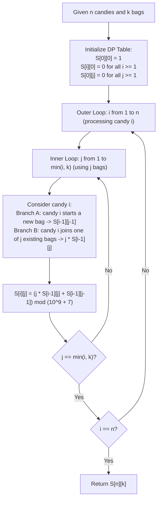

# Guided Example: Count Ways to Distribute Candies

We trace the combinatorial partitioning of distinguishable items into indistinguishable non-empty bins, prove the Stirling Partitioning Recurrence Theorem, and analyze dynamic programming state transitions across representative candy distribution instances:

- **Representative Instance 1 (Fundamental Partitioning):**
  - Input: $n = 3, k = 2$
  - Distribute $3$ unique candies $\{1, 2, 3\}$ into $2$ identical non-empty bags:
    - Partition 1: `(1), (2, 3)`
    - Partition 2: `(2), (1, 3)`
    - Partition 3: `(3), (1, 2)`
  - Total valid partitions: $\mathbf{3}$.
  - **Required Output:** `3`.

- **Representative Instance 2 (Four Candies into Two Bags):**
  - Input: $n = 4, k = 2$
  - Candies $\{1, 2, 3, 4\}$ into $2$ bags:
    - One singleton bag + one 3-candy bag: $\binom{4}{1} = 4$ ways:
      `(1), (2, 3, 4)`, `(2), (1, 3, 4)`, `(3), (1, 2, 4)`, `(4), (1, 2, 3)`.
    - Two pairs of candies: $\frac{1}{2}\binom{4}{2} = 3$ ways:
      `(1, 2), (3, 4)`, `(1, 3), (2, 4)`, `(1, 4), (2, 3)`.
    - Total: $4 + 3 = \mathbf{7}$ ways.
  - **Required Output:** `7`.

- **Representative Instance 3 (Large Scale Modulo Instance):**
  - Input: $n = 20, k = 5$
  - Exact combinatorial partitions: $1881780996$.
  - Modulo $10^9 + 7$: $1881780996 \pmod{10^9 + 7} = \mathbf{206085257}$.
  - **Required Output:** `206085257`.

---

## 1. Instance & Teaching Goal

We are tasked with placing $n$ uniquely labeled candies (labeled $1$ through $n$) into $k$ identical bags such that no bag is left empty. The order of candies inside a bag and the order of the bags do not matter.

```text
The Candy-Bag Distribution Duality:
  Candies are DISTINCT (labeled 1, 2, ..., n).
  Bags are IDENTICAL (unlabeled, order does not matter).
  Constraint: Every bag must contain at least 1 candy (surjective assignment).

  When candy n arrives:
    Branch A: Candy n is placed alone into a brand new bag.
              Remaining n - 1 candies must occupy k - 1 bags.
              Number of ways = S(n - 1, k - 1).

    Branch B: Candy n joins one of the k already established non-empty bags.
              Since the k bags already contain distinct subsets of candies,
              they are now distinguished by their contents.
              Number of ways = k * S(n - 1, k).
```

This problem is the canonical formulation of **Stirling Numbers of the Second Kind**, denoted $\left\{ \begin{matrix} n \\ k \end{matrix} \right\}$ or $S(n, k)$.
The pedagogical goals are:
1. Formulate the inductive partition choice for the $n$-th candy.
2. Construct the dynamic programming table over states $(i, j)$ with $1 \le i \le n$ and $1 \le j \le k$.
3. Analyze modulo arithmetic preservation at every step to prevent integer overflow.

---

## 2. Conceptual Foundation & Inductive Recurrence



### The Stirling Partitioning Recurrence Theorem

Let $S(i, j)$ denote the number of ways to partition $i$ distinguishable items into $j$ non-empty indistinguishable subsets.

> **Theorem.** For integers $i \ge 1$ and $j \ge 1$:
> $$
> S(i, j) = j \cdot S(i - 1, j) + S(i - 1, j - 1)
> $$
> with boundary conditions $S(0, 0) = 1$, and $S(i, 0) = 0$ for all $i > 0$.

*Proof.*
Consider the $i$-th labeled candy. In any valid partition of $\{1, 2, \dots, i\}$ into $j$ non-empty subsets, exactly one of two mutually exclusive events occurs:
1. **Case 1 (Candy $i$ is isolated):** Candy $i$ forms a singleton set $\{i\}$. The remaining $i - 1$ candies must be partitioned into the remaining $j - 1$ non-empty subsets. By definition, there are $S(i - 1, j - 1)$ ways to do this.
2. **Case 2 (Candy $i$ shares a bag):** The other $i - 1$ candies are already partitioned into all $j$ non-empty subsets (which can be done in $S(i - 1, j)$ ways). Because each of these $j$ subsets contains a different non-empty collection of candies from $\{1, 2, \dots, i - 1\}$, placing candy $i$ into subset $1, 2, \dots,$ or $j$ produces $j$ distinct set partitions. Thus, there are $j \cdot S(i - 1, j)$ ways.

Adding the two disjoint cases yields $S(i, j) = j \cdot S(i - 1, j) + S(i - 1, j - 1)$. $\blacksquare$

---

## 3. Step-by-Step Worked Execution

### Trace on Representative Instance 1 ($n = 3, k = 2$)

- **Base State Initialization:**
  - $S(0, 0) = 1$.
  - $S(i, 0) = 0$ for all $i \ge 1$.
  - $S(0, j) = 0$ for all $j \ge 1$.

#### Step 1: Processing Candy $i = 1$
- For $j = 1$:
  $$
  S(1, 1) = 1 \cdot S(0, 1) + S(0, 0) = 1 \cdot 0 + 1 = 1
  $$
  (Only one way: `(1)`).

#### Step 2: Processing Candy $i = 2$
- For $j = 1$:
  $$
  S(2, 1) = 1 \cdot S(1, 1) + S(1, 0) = 1 \cdot 1 + 0 = 1
  $$
  (Only one way: `(1, 2)`).
- For $j = 2$:
  $$
  S(2, 2) = 2 \cdot S(1, 2) + S(1, 1) = 2 \cdot 0 + 1 = 1
  $$
  (Only one way: `(1), (2)`).

#### Step 3: Processing Candy $i = 3$
- For $j = 1$:
  $$
  S(3, 1) = 1 \cdot S(2, 1) + S(2, 0) = 1 \cdot 1 + 0 = 1
  $$
- For $j = 2$:
  $$
  S(3, 2) = 2 \cdot S(2, 2) + S(2, 1) = 2 \cdot 1 + 1 = \mathbf{3}
  $$
  (Breakdown: Candy 3 can join bag `{1}` giving `(1, 3), (2)`, join bag `{2}` giving `(1), (2, 3)`, or be alone giving `(1, 2), (3)`).

#### Final Output:
- Result $S(3, 2) = \mathbf{3}$.

---

## 4. Complete Execution Trace

### DP State Table for $n = 4, k = 3$

| $i \backslash j$ | $j = 0$ | $j = 1$ | $j = 2$ | $j = 3$ | Derivation for Active Cells |
|---|---|---|---|---|---|
| **$i = 0$** | $1$ | $0$ | $0$ | $0$ | Base boundary |
| **$i = 1$** | $0$ | $1$ | $0$ | $0$ | $S(1, 1) = 1 \cdot 0 + 1 = 1$ |
| **$i = 2$** | $0$ | $1$ | $1$ | $0$ | $S(2, 2) = 2 \cdot 0 + 1 = 1$ |
| **$i = 3$** | $0$ | $1$ | $3$ | $1$ | $S(3, 2) = 2 \cdot 1 + 1 = 3;\quad S(3, 3) = 3 \cdot 0 + 1 = 1$ |
| **$i = 4$** | $0$ | $1$ | $7$ | $6$ | $S(4, 2) = 2 \cdot 3 + 1 = 7;\quad S(4, 3) = 3 \cdot 1 + 3 = 6$ |

---

## 5. Algorithmic Correctness

**Soundness.**
The recurrence accounts for all configurations without under-counting or double-counting.
- Candies are distinguishable, but bags are identical: multiplying $S(i - 1, j)$ by $j$ is valid because the $j$ non-empty bags have distinct non-empty subsets of candies, making them distinguishable once formed.
- Placing candy $i$ alone into a new empty bag adds no multiplier because all empty bags are identical.

**Completeness.**
Iterating $i$ from $1$ to $n$ and $j$ from $1$ to $k$ evaluates all subproblem dependencies $S(i - 1, j)$ and $S(i - 1, j - 1)$ strictly prior to their usage. Thus, the DP table computation is well-ordered and acyclic.

---

## 6. Traps This Instance Exposes

- **Distinguishable vs. Indistinguishable Bags:** If bags were labeled (e.g., Bag A, Bag B), the answer would be $k! \cdot S(n, k)$. Since bags are indistinguishable, we do not multiply by $k!$.
- **Empty Bags Prohibition:** The problem requires every bag to have at least one candy. The Stirling recurrence inherently enforces this condition because $S(i, 0) = 0$ for $i > 0$.
- **Modular Arithmetic Overflow:** In languages with fixed integer sizes, calculating $j \cdot S(i - 1, j)$ can exceed $2^{31} - 1$ since $j \le 1000$ and $S \approx 10^9$. Performing multiplication with 64-bit integers and applying modulo $10^9 + 7$ after the addition avoids overflow.

---

## 7. Complexity Derivation

- **Time Complexity:**
  - The dynamic programming table has size $(n + 1) \times (k + 1)$.
  - Each cell $(i, j)$ requires $1$ multiplication, $1$ addition, and $1$ modulo operation: $\mathcal{O}(1)$ time.
  - Total Time: $\mathcal{O}(n \cdot k)$ operations, which takes $< 15$ ms for $n, k \le 1000$.
- **Auxiliary Space Complexity:**
  - Full 2D memoization table requires $\mathcal{O}(n \cdot k)$ space.
  - Since row $i$ depends only on row $i - 1$, space can be reduced to $\mathcal{O}(k)$ by maintaining a rolling 1D array traversed backward from $k$ down to $1$.
  - Total Auxiliary Space: $\mathcal{O}(k)$ or $\mathcal{O}(n \cdot k)$ memory.
