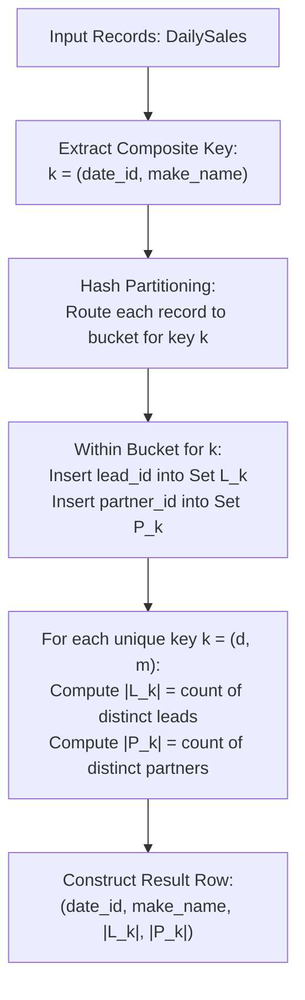

# Guided Example: Daily Leads and Partners

We analyze multi-attribute relational grouping, prove the Distinct Set Cardinality Projection Theorem and Partitioned Deduplication Invariant, and trace multi-set aggregation over representative sales records:

- **Representative Instance (Composite Grouping with Duplicate Records):**
  - Input Table `DailySales`:
    | `date_id` | `make_name` | `lead_id` | `partner_id` |
    |---|---|---|---|
    | `2020-12-8` | `toyota` | `0` | `1` |
    | `2020-12-8` | `toyota` | `1` | `0` |
    | `2020-12-8` | `toyota` | `1` | `2` |
    | `2020-12-7` | `toyota` | `0` | `2` |
    | `2020-12-7` | `toyota` | `0` | `1` |
    | `2020-12-8` | `honda` | `1` | `2` |
    | `2020-12-8` | `honda` | `2` | `1` |
    | `2020-12-7` | `honda` | `0` | `1` |
    | `2020-12-7` | `honda` | `1` | `2` |
    | `2020-12-7` | `honda` | `2` | `1` |
  - Unique Groups `(date_id, make_name)`:
    - Group A (`2020-12-8`, `toyota`):
      - Leads seen: $\{0, 1, 1\} \implies \text{Unique Leads} = \{0, 1\} \implies \mathbf{2}$.
      - Partners seen: $\{1, 0, 2\} \implies \text{Unique Partners} = \{0, 1, 2\} \implies \mathbf{3}$.
    - Group B (`2020-12-7`, `toyota`):
      - Leads seen: $\{0, 0\} \implies \text{Unique Leads} = \{0\} \implies \mathbf{1}$.
      - Partners seen: $\{2, 1\} \implies \text{Unique Partners} = \{1, 2\} \implies \mathbf{2}$.
    - Group C (`2020-12-8`, `honda`):
      - Leads seen: $\{1, 2\} \implies \text{Unique Leads} = \{1, 2\} \implies \mathbf{2}$.
      - Partners seen: $\{2, 1\} \implies \text{Unique Partners} = \{1, 2\} \implies \mathbf{2}$.
    - Group D (`2020-12-7`, `honda`):
      - Leads seen: $\{0, 1, 2\} \implies \text{Unique Leads} = \{0, 1, 2\} \implies \mathbf{3}$.
      - Partners seen: $\{1, 2, 1\} \implies \text{Unique Partners} = \{1, 2\} \implies \mathbf{2}$.
  - **Required Output Table:**
    | `date_id` | `make_name` | `unique_leads` | `unique_partners` |
    |---|---|---|---|
    | `2020-12-8` | `toyota` | `2` | `3` |
    | `2020-12-7` | `toyota` | `1` | `2` |
    | `2020-12-8` | `honda` | `2` | `2` |
    | `2020-12-7` | `honda` | `3` | `2` |

---

## 1. Instance & Teaching Goal

Given a multi-set of sales events with attributes `(date_id, make_name, lead_id, partner_id)`, we must partition the dataset into disjoint groups defined by the composite key `(date_id, make_name)` and compute the cardinality of the distinct values of `lead_id` and `partner_id` within each group.

```text
Relational Aggregation Model:
  Raw Multi-Set: T = { (date, make, lead, partner) }

  Step 1: Partitioning
    Partition T into equivalence classes under equivalence relation:
      (d1, m1, l1, p1) ~ (d2, m2, l2, p2)  <=>  d1 = d2 and m1 = m2

  Step 2: Projection & Deduplication
    For each partition class G_(d, m):
      UniqueLeads(d, m)    = | { l : exists p, (d, m, l, p) in G_(d, m) } |
      UniquePartners(d, m) = | { p : exists l, (d, m, l, p) in G_(d, m) } |

  Step 3: Relational Projection
    Emit tuple (d, m, UniqueLeads(d, m), UniquePartners(d, m))
```

The pedagogical objectives are:
1. Explain composite relational equivalence partitioning.
2. Differentiate between total record count and set-cardinality aggregation.
3. Formulate hash-based versus sort-based execution strategies for deduplicating projected attributes.

---

## 2. Conceptual Foundation & Mathematical Formulation



### The Distinct Set Cardinality Projection Theorem

Let the input relation be a multiset $\mathcal{R} \subseteq \mathcal{D} \times \mathcal{M} \times \mathcal{L} \times \mathcal{P}$.
Define the equivalence relation $\sim_{\mathcal{D}\mathcal{M}}$ on $\mathcal{R}$ such that:
$$
t_1 \sim_{\mathcal{D}\mathcal{M}} t_2 \iff t_1[\text{date\_id}] = t_2[\text{date\_id}] \;\land\; t_1[\text{make\_name}] = t_2[\text{make\_name}]
$$
This equivalence relation partitions $\mathcal{R}$ into disjoint quotient classes $\{ [t] \mid t \in \mathcal{R} \}$.

> **Theorem (Orthogonal Set Projection Invariant).**
> For each partition $[t]$, the cardinality of distinct values along attribute $\mathcal{L}$ is strictly independent of attribute $\mathcal{P}$:
> $$
> \text{unique\_leads}([t]) = \left| \pi_{\mathcal{L}}([t]) \right|
> $$
> $$
> \text{unique\_partners}([t]) = \left| \pi_{\mathcal{P}}([t]) \right|
> $$
> Duplicate occurrences of any pair $(l, p)$ or shared values across different $(d, m)$ groups have no effect on the local set cardinality of $[t]$.

---

## 3. Step-by-Step Worked Execution

### Trace on the Representative Instance

We iterate through each tuple of the table and route it into the accumulator corresponding to its group key `(date_id, make_name)`.

#### Row 1: `(2020-12-8, toyota, 0, 1)`
- Group: `(2020-12-8, toyota)`
- Lead set: $\emptyset \cup \{0\} = \{0\}$
- Partner set: $\emptyset \cup \{1\} = \{1\}$

#### Row 2: `(2020-12-8, toyota, 1, 0)`
- Group: `(2020-12-8, toyota)`
- Lead set: $\{0\} \cup \{1\} = \{0, 1\}$
- Partner set: $\{1\} \cup \{0\} = \{0, 1\}$

#### Row 3: `(2020-12-8, toyota, 1, 2)`
- Group: `(2020-12-8, toyota)`
- Lead set: $\{0, 1\} \cup \{1\} = \{0, 1\}$ (Duplicate `1` absorbed)
- Partner set: $\{0, 1\} \cup \{2\} = \{0, 1, 2\}$

#### Row 4: `(2020-12-7, toyota, 0, 2)`
- Group: `(2020-12-7, toyota)`
- Lead set: $\{0\}$
- Partner set: $\{2\}$

#### Row 5: `(2020-12-7, toyota, 0, 1)`
- Group: `(2020-12-7, toyota)`
- Lead set: $\{0\} \cup \{0\} = \{0\}$ (Duplicate `0` absorbed)
- Partner set: $\{2\} \cup \{1\} = \{1, 2\}$

#### Rows 6–10: Processing `honda` records
- `(2020-12-8, honda)`:
  - Row 6: lead `1`, partner `2` $\implies$ Leads: $\{1\}$, Partners: $\{2\}$
  - Row 7: lead `2`, partner `1` $\implies$ Leads: $\{1, 2\}$, Partners: $\{1, 2\}$
- `(2020-12-7, honda)`:
  - Row 8: lead `0`, partner `1` $\implies$ Leads: $\{0\}$, Partners: $\{1\}$
  - Row 9: lead `1`, partner `2` $\implies$ Leads: $\{0, 1\}$, Partners: $\{1, 2\}$
  - Row 10: lead `2`, partner `1` $\implies$ Leads: $\{0, 1, 2\}$, Partners: $\{1, 2\}$ (Duplicate partner `1` absorbed)

---

## 4. Complete Execution Trace

| Composite Group `(date_id, make_name)` | Raw Lead Multiset | Distinct Lead Set | `unique_leads` ($\lvert L \rvert$) | Raw Partner Multiset | Distinct Partner Set | `unique_partners` ($\lvert P \rvert$) |
|---|---|---|---|---|---|---|
| `(2020-12-8, toyota)` | $\{0, 1, 1\}$ | $\{0, 1\}$ | **`2`** | $\{1, 0, 2\}$ | $\{0, 1, 2\}$ | **`3`** |
| `(2020-12-7, toyota)` | $\{0, 0\}$ | $\{0\}$ | **`1`** | $\{2, 1\}$ | $\{1, 2\}$ | **`2`** |
| `(2020-12-8, honda)` | $\{1, 2\}$ | $\{1, 2\}$ | **`2`** | $\{2, 1\}$ | $\{1, 2\}$ | **`2`** |
| `(2020-12-7, honda)` | $\{0, 1, 2\}$ | $\{0, 1, 2\}$ | **`3`** | $\{1, 2, 1\}$ | $\{1, 2\}$ | **`2`** |

---

## 5. Algorithmic Correctness

**Soundness.**
The composite group key uniquely identifies each `(date_id, make_name)` pair. By using set insertion semantics (or hash sets per group), duplicate IDs are absorbed according to the idempotent property of set union: $S \cup \{x\} = S$ for $x \in S$. The final count corresponds exactly to the set cardinality.

**Completeness.**
Every row in `DailySales` is evaluated. No record is skipped, and no partition key is merged across different dates or makes.

---

## 6. Traps This Instance Exposes

- **Total Count vs. Distinct Count:** Using simple record count instead of distinct count counts duplicate leads/partners (e.g. `(2020-12-8, toyota)` has $3$ total rows, but only $2$ unique leads).
- **Group Key Cardinality:** Grouping by `date_id` alone or `make_name` alone aggregates across different manufacturers or days, conflating independent sales metrics. Both attributes must form the composite grouping key.
- **Ordering Independence:** The problem specification allows rows to be returned in any order, so no specific sorting is required unless desired by the query engine.

---

## 7. Complexity Derivation

- **Time Complexity:**
  - Let $N$ be the total number of rows in `DailySales`.
  - **Hash-Based Aggregation:** Inserting each row into a hash table indexed by `(date_id, make_name)` and adding IDs into hash sets takes $\mathcal{O}(1)$ average time per row. Total Time: $\mathcal{O}(N)$ average.
  - **Sort-Based Aggregation:** Sorting the table on `(date_id, make_name, lead_id, partner_id)` requires $\mathcal{O}(N \log N)$ time, followed by an $\mathcal{O}(N)$ linear scan.
- **Auxiliary Space Complexity:**
  - Storing the groups and distinct ID sets requires $\mathcal{O}(N)$ memory in the worst case (when all rows have distinct composite keys and IDs).
