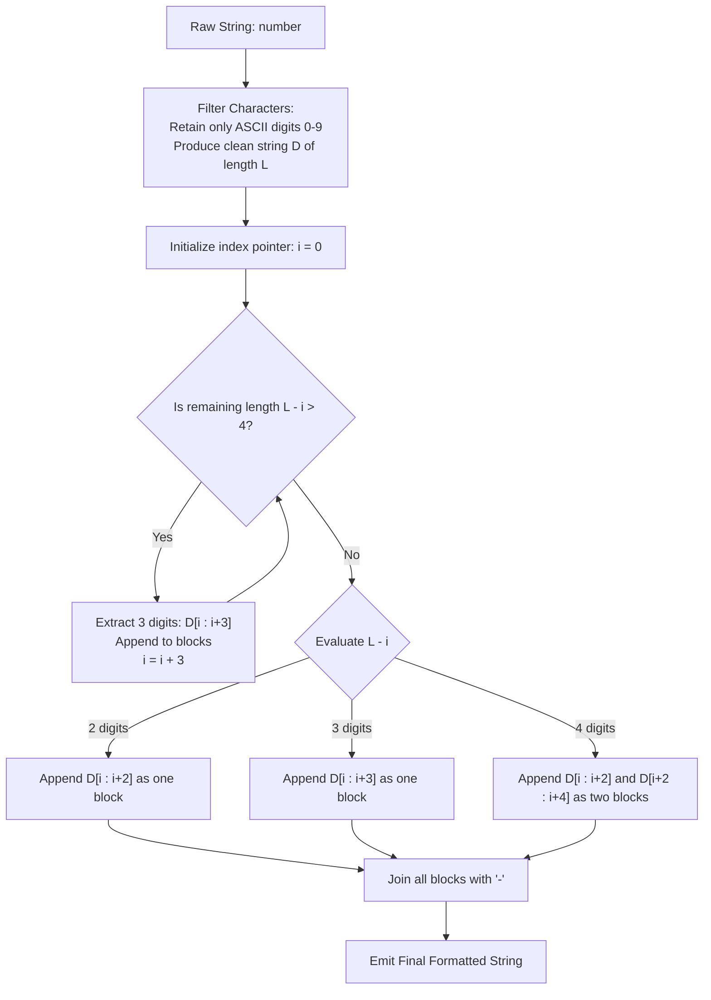

# Guided Example: Reformat Phone Number

We trace string sanitation, prove the Modular Tail Dissection Theorem and the Deterministic Triplet Chunking Invariant, and analyze block formatting across representative phone number strings:

- **Representative Instance 1 (Even Triplet Partition):**
  - Input: `number = "1-23-45 6"`
  - Filtered Digits: `"123456"`, Length: $L = 6$.
  - Partitioning ($6 \equiv 0 \pmod 3$):
    - Block 1 (length 3): `"123"`
    - Block 2 (length 3): `"456"`
  - Joined Output: `"123-456"`.
  - **Required Output:** `"123-456"`.

- **Representative Instance 2 (Residual Four Digits Split into Pairs):**
  - Input: `number = "123 4-567"`
  - Filtered Digits: `"1234567"`, Length: $L = 7$.
  - Partitioning ($7 \equiv 1 \pmod 3$):
    - Consume first 3 digits: `"123"`. Remaining: `"4567"` (length 4).
    - Length 4 rule: split into two blocks of length 2: `"45"` and `"67"`.
  - Joined Output: `"123-45-67"`.
  - **Required Output:** `"123-45-67"`.

- **Representative Instance 3 (Residual Two Digits):**
  - Input: `number = "123 4-5678"`
  - Filtered Digits: `"12345678"`, Length: $L = 8$.
  - Partitioning ($8 \equiv 2 \pmod 3$):
    - Consume first 3 digits: `"123"`.
    - Consume next 3 digits: `"456"`.
    - Remaining digits: `"78"` (length 2) $\implies$ block of 2: `"78"`.
  - Joined Output: `"123-456-78"`.
  - **Required Output:** `"123-456-78"`.

---

## 1. Instance & Teaching Goal

Given a raw string containing digits, spaces `' '`, and dashes `'-'`, we must reformat it into standard grouped telephone blocks according to strict rules:
1. Strip all formatting noise (spaces and dashes).
2. Take consecutive 3-digit chunks from left to right as long as **strictly more than 4 digits** remain.
3. For the final remaining digits (between 2 and 4):
   - Exactly 2 digits: form one block of 2.
   - Exactly 3 digits: form one block of 3.
   - Exactly 4 digits: form two consecutive blocks of 2 each (preventing an isolated singleton digit).
4. Delimit all constructed blocks with hyphens `'-'`.

```text
The Reformatting Decision Tree:
  Let L be the number of extracted digits (L >= 2).

  Extract triplets while remaining count > 4:
    [ d_0 d_1 d_2 ] - [ d_3 d_4 d_5 ] - ...

  When remaining count <= 4:
    Case L_rem == 2:  [ a b ]
    Case L_rem == 3:  [ a b c ]
    Case L_rem == 4:  [ a b ] - [ c d ]   <-- NOT [ a b c ] - [ d ]
```

The pedagogical objectives are:
1. Model string sanitation as a character filter.
2. Formulate the tail partitioning rule as a closed-form modulo condition over $L \pmod 3$.
3. Demonstrate why avoiding blocks of size 1 determines the exact split of 4 residual digits.

---

## 2. Conceptual Foundation & Formatting Recurrence



### The Modular Tail Dissection Theorem

Let $D$ be the sequence of digits obtained after removing non-digit characters, with length $L = |D| \ge 2$.

> **Theorem.** The canonical partitioning is completely determined by $L \pmod 3$:
> 1. If $L \equiv 0 \pmod 3$: $D$ partitions into exactly $L / 3$ blocks of length $3$.
> 2. If $L \equiv 2 \pmod 3$: $D$ partitions into $\lfloor L / 3 \rfloor$ blocks of length $3$ followed by $1$ block of length $2$.
> 3. If $L \equiv 1 \pmod 3$: $D$ partitions into $(\lfloor L / 3 \rfloor - 1)$ blocks of length $3$ followed by $2$ blocks of length $2$.
> In all cases, no block has length $1$, and at most two blocks have length $2$.

*Proof.*
- When repeatedly taking triplets of 3, the residual length $r$ must satisfy $2 \le r \le 4$.
- If $L \equiv 0 \pmod 3$, taking triplets leaves $r = 3$ when reaching the final group, which forms a valid block of 3.
- If $L \equiv 2 \pmod 3$, taking triplets leaves $r = 2$ at the end, which forms a single block of 2.
- If $L \equiv 1 \pmod 3$, taking triplets until $r \le 4$ halts when $r = 4$ (since $4 \equiv 1 \pmod 3$). Splitting $4$ into $2 + 2$ avoids producing $3 + 1$. Thus, the last $4$ digits are partitioned into two blocks of length $2$, leaving $\frac{L - 4}{3} = \lfloor L/3 \rfloor - 1$ triplets before them. $\blacksquare$

---

## 3. Step-by-Step Worked Execution

### Trace on Representative Instance 2 (`number = "123 4-567"`)

#### Step 1: Character Filtering
Scan raw string:
- `'1'` $\to$ digit $\implies$ append.
- `'2'` $\to$ digit $\implies$ append.
- `'3'` $\to$ digit $\implies$ append.
- `' '` $\to$ space $\implies$ skip.
- `'4'` $\to$ digit $\implies$ append.
- `'-'` $\to$ dash $\implies$ skip.
- `'5'` $\to$ digit $\implies$ append.
- `'6'` $\to$ digit $\implies$ append.
- `'7'` $\to$ digit $\implies$ append.
Resulting digit string: $D = \text{"1234567"}$, with total length $L = 7$.

#### Step 2: Chunking Execution
Pointer $i = 0$. Remaining count $L - i = 7$.
- Iteration 1:
  - Is $7 > 4$? Yes.
  - Extract chunk of 3: $D[0:3] = \text{"123"}$.
  - Blocks list: `["123"]`.
  - Advance pointer: $i = 3$.
- Iteration 2:
  - Remaining count: $L - i = 7 - 3 = 4$.
  - Is $4 > 4$? No. Loop terminates.

#### Step 3: Tail Resolution
Remaining substring: $D[3:7] = \text{"4567"}$ (length 4).
- Apply the 4-digit rule: split into two 2-digit blocks:
  - First pair: $D[3:5] = \text{"45"}$.
  - Second pair: $D[5:7] = \text{"67"}$.
- Blocks list becomes: `["123", "45", "67"]`.

#### Step 4: Delimiter Insertion
Join elements with `'-'`:
$$
\text{"123"} + \text{"-"} + \text{"45"} + \text{"-"} + \text{"67"} = \mathbf{"123-45-67"}
$$

---

## 4. Complete Execution Trace

| Raw Input String | Sanitized Digits $D$ | Digit Length $L$ | $L \pmod 3$ | Triplet Blocks (Size 3) | Tail Blocks (Size 2) | Output Joined String |
|---|---|---|---|---|---|---|
| `"1-23-45 6"` | `"123456"` | $6$ | $0$ | `["123", "456"]` | None | **`"123-456"`** |
| `"123 4-567"` | `"1234567"` | $7$ | $1$ | `["123"]` | `["45", "67"]` | **`"123-45-67"`** |
| `"123 4-5678"` | `"12345678"` | $8$ | $2$ | `["123", "456"]` | `["78"]` | **`"123-456-78"`** |
| `"--17-5 229 35-39475 "` | `"1752293539475"` | $13$ | $1$ | `["175", "229", "353"]` | `["94", "75"]` | **`"175-229-353-94-75"`** |
| `"99"` | `"99"` | $2$ | $2$ | None | `["99"]` | **`"99"`** |

---

## 5. Algorithmic Correctness

**Soundness.**
The construction satisfies every formatting criterion:
- Every character in the output is either an extracted digit or a separating hyphen.
- Blocks are created only with sizes 2 and 3.
- Blocks of size 1 are strictly forbidden; when 4 digits remain, splitting into $2 + 2$ guarantees no block has length 1.

**Completeness.**
Because the pointer advances by 3 while $L - i > 4$ and then consumes all remaining digits in one step, every single digit is placed into exactly one block.

---

## 6. Traps This Instance Exposes

- **Greedy Triplet Overshoot:** If triplets are greedily extracted as long as $\ge 3$ digits remain, a string of length 4 would produce a triplet of 3 followed by an illegal orphan singleton of size 1 (e.g. `"123-4"` instead of `"12-34"`). The loop condition must strictly require remaining length $> 4$.
- **Index Out-of-Bounds on Small Inputs:** For $L = 2$, no triplets can be extracted; the algorithm must directly recognize length 2 and yield a single 2-digit block without attempting to slice 3 characters.
- **Consecutive Hyphens in Source:** Raw inputs can contain adjacent dashes (e.g. `"--17--"`). Filtering on the condition `character in '0'..'9'` inherently discards arbitrary sequences of spaces and hyphens.

---

## 7. Complexity Derivation

- **Time Complexity:**
  - Filtering pass over input of length $N$: $\mathcal{O}(N)$ operations.
  - Slicing digits into chunks of size 2 and 3: $\mathcal{O}(L)$ operations, where $L \le N$.
  - Joining chunks with hyphens: $\mathcal{O}(L)$ string construction.
  - Total Time: $\mathcal{O}(N)$, which executes in $< 1$ ms for $N \le 100$.
- **Auxiliary Space Complexity:**
  - Clean digit buffer and block list store at most $L$ characters and $\lceil L/2 \rceil$ block references.
  - Total Auxiliary Space: $\mathcal{O}(N)$ memory to hold the formatted result.
