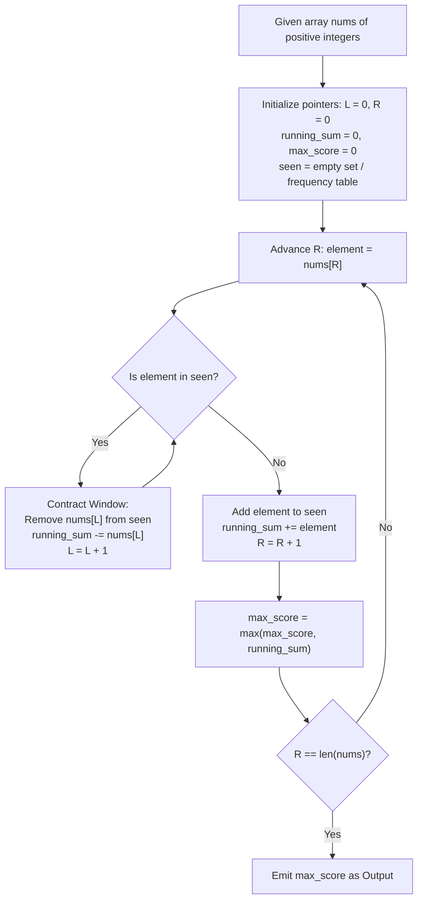

# Guided Example: Maximum Erasure Value

We trace the dynamic sliding window and prefix sum interval evaluation, prove the Sliding Window Monotonicity Theorem and the Unique Subarray Interval Invariant, and analyze optimal subarray score maximization across representative arrays:

- **Representative Instance 1 (Mid-Array Duplicate Encounter):**
  - Input: `nums = [4, 2, 4, 5, 6]`
  - Window Evolution:
    - Step 1: Include `4` $\implies$ window `[4]`, sum $= 4$.
    - Step 2: Include `2` $\implies$ window `[4, 2]`, sum $= 6$.
    - Step 3: Encounter duplicate `4` $\implies$ contract left past the previous `4` $\implies$ window `[2, 4]`, sum $= 6$.
    - Step 4: Include `5` $\implies$ window `[2, 4, 5]`, sum $= 11$.
    - Step 5: Include `6` $\implies$ window `[2, 4, 5, 6]`, sum $= \mathbf{17}$.
  - Maximum unique subarray score: $\mathbf{17}$.
  - **Required Output:** `17`.

- **Representative Instance 2 (Repeated Periodic Duplicate Cycles):**
  - Input: `nums = [5, 2, 1, 2, 5, 2, 1, 2, 5]`
  - Distinct maximal unique subarrays:
    - `[5, 2, 1]`: sum $= 5 + 2 + 1 = \mathbf{8}$.
    - Next window contracts to `[1, 2, 5]`: sum $= 1 + 2 + 5 = \mathbf{8}$.
    - Subsequent duplicates force windows no larger than sum $8$.
  - Maximum unique subarray score: $\mathbf{8}$.
  - **Required Output:** `8`.

- **Representative Instance 3 (Single Element Boundary):**
  - Input: `nums = [10000]`
  - Window: `[10000]`, sum $= \mathbf{10000}$.
  - **Required Output:** `10000`.

---

## 1. Instance & Teaching Goal

Given an array of positive integers `nums`, we must find a contiguous subarray containing strictly unique elements whose sum is maximized. All array values are strictly positive ($nums[i] \ge 1$).

```text
The Sliding Window Dynamic State:
  Left pointer L, Right pointer R.
  Invariant: Elements in nums[L ... R] are mutually distinct.
  Running Sum: S = sum(nums[L ... R]).

  Array: [ 4,  2,  4,  5,  6 ]
           ^   ^   ^
           |   |   +-- R encounters duplicate '4'!
           |   +------ Window must advance L past original '4'
           +---------- Previous index of '4'

  After contraction:
  Array: [ 4,  2,  4,  5,  6 ]
               ^       ^
               L       R
  Window: [2, 4, 5, 6], Sum = 2 + 4 + 5 + 6 = 17
```

The core pedagogical objectives are:
1. Formulate the two-pointer sliding window invariant.
2. Establish why all values being strictly positive guarantees that wider unique windows strictly dominate narrower ones.
3. Compare hash set membership deletion with direct last-seen index jumping.

---

## 2. Conceptual Foundation & Algorithmic Theorems



### The Sliding Window Monotonicity Theorem

Let $A[0 \dots n-1]$ be an array of positive integers. For each right endpoint $r \in [0, n-1]$, define:
$$
\ell^*(r) = \min \{ \ell \le r \mid A[\ell \dots r] \text{ has no duplicate values} \}
$$

> **Theorem (Monotonic Left Boundary Invariant).**
> The optimal lower bound $\ell^*(r)$ is monotonically non-decreasing with respect to $r$:
> $$
> r_1 \le r_2 \implies \ell^*(r_1) \le \ell^*(r_2)
> $$

*Proof.*
Suppose for contradiction that $r_1 < r_2$ but $\ell^*(r_1) > \ell^*(r_2)$.
By definition, the subarray $A[\ell^*(r_2) \dots r_2]$ contains no duplicate values.
Since $\ell^*(r_2) < \ell^*(r_1) \le r_1 < r_2$, the subarray $A[\ell^*(r_2) \dots r_1]$ is a subsegment of $A[\ell^*(r_2) \dots r_2]$.
A subsegment of a duplicate-free array cannot contain any duplicates, which means $A[\ell^*(r_2) \dots r_1]$ has no duplicates.
However, this contradicts the definition of $\ell^*(r_1)$ as the minimum valid start index for $r_1$, because $\ell^*(r_2) < \ell^*(r_1)$.
Thus, $\ell^*(r)$ never moves leftward, enabling a two-pointer sliding window to process the array in linear time. $\blacksquare$

### Positivity and Maximal Extension Dominance

Because every integer $nums[i] \ge 1$, adding an element to a unique subarray strictly increases its sum:
$$
\sum_{k = \ell}^r nums[k] > \sum_{k = \ell}^{r-1} nums[k]
$$
Therefore, for any fixed right endpoint $r$, the maximum score is always achieved at the earliest valid left boundary $\ell^*(r)$.

---

## 3. Step-by-Step Worked Execution

### Trace on Representative Instance 1 (`nums = [4, 2, 4, 5, 6]`)

Initialize $L = 0$, $\text{running\_sum} = 0$, $\text{max\_score} = 0$. Lookup table `seen` tracks elements currently in the window.

#### Step 1: Process $R = 0$ (`nums[0] = 4`)
- `4` is not in window.
- Add `4` to window: $\text{running\_sum} = 0 + 4 = 4$.
- Window: `[4]`.
- $\text{max\_score} = \max(0, 4) = 4$.

#### Step 2: Process $R = 1$ (`nums[1] = 2`)
- `2` is not in window.
- Add `2` to window: $\text{running\_sum} = 4 + 2 = 6$.
- Window: `[4, 2]`.
- $\text{max\_score} = \max(4, 6) = 6$.

#### Step 3: Process $R = 2$ (`nums[2] = 4`)
- `4` is already in window!
- Contract from left until duplicate `4` is removed:
  - Remove `nums[0] = 4`: $\text{running\_sum} = 6 - 4 = 2$, $L = 1$.
  - Now `4` is no longer in window.
- Add new `4`: $\text{running\_sum} = 2 + 4 = 6$.
- Window: `[2, 4]`.
- $\text{max\_score} = \max(6, 6) = 6$.

#### Step 4: Process $R = 3$ (`nums[3] = 5`)
- `5` is not in window.
- Add `5` to window: $\text{running\_sum} = 6 + 5 = 11$.
- Window: `[2, 4, 5]`.
- $\text{max\_score} = \max(6, 11) = 11$.

#### Step 5: Process $R = 4$ (`nums[4] = 6`)
- `6` is not in window.
- Add `6` to window: $\text{running\_sum} = 11 + 6 = 17$.
- Window: `[2, 4, 5, 6]`.
- $\text{max\_score} = \max(11, 17) = \mathbf{17}$.

---

## 4. Complete Execution Trace

| Right Index $R$ | Value $nums[R]$ | Duplicate Encountered? | Left Pointer Contraction ($L$) | Active Window Subarray | Current Window Sum | Running Maximum Score |
|---|---|---|---|---|---|---|
| $0$ | $4$ | None | $L = 0$ | `[4]` | $4$ | **`4`** |
| $1$ | $2$ | None | $L = 0$ | `[4, 2]` | $6$ | **`6`** |
| $2$ | $4$ | Yes (at $nums[0]$) | $L: 0 \to 1$ | `[2, 4]` | $6$ | **`6`** |
| $3$ | $5$ | None | $L = 1$ | `[2, 4, 5]` | $11$ | **`11`** |
| $4$ | $6$ | None | $L = 1$ | `[2, 4, 5, 6]` | $17$ | **`17`** |

---

## 5. Algorithmic Correctness

**Soundness.**
At every step, the window $nums[L \dots R]$ contains only unique values because any duplicate value causes the left boundary to contract until the earlier occurrence is evicted. The running sum matches the exact sum of elements in $nums[L \dots R]$.

**Completeness.**
By the Sliding Window Monotonicity Theorem, any subarray ending at $R$ that starts earlier than $\ell^*(R)$ contains a duplicate, while any subarray starting after $\ell^*(R)$ has a strictly smaller sum (due to strict positivity of array elements). Hence, checking $\sum_{k=\ell^*(R)}^R nums[k]$ for each $R \in [0, n-1]$ evaluates all possible candidates for the global maximum.

---

## 6. Traps This Instance Exposes

- **Quadratic Recomputation of Subarray Sums:** Recalculating the sum of the window from scratch after every contraction leads to an $\mathcal{O}(n^2)$ time complexity. Maintaining an incremental running sum (or using prefix sum differences $s[R+1] - s[L]$) maintains strict $\mathcal{O}(1)$ updates.
- **Negative Value Assumptions:** The sliding window approach relying on sum expansion holds because all numbers are strictly positive ($nums[i] \ge 1$). If negative numbers were present, shrinking a window could increase its sum, requiring Kadane-style modifications.
- **Set Invalidation Without Pointer Sync:** In a hash-set based sliding window, elements must be evicted from the set in the exact order $L, L+1, \dots$ until the conflicting element is removed.

---

## 7. Complexity Derivation

- **Time Complexity:**
  - The right pointer $R$ moves from $0$ to $n-1$ (at most $n$ increments).
  - The left pointer $L$ moves monotonically forward from $0$ to $n-1$ (at most $n$ increments).
  - Each element is added to and removed from the active window set at most once.
  - Total Time: $\mathcal{O}(n)$ operations, executing in $< 35$ ms for $n = 10^5$.
- **Auxiliary Space Complexity:**
  - A hash set or direct frequency array storing values up to $\max(nums[i]) \le 10^4$ requires $\mathcal{O}(\min(n, \max(nums)))$ space.
  - Total Auxiliary Space: $\mathcal{O}(\min(n, \max(nums)))$ memory.
