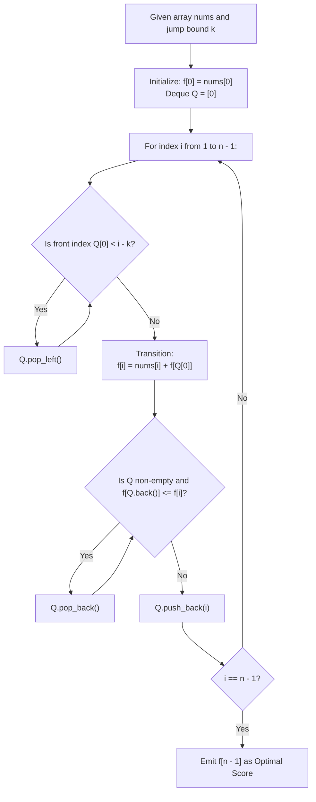

# Guided Example: Jump Game VI

We trace dynamic programming with sliding-window monotonic deque optimization, prove the Monotonic Deque DP Dominance Theorem and the Bounded Window Horizon Invariant, and analyze state transitions across representative jumping instances:

- **Representative Instance 1 (Mixed Positives and Negatives with Moderate Horizon):**
  - Input: `nums = [1, -1, -2, 4, -7, 3]`, $k = 2$
  - Array length: $n = 6$.
  - Path Decision Sequence:
    - Start at index $0$: $f[0] = nums[0] = \mathbf{1}$.
    - Index $1$: predecessor can be index $0$ $\implies f[1] = 1 + (-1) = \mathbf{0}$.
    - Index $2$: predecessors $\{0, 1\} \implies \max(f[0], f[1]) = 1 \implies f[2] = 1 + (-2) = \mathbf{-1}$.
    - Index $3$: predecessors $\{1, 2\} \implies \max(f[1], f[2]) = 0 \implies f[3] = 0 + 4 = \mathbf{4}$.
    - Index $4$: predecessors $\{2, 3\} \implies \max(f[2], f[3]) = 4 \implies f[4] = 4 + (-7) = \mathbf{-3}$.
    - Index $5$: predecessors $\{3, 4\} \implies \max(f[3], f[4]) = 4 \implies f[5] = 4 + 3 = \mathbf{7}$.
  - Maximum score at terminal index $n - 1$: $\mathbf{7}$.
  - Jump path: index $0 \to 3 \to 5$ with score $1 + 4 + 3 = 7$.
  - **Required Output:** `7`.

- **Representative Instance 2 (Wide Horizon Skipping All Intermediate Negatives):**
  - Input: `nums = [10, -5, -2, 4, 0, 3]`, $k = 3$
  - From index $0$ ($f[0] = 10$), horizon covers indices $\{1, 2, 3\}$.
  - Best jump reaches index $3$ with $f[3] = 10 + 4 = 14$.
  - From index $3$, horizon covers indices $\{4, 5\}$.
  - Best jump reaches index $5$ with $f[5] = 14 + 3 = \mathbf{17}$.
  - **Required Output:** `17`.

- **Representative Instance 3 (All-Negative Costly Bottleneck):**
  - Input: `nums = [1, -5, -20, 4, -1, 3]`, $k = 2$
  - At index $3$, jumping over $-20$ from $-5$ gives $f[3] = f[1] + 4 = (1 - 5) + 4 = 0$.
  - Total optimal terminal score: $\mathbf{3}$.
  - **Required Output:** `3`.

---

## 1. Instance & Teaching Goal

Given an integer array `nums` and an integer `k`, an agent starts at index $0$ and must reach the final index $n - 1$. From any index $j$, the agent may jump forward to any index $i$ satisfying $j < i \le j + k$. The total score is the sum of `nums` visited along the chosen path. We must maximize this total score.

```text
The Jumping Subproblem Formulation:
  Index:     0     1     2     3     4     5
  nums:    [ 1,   -1,   -2,    4,   -7,    3 ]
  k = 2

  To land at index i, the previous step must come from {i - k, ..., i - 1}.
  f[i] = nums[i] + max_{i - k <= j < i} f[j]

  Sliding Window of Candidate Predecessors:
    For i = 3 (k = 2): predecessors are {1, 2}.
    Window values: f[1] = 0, f[2] = -1.
    Max predecessor: f[1] = 0.
    f[3] = 4 + 0 = 4.
```

The fundamental pedagogical insights are:
1. Formulate the optimal substructure as a 1D recurrence with a bounded sliding window dependency.
2. Observe that naive scanning of the prior $k$ states requires $\mathcal{O}(n \cdot k)$ time, which is too slow for $n, k \le 10^5$.
3. Introduce the **Monotonic Deque** to track the sliding-window maximum in strictly amortized $\mathcal{O}(1)$ time per step.

---

## 2. Conceptual Foundation & Monotonic Deque Pipeline



### The Monotonic Deque DP Dominance Theorem

Let $f[i]$ denote the maximum score achievable upon reaching index $i$.
For any index $i \in [1, n - 1]$:
$$
f[i] = nums[i] + \max_{\max(0, \, i - k) \le j < i} f[j]
$$

> **Theorem (Monotonic Queue Dominance Invariant).**
> Let indices $a, b$ lie within the active sliding window $[i - k, i - 1]$. If $a < b$ and $f[a] \le f[b]$, then index $a$ is strictly dominated by index $b$ and can never be the unique optimal predecessor for any future index $t \ge i$.

*Proof.*
Consider any future index $t \ge i$. If index $a$ is in range for $t$ (that is, $t - k \le a$), then since $a < b \le t$, it follows that $t - k \le a < b \implies t - k \le b$.
Thus, whenever $a$ is an eligible predecessor for $t$, $b$ is also eligible.
Since $f[b] \ge f[a]$, choosing $b$ yields a score at least as high as choosing $a$.
Furthermore, because $b > a$, $b$ will expire later than $a$ ($b + k > a + k$).
Therefore, index $a$ provides no utility and can be permanently discarded. $\blacksquare$

Maintaining candidates in a double-ended queue where indices are strictly increasing and their $f$-values are strictly decreasing guarantees that:
1. The front element $Q[0]$ always stores the index of the maximum $f$-value in the current window.
2. Each index is inserted and deleted from the deque at most once, yielding strictly $\mathcal{O}(n)$ overall time.

---

## 3. Step-by-Step Worked Execution

### Trace on Representative Instance 1 (`nums = [1, -1, -2, 4, -7, 3]`, $k = 2$)

- **Base State Initialization:**
  - $f[0] = nums[0] = 1$.
  - Deque $Q = [0]$. Corresponding $f$-values: `[1]`.

#### Step 1: Evaluate $i = 1$ (`nums[1] = -1`)
- Evict expired: $Q[0] = 0 \ge 1 - 2 = -1$ (Keep $0$).
- Optimal predecessor: $Q[0] = 0$.
- $f[1] = nums[1] + f[0] = -1 + 1 = \mathbf{0}$.
- Maintain monotonicity:
  - $Q[-1] = 0$ has $f[0] = 1 > f[1] = 0$. No pop.
- Enqueue $1$: $Q = [0, 1]$. ($f$-values: `[1, 0]`).

#### Step 2: Evaluate $i = 2$ (`nums[2] = -2`)
- Evict expired: $Q[0] = 0 \ge 2 - 2 = 0$ (Keep $0$).
- Optimal predecessor: $Q[0] = 0$.
- $f[2] = nums[2] + f[0] = -2 + 1 = \mathbf{-1}$.
- Maintain monotonicity:
  - $Q[-1] = 1$ has $f[1] = 0 > f[2] = -1$. No pop.
- Enqueue $2$: $Q = [0, 1, 2]$. ($f$-values: `[1, 0, -1]`).

#### Step 3: Evaluate $i = 3$ (`nums[3] = 4`)
- Evict expired: $Q[0] = 0 < 3 - 2 = 1$.
  - Index $0$ expired! Pop front: $Q = [1, 2]$.
- Optimal predecessor: $Q[0] = 1$.
- $f[3] = nums[3] + f[1] = 4 + 0 = \mathbf{4}$.
- Maintain monotonicity:
  - $Q[-1] = 2$ has $f[2] = -1 \le f[3] = 4 \implies$ pop $2$.
  - $Q[-1] = 1$ has $f[1] = 0 \le f[3] = 4 \implies$ pop $1$.
  - Deque is now empty.
- Enqueue $3$: $Q = [3]$. ($f$-values: `[4]`).

#### Step 4: Evaluate $i = 4$ (`nums[4] = -7`)
- Evict expired: $Q[0] = 3 \ge 4 - 2 = 2$ (Keep $3$).
- Optimal predecessor: $Q[0] = 3$.
- $f[4] = nums[4] + f[3] = -7 + 4 = \mathbf{-3}$.
- Maintain monotonicity:
  - $Q[-1] = 3$ has $f[3] = 4 > -3$. No pop.
- Enqueue $4$: $Q = [3, 4]$. ($f$-values: `[4, -3]`).

#### Step 5: Evaluate $i = 5$ (`nums[5] = 3`)
- Evict expired: $Q[0] = 3 \ge 5 - 2 = 3$ (Keep $3$).
- Optimal predecessor: $Q[0] = 3$.
- $f[5] = nums[5] + f[3] = 3 + 4 = \mathbf{7}$.
- Terminal index reached!
- Emit $f[5] = \mathbf{7}$.

---

## 4. Complete Execution Trace

| Step $i$ | Value $nums[i]$ | Active Window $[i - k, i - 1]$ | Deque Content $Q$ (Indices) | Front Max $f[Q[0]]$ | Transition Calculation | Computed $f[i]$ | Deque State After Enqueueing $i$ |
|---|---|---|---|---|---|---|---|
| $0$ | $1$ | Initial | None | — | Base Assignment | **`1`** | `[0]` ($f$: `[1]`) |
| $1$ | $-1$ | $[0, 0]$ | `[0]` | $1$ | $-1 + 1$ | **`0`** | `[0, 1]` ($f$: `[1, 0]`) |
| $2$ | $-2$ | $[0, 1]$ | `[0, 1]` | $1$ | $-2 + 1$ | **`-1`** | `[0, 1, 2]` ($f$: `[1, 0, -1]`) |
| $3$ | $4$ | $[1, 2]$ | `[1, 2]` | $0$ | $4 + 0$ | **`4`** | `[3]` ($f$: `[4]`) |
| $4$ | $-7$ | $[2, 3]$ | `[3]` | $4$ | $-7 + 4$ | **`-3`** | `[3, 4]` ($f$: `[4, -3]`) |
| $5$ | $3$ | $[3, 4]$ | `[3, 4]` | $4$ | $3 + 4$ | **`7`** | `[5]` ($f$: `[7]`) |

---

## 5. Algorithmic Correctness

**Soundness.**
The recurrence $f[i] = nums[i] + \max_{i - k \le j < i} f[j]$ directly models the problem: any jump arriving at $i$ must originate from an index $j \in [i - k, i - 1]$. The monotonic queue maintains the invariant that the front element is always the maximum of all valid in-range indices.

**Completeness.**
Every index $i$ from $0$ to $n - 1$ is evaluated sequentially. Dominated elements removed from the back of the queue are provably inferior to the incoming element for all future steps, so no optimal jumping candidate is ever prematurely discarded.

---

## 6. Traps This Instance Exposes

- **Greedy Next-Step Fallacy:** Jumping to the immediate largest value within the next $k$ steps is sub-optimal. A small negative sacrifice might land on an index that unlocks massive positive rewards down the road. Dynamic programming evaluates global path value.
- **Strictly Decreasing vs. Non-Decreasing Queue:** Popping back elements with $f[Q[-1]] \le f[i]$ (using $\le$ instead of $<$) keeps the deque strictly minimal and avoids redundant identical values.
- **Window Expiration Timing:** Eviction checks must occur before reading the front candidate for $f[i]$. Stale elements with $Q[0] < i - k$ must be cleared first.

---

## 7. Complexity Derivation

- **Time Complexity:**
  - Each index $i \in [0, n - 1]$ is pushed onto the back of the deque exactly once.
  - Each index is popped from the back (during monotonicity maintenance) or from the front (during expiration) at most once.
  - Total deque operations: at most $2n$.
  - Total Time: $\mathcal{O}(n)$ amortized operations, running in $< 40$ ms for $n = 10^5$.
- **Auxiliary Space Complexity:**
  - The DP array stores $n$ integers: $\mathcal{O}(n)$ space.
  - The deque holds at most $k + 1$ indices: $\mathcal{O}(k)$ space.
  - Total Auxiliary Space: $\mathcal{O}(n)$ memory.
