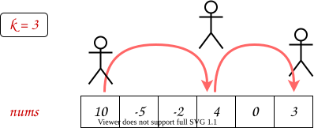
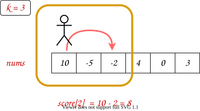
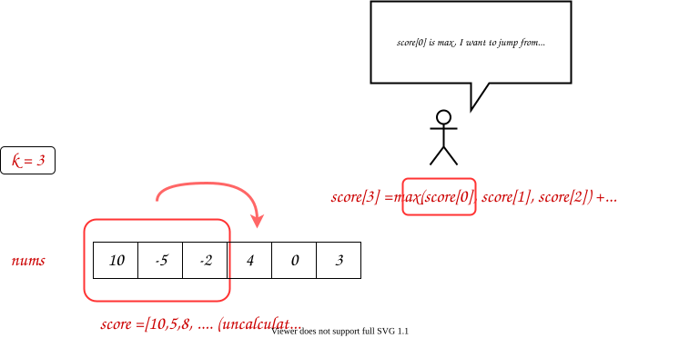
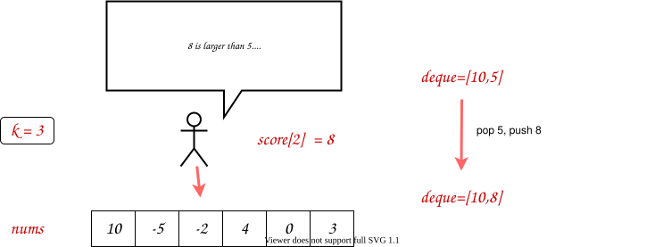
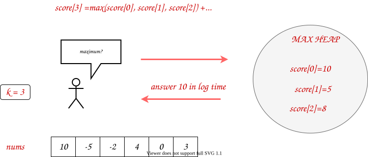
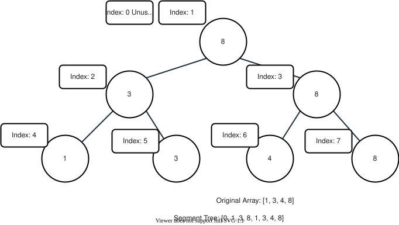
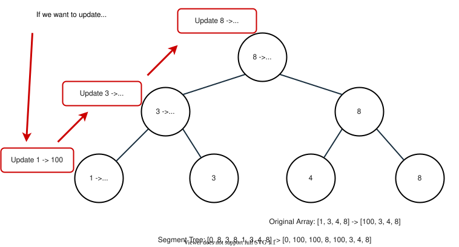
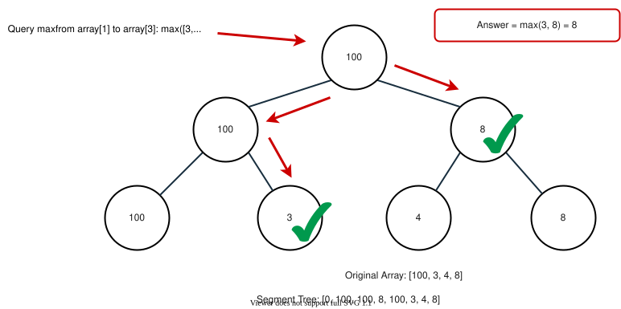

## Solution

---

#### Overview

You probably can guess from the problem title, this is the sixth problem in the series of [Jump Game](https://leetcode.com/problems/jump-game/) problems. Those problems are similar, but have considerable differences, making their solutions quite different.

In this problem, for each move, we are allowed to advance `k` steps, and our target is to maximize the scores we collect.

One example:



Below, five approaches are introduced.

Generally, we recommend *Approach 1: Dynamic Programming + Deque* and *Approach 4: Dynamic Programming + Deque (Compressed)* since they have the best performance.

Also, because it is a medium level problem, we allow some relevant slower approaches: *Approach 2: Dynamic Programming + Priority Queue* and *Approach 3: Segment Tree*.

Note that *Approach 4: Dynamic Programming + Deque (Compressed)* and *Approach 5: Dynamic Programming + Priority Queue (Compressed)* are the state compressed version of *Approach 1* and *Approach 2*.

---

#### Approach 1: Dynamic Programming + Deque

**Intuition**

> Note: This approach is a little bit **beyond** the medium level question, so if you are struggling to understand this, you should at least finish the DP part, and then feel free to jump to *Approach 2* , which is easier but has a slower performance.
>
> However, it is still strongly recommended to understand this whole approach since it is not that hard.

>In this part, we will explain how to think of this approach step by step.
>
>If you are only interested in the pure algorithm, you can jump to the algorithm part.

For the Jump Game series questions, dynamic programming is our old friend. It's natural to try DP first.

To implement DP, we need a dp array. What should the DP array represent?

Since the problem ask us the max score we can get ending at the last index, how about letting $\text{dp}[i]$ represent the max score we can get ending at index `i`?

> Also, you can let $\text{dp}[i]$ represent the max score we can get **starting** at index `i`. That is similar.

To have better naming, we rename `dp` to `score`. So, $\text{score}[i]$ represents the max score we can get ending at index `i`.

For example:



OK. Let's dive deeper.

For a DP solution, basically, we need two things:

1. The base case.

This is where our dp start. Usually, this means how to calculate $\text{dp}[0]$. In our case, $\text{score}[0] = \text{nums}[0]$ since $\text{nums}[0]$ is both our start and end. We only have one choice.

2. The so-called transition equation.

That is to say, if we have already calculated $\text{score}[0]$, $\text{score}[1]$, ..., `score[i-1]`, how can we calculate $\text{score}[i]$?

Since we can only advance `k` steps, to arrive $\text{nums}[i]$, we must jump from one of `nums[i-k]`, `nums[i-k+1]`, ..., `nums[i-1]`. We only need to pick the one with maximum `score`.

For example, if we are calculating $\text{score}[3]$ and `k=3`, we need to decide jump from index `0`, `1`, or `2`:



OK, now we have a transition equation:

```
score[i] = max(score[i-k], ..., score[i-1]) + nums[i]
```

However, this equation needs $\mathcal{O}(k)$ to calculate $\text{score}[i]$, which makes the overall complexity come to $\mathcal{O}(Nk) = 10^{9}$ in the worst case, given that $N$ is the length of `nums`.

This complexity is too much and we need to improve it.

Somehow, this equation is similar to [Sliding Window Maximum](https://leetcode.com/problems/sliding-window-maximum/), which is a typical monotonic queue problem. We can use the same technique to make some improvements.

Note that when calculating maximum, we do not need all `score[i-k]`, ..., `score[i-1]`; we just need some large values.

For example, if $k = 3$ and `[score[i-3], score[i-2], score[i-1]] = [2, 4, 10]`, their maximum is $score[i-1] = 10$. In this case, when calculating following $\text{score}[i]$ (and further `score[i+1]`), we do **not** need $score[i-3] = 2$ and $score[i-2] = 4$, since they are smaller than $score[i-1] = 10$.

The picture illustrates another example when calculating $\text{score}[2]$:



In this case, we maintain a deque as a monotonically decreasing queue. Since it is monotonically decreasing, the maximum value is always at the **top** of the queue.

In practice, since we store scores in `score`, we only need to store the index in the queue.

Also, remember to pop the index smaller than `i-k` out of the queue from the left.

**Algorithm**

*Step 1:* Initialize a dp array `score`, where $\text{score}[i]$ represents the max score starting at $\text{nums}[0]$ and ending at $\text{nums}[i]$.

*Step 2:* Initialize a deque array `dq` storing indexes of `nums` such that the corresponding values are monotonically decreasing.

*Step 3:* Iterate over `nums`. For each element $\text{nums}[i]$:
  - Pop all the indexes smaller than `i-k` out of `dq` from left.
  - Update $\text{score}[i]$ to $score[\text{dq.peekFirst}()] + \text{nums}[i]$.
  - If the corresponding score of the rightmost index in `dq` (i.e., `score[dq.peekLast()]`) is smaller than $\text{score}[i]$, pop it from the right to make corresponding values monotonically decreasing. Repeat.
  - Push `i` into the right of `dq`.

*Step 4:* Return the last element of `score`.

> Challenge: Can you implement the code yourself without seeing our implementations?

**Implementation**

```python
class Solution:
    def maxResult(self, nums: List[int], k: int) -> int:
        n = len(nums)
        score = [0]*n
        score[0] = nums[0]
        dq = deque()
        dq.append(0)
        for i in range(1, n):
            # pop the old index
            while dq and dq[0] < i-k:
                dq.popleft()
            score[i] = score[dq[0]] + nums[i]
            # pop the smaller value
            while dq and score[i] >= score[dq[-1]]:
                dq.pop()
            dq.append(i)
        return score[-1]
```

**Complexity Analysis**

Let $N$ be the length of `nums`.

* Time Complexity: $\mathcal{O}(N)$, since we need to iterate `nums`, and push and pop each element into the deque at most once.

* Space Complexity: $\mathcal{O}(N)$, since we need $\mathcal{O}(N)$ space to store our dp array and $\mathcal{O}(k)$ to store `dq`.

---

#### Approach 2: Dynamic Programming + Priority Queue

**Intuition**

In *Approach 1*, we got the following transition equation for Dynamic Programming:

```
score[i] = max(score[i-k], ..., score[i-1]) + nums[i]
```

If you are not familiar with the monotonic queue technique mentioned in *Approach 1*, and still want to find out the maximum quickly, Priority Queue (Heap) is for you. Heap maintain and return the max value in $\log$ time.



If we found that the index of the maximum score is less than `i-k`, just pop out and get the next maximum score.

**Algorithm**

*Step 1:* Initialize a dp array `score`, where $\text{score}[i]$ represents the max score starting at $\text{nums}[0]$ and ending at $\text{nums}[i]$.

*Step 2:* Initialize a max-heap $\text{priority}_{queue}$.

*Step 3:* Iterate over `nums`. For each element $\text{nums}[i]$:
  - If the index of top of $\text{priority}_{queue}$ is less than `i-k`, pop the top. Repeat.
  - Update $\text{score}[i]$ to the sum of corresponding score of the index of top of $\text{priority}_{queue}$ and $\text{nums}[i]$ (i.e., $score[\text{priorityQueue.peek}()[1]] + \text{nums}[i]$).
  - Push pair $(\text{score}[i], i)$ into $\text{priority}_{queue}$.

*Step 4:* Return the last element of `score`.

> Challenge: Can you implement the code yourself without seeing our implementations?

**Implementation**

```python
class Solution:
    def maxResult(self, nums: List[int], k: int) -> int:
        n = len(nums)
        score = [0]*n
        score[0] = nums[0]
        priority_queue = []
        # since heapq is a min-heap,
        # we use negative of the numbers to mimic a max-heap
        heapq.heappush(priority_queue, (-nums[0], 0))
        for i in range(1, n):
            # pop the old index
            while priority_queue[0][1] < i-k:
                heapq.heappop(priority_queue)
            score[i] = nums[i]+score[priority_queue[0][1]]
            heapq.heappush(priority_queue, (-score[i], i))
        return score[-1]
```

**Complexity Analysis**

Let $N$ be the length of `nums`.

* Time Complexity: $\mathcal{O}(N \log N)$, since we need to iterate `nums`, and push and pop each element into the deque at most once, and for each push and pop, it costs $\mathcal{O}(\log N)$ in the worst case.

* Space Complexity: $\mathcal{O}(N)$, since we need $\mathcal{O}(N)$ space to store our dp array and $\mathcal{O}(N)$ to store $\text{priority}_{queue}$.

---

#### Approach 3: Segment Tree

**Intuition**

In *Approach 1*, we got the following transition equation for Dynamic Programming:

```
score[i] = max(score[i-k], ..., score[i-1]) + nums[i]
```

There is also another way to find out the interval maximum in $\log$ time: Segment Tree.

Since we already have some great explanations on [Segment Tree](https://en.wikipedia.org/wiki/Segment_tree), here we will **not** provide a detailed explanation of implementation. You can find some comprehensive tutorials on [Recursive Approach to Segment Trees](https://leetcode.com/articles/a-recursive-approach-to-segment-trees-range-sum-queries-lazy-propagation/) or [Range Sum Query - Mutable](https://leetcode.com/problems/range-sum-query-mutable/solution/).

Now, we will have a quick review of the segment tree and then explain how we can use it to tackle our problem.

As we know, the segment tree is a data structure used for storing information about intervals. Given that $N$ is the size of the tree, this data structure allows us to `query` and to `update` the information about a certain interval in $\mathcal{O}(\log(N))$ time.

Take the segment tree for querying interval **max** for an example:



Usually, we store the tree in an array. We need twice the size of the original array to store the segment tree.

Here, we leave the index `0` unused for the convenience of indexing. You can also choose to use it by shifting the whole tree to left by one unit. In our approach, the left and right children of node `i` are `2*i` and $2*i + 1$ respectively.

Given that `n` is the size of the original array, from the node `n` to node $2*n - 1$, we store the original array itself. For other nodes, we store the value of node `i` as the sum of node `2*i` and node $2*i + 1$.

The segment tree allows us to `query` the **max** of a certain interval and to `update` the values of elements. It should be able to process both actions in $\mathcal{O}(\log(N))$ time. Let's see some examples.

*Updating Value*

For `update`, what we do is simple. Just update the value from the leaf to the root. For instance:



*Querying Sum*

For `query`, the case is a bit complicated. Generally speaking, we are dividing the target interval into a few pre-calculated segments to reduced run time. For example:



OK. Now back to our problem. How can we use the segment tree?

For each element $\text{nums}[i]$, we need to `query` `max(score[i-k], ..., score[i-1])`, and then `update` the value of index `i` in Segment Tree to that maximum plus $\text{nums}[i]$. Both actions can be implemented in $\log$ time.

**Algorithm**

*Step 1:* Implement the Segment Tree. Since the tree is initialized to all zeros, only `update` and `query` need to be implemented.

*Step 2:* Iterate over `nums`. For each element $\text{nums}[i]$:
  - `query` the maximum from index `i-k` to index `i`.
  - `update` value of index `i` to that maximum plus $\text{nums}[i]$.

*Step 3:* Return the last element of the segment tree.

> Challenge: Can you implement the code yourself without seeing our implementations?

**Implementation**

```python
class Solution:
    def maxResult(self, nums: List[int], k: int) -> int:
        # implement Segment Tree
        def update(index, value, tree, n):
            index += n
            tree[index] = value
            while index > 1:
                index >>= 1
                tree[index] = max(tree[index << 1], tree[(index << 1)+1])

        def query(left, right, tree, n):
            result = -inf
            left += n
            right += n
            while left < right:
                if left & 1:
                    result = max(result, tree[left])
                    left += 1
                left >>= 1
                if right & 1:
                    right -= 1
                    result = max(result, tree[right])
                right >>= 1
            return result

        n = len(nums)
        tree = [0]*(2*n)
        update(0, nums[0], tree, n)
        for i in range(1, n):
            maxi = query(max(0, i-k), i, tree, n)
            update(i, maxi+nums[i], tree, n)
        return tree[-1]
```

**Complexity Analysis**

Let $N$ be the length of `nums`.

* Time Complexity: $\mathcal{O}(N \log N)$, since we need to iterate `nums`, and for each element we need to perform the `query` and `update` once, which costs $\mathcal{O}(\log N)$ in the worst case.

* Space Complexity: $\mathcal{O}(N)$, since we need $\mathcal{O}(N)$ space to store our segment tree.

---

#### Approach 4: Dynamic Programming + Deque (Compressed)

**Intuition**

Note that in *Approach 1*, when calculating $\text{score}[i]$, we do not need all values from $\text{score}[0]$ to `score[i-1]`; we only need part of values from `score[i-k]` to `score[i-1]`. We can drop the previous values to save memory.

But how? Note that we have a deque array `dq`, we can save $\text{score}[i]$ when saving index `i`, and drop the whole `score` array. That is to say, we save a pair $(i, \text{score}[i])$ in the deque. The length of `dq` is at most $\mathcal{O}(k)$, so the space complexity is down to $\mathcal{O}(k)$.

**Algorithm**

*Step 1:* Initialize an integer `score`.

*Step 2:* Initialize a deque array `dq`.

*Step 3:* Iterate over `nums`. For each element $\text{nums}[i]$:
  - Pop all the indexes smaller than `i-k` out of `dq` from left.
  - Update `score` to $\text{dq.peekFirst}()[1] + \text{nums}[i]$.
  - If the corresponding score of the rightmost index in `dq` (i.e., `dq.peekLast()[1]`) is smaller than `score`, pop it from the right to make corresponding values monotonically decreasing. Repeat.
  - Push `(i, score)` into the right of `dq`.

*Step 4:* Return `score`.

> Challenge: Can you implement the code yourself without seeing our implementations?

**Implementation**

```python
class Solution:
    def maxResult(self, nums: List[int], k: int) -> int:
        n = len(nums)
        score = nums[0]
        dq = deque()
        dq.append((0, score))
        for i in range(1, n):
            # pop the old index
            while dq and dq[0][0] < i-k:
                dq.popleft()
            score = dq[0][1] + nums[i]
            # pop the smaller value
            while dq and score >= dq[-1][1]:
                dq.pop()
            dq.append((i, score))
        return score
```

**Complexity Analysis**

Let $N$ be the length of `nums`.

* Time Complexity: $\mathcal{O}(N)$, since we need to iterate `nums`, and push and pop each element into the deque at most once.

* Space Complexity: $\mathcal{O}(k)$, since we need $\mathcal{O}(k)$ to store `dq`.

---

#### Approach 5: Dynamic Programming + Priority Queue (Compressed)

**Intuition**

Similar to *Approach 4*, when calculating $\text{score}[i]$, we do not need all values from $\text{score}[0]$ to `score[i-1]`; we only need values from `score[i-k]` to `score[i-1]`. We can drop the previous values to save memory.

Since we already save the $(\text{score}[i], i)$ pair in our Priority Queue, we can directly drop the `score` array.

However, the length of our Priority Queue is $\mathcal{O}(N)$ in the worst case, given that $N$ is the length of `nums`. That is to say, we can not decrease the big-O space complexity. Nevertheless, we still decrease memory usage by half by dropping the `score` array.

**Algorithm**

*Step 1:* Initialize an integer `score`.

*Step 2:* Initialize a max-heap $\text{priority}_{queue}$.

*Step 3:* Iterate over `nums`. For each element $\text{nums}[i]$:
  - If the index of top of $\text{priority}_{queue}$ is less than `i-k`, pop the top. Repeat.
  - Update `score` to the sum of corresponding score of the index of top of $\text{priority}_{queue}$ and $\text{nums}[i]$ (i.e., $\text{priorityQueue.peek}()[0] + \text{nums}[i]$).
  - Push pair `(score, i)` into $\text{priority}_{queue}$.

*Step 4:* Return `score`.

> Challenge: Can you implement the code yourself without seeing our implementations?

**Implementation**

```python
class Solution:
    def maxResult(self, nums: List[int], k: int) -> int:
        n = len(nums)
        score = nums[0]
        priority_queue = []
        # since heapq is a min-heap,
        # we use negative of the numbers to mimic a max-heap
        heapq.heappush(priority_queue, (-nums[0], 0))
        for i in range(1, n):
            # pop the old index
            while priority_queue[0][1] < i-k:
                heapq.heappop(priority_queue)
            score = nums[i]-priority_queue[0][0]
            heapq.heappush(priority_queue, (-score, i))
        return score
```

**Complexity Analysis**

Let $N$ be the length of `nums`.

* Time Complexity: $\mathcal{O}(N \log N)$, since we need to iterate `nums`, and push and pop each element into the deque at most once, and for each push and pop, it costs $\mathcal{O}(\log N)$ in the worst case.

* Space Complexity: $\mathcal{O}(N)$, since we need $\mathcal{O}(N)$ to store $\text{priority}_{queue}$.