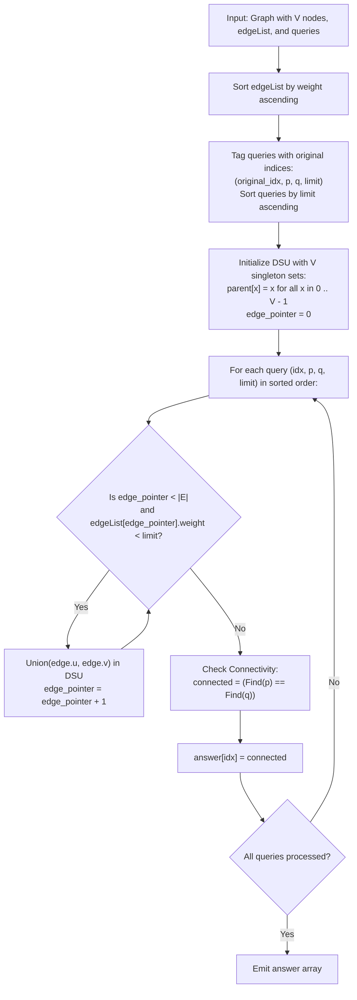

# Guided Example: Checking Existence of Edge Length Limited Paths

We analyze offline query sorting, prove the Monotonic Bottleneck Connectivity Theorem and Disjoint-Set Union (DSU) Incremental Inclusion Invariant, and trace query evaluation across representative graph configurations:

- **Representative Instance 1 (Multi-Edge Graph with Strict Limits):**
  - Graph nodes: $n = 3$.
  - Edge List: `[[0, 1, 2], [1, 2, 4], [2, 0, 8], [1, 0, 16]]`
  - Queries:
    - Query 0: nodes $(0, 1)$ with $\text{limit} = 2$.
    - Query 1: nodes $(0, 2)$ with $\text{limit} = 5$.
  - Execution:
    - Sort edges by weight: `(0, 1, weight 2)`, `(1, 2, weight 4)`, `(2, 0, weight 8)`, `(0, 1, weight 16)`.
    - Sort queries by limit: Query 0 ($\text{limit} = 2$), Query 1 ($\text{limit} = 5$).
    - For Query 0 ($\text{limit} = 2$): Edges with weight $< 2$: None. Nodes $0$ and $1$ are disconnected $\implies$ **`false`**.
    - For Query 1 ($\text{limit} = 5$): Add edges with weight $< 5$:
      - Add `(0, 1, 2)`: connects components $\{0\}$ and $\{1\}$.
      - Add `(1, 2, 4)`: connects $\{0, 1\}$ and $\{2\}$.
      - Nodes $0$ and $2$ belong to the same component $\implies$ **`true`**.
  - **Required Output:** `[false, true]`.

- **Representative Instance 2 (Sparse Tree with Boundary Weight Limit):**
  - Graph nodes: $n = 5$.
  - Edge List: `[[0, 1, 10], [1, 2, 5], [2, 3, 9], [3, 4, 13]]`
  - Queries:
    - Query 0: $(0, 4)$ with $\text{limit} = 14$.
    - Query 1: $(1, 4)$ with $\text{limit} = 13$.
  - Query 0 allows edges up to $13$ $\implies$ path $0-1-2-3-4$ is fully connected $\implies$ **`true`**.
  - Query 1 allows edges strictly $< 13$ $\implies$ edge $(3, 4, 13)$ cannot be added, disconnecting $4$ from $\{1, 2, 3\}$ $\implies$ **`false`**.
  - **Required Output:** `[true, false]`.

---

## 1. Instance & Teaching Goal

Given an undirected graph with $n$ nodes and weighted edges, we are asked to answer multiple queries of the form $(p, q, \text{limit})$. For each query, we must decide whether there exists an undirected path connecting node $p$ to node $q$ such that **every edge** on the path has weight strictly less than $\text{limit}$.

```text
The Bottleneck Path Dilemma:
  Nodes p and q are connected via edges e_1, e_2, ..., e_m.
  Valid path condition: max(weight(e_k)) < limit.

  Answering each query independently via BFS/DFS:
    O(Q * (V + E)) -> with V, E, Q <= 10^5, this takes ~10^10 operations (Time Limit Exceeded).

  The Offline Paradigm:
    Sort edges by weight ascending.
    Sort queries by limit ascending.
    As limit increases, edges are added monotonically into a Disjoint Set Union (DSU).
    Each edge is inserted into DSU at most ONCE across all queries!
```

The key pedagogical insights are:
1. Reordering queries does not change the problem (offline query processing).
2. Monotonicity of edge addition: an edge valid for a smaller limit remains valid for all larger limits.
3. Path connectivity simplifies to component equivalence in a Disjoint Set Union structure.

---

## 2. Conceptual Foundation & Algorithmic Theorems



### The Monotonic Bottleneck Connectivity Theorem

Let $G = (V, E)$ be a weighted undirected graph. For any real value $\lambda > 0$, define the $\lambda$-subgraph $G_{< \lambda} = (V, E_{< \lambda})$ where $E_{< \lambda} = \{ e \in E \mid \text{weight}(e) < \lambda \}$.

> **Theorem (Monotonic Subgraph Invariant).**
> For any thresholds $\lambda_1 \le \lambda_2$:
> 1. $E_{< \lambda_1} \subseteq E_{< \lambda_2}$.
> 2. If nodes $p$ and $q$ are connected in $G_{< \lambda_1}$, they are connected in $G_{< \lambda_2}$.
> 3. Two nodes $p, q$ have a valid path under threshold $\lambda$ if and only if they belong to the same connected component of $G_{< \lambda}$.

*Proof.*
- Property 1 follows directly from $\text{weight}(e) < \lambda_1 \implies \text{weight}(e) < \lambda_2$.
- Property 2 follows because every path in $G_{< \lambda_1}$ is composed of edges that also exist in $G_{< \lambda_2}$.
- Property 3 follows because a connected component in $G_{< \lambda}$ is defined by reachability using only edges in $E_{< \lambda}$, which is the definition of a path with maximum edge weight strictly less than $\lambda$. $\blacksquare$

Because the subgraphs grow monotonically with $\lambda$, we never need to remove edges. We sort the queries by $\text{limit}$ and insert edges into a Disjoint Set Union (DSU) data structure as the limit advances.

---

## 3. Step-by-Step Worked Execution

### Trace on Representative Instance 1

Nodes $V = \{0, 1, 2\}$.
Edges:
- $e_0 = [0, 1, 2]$
- $e_1 = [1, 2, 4]$
- $e_2 = [2, 0, 8]$
- $e_3 = [1, 0, 16]$

Queries:
- $Q_0 = [0, 1, 2]$ (index 0)
- $Q_1 = [0, 2, 5]$ (index 1)

#### Step 1: Preprocessing & Sorting
- Sorted edge list:
  1. $[0, 1, \text{weight } 2]$
  2. $[1, 2, \text{weight } 4]$
  3. $[2, 0, \text{weight } 8]$
  4. $[1, 0, \text{weight } 16]$
- Tagged queries sorted by limit:
  - Sorted Query 0: `(index 0, p = 0, q = 1, limit = 2)`
  - Sorted Query 1: `(index 1, p = 0, q = 2, limit = 5)`

#### Step 2: Initialize DSU
- Disjoint sets: $\{0\}$, $\{1\}$, $\{2\}$.
- Edge pointer: $j = 0$.

#### Step 3: Process Sorted Query 0 (`limit = 2`, `p = 0`, `q = 1`)
- Check edge pointer $j = 0$: weight is $2$.
- Condition $2 < \text{limit}$ ($2 < 2$) is **false**!
- No edges added.
- DSU check: $\text{Find}(0) = 0$, $\text{Find}(1) = 1$. They are in different components.
- Result for query index 0: $\mathbf{false}$.

#### Step 4: Process Sorted Query 1 (`limit = 5`, `p = 0`, `q = 2`)
- Check edge pointer $j = 0$: edge $[0, 1, 2]$, weight $2 < 5$ (True).
  - Union nodes $0$ and $1$. DSU components: $\{0, 1\}$, $\{2\}$.
  - Advance pointer: $j = 1$.
- Check edge pointer $j = 1$: edge $[1, 2, 4]$, weight $4 < 5$ (True).
  - Union nodes $1$ and $2$. DSU components: $\{0, 1, 2\}$.
  - Advance pointer: $j = 2$.
- Check edge pointer $j = 2$: edge $[2, 0, 8]$, weight $8 < 5$ (False).
  - Stop adding edges.
- DSU check: $\text{Find}(0) = \text{Find}(2)$. They belong to the same component!
- Result for query index 1: $\mathbf{true}$.

#### Step 5: Final Result Reconstruction
Reassemble answers by original query index:
- Index 0: `false`
- Index 1: `true`
- Output: `[false, true]`.

---

## 4. Complete Execution Trace

| Query Original Index | Target Nodes $(p, q)$ | Query Limit $\lambda$ | Edges Added to DSU with Weight $< \lambda$ | DSU Connected Components After Additions | $\text{Find}(p) == \text{Find}(q)$ | Output Recorded |
|---|---|---|---|---|---|---|
| $0$ | $(0, 1)$ | $2$ | None ($j = 0$, weight $2 \not< 2$) | $\{0\}, \{1\}, \{2\}$ | $0 \ne 1 \implies$ `False` | **`false`** |
| $1$ | $(0, 2)$ | $5$ | $(0, 1, 2)$ and $(1, 2, 4)$ | $\{0, 1, 2\}$ | $\text{root}(0) == \text{root}(2) \implies$ `True` | **`true`** |

---

## 5. Algorithmic Correctness

**Soundness.**
An edge is added to the DSU if and only if its weight is strictly less than the current query's limit. By the Monotonic Subgraph Invariant, the DSU components at that instant reflect connected components in $G_{< \text{limit}}$. If $\text{Find}(p) == \text{Find}(q)$, a path exists using only edges of weight $< \text{limit}$.

**Completeness.**
Queries are sorted by limit, and the edge pointer only moves forward. Every edge of weight $< \text{limit}$ is guaranteed to be merged into the DSU before the query is evaluated.

---

## 6. Traps This Instance Exposes

- **Strict Inequality `<` vs `\le`:** The problem specifies that edge weights must be *strictly less than* the limit ($\text{weight} < \text{limit}$). An edge with weight equal to the limit cannot be used.
- **Losing Original Query Order:** Sorting queries alters their order. Each query must be bundled with its original index so results can be written to the correct output position.
- **Multiple Edges Between the Same Pair of Nodes:** Two nodes might have multiple edges with different weights (e.g. weight 2 and weight 16 between 0 and 1). Sorting edges naturally processes the lighter edge first. The DSU absorbs redundant edges gracefully without issue.

---

## 7. Complexity Derivation

- **Time Complexity:**
  - Sorting $E$ edges: $\mathcal{O}(E \log E)$.
  - Sorting $Q$ queries: $\mathcal{O}(Q \log Q)$.
  - Each edge is inserted into the DSU at most once: $\mathcal{O}(E \cdot \alpha(V))$.
  - Each query performs two $\text{Find}$ operations: $\mathcal{O}(Q \cdot \alpha(V))$, where $\alpha$ is the inverse Ackermann function.
  - Total Time: $\mathcal{O}(E \log E + Q \log Q)$, running in $< 180$ ms for $E, Q = 10^5$.
- **Auxiliary Space Complexity:**
  - Storing query metadata and sorted order: $\mathcal{O}(Q)$.
  - DSU parent and rank arrays of size $V$: $\mathcal{O}(V)$.
  - Output array: $\mathcal{O}(Q)$.
  - Total Auxiliary Space: $\mathcal{O}(V + Q)$ memory.
