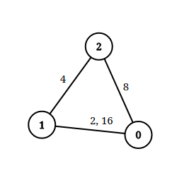
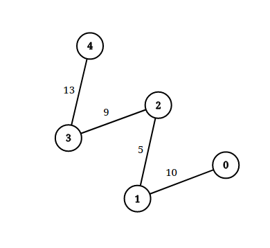

### 1. Description

An undirected graph of `n` nodes is defined by `edgeList`, where $\text{edgeList}[i] = [u_{i}, v_{i}, \text{dis}_{i}]$ denotes an edge between nodes $u_{i}$ and $v_{i}$ with distance $\text{dis}_{i}$. Note that there may be **multiple** edges between two nodes.

Given an array `queries`, where $\text{queries}[j] = [p_{j}, q_{j}, \text{limit}_{j}]$, your task is to determine for each $\text{queries}[j]$ whether there is a path between $p_{j}$ and $q_{j}$_ such that each edge on the path has a distance **strictly less than** $\text{limit}_{j}$ .

Return *a **boolean array** *`answer`*, where *$\text{answer.length} = \text{queries.length}$ *and the *$j^{\text{th}}$ *value of *`answer` *is *`true`* if there is a path for *$\text{queries}[j]$* is *`true`*, and *`false`* otherwise*.

### 2. Function Contract

**Inputs**

- `n`: Input parameter (`int`).
- `edgeList`: Input parameter (`List[List[int]]`).
- `queries`: Input parameter (`List[List[int]]`).

**Return value**

- Returns `List[bool]`.

### 3. Examples

#### Example 1

- **Input:** $n = 3, edgeList = [[0,1,2],[1,2,4],[2,0,8],[1,0,16]], queries = [[0,1,2],[0,2,5]]$
- **Output:** `[false,true]`
- **Explanation:** The above figure shows the given graph. Note that there are two overlapping edges between 0 and 1 with distances 2 and 16.
For the first query, between 0 and 1 there is no path where each distance is less than 2, thus we return false for this query.
For the second query, there is a path (0 -> 1 -> 2) of two edges with distances less than 5, thus we return true for this query.

#### Example 2

- **Input:** $n = 5, edgeList = [[0,1,10],[1,2,5],[2,3,9],[3,4,13]], queries = [[0,4,14],[1,4,13]]$
- **Output:** `[true,false]`
- **Explanation:** The above figure shows the given graph.

### 4. Constraints

- $2 \le n \le 10^{5}$

- $1 \le \text{edgeList.length}, \text{queries.length} \le 10^{5}$

- $\text{edgeList}[i].length = 3$

- $\text{queries}[j].length = 3$

- $0 \le u_{i}, v_{i}, p_{j}, q_{j} \le n - 1$

- $u_{i} \neq v_{i}$

- $p_{j} \neq q_{j}$

- $1 \le \text{dis}_{i}, \text{limit}_{j} \le 10^{9}$

- There may be **multiple** edges between two nodes.
