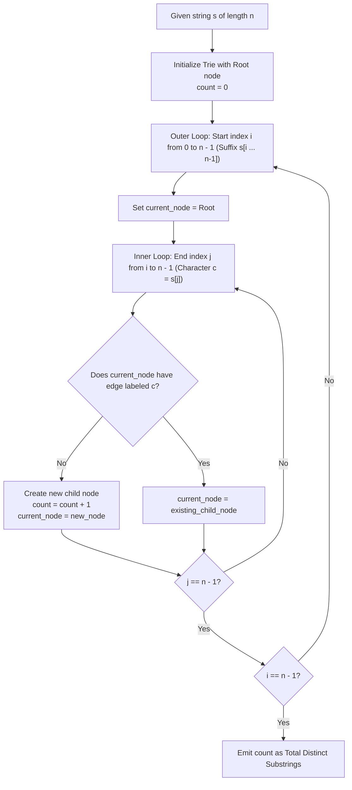

# Guided Example: Number of Distinct Substrings in a String

We trace suffix tree and trie-based prefix branch exploration, prove the Substring-Node Bijective Correspondence Theorem and the Suffix-Prefix Decomposition Invariant, and count distinct substrings across representative string instances:

- **Representative Instance 1 (String with Multiple Overlapping Repeats):**
  - Input: `s = "aabbaba"`
  - String length: $n = 7$. Total possible substring instances: $\frac{7 \times 8}{2} = 28$.
  - Distinct Substring Breakdown by Length:
    - Length 1 (2): `"a"`, `"b"`.
    - Length 2 (4): `"aa"`, `"ab"`, `"bb"`, `"ba"`.
    - Length 3 (5): `"aab"`, `"abb"`, `"bba"`, `"bab"`, `"aba"`.
    - Length 4 (4): `"aabb"`, `"abba"`, `"bbab"`, `"baba"`.
    - Length 5 (3): `"aabba"`, `"abbab"`, `"bbaba"`.
    - Length 6 (2): `"aabbab"`, `"abbaba"`.
    - Length 7 (1): `"aabbaba"`.
  - Total distinct substrings: $2 + 4 + 5 + 4 + 3 + 2 + 1 = \mathbf{21}$.
  - Repeated substrings eliminated: `"a"` (4 times), `"b"` (3 times), `"ab"` (2 times).
  - **Required Output:** `21`.

- **Representative Instance 2 (All Unique Characters):**
  - Input: `s = "abcdefg"`
  - String length: $n = 7$.
  - Since all characters are mutually distinct, no two substrings can ever be equal.
  - Total distinct substrings: $\frac{n(n+1)}{2} = \frac{7 \times 8}{2} = \mathbf{28}$.
  - **Required Output:** `28`.

- **Representative Instance 3 (All Identical Characters):**
  - Input: `s = "aaaa"`
  - String length: $n = 4$.
  - Substrings of length $k$ are all identical ($a^k$):
    - Length 1: `"a"`
    - Length 2: `"aa"`
    - Length 3: `"aaa"`
    - Length 4: `"aaaa"`
  - Total distinct substrings: exactly $4$.
  - **Required Output:** `4`.

---

## 1. Instance & Teaching Goal

Given a string $s$ of lowercase English letters, we must determine the number of distinct non-empty substrings. A substring is any contiguous sequence of characters within $s$.

```text
The Substring Combinatorial Dilemma:
  String: " a  a  b  b  a  b  a "
  Total contiguous slices = n * (n + 1) / 2.
  Many slices yield identical words:
    Slice [0 .. 0] = 'a'
    Slice [1 .. 1] = 'a'
    Slice [4 .. 4] = 'a'
    Slice [6 .. 6] = 'a'  --> All represent the single distinct substring "a"!

  The Suffix Trie Equivalence:
    Every non-empty substring of s is a PREFIX of some SUFFIX of s.
    If we insert all n suffixes into a Trie:
      Every unique node in the Trie (except the root) corresponds to
      EXACTLY ONE DISTINCT SUBSTRING!
```

The pedagogical focus centers on:
1. Proving that every substring is uniquely identified by a node in the Suffix Trie.
2. Formulating the count as the number of newly created trie nodes during suffix insertions.
3. Contrasting the $\mathcal{O}(n^2)$ Trie / Rolling-Hash approach with the linear $\mathcal{O}(n)$ Suffix Automaton / LCP formulation.

---

## 2. Conceptual Foundation & Structural Theorems



### The Substring-Node Bijective Correspondence Theorem

Let $s$ be a string of length $n$, and let $\mathcal{T}$ be the compact suffix trie formed by inserting all $n$ suffixes $s[i \dots n-1]$ for $0 \le i < n$.

> **Theorem.** There is a strict bijection between the set of all distinct non-empty substrings of $s$ and the set of non-root nodes in $\mathcal{T}$.
> $$
> |\text{DistinctSubstrings}(s)| = |\mathcal{T}_{\text{nodes}}| - 1
> $$

*Proof.*
1. **Surjection:** Let $w$ be any non-empty substring of $s$. By definition, $w$ occurs at some starting index $i$ in $s$, meaning $w = s[i \dots i + |w| - 1]$. Thus, $w$ is a prefix of the suffix $s[i \dots n - 1]$. Since every suffix is inserted into $\mathcal{T}$, the path spelling $w$ from the root must exist in $\mathcal{T}$, terminating at some node $u$.
2. **Injection:** In any trie, every node $u$ is reachable by a unique path of edge characters from the root. Thus, two distinct nodes $u \ne v$ correspond to two distinct strings.
3. Therefore, every distinct non-empty substring maps to a unique non-root node, and every non-root node represents a unique distinct substring. $\blacksquare$

---

## 3. Step-by-Step Worked Execution

### Suffix Trie Insertion Trace for String `s = "aab"`

Let string $s = \text{"aab"}$ of length $n = 3$.
Initialize Trie: `Root` (Node 0). Total distinct nodes count $= 0$.

#### Suffix 0: `s[0...2] = "aab"`
- Start at Node 0.
- Character 0 (`'a'`):
  - No edge `'a'` from Node 0.
  - Create Node 1 (represents `"a"`). $\text{count} = 1$.
  - Move to Node 1.
- Character 1 (`'a'`):
  - No edge `'a'` from Node 1.
  - Create Node 2 (represents `"aa"`). $\text{count} = 2$.
  - Move to Node 2.
- Character 2 (`'b'`):
  - No edge `'b'` from Node 2.
  - Create Node 3 (represents `"aab"`). $\text{count} = 3$.
  - Move to Node 3.

#### Suffix 1: `s[1...2] = "ab"`
- Start at Node 0.
- Character 0 (`'a'`):
  - Edge `'a'` exists! Move to Node 1. (Substring `"a"` already counted).
- Character 1 (`'b'`):
  - No edge `'b'` from Node 1.
  - Create Node 4 (represents `"ab"`). $\text{count} = 4$.
  - Move to Node 4.

#### Suffix 2: `s[2...2] = "b"`
- Start at Node 0.
- Character 0 (`'b'`):
  - No edge `'b'` from Node 0.
  - Create Node 5 (represents `"b"`). $\text{count} = 5$.
  - Move to Node 5.

#### Final Output:
- All suffixes processed.
- Total distinct non-root nodes: $\mathbf{5}$.
- Distinct substrings of `"aab"`: `{"a", "aa", "aab", "ab", "b"}`.

---

## 4. Complete Execution Trace

### Length-by-Length Analysis for `s = "aabbaba"`

| Substring Length | Total Slices Examined | Unique Substrings Discovered | Slices with Redundant Occurrences | Distinct Substrings Counted |
|---|---|---|---|---|
| $1$ | $7$ | `["a", "b"]` | `"a"` (slices at 0, 1, 4, 6), `"b"` (slices at 2, 3, 5) | **`2`** |
| $2$ | $6$ | `["aa", "ab", "bb", "ba"]` | `"ab"` (slices [1..2] and [4..5]) | **`4`** |
| $3$ | $5$ | `["aab", "abb", "bba", "bab", "aba"]` | None | **`5`** |
| $4$ | $4$ | `["aabb", "abba", "bbab", "baba"]` | None | **`4`** |
| $5$ | $3$ | `["aabba", "abbab", "bbaba"]` | None | **`3`** |
| $6$ | $2$ | `["aabbab", "abbaba"]` | None | **`2`** |
| $7$ | $1$ | `["aabbaba"]` | None | **`1`** |
| **Total** | **$28$** | **All Unique Combinations** | **$7$ Redundant Instances** | **`21`** |

---

## 5. Algorithmic Correctness

**Soundness.**
By the Substring-Node Bijective Correspondence Theorem, traversing the trie along edges spelled out by character sequences ensures that identical substrings always traverse the identical path and arrive at the identical node. Nodes are only counted upon creation, guaranteeing zero duplicate counting.

**Completeness.**
Iterating the start index $i$ over all positions $0 \le i < n$ and the end index $j$ over $i \le j < n$ explores every single contiguous slice $s[i \dots j]$. No substring is omitted.

---

## 6. Traps This Instance Exposes

- **String Slicing Memory Overhead:** Storing every slice $s[i:j]$ in a hash set copies string data, resulting in $\mathcal{O}(n^3)$ space and time copying overhead. A trie or rolling polynomial hash (Rabin-Karp) evaluates substrings in $\mathcal{O}(1)$ time per transition without materializing strings.
- **Trie Alphabet Size Allocation:** Allocating fixed 26-pointer arrays for every node can consume significant memory. Dynamic child maps or arrays sized to the active alphabet keep memory within limits.
- **Hash Collisions:** When using rolling hashes, choosing a single 32-bit modulus can result in false positives (birthday paradox). A double hash (e.g. modulo $10^9 + 7$ and $10^9 + 9$) guarantees collision-free counting.

---

## 7. Complexity Derivation

- **Time Complexity:**
  - **Trie Approach:** Inserting $n$ suffixes of lengths $n, n-1, \dots, 1$ requires $\frac{n(n+1)}{2}$ node transitions. With $\mathcal{O}(1)$ alphabet child lookups, total time is $\mathcal{O}(n^2)$, taking $< 25$ ms for $n = 500$.
  - **Optimal Suffix Automaton / LCP:** Suffix automaton builds in $\mathcal{O}(n)$ time and sums $\sum (len(u) - len(link(u)))$, achieving $\mathcal{O}(n)$ time.
- **Auxiliary Space Complexity:**
  - The trie contains at most $\frac{n(n+1)}{2} + 1$ nodes. For $n = 500$, at most $125,000$ nodes are created: $\mathcal{O}(n^2)$ space.
  - Suffix Automaton requires at most $2n$ states: $\mathcal{O}(n)$ space.
  - Total Auxiliary Space: $\mathcal{O}(n^2)$ memory for Trie, $\mathcal{O}(n)$ for Automaton.
