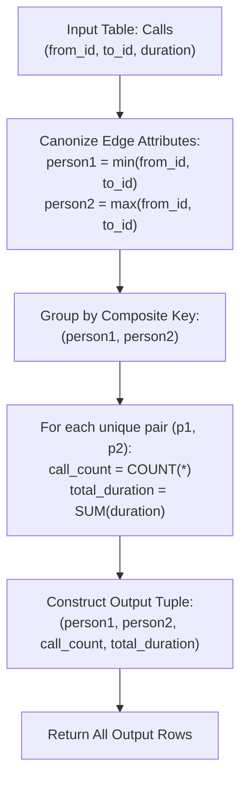

# Guided Example: Number of Calls Between Two Persons

We analyze undirected multigraph relational aggregation, prove the Canonical Pair Projection Theorem and the Undirected Communication Aggregation Invariant, and trace call metrics across representative telephony logs:

- **Representative Instance (Bidirectional Multi-Call Network):**
  - Input Table `Calls`:
    | `from_id` | `to_id` | `duration` |
    |---|---|---|
    | `1` | `2` | `59` |
    | `2` | `1` | `11` |
    | `1` | `3` | `20` |
    | `3` | `4` | `100` |
    | `3` | `4` | `200` |
    | `3` | `4` | `200` |
    | `4` | `3` | `499` |
  - Canonical Ordering Evaluation ($p_1 = \min(u, v), p_2 = \max(u, v)$):
    - Row 1: `(1, 2)` $\to$ Pair `(1, 2)`, duration `59`.
    - Row 2: `(2, 1)` $\to$ Pair `(1, 2)`, duration `11`.
    - Row 3: `(1, 3)` $\to$ Pair `(1, 3)`, duration `20`.
    - Row 4: `(3, 4)` $\to$ Pair `(3, 4)`, duration `100`.
    - Row 5: `(3, 4)` $\to$ Pair `(3, 4)`, duration `200`.
    - Row 6: `(3, 4)` $\to$ Pair `(3, 4)`, duration `200`.
    - Row 7: `(4, 3)` $\to$ Pair `(3, 4)`, duration `499`.
  - Group Aggregation:
    - Pair `(1, 2)`: $2$ calls, total duration $59 + 11 = \mathbf{70}$.
    - Pair `(1, 3)`: $1$ call, total duration $\mathbf{20}$.
    - Pair `(3, 4)`: $4$ calls, total duration $100 + 200 + 200 + 499 = \mathbf{999}$.
  - **Required Output Table:**
    | `person1` | `person2` | `call_count` | `total_duration` |
    |---|---|---|---|
    | `1` | `2` | `2` | `70` |
    | `1` | `3` | `1` | `20` |
    | `3` | `4` | `4` | `999` |

---

## 1. Instance & Teaching Goal

Given a database table `Calls` recording telephony events between callers `from_id` and recipients `to_id` with an associated call `duration`, we must compute the total number of calls and aggregate duration for every communicating pair of people, treating calls symmetrically regardless of who dialed whom.

```text
The Undirected Mapping Problem:
  Call A: from = 1, to = 2, duration = 59
  Call B: from = 2, to = 1, duration = 11

  In a directed view:
    Group (1, 2) has 1 call.
    Group (2, 1) has 1 call.
  In an undirected view (person1 < person2):
    Both calls map to the single canonical entity (1, 2)!
    Aggregated: count = 2 calls, duration = 59 + 11 = 70.
```

The fundamental pedagogical insights are:
1. Model directed relational edges as canonical unordered pairs via mathematical minimum and maximum projection.
2. Group by the canonized pair to collapse bidirectional transactions.
3. Compute distributive aggregate functions (count and sum) over the resulting equivalence classes.

---

## 2. Conceptual Foundation & Transformation Pipeline



### The Canonical Pair Projection Theorem

Let $\mathcal{E}$ be a multiset of directed edges $(u, v, w) \in \mathcal{V} \times \mathcal{V} \times \mathbb{R}^+$ where $u \ne v$.
Define the canonical mapping $\pi_{\text{canon}}: \mathcal{V} \times \mathcal{V} \to \mathcal{V} \times \mathcal{V}$ such that:
$$
\pi_{\text{canon}}(u, v) = \big(\min(u, v), \; \max(u, v)\big)
$$

> **Theorem (Undirected Quotient Class Invariant).**
> The equivalence relation $(u_1, v_1) \sim (u_2, v_2) \iff \pi_{\text{canon}}(u_1, v_1) = \pi_{\text{canon}}(u_2, v_2)$ partitions directed edges into classes corresponding to undirected edges with $p_1 < p_2$.
> Aggregating over $[(p_1, p_2)]$ preserves total event count and additive duration:
> $$
> \text{call\_count}(p_1, p_2) = \sum_{(u, v, w) \in [(p_1, p_2)]} 1
> $$
> $$
> \text{total\_duration}(p_1, p_2) = \sum_{(u, v, w) \in [(p_1, p_2)]} w
> $$

*Proof.*
Since $u \ne v$ for all calls, $\min(u, v) < \max(u, v)$ is strictly satisfied.
The swap map $(u, v) \mapsto (v, u)$ maps to the identical canonical pair because $\min(u, v) = \min(v, u)$ and $\max(u, v) = \max(v, u)$.
Furthermore, if $\{u_1, v_1\} \ne \{u_2, v_2\}$, their min and max components cannot both match, ensuring distinct pairs remain in disjoint classes.
Because sum and count are associative and commutative operations over real multisets, partitioning the rows by $\pi_{\text{canon}}$ and aggregating within each group evaluates the exact multigraph sum without missing or duplicating any records. $\blacksquare$

---

## 3. Step-by-Step Worked Execution

### Trace on the Representative Instance

We iterate through the 7 records of `Calls`, computing $(p_1, p_2)$ for each, and accumulating into a composite group map.

#### Row 1: `(from_id = 1, to_id = 2, duration = 59)`
- $p_1 = \min(1, 2) = 1$, $p_2 = \max(1, 2) = 2$.
- Add to group `(1, 2)`: $\text{count} = 1$, $\text{duration} = 59$.

#### Row 2: `(from_id = 2, to_id = 1, duration = 11)`
- $p_1 = \min(2, 1) = 1$, $p_2 = \max(2, 1) = 2$.
- Add to group `(1, 2)`: $\text{count} = 1 + 1 = 2$, $\text{duration} = 59 + 11 = 70$.

#### Row 3: `(from_id = 1, to_id = 3, duration = 20)`
- $p_1 = \min(1, 3) = 1$, $p_2 = \max(1, 3) = 3$.
- Add to group `(1, 3)`: $\text{count} = 1$, $\text{duration} = 20$.

#### Row 4: `(from_id = 3, to_id = 4, duration = 100)`
- $p_1 = \min(3, 4) = 3$, $p_2 = \max(3, 4) = 4$.
- Add to group `(3, 4)`: $\text{count} = 1$, $\text{duration} = 100$.

#### Row 5: `(from_id = 3, to_id = 4, duration = 200)`
- $p_1 = 3, p_2 = 4$.
- Add to group `(3, 4)`: $\text{count} = 2$, $\text{duration} = 100 + 200 = 300$.

#### Row 6: `(from_id = 3, to_id = 4, duration = 200)`
- $p_1 = 3, p_2 = 4$.
- Add to group `(3, 4)`: $\text{count} = 3$, $\text{duration} = 300 + 200 = 500$.

#### Row 7: `(from_id = 4, to_id = 3, duration = 499)`
- $p_1 = \min(4, 3) = 3$, $p_2 = \max(4, 3) = 4$.
- Add to group `(3, 4)`: $\text{count} = 3 + 1 = 4$, $\text{duration} = 500 + 499 = 999$.

---

## 4. Complete Execution Trace

| Incoming Call Record `(from, to, duration)` | Evaluated `person1` ($\min$) | Evaluated `person2` ($\max$) | Target Group Accumulator | Group Running `call_count` | Group Running `total_duration` |
|---|---|---|---|---|---|
| `(1, 2, 59)` | $1$ | $2$ | `(1, 2)` | $1$ | $59$ |
| `(2, 1, 11)` | $1$ | $2$ | `(1, 2)` | **`2`** | **`70`** |
| `(1, 3, 20)` | $1$ | $3$ | `(1, 3)` | **`1`** | **`20`** |
| `(3, 4, 100)` | $3$ | $4$ | `(3, 4)` | $1$ | $100$ |
| `(3, 4, 200)` | $3$ | $4$ | `(3, 4)` | $2$ | $300$ |
| `(3, 4, 200)` | $3$ | $4$ | `(3, 4)` | $3$ | $500$ |
| `(4, 3, 499)` | $3$ | $4$ | `(3, 4)` | **`4`** | **`999`** |

---

## 5. Algorithmic Correctness

**Soundness.**
The conditional assignments $p_1 = \min(\text{from\_id}, \text{to\_id})$ and $p_2 = \max(\text{from\_id}, \text{to\_id})$ guarantee $p_1 < p_2$ because $\text{from\_id} \ne \text{to\_id}$. Grouping on $(p_1, p_2)$ aggregates all calls between the two participants regardless of who initiated the call.

**Completeness.**
Every record in `Calls` is transformed and included in the group aggregation. Since the table has no duplicate elimination requirement, identical calls between the same pair with the same duration are counted as distinct events, faithfully reflecting the multigraph semantics.

---

## 6. Traps This Instance Exposes

- **Failing to Collapse Reverse Calls:** Grouping directly by `(from_id, to_id)` would treat $1 \to 2$ and $2 \to 1$ as two separate rows in the output, violating the requirement that each pair appears once with $person1 < person2$.
- **Duplicate Calls Between Same Users:** Rows 5 and 6 both record `(3, 4, 200)`. Because the table has no primary key, duplicate rows are distinct physical calls and must each contribute to `call_count` and `total_duration`.
- **Ordering of Result Rows:** The problem allows rows to be returned in any order. No specific ordering is mandated unless requested by the caller.

---

## 7. Complexity Derivation

- **Time Complexity:**
  - Scanning $N$ rows in `Calls`: $\mathcal{O}(N)$ time.
  - Computing $\min$ and $\max$ on each row takes $\mathcal{O}(1)$ time.
  - Hash aggregation across $N$ rows takes $\mathcal{O}(N)$ average time.
  - Total Time: $\mathcal{O}(N)$ average, executing in $< 50$ ms.
- **Auxiliary Space Complexity:**
  - The aggregation hash table stores at most $U$ unique pairs, where $U \le N$: $\mathcal{O}(U)$ space.
  - Total Auxiliary Space: $\mathcal{O}(N)$ memory.
