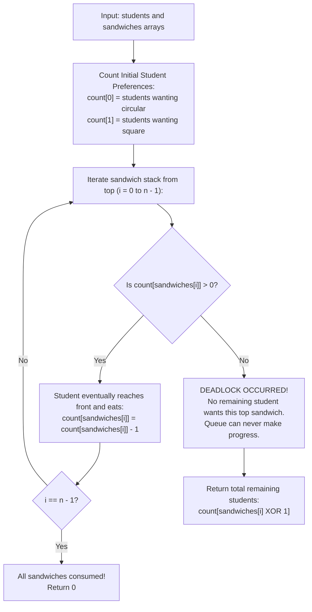

# Guided Example: Number of Students Unable to Eat Lunch

We analyze circular queue rotation, prove the Queue Order-Invariance Demotion Theorem and Deadlock Halting Condition Invariant, and trace cafeteria distribution across representative student instances:

- **Representative Instance 1 (Full Clearance via Interleaved Consumption):**
  - Input: `students = [1, 1, 0, 0]`, `sandwiches = [0, 1, 0, 1]`
  - Preference Counts: `type 0` $= 2$, `type 1` $= 2$.
  - Stack Traversal (top to bottom):
    - Sandwich 0 (`type 0`): `count[0] = 2 > 0` $\implies$ consumed. `count[0]` becomes $1$.
    - Sandwich 1 (`type 1`): `count[1] = 2 > 0` $\implies$ consumed. `count[1]` becomes $1$.
    - Sandwich 2 (`type 0`): `count[0] = 1 > 0` $\implies$ consumed. `count[0]` becomes $0$.
    - Sandwich 3 (`type 1`): `count[1] = 1 > 0` $\implies$ consumed. `count[1]` becomes $0$.
  - All sandwiches consumed; $0$ students remain.
  - **Required Output:** `0`.

- **Representative Instance 2 (Early Deadlock on Exhausted Preference):**
  - Input: `students = [1, 1, 1, 0, 0, 1]`, `sandwiches = [1, 0, 0, 0, 1, 1]`
  - Initial Counts: `type 0` $= 2$, `type 1` $= 4$. Total $= 6$.
  - Stack Traversal:
    - Sandwich 0 (`type 1`): `count[1] = 4 > 0` $\implies$ consumed. Remaining: `count[0] = 2`, `count[1] = 3`.
    - Sandwich 1 (`type 0`): `count[0] = 2 > 0` $\implies$ consumed. Remaining: `count[0] = 1`, `count[1] = 3`.
    - Sandwich 2 (`type 0`): `count[0] = 1 > 0` $\implies$ consumed. Remaining: `count[0] = 0`, `count[1] = 3`.
    - Sandwich 3 (`type 0`): `count[0] == 0`! No remaining student wants `type 0`.
  - Halting condition reached: all remaining $3$ students want `type 1`, but the top sandwich is `type 0`.
  - Unable to eat: $\mathbf{3}$.
  - **Required Output:** `3`.

---

## 1. Instance & Teaching Goal

In a cafeteria, $n$ students wait in a first-in first-out queue with binary preferences ($0$ for circular, $1$ for square). Sandwiches sit in a rigid stack, accessible only from the top. At each step:
1. If the front student wants the top sandwich, they take it and exit.
2. If they do not, they rotate to the back of the line.
3. The process terminates when no student remaining in the queue will take the top sandwich.

```text
The Sandwich Stack Bottleneck:
  Stack of Sandwiches:    [ Top: Type 0,  Type 0,  Type 1 ]
  Queue of Students:      ( Front: 1, 1, 1 : Back )

  Student at front wants Type 1, but top sandwich is Type 0.
  Student rotates to back: ( 1, 1, 1 ) -> ( 1, 1, 1 ) -> ( 1, 1, 1 ) ...
  Every student rejects the top sandwich!
  Deadlock occurs: the sandwich cannot be removed, and no other sandwich is accessible.
```

The fundamental pedagogical insights are:
1. **Queue Order Irrelevance:** Because students cycle to the back of the queue indefinitely without penalty, queue order does not prevent any interested student from reaching the front.
2. **Rigid Stack Order:** Unlike students, sandwiches cannot rotate. Sandwich $i$ must be consumed before sandwich $i + 1$ can ever be accessed.
3. **Deadlock Invariant:** The simulation halts if and only if the count of students desiring the current top sandwich type drops to zero.

---

## 2. Conceptual Foundation & Mathematical Theorems



### The Queue Order-Invariance Demotion Theorem

Let $S$ be the multiset of remaining student preferences, and let $T = sandwiches[i]$ be the current top sandwich.

> **Theorem (Deadlock Equivalence Invariant).**
> Progress can occur at sandwich $i$ if and only if $T \in S$ (that is, $\text{count}[T] > 0$).
> When $\text{count}[T] = 0$, a deadlock occurs, and no further sandwiches can ever be consumed.

*Proof.*
1. **Sufficiency ($\text{count}[T] > 0 \implies$ Progress):**
   Suppose at least one student in the queue has preference $T$. If this student is currently at position $k$ in the queue, then at most $k$ rotations will bring this student to the front. Upon reaching the front, the student matches the top sandwich $T$, takes it, and exits. The stack advances to $i + 1$.
2. **Necessity ($\text{count}[T] = 0 \implies$ Deadlock):**
   Suppose $\text{count}[T] = 0$. Every student currently in the queue has preference $1 - T \ne T$. Every student who reaches the front will reject $T$ and rotate to the back. After a full cycle of $|S|$ rejections, the queue returns to its exact previous state with $T$ still on top. By induction, the configuration is invariant under further steps, and the simulation halts.
3. **Terminal Count:**
   When deadlock occurs, none of the remaining $|S|$ students can eat. Since all remaining students have preference $1 - T$, the number of unable students is simply $\text{count}[1 - T]$. $\blacksquare$

---

## 3. Step-by-Step Worked Execution

### Trace on Representative Instance 2 (`students = [1, 1, 1, 0, 0, 1]`, `sandwiches = [1, 0, 0, 0, 1, 1]`)

- **Initial Frequency Map:**
  - `count[0] = 2` (students wanting circular sandwich)
  - `count[1] = 4` (students wanting square sandwich)
  - Total students $= 6$.

#### Sandwich $i = 0$ (`type 1`)
- Is `count[1] > 0`? Yes ($4 > 0$).
- A student wanting `type 1` takes it and leaves.
- `count[1]` updates: $4 - 1 = 3$.
- Remaining: `count[0] = 2`, `count[1] = 3`.

#### Sandwich $i = 1$ (`type 0`)
- Is `count[0] > 0`? Yes ($2 > 0$).
- A student wanting `type 0` takes it and leaves.
- `count[0]` updates: $2 - 1 = 1$.
- Remaining: `count[0] = 1`, `count[1] = 3`.

#### Sandwich $i = 2$ (`type 0`)
- Is `count[0] > 0`? Yes ($1 > 0$).
- A student wanting `type 0` takes it and leaves.
- `count[0]` updates: $1 - 1 = 0$.
- Remaining: `count[0] = 0`, `count[1] = 3`.

#### Sandwich $i = 3$ (`type 0`)
- Top of stack requires `type 0`.
- Check available students: `count[0] = 0`!
- Deadlock triggered! No student in the queue will ever accept `type 0`.
- Stack cannot advance, and all remaining students are locked out.
- Remaining students count $= count[1] = \mathbf{3}$.

#### Final Answer:
- Number of students unable to eat: $\mathbf{3}$.

---

## 4. Complete Execution Trace

| Stack Step $i$ | Sandwich Type Examined | Available Students `count[0]` | Available Students `count[1]` | Can Current Sandwich Be Consumed? | State Update / Event |
|---|---|---|---|---|---|
| Initial | — | $2$ | $4$ | — | Preference histogram constructed |
| $0$ | `1` | $2$ | $4$ | Yes (`count[1] > 0`) | `count[1]` decremented to $3$ |
| $1$ | `0` | $2$ | $3$ | Yes (`count[0] > 0`) | `count[0]` decremented to $1$ |
| $2$ | `0` | $1$ | $3$ | Yes (`count[0] > 0`) | `count[0]` decremented to $0$ |
| $3$ | `0` | $0$ | $3$ | **No (`count[0] == 0`)** | **Deadlock Triggered! Terminate.** |

---

## 5. Algorithmic Correctness

**Soundness.**
The reduction relies on the fact that student queue rotation is non-destructive: rotation only permutes the queue order without changing student preferences or sandwich order. Because the sandwich stack is strictly LIFO and immovable, the first unsatisfied sandwich halts all further progress.

**Completeness.**
The algorithm inspects sandwiches from top to bottom. If all sandwiches are consumed without triggering deadlock, the final count of unable students is $0$. If deadlock triggers at sandwich $i$, exactly the remaining students in the preference counter are returned.

---

## 6. Traps This Instance Exposes

- **Simulating Full Queue Rotations:** Simulating every single rotation using a concrete queue data structure takes $\mathcal{O}(n^2)$ time in the worst case (e.g. rotating $n$ times between each consumption). Counting frequencies reduces time to strictly $\mathcal{O}(n)$.
- **Sandwich Rotations vs. Student Rotations:** Students can rotate to the back, but sandwiches cannot. Sandwiches must be consumed in their exact original stack order.
- **Deadlock Termination Condition:** Deadlock occurs when `count[sandwiches[i]] == 0`, NOT when the queue has rotated a specific number of times. Checking the zero-frequency condition halts immediately.

---

## 7. Complexity Derivation

- **Time Complexity:**
  - Counting student preferences: $\mathcal{O}(n)$ time over $n$ students.
  - Iterating through sandwiches: at most $n$ comparisons, each requiring $\mathcal{O}(1)$ operations.
  - Total Time: strictly $\mathcal{O}(n)$ operations, executing in $< 1$ ms for $n \le 100$.
- **Auxiliary Space Complexity:**
  - Frequency storage for binary preferences ($0$ and $1$) takes $\mathcal{O}(1)$ space.
  - Total Auxiliary Space: $\mathcal{O}(1)$ memory.
