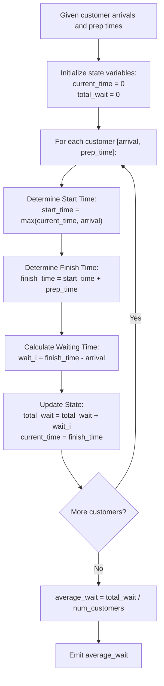

# Guided Example: Average Waiting Time

We analyze single-server first-in-first-out (FIFO) queue service processing, prove the Cumulative Waiting Time Recurrence Theorem and Server Idle-Jump Invariant, and trace service scheduling across representative customer arrival streams:

- **Representative Instance 1 (Continuous Backlog Queue):**
  - Input: `customers = [[1, 2], [2, 5], [4, 3]]`
  - Customer 1: arrives at $t = 1$, takes $2$ units.
    - Chef starts at $\max(0, 1) = 1$, finishes at $1 + 2 = 3$.
    - Wait time: $3 - 1 = \mathbf{2}$.
  - Customer 2: arrives at $t = 2$, takes $5$ units.
    - Chef was busy until $t = 3$. Starts at $\max(3, 2) = 3$, finishes at $3 + 5 = 8$.
    - Wait time: $8 - 2 = \mathbf{6}$.
  - Customer 3: arrives at $t = 4$, takes $3$ units.
    - Chef was busy until $t = 8$. Starts at $\max(8, 4) = 8$, finishes at $8 + 3 = 11$.
    - Wait time: $11 - 4 = \mathbf{7}$.
  - Total wait time: $2 + 6 + 7 = 15$.
  - Customer count: $3$. Average: $15 / 3 = \mathbf{5.0}$.
  - **Required Output:** `5.00000`.

- **Representative Instance 2 (Queue with Server Idle Gaps):**
  - Input: `customers = [[5, 2], [5, 4], [10, 3], [20, 1]]`
  - Customer 1 ($[5, 2]$): finishes at $5 + 2 = 7$, wait $= 7 - 5 = 2$.
  - Customer 2 ($[5, 4]$): finishes at $7 + 4 = 11$, wait $= 11 - 5 = 6$.
  - Customer 3 ($[10, 3]$): chef is busy until $11$. Starts at $11$, finishes at $14$, wait $= 14 - 10 = 4$.
  - Customer 4 ($[20, 1]$): chef finished at $14$ and became idle. Customer arrives at $20$. Chef jumps to $20$, finishes at $21$, wait $= 21 - 20 = 1$.
  - Total wait time: $2 + 6 + 4 + 1 = 13$. Average: $13 / 4 = \mathbf{3.25}$.
  - **Required Output:** `3.25000`.

---

## 1. Instance & Teaching Goal

A restaurant operates with a single chef preparing orders strictly in the sequence received. Customer $i$ arrives at time $\text{arrival}_i$ and requests preparation time $\text{time}_i$. If the chef is idle upon arrival, preparation begins immediately; otherwise, the customer waits in line until all preceding orders are completed. A customer's waiting time is the total duration from arrival until their food is delivered. We must calculate the average waiting time across all customers.

```text
The Single-Server Timeline:
  Customer 1: arrives at 1, prep 2 --> [1 ------- 3] (Wait: 3 - 1 = 2)
  Customer 2: arrives at 2, prep 5 ------> [3 ----------------- 8] (Wait: 8 - 2 = 6)
  Customer 3: arrives at 4, prep 3 --------------> [8 --------- 11] (Wait: 11 - 4 = 7)

  Chef Timeline:
  0    1    2    3    4    5    6    7    8    9    10   11
  |idle|---Cust 1---|-------Cust 2--------|---Cust 3---|
```

The pedagogical objectives are:
1. Model the server's availability timeline using the boundary condition $T_{\text{start}} = \max(T_{\text{idle}}, \text{arrival}_i)$.
2. Prove that cumulative waiting time can be tracked in an online linear scan without storing historical intervals.
3. Formulate the arithmetic invariance of floating-point division at the terminal step.

---

## 2. Conceptual Foundation & Mathematical Recurrence



### The Cumulative Waiting Time Recurrence Theorem

Let $C_1, C_2, \dots, C_n$ be an ordered sequence of customers with non-decreasing arrival times $a_1 \le a_2 \le \dots \le a_n$ and service times $t_i > 0$.
Let $F_i$ denote the completion time of customer $i$, with $F_0 = 0$.

> **Theorem (Server State Transition Invariant).**
> The completion time $F_i$ follows the recurrence:
> $$
> F_i = \max(F_{i-1}, \; a_i) + t_i
> $$
> The waiting time $W_i$ experienced by customer $i$ is:
> $$
> W_i = F_i - a_i = \max(F_{i-1} - a_i, \; 0) + t_i
> $$
> The total waiting time $\sum_{i=1}^n W_i$ is uniquely determined and invariant under any representation of idle periods.

*Proof.*
- The chef cannot begin order $i$ before finishing order $i - 1$, so the chef is available no earlier than $F_{i-1}$.
- The chef cannot begin order $i$ before customer $i$ arrives, so service cannot start before $a_i$.
- Because the chef begins immediately once both conditions are met, service starts precisely at $S_i = \max(F_{i-1}, a_i)$.
- Order $i$ requires $t_i$ units of continuous preparation, terminating at $F_i = S_i + t_i = \max(F_{i-1}, a_i) + t_i$.
- The customer waits from arrival $a_i$ until completion $F_i$, so $W_i = F_i - a_i$. Expanding $F_i$:
  $$
  W_i = \max(F_{i-1}, a_i) + t_i - a_i = \max(F_{i-1} - a_i, 0) + t_i
  $$
  This directly decomposes into the queuing delay $\max(F_{i-1} - a_i, 0)$ plus the service duration $t_i$. $\blacksquare$

---

## 3. Step-by-Step Worked Execution

### Trace on Representative Instance 2 (`customers = [[5, 2], [5, 4], [10, 3], [20, 1]]`)

- Initialize $\text{current\_time} = 0$, $\text{total\_wait} = 0$.

#### Customer 1: Arrival $a_1 = 5$, Service $t_1 = 2$
- Server idle check: $\max(0, 5) = 5$.
- Finish time: $F_1 = 5 + 2 = 7$.
- Wait time: $W_1 = 7 - 5 = 2$.
- Accumulator updates:
  - $\text{current\_time} = 7$
  - $\text{total\_wait} = 0 + 2 = 2$.

#### Customer 2: Arrival $a_2 = 5$, Service $t_2 = 4$
- Server idle check: $\max(7, 5) = 7$ (Customer arrived while chef was busy with Customer 1).
- Finish time: $F_2 = 7 + 4 = 11$.
- Wait time: $W_2 = 11 - 5 = 6$.
- Accumulator updates:
  - $\text{current\_time} = 11$
  - $\text{total\_wait} = 2 + 6 = 8$.

#### Customer 3: Arrival $a_3 = 10$, Service $t_3 = 3$
- Server idle check: $\max(11, 10) = 11$ (Customer arrived at $10$, waited $1$ minute).
- Finish time: $F_3 = 11 + 3 = 14$.
- Wait time: $W_3 = 14 - 10 = 4$.
- Accumulator updates:
  - $\text{current\_time} = 14$
  - $\text{total\_wait} = 8 + 4 = 12$.

#### Customer 4: Arrival $a_4 = 20$, Service $t_4 = 1$
- Server idle check: $\max(14, 20) = 20$ (Chef finished at $14$ and was idle for $6$ minutes until Customer 4 arrived at $20$).
- Finish time: $F_4 = 20 + 1 = 21$.
- Wait time: $W_4 = 21 - 20 = 1$.
- Accumulator updates:
  - $\text{current\_time} = 21$
  - $\text{total\_wait} = 12 + 1 = 13$.

#### Final Computation:
- $\text{average\_wait} = \frac{\text{total\_wait}}{n} = \frac{13}{4} = \mathbf{3.25}$.

---

## 4. Complete Execution Trace

| Customer Index $i$ | Arrival $a_i$ | Prep Time $t_i$ | Service Start $S_i = \max(F_{i-1}, a_i)$ | Order Completion $F_i$ | Individual Wait $W_i = F_i - a_i$ | Running Total Wait $\sum W$ |
|---|---|---|---|---|---|---|
| $1$ | $5$ | $2$ | $\max(0, 5) = 5$ | $7$ | $7 - 5 = \mathbf{2}$ | $2$ |
| $2$ | $5$ | $4$ | $\max(7, 5) = 7$ | $11$ | $11 - 5 = \mathbf{6}$ | $8$ |
| $3$ | $10$ | $3$ | $\max(11, 10) = 11$ | $14$ | $14 - 10 = \mathbf{4}$ | $12$ |
| $4$ | $20$ | $1$ | $\max(14, 20) = 20$ | $21$ | $21 - 20 = \mathbf{1}$ | **`13`** |

---

## 5. Algorithmic Correctness

**Soundness.**
Because the chef processes orders strictly in input order without preemption or parallelization, the completion time of any order depends solely on the arrival time and the completion time of the previous order. Calculating $F_i = \max(F_{i-1}, a_i) + t_i$ accurately tracks the exact physical timeline of the single chef.

**Completeness.**
Each customer in the list is processed in sequence. Waiting times are non-negative ($F_i \ge a_i + t_i \implies W_i \ge t_i > 0$). The total sum divided by $n$ produces the exact mathematical expectation of waiting time.

---

## 6. Traps This Instance Exposes

- **Overlooking Idle Gaps:** Assuming the chef works back-to-back without checking $a_i$ (i.e. $F_i = F_{i-1} + t_i$) treats the chef as starting orders before customers even arrive. The term $\max(F_{i-1}, a_i)$ correctly handles idle intervals.
- **Integer Overflow in Summation:** With $n = 10^5$ and $a_i, t_i \le 10^4$, completion times reach $10^9$ and total wait can exceed $2^{31} - 1$. Using 64-bit integer accumulators prevents numerical overflow.
- **Wait Time vs. Queuing Delay:** Wait time is the total duration until the meal is ready ($F_i - a_i$), which includes the preparation duration $t_i$. It is not merely the delay spent sitting idle before preparation starts ($S_i - a_i$).

---

## 7. Complexity Derivation

- **Time Complexity:**
  - A single linear loop iterates over $n$ customers.
  - Inside the loop, $\max$, addition, and subtraction run in $\mathcal{O}(1)$ time.
  - Total Time: strictly $\mathcal{O}(n)$, executing in $< 15$ ms for $n = 10^5$.
- **Auxiliary Space Complexity:**
  - Only two scalar registers (`current_time` and `total_wait`) are maintained.
  - Total Auxiliary Space: $\mathcal{O}(1)$ constant memory.
