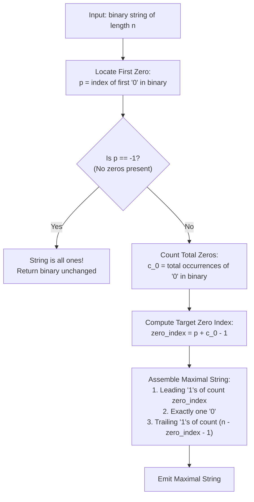

# Guided Example: Maximum Binary String After Change

We analyze rewrite system invariants, prove the Canonical Single-Zero Maximization Theorem and the Zero-Compaction Shift Invariant, and trace optimal binary string transformations across representative bit sequences:

- **Representative Instance 1 (Dispersed Zeros with Interleaving Ones):**
  - Input: `binary = "000110"`
  - Total length: $n = 6$.
  - First zero position: $p = 0$.
  - Total zero count: $c_0 = 4$ (at indices $0, 1, 2, 5$).
  - Transformation Walkthrough:
    - Step 1: Shift rightmost zero leftward past the ones via `"10" \to "01"`:
      `"000110"` $\to$ `"000101"` $\to$ `"000011"`.
    - Step 2: Now four zeros are contiguous at the front: `"000011"`.
    - Step 3: Convert pairs via `"00" \to "10"`:
      - `"000011"` $\to$ `"100011"`
      - `"100011"` $\to$ `"110011"`
      - `"110011"` $\to$ `"111011"`
  - The remaining string contains a single zero at index $0 + 4 - 1 = 3$.
  - Output: `"111011"`.
  - **Required Output:** `"111011"`.

- **Representative Instance 2 (Irreducible Minimal Base String):**
  - Input: `binary = "01"`
  - First zero at $p = 0$. Total zeros: $c_0 = 1$.
  - No `"00"` substring exists, and `"01"` cannot be converted into `"10"`.
  - String is already maximal.
  - **Required Output:** `"01"`.

- **Representative Instance 3 (Leading Ones Preservation):**
  - Input: `binary = "11010"`
  - Leading ones before first zero: length $p = 2$ (indices $0, 1$).
  - Total zeros: $c_0 = 2$ (at indices $2, 4$).
  - Consolidated zero location: $p + c_0 - 1 = 2 + 2 - 1 = 3$.
  - Output string: `"11101"`.
  - **Required Output:** `"11101"`.

---

## 1. Instance & Teaching Goal

We are given a binary string and two allowable substring rewrite operations:
- **Operation 1:** Replace `"00"` with `"10"`.
- **Operation 2:** Replace `"10"` with `"01"`.

The goal is to maximize the decimal value represented by the binary string. Since binary values are ordered lexicographically from left to right, maximizing the value requires pushing `'1'`s as far to the left as possible and minimizing the total count of `'0'`s.

```text
The Rewriting Mechanics:
  Operation 1:  0 0  --->  1 0   (Consumes one '0', gains a '1' on the left!)
  Operation 2:  1 0  --->  0 1   (Shifts a '0' rightward, or bubbles '0' leftward)

  Key Observation:
    Any zero after a '1' can be moved adjacent to preceding zeros using Operation 2:
      ... 0 [1 0] ...  --->  ... 0 [0 1] ...  (Now we have "00"!)
    Once two zeros are adjacent, Operation 1 turns the first into '1':
      ... [0 0] 1 ...  --->  ... [1 0] 1 ...
```

The core pedagogical objectives are:
1. Formulate string rewrite system invariants (conservation and reduction of zeros).
2. Prove why any string with $c_0 \ge 1$ zeros can be reduced to having **at most one** `'0'`.
3. Construct the globally maximal string in closed-form $\mathcal{O}(n)$ time without performing iterative simulation.

---

## 2. Conceptual Foundation & Structural Theorems



### The Canonical Single-Zero Maximization Theorem

Let $S$ be a binary string of length $n$ containing $c_0$ zeros, with the first zero occurring at 0-indexed position $p$.

> **Theorem (Single-Zero Conservation and Location Invariant).**
> 1. No sequence of operations can eliminate the last remaining `'0'`. Hence, if $c_0 \ge 1$, the final string must contain at least one `'0'`.
> 2. If $c_0 \ge 1$, all zeros can be consolidated and reduced via Operation 1 and Operation 2 to yield a string with **exactly one** `'0'`.
> 3. The unique lexicographically maximal string with exactly one `'0'` places that zero at index:
>    $$
>    k = p + c_0 - 1
>    $$
>    with all other $n - 1$ characters equal to `'1'`.

*Proof.*
- **Lower Bound on Zeros:**
  - Operation 1 replaces `"00"` (two zeros) with `"10"` (one zero), reducing the total zero count by $1$.
  - Operation 2 replaces `"10"` (one zero) with `"01"` (one zero), preserving the total zero count.
  - Neither operation can transform a string with one zero into a string with zero zeros. Thus, at least one `'0'` must persist.
- **Reachability of Single Zero:**
  - Leading ones at indices $0 \dots p - 1$ are unaffected because operations cannot introduce zeros to the left of the first zero.
  - For every zero at index $j > p$, we can repeatedly apply Operation 2 (`"10" \to "01"`) to commute that zero leftward past all intervening `'1'`s until it joins the prefix zeros.
  - Gathering all $c_0$ zeros produces a contiguous substring $0^{c_0}$ starting at index $p$.
  - Applying Operation 1 (`"00" \to "10"`) sequentially to the first two zeros transforms $0^{c_0}$ into $10^{c_0-1}$. Repeating this $c_0 - 1$ times yields $1^{c_0-1}0$.
  - The single surviving zero now sits at index $p + (c_0 - 1)$.
- **Optimality:**
  - To maximize numerical value, we must maximize the index of the first (and only) `'0'`, making the prefix of `'1'`s as long as possible.
  - Since leading ones before $p$ cannot absorb a zero, and each of the $c_0 - 1$ reductions converts exactly one zero into a `'1'` ahead of the final zero, the final zero cannot be pushed further right than index $p + c_0 - 1$.
  - Thus, the string $1^k 0 1^{n - k - 1}$ with $k = p + c_0 - 1$ is the unique global maximum. $\blacksquare$

---

## 3. Step-by-Step Worked Execution

### Trace on Representative Instance 1 (`binary = "000110"`)

- String length: $n = 6$.
- Scan string for first zero:
  - `binary[0] == '0'` $\implies p = 0$.
- Count zeros:
  - Zeros appear at indices $0, 1, 2, 5$.
  - Total zero count: $c_0 = 4$.

#### Target Zero Index Computation
$$
k = p + c_0 - 1 = 0 + 4 - 1 = 3
$$

#### Direct String Construction
- Leading ones: $k = 3$ ones $\implies \text{"111"}$.
- The single zero: $1$ zero at index $3 \implies \text{"0"}$.
- Trailing ones: $n - k - 1 = 6 - 3 - 1 = 2$ ones $\implies \text{"11"}$.
- Concatenated result: $\text{"111"} + \text{"0"} + \text{"11"} = \mathbf{\text{"111011"}}$.

---

## 4. Complete Execution Trace

| Raw Binary Input | Length $n$ | First Zero Index $p$ | Total Zero Count $c_0$ | Single Zero Target Position $k = p + c_0 - 1$ | Constructed Maximal Binary String |
|---|---|---|---|---|---|
| `"000110"` | $6$ | $0$ | $4$ | $0 + 4 - 1 = \mathbf{3}$ | **`"111011"`** |
| `"01"` | $2$ | $0$ | $1$ | $0 + 1 - 1 = \mathbf{0}$ | **`"01"`** |
| `"11010"` | $5$ | $2$ | $2$ | $2 + 2 - 1 = \mathbf{3}$ | **`"11101"`** |
| `"1111"` | $4$ | $-1$ (None) | $0$ | None (All ones) | **`"1111"`** |
| `"1000"` | $4$ | $1$ | $3$ | $1 + 3 - 1 = \mathbf{3}$ | **`"1110"`** |

---

## 5. Algorithmic Correctness

**Soundness.**
The reduction relies on the provable invariants of the two allowed replacement rules. Operation 2 enables arbitrary leftward bubbling of zeros through blocks of ones, and Operation 1 consolidates two adjacent zeros into a leading one and a trailing zero. Because every step is physically achievable via legal operations, the target string is reachable.

**Completeness.**
Any binary string is strictly larger when its first zero appears at a greater index. Since no operation can eliminate the last zero, having exactly one zero is the minimum possible number of zeros. Placing that zero at $p + c_0 - 1$ achieves the longest possible prefix of ones, guaranteeing global optimality.

---

## 6. Traps This Instance Exposes

- **Attempting Physical Simulation:** Performing actual substring replacements on strings of length $10^5$ leads to $\mathcal{O}(n^2)$ character copying. Because the final form is completely determined by $p$ and $c_0$, the result can be constructed in $\mathcal{O}(n)$ time.
- **Handling All-Ones Edge Case:** When the input string contains no zeros (e.g. `"111"`), $p = -1$. Trying to calculate $p + c_0 - 1$ produces invalid negative indices. An early return for strings without zeros prevents errors.
- **Single-Zero Inputs:** When $c_0 = 1$, $k = p + 1 - 1 = p$. The zero remains exactly at its original position, correctly yielding the input string without change.

---

## 7. Complexity Derivation

- **Time Complexity:**
  - Finding the first zero: $\mathcal{O}(n)$ scan.
  - Counting total zeros: $\mathcal{O}(n)$ scan.
  - Constructing the output string of length $n$: $\mathcal{O}(n)$ operations.
  - Total Time: strictly $\mathcal{O}(n)$, executing in $< 10$ ms for $n = 10^5$.
- **Auxiliary Space Complexity:**
  - Only a few integer counters are required for the computation.
  - Output string creation requires $\mathcal{O}(n)$ space.
  - Total Auxiliary Space: $\mathcal{O}(n)$ memory for the returned string.
