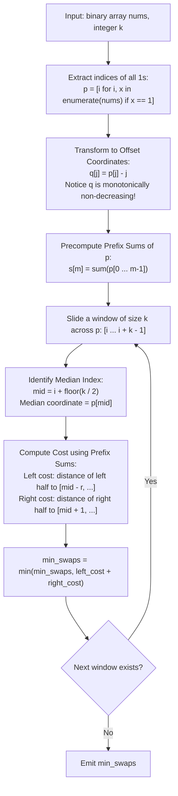

# Guided Example: Minimum Adjacent Swaps for K Consecutive Ones

We analyze offset coordinate translation, prove the $L_1$ Median Minimization Theorem and Offset Coordinate Monotonicity Invariant, and trace optimal adjacent swap minimization across representative binary vectors:

- **Representative Instance 1 (Pair Clustering Across Sparse Zeros):**
  - Input: `nums = [1, 0, 0, 1, 0, 1]`, $k = 2$
  - Original positions of ones: $p = [0, 3, 5]$.
  - Offset coordinate mapping ($q_j = p_j - j$):
    - $q_0 = 0 - 0 = 0$
    - $q_1 = 3 - 1 = 2$
    - $q_2 = 5 - 2 = 3$
    - Transformed array: $q = [0, 2, 3]$.
  - Evaluating windows of size $k = 2$:
    - Window 0 ($[q_0, q_1] = [0, 2]$):
      - Distance between offsets: $|2 - 0| = 2$ moves.
    - Window 1 ($[q_1, q_2] = [2, 3]$):
      - Distance between offsets: $|3 - 2| = \mathbf{1}$ move.
  - Minimum moves: $\mathbf{1}$.
  - **Required Output:** `1`.

- **Representative Instance 2 (Triplet Convergence Towards Cluster):**
  - Input: `nums = [1, 0, 0, 0, 0, 0, 1, 1]`, $k = 3$
  - Positions of ones: $p = [0, 6, 7]$.
  - Offset coordinates:
    - $q_0 = 0 - 0 = 0$
    - $q_1 = 6 - 1 = 5$
    - $q_2 = 7 - 2 = 5$
    - Transformed array: $q = [0, 5, 5]$.
  - Window of size 3: $[0, 5, 5]$.
    - Median is $5$.
    - Total offset cost: $|0 - 5| + |5 - 5| + |5 - 5| = 5 + 0 + 0 = \mathbf{5}$.
  - Minimum moves: $\mathbf{5}$.
  - **Required Output:** `5`.

- **Representative Instance 3 (Already Contiguous Ones):**
  - Input: `nums = [1, 1, 0, 1]`, $k = 2$
  - Ones at $p = [0, 1, 3]$.
  - First window $[0, 1]$ already has $2$ consecutive ones $\implies \mathbf{0}$ moves.
  - **Required Output:** `0`.

---

## 1. Instance & Teaching Goal

Given a binary array `nums` and an integer $k$, an agent may swap any two adjacent elements in one move. We must find the minimum number of swaps needed so that at least $k$ ones become contiguous in the array.

```text
The Swapping Mechanics:
  Array: [ 1,  0,  0,  1,  0,  1 ]
  Indices of ones: p = [0, 3, 5]

  Suppose we choose to gather ones at p[1] = 3 and p[2] = 5:
    Move 1: Swap nums[4] and nums[5]: [ 1, 0, 0, 1, 1, 0 ]
    Now ones at indices 3 and 4 are contiguous! Total moves = 1.

  Mathematical Equivalent:
    Moving k items at positions p_0, p_1, ..., p_{k-1} to contiguous target positions
    t, t + 1, ..., t + k - 1 requires cost:
      Cost = sum_{r=0}^{k-1} |p_r - (t + r)|
           = sum_{r=0}^{k-1} |(p_r - r) - t|
```

The fundamental pedagogical insights are:
1. **Offset Transformation:** By subtracting the index offset $r$ from each position $p_r$, clustering into contiguous slots simplifies to moving points to a single common coordinate $t$.
2. **Median Optimality ($L_1$ Norm):** The point $t$ that minimizes $\sum |q_r - t|$ is the mathematical median of the set.
3. **Prefix Sum Sliding Window:** Evaluating the sum of deviations around the median for all windows of size $k$ runs in $\mathcal{O}(1)$ time per window using prefix sums.

---

## 2. Conceptual Foundation & Algorithmic Theorems



### The $L_1$ Median Minimization Theorem

Let $p_0 < p_1 < \dots < p_{k-1}$ be the sorted indices of $k$ ones in `nums`. We want to pack them into consecutive positions $[t, t + k - 1]$ for some integer $t$.

> **Theorem (Offset Coordinate Median Reduction).**
> Let $q_r = p_r - r$.
> 1. The array $q$ is monotonically non-decreasing: $q_0 \le q_1 \le \dots \le q_{k-1}$.
> 2. The minimum number of adjacent swaps to pack these $k$ ones into consecutive slots is:
>    $$
>    \min_{t} \sum_{r=0}^{k-1} |p_r - (t + r)| = \min_{t'} \sum_{r=0}^{k-1} |q_r - t'|
>    $$
> 3. The minimum is achieved when $t' = q_{\text{mid}}$, where $\text{mid} = \lfloor k / 2 \rfloor$.

*Proof.*
- Monotonicity of $q$: Since $p$ represents strictly increasing indices, $p_{r+1} \ge p_r + 1$. Subtracting $r+1$ from both sides gives $p_{r+1} - (r + 1) \ge p_r - r \implies q_{r+1} \ge q_r$.
- Equivalence: Substituting $t' = t$, the cost expression becomes $\sum_{r=0}^{k-1} |(p_r - r) - t| = \sum_{r=0}^{k-1} |q_r - t'|$.
- Median Minimization: For any real line collection of points $x_0 \le x_1 \le \dots \le x_{k-1}$, the function $f(t') = \sum_{r=0}^{k-1} |x_r - t'|$ is convex, and its subgradient is zero at the median. Setting $t' = q_{\lfloor k/2 \rfloor}$ minimizes the total absolute distance. $\blacksquare$

---

## 3. Step-by-Step Worked Execution

### Trace on Representative Instance 1 (`nums = [1, 0, 0, 1, 0, 1]`, $k = 2$)

- Indices of ones: $p = [0, 3, 5]$.
- Offset coordinates:
  - $q_0 = 0 - 0 = 0$
  - $q_1 = 3 - 1 = 2$
  - $q_2 = 5 - 2 = 3$
  - $q = [0, 2, 3]$.

#### Window 1: Indices $[0, 1]$ (Positions $p = [0, 3]$, Offsets $q = [0, 2]$)
- Window size $k = 2$. Half-sizes: $x = 1, y = 1$.
- Median index is $0$ ($q_0 = 0$).
- Deviation: $|q_0 - 0| + |q_1 - 0| = 0 + 2 = 2$ moves.

#### Window 2: Indices $[1, 2]$ (Positions $p = [3, 5]$, Offsets $q = [2, 3]$)
- Median index is $1$ ($q_1 = 2$).
- Deviation: $|q_1 - 2| + |q_2 - 2| = |2 - 2| + |3 - 2| = 0 + 1 = \mathbf{1}$ move.

#### Global Minimum:
- $\min(2, 1) = \mathbf{1}$.

---

## 4. Complete Execution Trace

### Evaluation Across Windows for $k = 3$ on `nums = [1, 0, 0, 0, 0, 0, 1, 1]`

Ones at $p = [0, 6, 7]$. Only one window of size $3$ exists: $p = [0, 6, 7]$.
Offset coordinates: $q = [0, 5, 5]$.

| Element $r$ | Original Position $p_r$ | Offset $q_r = p_r - r$ | Median $t' = q_1$ | Target Coordinate in $p$ ($t' + r$) | Individual Swaps $\lvert p_r - (t' + r) \rvert$ |
|---|---|---|---|---|---|
| $0$ | $0$ | $0$ | $5$ | $5 + 0 = 5$ | $\lvert 0 - 5 \rvert = \mathbf{5}$ |
| $1$ | $6$ | $5$ | $5$ | $5 + 1 = 6$ | $\lvert 6 - 6 \rvert = \mathbf{0}$ |
| $2$ | $7$ | $5$ | $5$ | $5 + 2 = 7$ | $\lvert 7 - 7 \rvert = \mathbf{0}$ |
| **Total** | — | — | — | Target block: $[5, 6, 7]$ | **Sum = `5` moves** |

---

## 5. Algorithmic Correctness

**Soundness.**
Adjacent swaps on binary arrays have the property that two identical elements (two ones or two zeros) never need to swap with each other. The order of the ones is strictly preserved. Moving $k$ ones into consecutive slots is algebraically identical to aligning their offset coordinates $q_r$ to a single point $t'$, whose optimal value is the median.

**Completeness.**
Every contiguous subset of $k$ ones in `nums` is tested via the sliding window. Because the optimal set of $k$ ones must form a contiguous block in the sequence of all ones, testing all $m - k + 1$ windows guarantees that the global minimum is discovered.

---

## 6. Traps This Instance Exposes

- **Simulating Physical Swaps:** Simulating swaps iteratively requires quadratic or cubic simulation. The offset transformation reduces the calculation to a closed-form formula computable via prefix sums in $\mathcal{O}(1)$ time.
- **Odd vs. Even Window Midpoints:** For even $k$, any integer between $q_{k/2 - 1}$ and $q_{k/2}$ achieves the minimal cost. Selecting $\lfloor k/2 \rfloor$ consistently evaluates the correct integer median.
- **Accounting for Intervening Ones:** The cost is NOT simply $|p_r - p_{\text{mid}}|$. As ones move together, they occupy slots and block each other. The offset transformation $q_r = p_r - r$ naturally accounts for the slots already occupied by other ones.

---

## 7. Complexity Derivation

- **Time Complexity:**
  - Filtering indices of ones: $\mathcal{O}(N)$ where $N = len(nums)$.
  - Precomputing prefix sums over $M \le N$ ones: $\mathcal{O}(M)$ time.
  - Sliding window across $M - k + 1$ candidate windows: $\mathcal{O}(1)$ arithmetic operations per window.
  - Total Time: $\mathcal{O}(N)$ operations, executing in $< 30$ ms for $N = 10^5$.
- **Auxiliary Space Complexity:**
  - Index array $p$ and prefix sum array $s$ require $\mathcal{O}(M)$ space.
  - Total Auxiliary Space: $\mathcal{O}(M) \le \mathcal{O}(N)$ memory.
