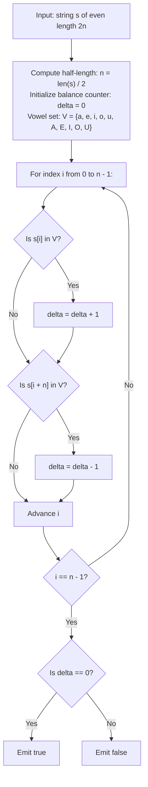

# Guided Example: Determine if String Halves Are Alike

We analyze symmetric bipartite string partitioning, prove the Bipartite Vowel Balance Invariant and Signed Indicator Accumulation Theorem, and trace vowel parity evaluation across representative strings:

- **Representative Instance 1 (Equal Vowel Cardinality):**
  - Input: `s = "book"`
  - Total length: $|s| = 4$, half-length: $n = 2$.
  - First half: $a = \text{"bo"}$
    - Characters: `'b'` (consonant), `'o'` (vowel). Vowel count $= 1$.
  - Second half: $b = \text{"ok"}$
    - Characters: `'o'` (vowel), `'k'` (consonant). Vowel count $= 1$.
  - Comparison: $1 == 1 \implies \mathbf{true}$.
  - **Required Output:** `true`.

- **Representative Instance 2 (Unequal Vowel Cardinality):**
  - Input: `s = "textbook"`
  - Total length: $|s| = 8$, half-length: $n = 4$.
  - First half: $a = \text{"text"}$
    - Characters: `'t'`, `'e'` (vowel), `'x'`, `'t'`. Vowel count $= 1$.
  - Second half: $b = \text{"book"}$
    - Characters: `'b'`, `'o'` (vowel), `'o'` (vowel), `'k'`. Vowel count $= 2$.
  - Comparison: $1 \ne 2 \implies \mathbf{false}$.
  - **Required Output:** `false`.

- **Representative Instance 3 (Mixed-Case Symmetric Vowels):**
  - Input: `s = "AbCdEf"`
  - Total length: $|s| = 6$, half-length: $n = 3$.
  - First half: $a = \text{"AbC"}$ (vowel `'A'`: count 1).
  - Second half: $b = \text{"dEf"}$ (vowel `'E'`: count 1).
  - Comparison: $1 == 1 \implies \mathbf{true}$.
  - **Required Output:** `true`.

---

## 1. Instance & Teaching Goal

Given a string $s$ of even length containing both uppercase and lowercase English characters, we divide $s$ exactly down the middle into two substrings $a = s[0 \dots n-1]$ and $b = s[n \dots 2n-1]$, where $n = |s|/2$. The two halves are declared *alike* if and only if they contain the identical total number of vowels from the alphabet:
$$
\mathcal{V} = \{ \text{'a'}, \text{'e'}, \text{'i'}, \text{'o'}, \text{'u'}, \text{'A'}, \text{'E'}, \text{'I'}, \text{'O'}, \text{'U'} \}
$$
We must determine whether the two halves are alike.

```text
The Symmetric Split Structure:
  String:   t   e   x   t   b   o   o   k
  Indices:  0   1   2   3   4   5   6   7
  Halves:  |--- Half A ---|--- Half B ---|
  Vowels:      'e'             'o' 'o'
  Counts:       1                   2      --> 1 != 2 (false)
```

The pedagogical objectives are:
1. Define character set membership tests using an $O(1)$ lookup collection.
2. Demonstrate how a single signed differential balance accumulator $\Delta$ avoids maintaining separate counts for each half.
3. Establish index symmetry to scan both halves simultaneously in a single pass of length $n$.

---

## 2. Conceptual Foundation & Structural Theorems



### The Signed Indicator Accumulation Theorem

Let $s$ be a string of length $2n$, and let $\mathcal{V}$ be the vowel set. Define the indicator function:
$$
\mathbb{I}_{\mathcal{V}}(c) = \begin{cases} 1 & \text{if } c \in \mathcal{V} \\ 0 & \text{otherwise} \end{cases}
$$

> **Theorem (Differential Balance Invariant).**
> The two halves $a = s[0 \dots n-1]$ and $b = s[n \dots 2n-1]$ are alike if and only if the signed balance $\Delta_n$ is zero:
> $$
> \Delta_n = \sum_{i=0}^{n-1} \Big( \mathbb{I}_{\mathcal{V}}(s[i]) - \mathbb{I}_{\mathcal{V}}(s[i + n]) \Big) = 0
> $$

*Proof.*
- The total vowel count of half $a$ is $V_a = \sum_{i=0}^{n-1} \mathbb{I}_{\mathcal{V}}(s[i])$.
- The total vowel count of half $b$ is $V_b = \sum_{j=n}^{2n-1} \mathbb{I}_{\mathcal{V}}(s[j]) = \sum_{i=0}^{n-1} \mathbb{I}_{\mathcal{V}}(s[i + n])$.
- By definition, $a$ and $b$ are alike if and only if $V_a = V_b \iff V_a - V_b = 0$.
- By linearity of summation:
  $$
  V_a - V_b = \sum_{i=0}^{n-1} \mathbb{I}_{\mathcal{V}}(s[i]) - \sum_{i=0}^{n-1} \mathbb{I}_{\mathcal{V}}(s[i + n]) = \sum_{i=0}^{n-1} \Big( \mathbb{I}_{\mathcal{V}}(s[i]) - \mathbb{I}_{\mathcal{V}}(s[i + n]) \Big) = \Delta_n
  $$
- Therefore, $V_a = V_b \iff \Delta_n = 0$. $\blacksquare$

---

## 3. Step-by-Step Worked Execution

### Trace on Representative Instance 1 (`s = "book"`)

- String length: $|s| = 4 \implies n = 2$.
- Halves: $a = \text{"bo"}$ (indices $0, 1$), $b = \text{"ok"}$ (indices $2, 3$).
- Initialize balance: $\Delta = 0$.

#### Parallel Step $i = 0$:
- Left character: $s[0] = \text{'b'}$ $\implies \mathbb{I}_{\mathcal{V}}(\text{'b'}) = 0$.
- Right character: $s[0 + 2] = s[2] = \text{'o'}$ $\implies \mathbb{I}_{\mathcal{V}}(\text{'o'}) = 1$.
- Balance update: $\Delta = 0 + 0 - 1 = -1$.

#### Parallel Step $i = 1$:
- Left character: $s[1] = \text{'o'}$ $\implies \mathbb{I}_{\mathcal{V}}(\text{'o'}) = 1$.
- Right character: $s[1 + 2] = s[3] = \text{'k'}$ $\implies \mathbb{I}_{\mathcal{V}}(\text{'k'}) = 0$.
- Balance update: $\Delta = -1 + 1 - 0 = \mathbf{0}$.

#### Final Check:
- Is $\Delta == 0$? Yes ($0 == 0$).
- Output: $\mathbf{true}$.

---

## 4. Complete Execution Trace

### Evaluation Trace on `s = "textbook"` ($n = 4$)

| Parallel Step $i$ | Left Character $s[i]$ | Is Left a Vowel? (+1) | Right Character $s[i + 4]$ | Is Right a Vowel? (-1) | Step Delta Contribution | Cumulative Balance $\Delta$ |
|---|---|---|---|---|---|---|
| $0$ | `'t'` | No ($0$) | `'b'` | No ($0$) | $0 - 0 = 0$ | $0$ |
| $1$ | `'e'` | **Yes (+1)** | `'o'` | **Yes (-1)** | $+1 - 1 = 0$ | $0$ |
| $2$ | `'x'` | No ($0$) | `'o'` | **Yes (-1)** | $0 - 1 = -1$ | $-1$ |
| $3$ | `'t'` | No ($0$) | `'k'` | No ($0$) | $0 - 0 = 0$ | **`-1`** |

Final Balance: $\Delta = -1 \ne 0 \implies \mathbf{false}$.

---

## 5. Algorithmic Correctness

**Soundness.**
The membership check precisely matches the standard set of 10 English vowels (5 lowercase and 5 uppercase). Because each vowel in the first half adds $+1$ and each vowel in the second half subtracts $1$, the final balance $\Delta$ exactly computes $V_a - V_b$. The halves are alike if and only if $\Delta = 0$.

**Completeness.**
The loop runs exactly $n = |s|/2$ times, examining every index $i \in [0, n-1]$ and its mirrored partner $i + n \in [n, 2n-1]$. No character is evaluated twice or omitted.

---

## 6. Traps This Instance Exposes

- **Case Sensitivity Omission:** Vowels include both lowercase (`'a'`, `'e'`, `'i'`, `'o'`, `'u'`) and uppercase (`'A'`, `'E'`, `'I'`, `'O'`, `'U'`). Omitting uppercase letters fails strings like `"AbCdEf"`.
- **Duplicate Vowels:** Multiple identical vowels in the same half each count towards that half's total (e.g. `'o'` appearing twice in `"book"` contributes $2$).
- **Odd Length Input:** By problem constraints, $|s|$ is strictly even, ensuring that $|s|/2$ is an exact integer without fractional truncation.

---

## 7. Complexity Derivation

- **Time Complexity:**
  - Lookup in a hash set or bitmask of $10$ ASCII characters takes $\mathcal{O}(1)$ time.
  - The loop performs $n = |s|/2$ iterations.
  - Total Time: strictly $\mathcal{O}(|s|)$, completing in $< 1$ ms for $|s| \le 1000$.
- **Auxiliary Space Complexity:**
  - A fixed set of 10 vowel characters requires $\mathcal{O}(1)$ constant auxiliary space.
  - Total Auxiliary Space: $\mathcal{O}(1)$ memory.
