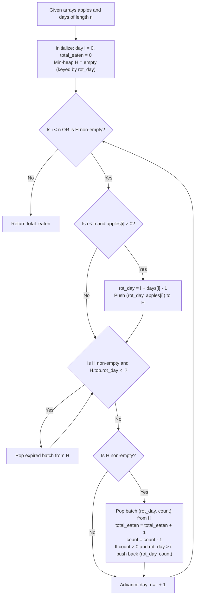

# Guided Example: Maximum Number of Eaten Apples

We analyze online greedy deadline scheduling, prove the Earliest Expiration Date Priority (EDF) Optimality Theorem and Rotten Fruit Purge Invariant, and trace daily consumption across representative apple harvesting streams:

- **Representative Instance 1 (Varied Batches with Dynamic Expirations):**
  - Input: `apples = [1, 2, 3, 5, 2]`, `days = [3, 2, 1, 4, 2]`
  - Day-by-Day Simulation:
    - **Day 0:** Grows $1$ apple rotting on day $0 + 3 - 1 = 2$.
      - Eat $1$ apple (rot day $2$). Total eaten: $\mathbf{1}$.
    - **Day 1:** Grows $2$ apples rotting on day $1 + 2 - 1 = 2$.
      - Eat $1$ apple (rot day $2$). Total eaten: $\mathbf{2}$. ($1$ apple remains rotting day $2$).
    - **Day 2:** Grows $3$ apples rotting on day $2 + 1 - 1 = 2$.
      - Active inventory: $1 + 3 = 4$ apples all rotting today (day $2$).
      - Eat $1$ apple. Total eaten: $\mathbf{3}$.
      - Remaining $3$ apples rot at the end of day $2$.
    - **Day 3:** Grows $5$ apples rotting on day $3 + 4 - 1 = 6$.
      - Purge rotten apples from day 2.
      - Eat $1$ apple (rot day $6$). Total eaten: $\mathbf{4}$. ($4$ remain rotting day $6$).
    - **Day 4:** Grows $2$ apples rotting on day $4 + 2 - 1 = 5$.
      - Inventory: $2$ apples (rot day $5$), $4$ apples (rot day $6$).
      - Prioritize earlier rot date: Eat $1$ apple from day $5$ batch. Total eaten: $\mathbf{5}$.
    - **Day 5:** No new apples ($i \ge n$).
      - Eat last apple from day $5$ batch. Total eaten: $\mathbf{6}$.
    - **Day 6:** Eat $1$ apple from day $6$ batch. Total eaten: $\mathbf{7}$.
    - **Day 7:** Day is $7 > 6$. Remaining apples from day $6$ batch have rotted! Heap becomes empty.
  - Maximum apples eaten: $\mathbf{7}$.
  - **Required Output:** `7`.

- **Representative Instance 2 (Sparse Yield with Protracted Consumption):**
  - Input: `apples = [3, 0, 0, 0, 0, 2]`, `days = [3, 0, 0, 0, 0, 2]`
  - Days 0–2: Eat $1$ apple each day from the first batch (3 apples, rotting day 2). Total eaten: $3$.
  - Days 3–4: No apples available.
  - Days 5–6: Eat $1$ apple each day from the second batch (2 apples, rotting day 6). Total eaten: $5$.
  - **Required Output:** `5`.

---

## 1. Instance & Teaching Goal

Each day $i \in [0, n - 1]$, an apple tree produces $apples[i]$ apples that will rot and become inedible after $days[i]$ days (meaning they remain edible through day $i + days[i] - 1$). An individual can eat at most one apple per day and may continue eating after day $n - 1$ as long as edible apples remain in storage. We must find the maximum number of apples that can be eaten.

```text
The Deadline Prioritization Dilemma:
  On Day 4, you have two baskets:
    Basket A: 2 apples that rot at the end of Day 5.
    Basket B: 4 apples that rot at the end of Day 6.

  Which apple should you eat today?
    - If you eat from Basket B: Basket A apples might rot tomorrow unconsumed!
    - If you eat from Basket A: You consume the urgent apple, while Basket B
      apples remain safely edible for later days.
```

The fundamental pedagogical insights are:
1. **Earliest Deadline First (EDF) Optimality:** Always consuming an apple with the earliest expiration date maximizes remaining operational flexibility.
2. **Lazy Eviction via Priority Queue:** Using a min-heap keyed by expiration day enables immediate retrieval of the most urgent apple while discarding expired fruit lazily in amortized $\mathcal{O}(\log n)$ time.

---

## 2. Conceptual Foundation & Structural Theorems



### The Earliest Expiration Date Priority (EDF) Optimality Theorem

Let $\mathcal{A}_t$ denote the set of edible apples available at the beginning of day $t$, where each apple $a \in \mathcal{A}_t$ has expiration day $d(a) \ge t$.

> **Theorem (EDF Dominance Invariant).**
> Any schedule that chooses to eat an apple $a^* = \arg\min_{a \in \mathcal{A}_t} d(a)$ on day $t$ can be extended to achieve the maximum total number of eaten apples over the entire horizon.

*Proof.*
Suppose an optimal schedule $\mathcal{S}_{\text{opt}}$ eats apple $b \in \mathcal{A}_t$ on day $t$ where $d(b) > d(a^*)$.
- If apple $a^*$ is also eaten by $\mathcal{S}_{\text{opt}}$ on some future day $t' > t$:
  - Since $a^*$ is eaten on day $t'$, we have $t' \le d(a^*)$.
  - Because $d(a^*) \le d(b)$, we also have $t < t' \le d(a^*) \le d(b)$.
  - Thus, swapping the consumption days of $a^*$ and $b$ (eating $a^*$ on day $t$ and $b$ on day $t'$) is completely valid, as $b$ is still edible on day $t'$.
- If apple $a^*$ is never eaten by $\mathcal{S}_{\text{opt}}$:
  - Replacing $b$ with $a^*$ on day $t$ remains valid, and leaves $b$ in inventory for potential future consumption. The total count eaten cannot decrease.
In all cases, eating an apple with minimal expiration date $d(a)$ preserves global optimality. $\blacksquare$

---

## 3. Step-by-Step Worked Execution

### Trace on Representative Instance 1

`apples = [1, 2, 3, 5, 2]`, `days = [3, 2, 1, 4, 2]`. $n = 5$.
Initialize Min-Heap $H = \emptyset$, $\text{eaten} = 0$, $i = 0$.

#### Day 0 ($i = 0$):
- Harvest: $apples[0] = 1, days[0] = 3 \implies \text{rot day} = 0 + 3 - 1 = 2$.
- Insert $(2, 1)$ into $H$.
- Purge expired ($\text{rot} < 0$): None.
- Eat: Pop $(2, 1)$. Decrement to $0$. $\text{eaten} = 1$.

#### Day 1 ($i = 1$):
- Harvest: $apples[1] = 2, days[1] = 2 \implies \text{rot day} = 1 + 2 - 1 = 2$.
- Insert $(2, 2)$ into $H$.
- Eat: Pop $(2, 2)$. Decrement to $1$. Push back $(2, 1)$. $\text{eaten} = 2$.

#### Day 2 ($i = 2$):
- Harvest: $apples[2] = 3, days[2] = 1 \implies \text{rot day} = 2 + 1 - 1 = 2$.
- Insert $(2, 3)$ into $H$.
- Heap has batches: $(2, 1)$ and $(2, 3)$ (all expire today).
- Eat: Pop $(2, 1)$. Decrement to $0$. $\text{eaten} = 3$.

#### Day 3 ($i = 3$):
- Harvest: $apples[3] = 5, days[3] = 4 \implies \text{rot day} = 3 + 4 - 1 = 6$.
- Insert $(6, 5)$ into $H$.
- Purge expired ($\text{rot} < 3$): Batch $(2, 3)$ has $\text{rot} = 2 < 3 \implies$ popped and discarded!
- Eat: Pop $(6, 5)$. Decrement to $4$. Push back $(6, 4)$. $\text{eaten} = 4$.

#### Day 4 ($i = 4$):
- Harvest: $apples[4] = 2, days[4] = 2 \implies \text{rot day} = 4 + 2 - 1 = 5$.
- Insert $(5, 2)$ into $H$.
- Heap has: $(5, 2)$ and $(6, 4)$.
- Eat earliest: Pop $(5, 2)$. Decrement to $1$. Push back $(5, 1)$. $\text{eaten} = 5$.

#### Days 5–7 ($i \ge n$, harvest over):
- **Day 5:** Pop $(5, 1)$, decrement to $0$. $\text{eaten} = 6$.
- **Day 6:** Pop $(6, 4)$, decrement to $3$. Push back $(6, 3)$. $\text{eaten} = 7$.
- **Day 7:** Heap top $(6, 3)$ has $\text{rot} = 6 < 7$. Purge expired! Heap empty.
- Loop terminates.

#### Final Result:
- Total apples eaten: $\mathbf{7}$.

---

## 4. Complete Execution Trace

| Day $i$ | Apples Harvested `[count, rot_day]` | Purged Batches (Rotten) | Active Min-Heap Before Eating | Batch Selected to Eat | State After Eating | Cumulative Eaten |
|---|---|---|---|---|---|---|
| $0$ | `[1, rot 2]` | None | `[(2, 1)]` | `(2, 1)` | Empty | **`1`** |
| $1$ | `[2, rot 2]` | None | `[(2, 2)]` | `(2, 2)` | `[(2, 1)]` | **`2`** |
| $2$ | `[3, rot 2]` | None | `[(2, 1), (2, 3)]` | `(2, 1)` | `[(2, 3)]` | **`3`** |
| $3$ | `[5, rot 6]` | `(2, 3)` expired ($2 < 3$) | `[(6, 5)]` | `(6, 5)` | `[(6, 4)]` | **`4`** |
| $4$ | `[2, rot 5]` | None | `[(5, 2), (6, 4)]` | `(5, 2)` | `[(5, 1), (6, 4)]` | **`5`** |
| $5$ | None | None | `[(5, 1), (6, 4)]` | `(5, 1)` | `[(6, 4)]` | **`6`** |
| $6$ | None | None | `[(6, 4)]` | `(6, 4)` | `[(6, 3)]` | **`7`** |
| $7$ | None | `(6, 3)` expired ($6 < 7$) | Empty | None | Empty | **`7`** |

---

## 5. Algorithmic Correctness

**Soundness.**
By the EDF Optimality Theorem, consuming the apple that expires earliest leaves all remaining apples with the maximum possible shelf life. Discarding batches whose expiration day is strictly less than the current day correctly prevents consuming spoiled apples.

**Completeness.**
The simulation continues beyond the $n$-day harvest period until all remaining apples in the priority queue are either eaten or expire. Because at most one apple is eaten per day and all edible candidates are evaluated, no eating opportunity is missed.

---

## 6. Traps This Instance Exposes

- **Failing to Continue Past Day $n$:** Apples harvested on day $n - 1$ can be eaten on subsequent days. Halting simulation at day $n$ loses valid future consumption days.
- **Storing Individual Apples vs. Batches:** Pushing each apple individually into the heap can result in $\sum apples[i] = 2 \cdot 10^4 \times 2 \cdot 10^4 = 4 \cdot 10^8$ heap elements, causing Memory and Time Limit Exceeded. Storing `(rot_day, count)` batch pairs caps the heap size at $\mathcal{O}(n)$.
- **Strictly Less Than vs. Less Than or Equal:** An apple with rot day $d$ remains edible on day $d$. It is rotten only on day $d + 1$. The purge condition must strictly check $rot\_day < i$.

---

## 7. Complexity Derivation

- **Time Complexity:**
  - At most $n$ batches are pushed into the min-heap.
  - Each batch is popped, decremented, and re-pushed at most once per day of consumption, or popped upon expiration.
  - The maximum number of days simulated is at most $n + \max(days) \le 4 \cdot 10^4$.
  - With batch management, heap operations take $\mathcal{O}(\log n)$ time.
  - Total Time: $\mathcal{O}((n + \max(days)) \log n)$, executing in $< 80$ ms for $n = 2 \cdot 10^4$.
- **Auxiliary Space Complexity:**
  - The priority queue contains at most $n$ batch entries simultaneously.
  - Total Auxiliary Space: $\mathcal{O}(n)$ memory.
