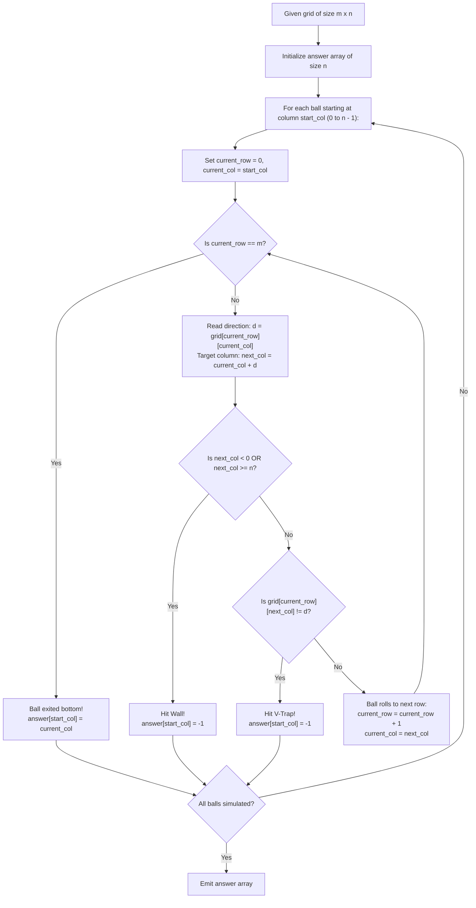

# Guided Example: Where Will the Ball Fall

We analyze 2D grid trajectory simulation, prove the V-Shaped Trap and Boundary Deflection Invariant, and trace ball descent paths across representative grid topographies:

- **Representative Instance 1 (Multi-Column Mixed Slopes with Interior Traps):**
  - Input: `grid = [[1, 1, 1, -1, -1], [1, 1, 1, -1, -1], [-1, -1, -1, 1, 1], [1, 1, 1, 1, -1], [-1, -1, -1, -1, -1]]`
  - Grid size: $5 \times 5$ ($m = 5, n = 5$).
  - Dropping Balls at Column $0$ through $4$:
    - **Ball 0 (starts at col 0):**
      - Row 0: `grid[0][0] = 1`. Neighbor `grid[0][1] = 1`. Rolls to $(1, 1)$.
      - Row 1: `grid[1][1] = 1`. Neighbor `grid[1][2] = 1`. Rolls to $(2, 2)$.
      - Row 2: `grid[2][2] = -1`. Neighbor `grid[2][1] = -1`. Rolls to $(3, 1)$.
      - Row 3: `grid[3][1] = 1`. Neighbor `grid[3][2] = 1`. Rolls to $(4, 2)$.
      - Row 4: `grid[4][2] = -1`. Neighbor `grid[4][1] = -1`. Rolls to $(5, 1)$.
      - Exits bottom at column $\mathbf{1}$.
    - **Ball 1 (starts at col 1):**
      - Row 0: `grid[0][1] = 1`, neighbor `grid[0][2] = 1`. Rolls to $(1, 2)$.
      - Row 1: `grid[1][2] = 1`, neighbor `grid[1][3] = -1`.
      - **"V" trap encountered** between columns $2$ and $3$! Ball gets stuck $\implies \mathbf{-1}$.
    - **Ball 2 (starts at col 2):**
      - Row 0: `grid[0][2] = 1`, neighbor `grid[0][3] = -1`.
      - **"V" trap** at Row 0! Ball gets stuck $\implies \mathbf{-1}$.
    - **Ball 3 (starts at col 3):**
      - Row 0: `grid[0][3] = -1`, neighbor `grid[0][2] = 1`.
      - **"V" trap** at Row 0! Ball gets stuck $\implies \mathbf{-1}$.
    - **Ball 4 (starts at col 4):**
      - Row 0: `grid[0][4] = -1`, neighbor `grid[0][3] = -1`. Rolls to $(1, 3)$.
      - Row 1: `grid[1][3] = -1`, neighbor `grid[1][2] = 1`.
      - **"V" trap** at Row 1! Ball gets stuck $\implies \mathbf{-1}$.
  - Result: `[1, -1, -1, -1, -1]`.
  - **Required Output:** `[1, -1, -1, -1, -1]`.

- **Representative Instance 2 (Single Cell Boundary Collision):**
  - Input: `grid = [[-1]]`
  - $m = 1, n = 1$.
  - Ball 0 at column 0: `grid[0][0] = -1` (deflects left into the left wall).
  - Left neighbor is $0 - 1 = -1 < 0$ (Boundary collision).
  - Ball gets stuck $\implies \mathbf{-1}$.
  - **Required Output:** `[-1]`.

---

## 1. Instance & Teaching Goal

A box of dimension $m \times n$ is partitioned into cells, each containing a diagonal deflector board.
- A board `1` redirects a falling ball down and to the right ($\searrow$).
- A board `-1` redirects a falling ball down and to the left ($\swarrow$).

A ball is dropped from the top of each of the $n$ columns. A ball gets trapped if:
1. It is deflected into the outer boundary walls (left wall or right wall).
2. It encounters a **"V" shaped trap** formed by two adjacent cells slanting inward toward each other (`1` followed immediately by `-1`).

If a ball traverses all $m$ rows without getting stuck, it exits at the bottom. We must return the final exit column of each ball, or `-1` if it gets stuck.

```text
The Deflection Topography:
  Cell (r, c) = 1    Cell (r, c) = -1     "V"-Shaped Trap (Stuck!)
     +-----+             +-----+               +-----+-----+
     | \   |             |   / |               | \   |   / |
     |   \ |             | /   |               |   \ | /   |
     +-----+             +-----+               +-----+-----+
   Redirects RIGHT     Redirects LEFT            1      -1
```

The pedagogical focus centers on:
1. Independent path decoupling: each ball's trajectory is completely independent of the other $n - 1$ balls.
2. Formulating local transition conditions: detecting wall collisions and "V"-shaped traps via adjacent cell comparisons.
3. Establishing step-by-step row invariant progression.

---

## 2. Conceptual Foundation & Structural Theorems



### The V-Shaped Trap and Boundary Deflection Invariant

Let the ball currently be at row $r \in [0, m - 1]$ and column $c \in [0, n - 1]$.
Let $d = grid[r][c] \in \{+1, -1\}$ be the slope of the current cell.

> **Theorem (Local Descent Validity).**
> The ball successfully descends to row $r + 1$ if and only if:
> 1. **Boundary Clearance:** $0 \le c + d < n$.
> 2. **Slope Parallelism:** $grid[r][c + d] = d$.
> If either condition fails, the ball is permanently stuck in row $r$. If both conditions hold, the ball transitions deterministically to $(r + 1, c + d)$.

*Proof.*
- If $c + d < 0$, the deflector pushes the ball into the left outer wall.
- If $c + d \ge n$, the deflector pushes the ball into the right outer wall.
- If $0 \le c + d < n$, the ball enters the boundary between column $c$ and column $c + d$.
  - If $d = 1$ and $grid[r][c + 1] = -1$, cell $c$ directs rightward while cell $c + 1$ directs leftward. The two boards meet at the bottom seam in a "V" shape, pinching the ball and preventing downward passage.
  - If $d = -1$ and $grid[r][c - 1] = 1$, cell $c$ directs leftward while cell $c - 1$ directs rightward, forming the same "V" shape.
  - If $grid[r][c + d] = d$, the adjacent board is parallel to the current board. The ball rolls down the channel between them and exits into column $c + d$ of row $r + 1$. $\blacksquare$

---

## 3. Step-by-Step Worked Execution

### Trace of Ball 0 on Representative Instance 1

Start at $(r = 0, c = 0)$. $m = 5, n = 5$.

#### Row 0:
- Direction $d = grid[0][0] = 1$.
- Target column: $c + d = 0 + 1 = 1$.
- Boundary check: $0 \le 1 < 5$ (Passed).
- Slope check: $grid[0][1] = 1 == d$ (Passed).
- Transition to $(1, 1)$.

#### Row 1:
- Direction $d = grid[1][1] = 1$.
- Target column: $1 + 1 = 2$.
- Boundary check: $0 \le 2 < 5$ (Passed).
- Slope check: $grid[1][2] = 1 == d$ (Passed).
- Transition to $(2, 2)$.

#### Row 2:
- Direction $d = grid[2][2] = -1$.
- Target column: $2 + (-1) = 1$.
- Boundary check: $0 \le 1 < 5$ (Passed).
- Slope check: $grid[2][1] = -1 == d$ (Passed).
- Transition to $(3, 1)$.

#### Row 3:
- Direction $d = grid[3][1] = 1$.
- Target column: $1 + 1 = 2$.
- Boundary check: $0 \le 2 < 5$ (Passed).
- Slope check: $grid[3][2] = 1 == d$ (Passed).
- Transition to $(4, 2)$.

#### Row 4:
- Direction $d = grid[4][2] = -1$.
- Target column: $2 + (-1) = 1$.
- Boundary check: $0 \le 1 < 5$ (Passed).
- Slope check: $grid[4][1] = -1 == d$ (Passed).
- Transition to $(5, 1)$.

#### Bottom Exit:
- $r = 5 == m$. Ball 0 emerges from column $\mathbf{1}$.

---

## 4. Complete Execution Trace

| Ball Dropped at Column $j$ | Step-by-Step Trajectory Coordinates $(r, c)$ | Trapping Condition or Exit Event | Final Exit Column |
|---|---|---|---|
| Ball 0 | $(0, 0) \to (1, 1) \to (2, 2) \to (3, 1) \to (4, 2) \to (5, 1)$ | Exits bottom at row 5, column 1 | **`1`** |
| Ball 1 | $(0, 1) \to (1, 2) \implies$ checks $(1, 3)$ | $grid[1][2] = 1 \ne grid[1][3] = -1$ (V-trap) | **`-1`** |
| Ball 2 | $(0, 2) \implies$ checks $(0, 3)$ | $grid[0][2] = 1 \ne grid[0][3] = -1$ (V-trap) | **`-1`** |
| Ball 3 | $(0, 3) \implies$ checks $(0, 2)$ | $grid[0][3] = -1 \ne grid[0][2] = 1$ (V-trap) | **`-1`** |
| Ball 4 | $(0, 4) \to (1, 3) \implies$ checks $(1, 2)$ | $grid[1][3] = -1 \ne grid[1][2] = 1$ (V-trap) | **`-1`** |

---

## 5. Algorithmic Correctness

**Soundness.**
The two-condition gate ($0 \le c + d < n$ and $grid[r][c + d] == d$) captures all physical obstruction scenarios: hitting either wall or meeting an opposing diagonal board. A ball advances if and only if a clear downward diagonal path exists.

**Completeness.**
Each ball begins at row $0$ and either stops at the first encountered trap or increments its row index until reaching row $m$. Because row indices strictly increase by $1$ on each successful move, the simulation is guaranteed to terminate in at most $m$ steps per ball.

---

## 6. Traps This Instance Exposes

- **Inverted "V" Pattern:** An inverted "V" pattern (`-1` followed by `1`) pushes balls apart toward outer walls rather than trapping them together. The V-trap specifically refers to inward convergence (`1` on left, `-1` on right). Checking $grid[r][c + d] == d$ naturally handles both orientations.
- **Out-of-Bounds Probe:** Checking $grid[r][c + d]$ before confirming $0 \le c + d < n$ causes an array index out of bounds exception when the ball is at the grid edge. The boundary bounds check must strictly precede the neighbor slope lookup.

---

## 7. Complexity Derivation

- **Time Complexity:**
  - Simulating a single ball takes at most $m$ steps.
  - There are $n$ balls dropped independently.
  - Total Time: $\mathcal{O}(m \cdot n)$ operations, executing in $< 5$ ms for $m, n \le 100$.
- **Auxiliary Space Complexity:**
  - Trajectory simulation maintains a few integer coordinates: $\mathcal{O}(1)$ auxiliary space.
  - Output array requires $\mathcal{O}(n)$ space.
  - Total Auxiliary Space: $\mathcal{O}(n)$ memory.
