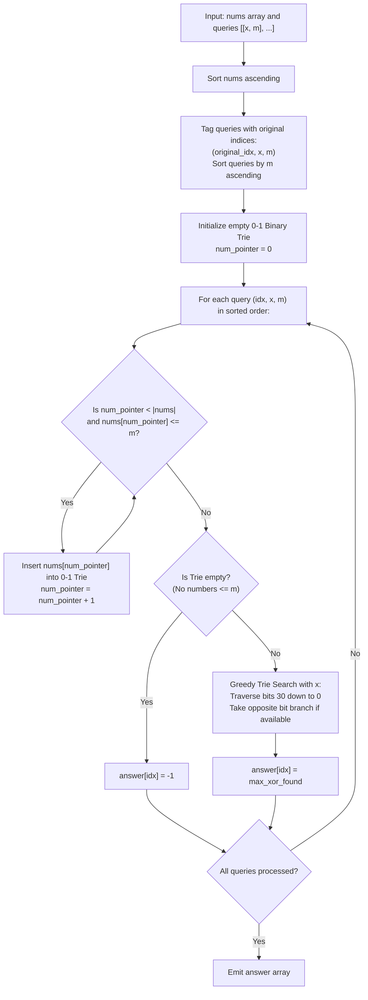

# Guided Example: Maximum XOR With an Element From Array

We analyze bitwise prefix tree optimization, prove the Greedy Bitwise Orthogonality Theorem and Monotonic Offline Ingestion Invariant, and trace query evaluation across representative binary trie configurations:

- **Representative Instance 1 (Progressive Upper-Bound Limits):**
  - Input: `nums = [0, 1, 2, 3, 4]`, `queries = [[3, 1], [1, 3], [5, 6]]`
  - Array sorted: `[0, 1, 2, 3, 4]`.
  - Queries sorted by threshold $m$:
    - Query 0: $x = 3, m = 1$ (Original index $0$).
    - Query 1: $x = 1, m = 3$ (Original index $1$).
    - Query 2: $x = 5, m = 6$ (Original index $2$).
  - Step-by-Step Execution:
    - **Step 1 (Query 0, $m = 1$):**
      - Insert into Binary Trie all elements $\le 1$: $\{0, 1\}$.
      - Query Trie with $x = 3$ ($011_2$):
        - Bit 1: $x$ has $1 \implies$ seek opposite branch $0$ (exists: value $0, 1$). Take $0$, XOR bit is $1$.
        - Bit 0: $x$ has $1 \implies$ seek branch $0$ (value $0$ has bit 0). Take $0$, XOR bit is $1$.
        - Maximum XOR: $3 \oplus 0 = \mathbf{3}$.
    - **Step 2 (Query 1, $m = 3$):**
      - Insert elements $\le 3$: $\{2, 3\}$. Active Trie: $\{0, 1, 2, 3\}$.
      - Query Trie with $x = 1$ ($001_2$):
        - Bit 1: $x$ has $0 \implies$ seek branch $1$ (values $2, 3$). Take $1$, XOR bit is $1$.
        - Bit 0: $x$ has $1 \implies$ seek branch $0$ (value $2$). Take $0$, XOR bit is $1$.
        - Chosen number: $2$. Maximum XOR: $1 \oplus 2 = \mathbf{3}$.
    - **Step 3 (Query 2, $m = 6$):**
      - Insert elements $\le 6$: $\{4\}$. Active Trie: $\{0, 1, 2, 3, 4\}$.
      - Query Trie with $x = 5$ ($101_2$):
        - Bit 2: $x$ has $1 \implies$ seek branch $0$ (values $\{0, 1, 2, 3\}$).
        - Bit 1: $x$ has $0 \implies$ seek branch $1$ (values $\{2, 3\}$).
        - Bit 0: $x$ has $1 \implies$ seek branch $0$ (value $2$).
        - Chosen number: $2$. Maximum XOR: $5 \oplus 2 = \mathbf{7}$.
  - Result: `[3, 3, 7]`.
  - **Required Output:** `[3, 3, 7]`.

- **Representative Instance 2 (Unsatisfiable Threshold with Fallback):**
  - Input: `nums = [5, 2, 4, 6, 6, 3]`, `queries = [[12, 4], [8, 1], [6, 3]]`
  - Query with $x = 8, m = 1$:
    - Smallest element in `nums` is $2$.
    - No element satisfies $nums[j] \le 1$.
    - Return fallback value: $\mathbf{-1}$.
  - **Required Output:** `[15, -1, 5]`.

---

## 1. Instance & Teaching Goal

Given an integer array `nums` and queries of the form $(x_i, m_i)$, each query asks for the maximum possible bitwise XOR value $x_i \oplus \text{val}$, subject to the constraint that $\text{val} \in nums$ and $\text{val} \le m_i$. If no element in `nums` is less than or equal to $m_i$, the answer is $-1$.

```text
The Bitwise XOR Challenge:
  For a fixed x, to maximize x XOR val:
    At each bit position (from most significant to least significant):
      We want the bit of 'val' to be the OPPOSITE of the bit in 'x'.
      bit(val) = bit(x) XOR 1  --> yields a '1' in the result!

  The Threshold Constraint:
    Only elements val <= m are eligible.
    If we evaluate online, filtering nums for each query takes O(N) -> O(Q * N) TLE.
    By sorting nums and queries by m, we insert elements into a 0-1 Trie monotonically!
```

The core pedagogical objectives are:
1. Formulate offline query sorting to remove the conditional upper-bound check during trie traversal.
2. Structure the 0-1 Binary Trie to explore bit paths greedily from highest to lowest significant bit.
3. Prove that prioritizing high-order bits guarantees global maximality over all low-order combinations.

---

## 2. Conceptual Foundation & Structural Theorems



### The Greedy Bitwise Orthogonality Theorem

Let integers be represented in binary with $B$ bits (indices $B - 1$ down to $0$).
Consider querying the trie with value $x$.

> **Theorem (High-Order Bit Dominance).**
> For any bit position $k$, obtaining a $1$ at position $k$ in the XOR result yields a strictly larger numerical value than any combination of $1$s at all lower bit positions $0, 1, \dots, k - 1$:
> $$
> 2^k > \sum_{j=0}^{k-1} 2^j = 2^k - 1
> $$
> Consequently, choosing the opposite bit branch $v \oplus 1$ at bit position $k$ whenever it exists is strictly globally optimal.

*Proof.*
- The maximum possible value contributed by all bits strictly below $k$ is $\sum_{j=0}^{k-1} 2^j = 2^k - 1$.
- If we fail to secure a $1$ at bit $k$, the XOR value from bits $0 \dots k$ cannot exceed $0 + (2^k - 1) = 2^k - 1$.
- If we secure a $1$ at bit $k$, the value from bits $0 \dots k$ is at least $2^k + 0 = 2^k$.
- Since $2^k > 2^k - 1$, no future choices at lower bits can ever compensate for missing a $1$ at bit $k$.
- Thus, the greedy decision at each bit level is universally optimal and requires no backtracking. $\blacksquare$

---

## 3. Step-by-Step Worked Execution

### Trace on Query with $x = 5$ ($101_2$) over Trie containing $\{0, 1, 2, 3, 4\}$

Numbers in Trie:
- $0 = 000_2$
- $1 = 001_2$
- $2 = 010_2$
- $3 = 011_2$
- $4 = 100_2$

Query bit by bit from bit $2$ down to $0$ with $x = 5$ ($101_2$):

#### Bit 2 (Value $2^2 = 4$):
- Bit of $x$: $x[2] = 1$.
- Desired opposite bit: $1 \oplus 1 = 0$.
- Does Trie have a child with bit $0$?
  - Yes! Values $\{0, 1, 2, 3\}$ all have bit 2 equal to $0$.
- Take branch $0$.
- Result bit 2 is set to $1$. Current XOR: $4$.

#### Bit 1 (Value $2^1 = 2$):
- Bit of $x$: $x[1] = 0$.
- Desired opposite bit: $0 \oplus 1 = 1$.
- Does the current subtree have a child with bit $1$?
  - Among $\{0, 1, 2, 3\}$, values $\{2, 3\}$ have bit 1 equal to $1$.
  - Yes, child $1$ exists!
- Take branch $1$.
- Result bit 1 is set to $1$. Current XOR: $4 + 2 = 6$.

#### Bit 0 (Value $2^0 = 1$):
- Bit of $x$: $x[0] = 1$.
- Desired opposite bit: $1 \oplus 1 = 0$.
- Does the current subtree have a child with bit $0$?
  - Among $\{2, 3\}$, value $2 = 010_2$ has bit 0 equal to $0$.
  - Yes, child $0$ exists!
- Take branch $0$.
- Result bit 0 is set to $1$. Current XOR: $6 + 1 = \mathbf{7}$.

#### Output:
- Best number matched is $2$, yielding maximum XOR: $5 \oplus 2 = \mathbf{7}$.

---

## 4. Complete Execution Trace

| Query Original Index | Query Parameters $(x, m)$ | Elements Ingested into 0-1 Trie ($\le m$) | Trie Empty? | Optimal Bit Path Chosen in Trie | Matched Number | Maximum XOR Evaluated |
|---|---|---|---|---|---|---|
| $0$ | $(3, 1)$ | $\{0, 1\}$ | No | $0 \to 0$ | $0$ | $3 \oplus 0 = \mathbf{3}$ |
| $1$ | $(1, 3)$ | $\{2, 3\}$ (Total: $\{0, 1, 2, 3\}$) | No | $1 \to 0$ | $2$ | $1 \oplus 2 = \mathbf{3}$ |
| $2$ | $(5, 6)$ | $\{4\}$ (Total: $\{0, 1, 2, 3, 4\}$) | No | $0 \to 1 \to 0$ | $2$ | $5 \oplus 2 = \mathbf{7}$ |

---

## 5. Algorithmic Correctness

**Soundness.**
Because queries are sorted by $m$, numbers are only added to the trie when they satisfy $nums[j] \le m$. No number exceeding $m$ is ever present in the trie during a query evaluation. The greedy trie traversal provably selects the element in the trie that maximizes the XOR sum.

**Completeness.**
The monotonic pointer guarantees that every element $\le m$ is inserted before the query executes. If no elements are $\le m$, the trie remains empty, correctly producing the required $-1$ fallback.

---

## 6. Traps This Instance Exposes

- **Bit Depth Selection:** Inputs reach $10^9 < 2^{30}$. The bit tree must span at least 30 bits (from bit 29 or 30 down to 0). Truncating at 16 or 20 bits fails on large numbers.
- **Dynamic Insertion vs. Offline Batching:** Inserting and deleting numbers for each query dynamically in an online fashion requires persistent segment trees or balanced BSTs. Offline sorting achieves the same result using a simple standard 0-1 Trie.
- **Preserving Original Indices:** Queries are answered out of order due to sorting by $m$. An auxiliary index must record the original query position so the answers can be returned in their initial sequence.

---

## 7. Complexity Derivation

- **Time Complexity:**
  - Sorting `nums` of size $N$: $\mathcal{O}(N \log N)$.
  - Sorting `queries` of size $Q$: $\mathcal{O}(Q \log Q)$.
  - Inserting each number into the 31-bit Trie: $31 \times N = \mathcal{O}(31 N)$ operations.
  - Querying each of the $Q$ queries: $31 \times Q = \mathcal{O}(31 Q)$ operations.
  - Total Time: $\mathcal{O}(N \log N + Q \log Q + 31(N + Q))$, running in $< 200$ ms for $N, Q = 10^5$.
- **Auxiliary Space Complexity:**
  - The 0-1 Trie has at most $31 \times N$ nodes: $\mathcal{O}(31 N)$ space.
  - Sorting and answer arrays require $\mathcal{O}(Q)$ space.
  - Total Auxiliary Space: $\mathcal{O}(31 N + Q)$ memory.
