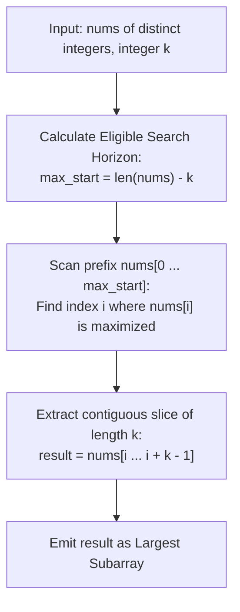

# Guided Example: Largest Subarray Length K

We analyze lexicographical subarray comparison, prove the Distinct Element Prefix Extremum Theorem and the First-Element Dominance Invariant, and trace optimal subarray extraction across representative integer arrays:

- **Representative Instance 1 (Interior Peak Candidate):**
  - Input: `nums = [1, 4, 5, 2, 3]`, $k = 3$
  - Array length: $n = 5$.
  - Target subarray length: $k = 3$.
  - Eligible starting indices: $0 \le i \le n - k \implies 0 \le i \le 2$.
  - Inspecting candidate subarrays of length $3$:
    - Starting at $i = 0$: `[1, 4, 5]` (leading element: $1$).
    - Starting at $i = 1$: `[4, 5, 2]` (leading element: $4$).
    - Starting at $i = 2$: `[5, 2, 3]` (leading element: $5$).
  - Comparing leading elements: $\max(1, 4, 5) = 5$ at index $i = 2$.
  - Because all elements are distinct, the subarray starting with $5$ is strictly larger than any other candidate.
  - Subarray extracted: `[5, 2, 3]`.
  - **Required Output:** `[5, 2, 3]`.

- **Representative Instance 2 (Truncated Search Horizon):**
  - Input: `nums = [1, 4, 5, 2, 3]`, $k = 4$
  - Target length $k = 4 \implies$ eligible start indices $i \in [0, 5 - 4] = [0, 1]$.
  - Candidates:
    - Index $0$: `[1, 4, 5, 2]` (starts with $1$).
    - Index $1$: `[4, 5, 2, 3]` (starts with $4$).
    - (Notice: index $2$ has element $5$, but cannot start a subarray of length $4$ because only $3$ elements remain).
  - Maximum starting element in eligible range: $4$ at index $1$.
  - Subarray: `[4, 5, 2, 3]`.
  - **Required Output:** `[4, 5, 2, 3]`.

- **Representative Instance 3 (Single Element Subarray):**
  - Input: `nums = [1, 4, 5, 2, 3]`, $k = 1$
  - Eligible indices: $0 \le i \le 4$.
  - Global maximum element: $5$ at index $2$.
  - Subarray: `[5]`.
  - **Required Output:** `[5]`.

---

## 1. Instance & Teaching Goal

Given an array `nums` of **strictly distinct** integers and an integer $k$, find the contiguous subarray of length $k$ that is lexicographically largest. Array $A$ is lexicographically larger than array $B$ if at the first index $j$ where $A[j] \ne B[j]$, we have $A[j] > B[j]$.

```text
The First-Element Decisiveness:
  Candidate A (starts at index 0): [ 1,  4,  5 ]
  Candidate B (starts at index 1): [ 4,  5,  2 ]
  Candidate C (starts at index 2): [ 5,  2,  3 ]

  At index 0 of each candidate:
    A[0] = 1,   B[0] = 4,   C[0] = 5.
  Because all numbers in nums are DISTINCT, A[0], B[0], C[0] are ALL DIFFERENT!
  Therefore, the comparison is DECIDED IMMEDIATELY AT INDEX 0!
  No tie-breaking at index 1 or 2 is ever needed!
```

The fundamental pedagogical insights are:
1. **Uniqueness Eliminates Ties:** When all elements in `nums` are unique, any two subarrays starting at different positions $i \ne j$ satisfy $nums[i] \ne nums[j]$.
2. **First-Element Dominance:** The lexicographical comparison of any two valid subarrays of length $k$ is completely determined by their very first elements.
3. **Horizon Constraint:** A valid subarray of length $k$ must start at an index $i \le n - k$. Thus, the problem reduces to finding the index of the maximum element in the prefix slice $nums[0 \dots n - k]$.

---

## 2. Conceptual Foundation & Structural Theorems



### The Distinct Element Prefix Extremum Theorem

Let $nums$ be an array of $n$ distinct integers. Let $\mathcal{S}_k = \{ nums[i \dots i + k - 1] \mid 0 \le i \le n - k \}$ be the set of all legal contiguous subarrays of length $k$.

> **Theorem (First-Element Dominance Invariant).**
> For any two distinct subarrays $A = nums[a \dots a + k - 1]$ and $B = nums[b \dots b + k - 1]$ in $\mathcal{S}_k$ with $a \ne b$:
> $$
> A >_{\text{lex}} B \iff nums[a] > nums[b]
> $$
> Consequently, the unique lexicographically largest subarray in $\mathcal{S}_k$ is the one starting at index $i^*$:
> $$
> i^* = \arg\max_{0 \le i \le n - k} nums[i]
> $$

*Proof.*
1. Subarrays $A$ and $B$ begin at indices $a$ and $b$ respectively.
2. Because all elements of $nums$ are pairwise distinct and $a \ne b$, we have $nums[a] \ne nums[b]$.
3. In lexicographical comparison, the two sequences are compared starting from the first position $0$. Since $A[0] = nums[a]$ and $B[0] = nums[b]$, the very first position already differs ($A[0] \ne B[0]$).
4. By the definition of lexicographical ordering, $A >_{\text{lex}} B$ if and only if $A[0] > B[0] \iff nums[a] > nums[b]$.
5. To maximize the subarray lexicographically, we must maximize its leading element $nums[i]$ over all valid starting indices $0 \le i \le n - k$. $\blacksquare$

---

## 3. Step-by-Step Worked Execution

### Trace on Representative Instance 1 (`nums = [1, 4, 5, 2, 3]`, $k = 3$)

- Total elements: $n = 5$.
- Target length: $k = 3$.
- Valid start index range: $0 \le i \le 5 - 3 = 2$.
- Prefix subarray to examine: $nums[0 \dots 2] = [1, 4, 5]$.

#### Step 1: Scan for Maximum Element in Prefix
- Index $0$: value $1$. Current max $= 1$, best index $= 0$.
- Index $1$: value $4$. Since $4 > 1$, current max $= 4$, best index $= 1$.
- Index $2$: value $5$. Since $5 > 4$, current max $= 5$, best index $= 2$.
- Optimal start index: $i^* = 2$.

#### Step 2: Slice Subarray of Length $k = 3$
- Starting at index $i^* = 2$:
  - Take elements from index $2$ to $2 + 3 - 1 = 4$:
  - Elements: $nums[2] = 5, nums[3] = 2, nums[4] = 3$.
- Extracted subarray: `[5, 2, 3]`.

---

## 4. Complete Execution Trace

| Input Array `nums` | Length $k$ | Eligible Starting Range $[0, n - k]$ | Values in Search Window | Max Element Found | Optimal Start Index $i^*$ | Extracted Subarray `nums[i* : i* + k]` |
|---|---|---|---|---|---|---|
| `[1, 4, 5, 2, 3]` | $3$ | $[0, 2]$ | `[1, 4, 5]` | $5$ | $2$ | **`[5, 2, 3]`** |
| `[1, 4, 5, 2, 3]` | $4$ | $[0, 1]$ | `[1, 4]` | $4$ | $1$ | **`[4, 5, 2, 3]`** |
| `[1, 4, 5, 2, 3]` | $1$ | $[0, 4]$ | `[1, 4, 5, 2, 3]` | $5$ | $2$ | **`[5]`** |
| `[7, 2, 9, 4, 8]` | $2$ | $[0, 3]$ | `[7, 2, 9, 4]` | $9$ | $2$ | **`[9, 4]`** |

---

## 5. Algorithmic Correctness

**Soundness.**
The Distinct Element Prefix Extremum Theorem establishes that no pair of subarrays of length $k$ can have matching leading elements. Therefore, maximizing the first element guarantees that the resulting subarray is lexicographically greater than all other candidates.

**Completeness.**
The search range $0 \le i \le n - k$ covers every starting position that has at least $k$ elements remaining in the array. No valid candidate is excluded.

---

## 6. Traps This Instance Exposes

- **Searching Past $n - k$:** Finding the global maximum of the entire array without bounding the search by $n - k$ can pick an element too close to the end (e.g. index $n - 1$), where fewer than $k$ elements remain to form a valid subarray.
- **Assuming Follow-up with Duplicates:** If duplicate integers were permitted, ties at the first element would require comparing subsequent elements, requiring suffix arrays or the Duval algorithm. However, under the problem's explicit guarantee that all elements are unique, the single-element linear scan is both necessary and sufficient.

---

## 7. Complexity Derivation

- **Time Complexity:**
  - Finding the maximum element in the slice $nums[0 \dots n - k]$ takes $\mathcal{O}(n - k + 1)$ comparisons.
  - Slicing $k$ elements to form the output array takes $\mathcal{O}(k)$ operations.
  - Total Time: $\mathcal{O}(n)$, running in $< 20$ ms for $n = 10^5$.
- **Auxiliary Space Complexity:**
  - Finding the maximum element requires $\mathcal{O}(1)$ auxiliary variables.
  - Output array requires $\mathcal{O}(k)$ space.
  - Total Auxiliary Space: $\mathcal{O}(k)$ memory.
