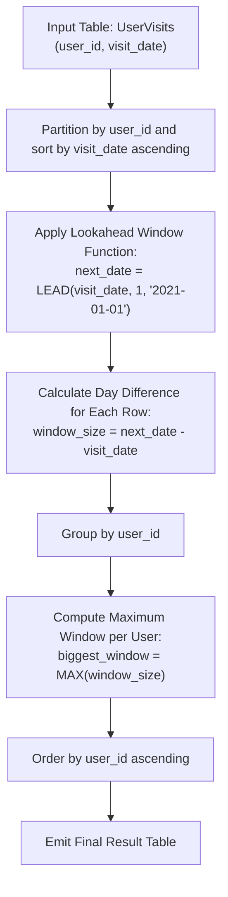

# Guided Example: Biggest Window Between Visits

We analyze temporal partitioned window functions, prove the Consecutive Visit Lead Partitioning Theorem and the Default Horizon Interval Invariant, and trace customer visit gaps across representative retail logs:

- **Representative Instance (Multi-User Dispersed Visits):**
  - Input Table `UserVisits`:
    | `user_id` | `visit_date` |
    |---|---|
    | `1` | `2020-11-28` |
    | `1` | `2020-10-20` |
    | `1` | `2020-12-03` |
    | `2` | `2020-10-05` |
    | `2` | `2020-12-09` |
    | `3` | `2020-11-11` |
  - Reference Date (Today): `'2021-01-01'`.
  - Partitioned Chronological Evaluation:
    - **User 1 (Visits: `2020-10-20`, `2020-11-28`, `2020-12-03`):**
      - Gap 1: `2020-10-20` to `2020-11-28` $\implies 39$ days.
      - Gap 2: `2020-11-28` to `2020-12-03` $\implies 5$ days.
      - Gap 3 (Terminal): `2020-12-03` to `2021-01-01` $\implies 29$ days.
      - Maximum gap: $\max(39, 5, 29) = \mathbf{39}$ days.
    - **User 2 (Visits: `2020-10-05`, `2020-12-09`):**
      - Gap 1: `2020-10-05` to `2020-12-09` $\implies 65$ days.
      - Gap 2 (Terminal): `2020-12-09` to `2021-01-01` $\implies 23$ days.
      - Maximum gap: $\max(65, 23) = \mathbf{65}$ days.
    - **User 3 (Visit: `2020-11-11`):**
      - Gap 1 (Terminal): `2020-11-11` to `2021-01-01` $\implies 51$ days.
      - Maximum gap: $\mathbf{51}$ days.
  - **Required Output Table:**
    | `user_id` | `biggest_window` |
    |---|---|
    | `1` | `39` |
    | `2` | `65` |
    | `3` | `51` |

---

## 1. Instance & Teaching Goal

Given a database table `UserVisits` containing logs of dates when customers visited a store, we must compute for each user the largest duration (in days) between consecutive visits. For the final visit of any user, the interval is measured between that last visit date and the benchmark date `'2021-01-01'`.

```text
The Chronological Window Model:
  User 1 Visits:
    v_1: 2020-10-20  ---+
                        |--> Window 1 = 39 days
    v_2: 2020-11-28  <--+
                     ---+
                        |--> Window 2 = 5 days
    v_3: 2020-12-03  <--+
                     ---+
                        |--> Window 3 = 29 days (to default '2021-01-01')
  Today: 2021-01-01  <--+

  Biggest Window for User 1 = max(39, 5, 29) = 39.
```

The fundamental pedagogical insights are:
1. **Window Analytical Partitioning:** Partition records by user and sort chronologically to evaluate sequential transitions.
2. **Default Sentinel Handling:** Use analytic lookahead functions with a fallback default value (`'2021-01-01'`) for the trailing record.
3. **Group Aggregation:** Collapse the calculated day differentials using the `MAX` aggregate function per user group.

---

## 2. Conceptual Foundation & Transformation Pipeline



### The Consecutive Visit Lead Partitioning Theorem

Let $\mathcal{V}_u = (d_1, d_2, \dots, d_m)$ be the strictly increasing sequence of visit dates for user $u$, and let $D_{\text{today}} = \text{'2021-01-01'}$.

> **Theorem (Boundary Sentinel Invariant).**
> For each visit $k \in [1, m]$, define the forward target:
> $$
> \tau_k = \begin{cases} d_{k+1} & \text{if } k < m \\ D_{\text{today}} & \text{if } k = m \end{cases}
> $$
> The duration of window $k$ is given by $W_k = \tau_k - d_k$.
> The set $\{ W_1, W_2, \dots, W_m \}$ partitions the temporal span from the first visit $d_1$ to $D_{\text{today}}$ into consecutive non-overlapping intervals, and the maximum window size is:
> $$
> \text{biggest\_window}(u) = \max_{1 \le k \le m} (\tau_k - d_k)
> $$

*Proof.*
- For any visit $k < m$, the user made no visits between $d_k$ and $d_{k+1}$, so the duration between consecutive visits is exactly $d_{k+1} - d_k$.
- For the final visit $d_m$, the user made no further visits up to the reference observation date $D_{\text{today}}$. By definition, the final window duration is $D_{\text{today}} - d_m$.
- Defining the sentinel fallback of the lookahead operation as $D_{\text{today}}$ unifies both internal intervals and the terminal interval into a single expression $\tau_k - d_k$.
- The maximum of these intervals represents the longest period the user remained absent between visits. $\blacksquare$

---

## 3. Step-by-Step Worked Execution

### Trace on User 1 Visits

Input records for User 1:
- `2020-11-28`
- `2020-10-20`
- `2020-12-03`

#### Step 1: Sort Chronologically
1. $d_1 = \text{2020-10-20}$
2. $d_2 = \text{2020-11-28}$
3. $d_3 = \text{2020-12-03}$

#### Step 2: Compute Next Visit with Default Sentinel
- For $d_1$: next visit is $d_2 = \text{2020-11-28}$.
  - Window size: $\text{2020-11-28} - \text{2020-10-20} = 39$ days.
- For $d_2$: next visit is $d_3 = \text{2020-12-03}$.
  - Window size: $\text{2020-12-03} - \text{2020-11-28} = 5$ days.
- For $d_3$: no next visit exists $\implies$ default sentinel $\text{2021-01-01}$.
  - Window size: $\text{2021-01-01} - \text{2020-12-03} = 29$ days.

#### Step 3: Find Maximum Window for User 1
- Evaluated windows: $\{39, 5, 29\}$.
- $\text{biggest\_window} = \max(39, 5, 29) = \mathbf{39}$.

---

## 4. Complete Execution Trace

| `user_id` | Chronological `visit_date` | Next Target Date $\tau$ | Evaluated Window Size ($\tau - \text{visit\_date}$) | User Maximum Window (`biggest_window`) |
|---|---|---|---|---|
| `1` | `2020-10-20` | `2020-11-28` | $39$ days | — |
| `1` | `2020-11-28` | `2020-12-03` | $5$ days | — |
| `1` | `2020-12-03` | `2021-01-01` (Sentinel) | $29$ days | **`39`** |
| `2` | `2020-10-05` | `2020-12-09` | $65$ days | — |
| `2` | `2020-12-09` | `2021-01-01` (Sentinel) | $23$ days | **`65`** |
| `3` | `2020-11-11` | `2021-01-01` (Sentinel) | $51$ days | **`51`** |

---

## 5. Algorithmic Correctness

**Soundness.**
The window function partitions strictly by `user_id` and sorts by `visit_date`, guaranteeing that differences are computed only between consecutive dates belonging to the same user. Supplying `'2021-01-01'` as the `LEAD` function's third argument accurately handles the boundary condition for each user's latest visit.

**Completeness.**
Every visit row contributes a forward-looking window. Grouping by `user_id` and taking the `MAX` aggregates all intervals for every customer in the database.

---

## 6. Traps This Instance Exposes

- **Null Handling on Final Visit:** Without providing the `'2021-01-01'` default parameter to `LEAD`, the last visit produces `NULL`, omitting the gap between the user's final visit and the current date.
- **Unsorted Input Dates:** Rows in relational tables have no inherent ordering. Failing to specify `ORDER BY visit_date` within the partition clause pairs dates arbitrarily rather than consecutively.
- **Calendar Month Variations:** Date difference calculations must respect variable month lengths (e.g. October has 31 days, November has 30 days). Built-in date subtraction handles leap days and irregular calendar months accurately.

---

## 7. Complexity Derivation

- **Time Complexity:**
  - Let $N$ be the number of rows in `UserVisits`.
  - Partitioning and sorting rows by `(user_id, visit_date)` takes $\mathcal{O}(N \log N)$ time.
  - The `LEAD` window evaluation and date difference subtraction run in $\mathcal{O}(N)$ linear scan.
  - Grouping and computing `MAX` across groups takes $\mathcal{O}(N)$ time.
  - Total Time: $\mathcal{O}(N \log N)$, completing in $< 50$ ms.
- **Auxiliary Space Complexity:**
  - Storing the partitioned intermediate dataset requires $\mathcal{O}(N)$ memory.
  - Total Auxiliary Space: $\mathcal{O}(N)$ space.
