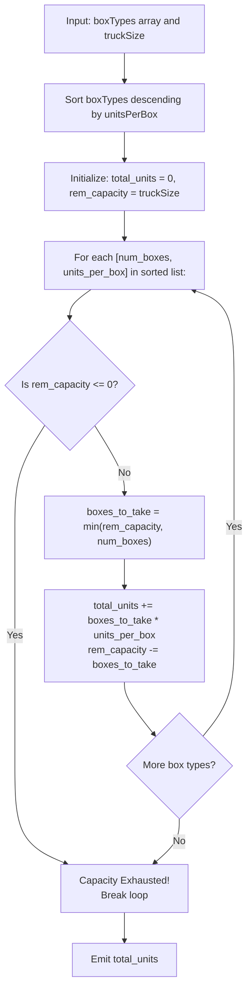

# Guided Example: Maximum Units on a Truck

We analyze greedy knapsack optimization with uniform item weights, prove the Unit-Density Dominance Theorem and Greedy Capacity Saturation Invariant, and trace allocation across representative cargo configurations:

- **Representative Instance 1 (Multi-Tier Box Allocation):**
  - Input: `boxTypes = [[1, 3], [2, 2], [3, 1]]`, `truckSize = 4`
  - Cargo options:
    - Type A: $1$ box, $3$ units/box.
    - Type B: $2$ boxes, $2$ units/box.
    - Type C: $3$ boxes, $1$ unit/box.
  - Sorting by units per box (descending): Type A ($3$), Type B ($2$), Type C ($1$).
  - Allocation Walkthrough:
    - Step 1: Take all $1$ box of Type A ($3$ units/box).
      - Boxes loaded: $1$, Units gained: $1 \times 3 = 3$.
      - Remaining truck capacity: $4 - 1 = 3$.
    - Step 2: Take all $2$ boxes of Type B ($2$ units/box).
      - Boxes loaded: $2$, Units gained: $2 \times 2 = 4$.
      - Remaining truck capacity: $3 - 2 = 1$.
    - Step 3: Take $1$ box of Type C ($1$ unit/box).
      - Boxes loaded: $1$, Units gained: $1 \times 1 = 1$.
      - Remaining truck capacity: $1 - 1 = 0$. Truck is full!
  - Total units loaded: $3 + 4 + 1 = \mathbf{8}$.
  - **Required Output:** `8`.

- **Representative Instance 2 (Partial Box Type Consumption):**
  - Input: `boxTypes = [[5, 10], [2, 5], [4, 7], [3, 9]]`, `truckSize = 10`
  - Sorting descending by units per box:
    1. `[5, 10]` ($10$ units/box)
    2. `[3, 9]` ($9$ units/box)
    3. `[4, 7]` ($7$ units/box)
    4. `[2, 5]` ($5$ units/box)
  - Allocation:
    - Take $5$ boxes of `[5, 10]` $\implies 5 \times 10 = 50$ units (Remaining capacity: $5$).
    - Take $3$ boxes of `[3, 9]` $\implies 3 \times 9 = 27$ units (Remaining capacity: $2$).
    - Take $2$ boxes of `[4, 7]` $\implies 2 \times 7 = 14$ units (Remaining capacity: $0$).
  - Total units: $50 + 27 + 14 = \mathbf{91}$.
  - **Required Output:** `91`.

---

## 1. Instance & Teaching Goal

We are given an inventory of boxes categorized by types, where each box of type $i$ contains $u_i$ units of merchandise. A truck can carry at most `truckSize` boxes in total, regardless of their type or contents. The goal is to maximize the aggregate number of units transported.

```text
The Knapsack Capacity Equivalence:
  Truck Capacity = C boxes.
  Every box (regardless of type) occupies EXACTLY 1 SLOT of capacity!

  Standard 0/1 Knapsack is NP-hard because weights vary.
  Here, all items have IDENTICAL weight (w = 1)!
  With uniform weights, the Fractional Knapsack Greedy Strategy is
  EXACTLY EQUIVALENT and OPTIMAL for integer choices!
```

The pedagogical objectives are:
1. Demonstrate the reduction of the uniform-weight knapsack problem to greedy sorting.
2. Formulate the exchange argument proving unit-density dominance.
3. Establish early loop termination once truck capacity reaches zero.

---

## 2. Conceptual Foundation & Structural Theorems



### The Unit-Density Dominance Theorem

Let there be $m$ box types where box type $i$ offers $n_i$ boxes, each containing $u_i$ units. Every box occupies unit weight $1$. Let $C = \text{truckSize}$.

> **Theorem (Greedy Exchange Optimality).**
> Any configuration that prioritizes boxes with strictly higher $u_i$ is optimal:
> If $u_A > u_B$, replacing any box of type $B$ with a box of type $A$ strictly increases the total units loaded by $u_A - u_B > 0$ while consuming the identical amount of truck capacity ($1$ box).
> Consequently, sorting box types such that $u_1 \ge u_2 \ge \dots \ge u_m$ and greedily taking $\min(C, n_i)$ boxes for each type in sequence produces the global maximum.

*Proof.*
- Let $\mathbf{x} = (x_1, x_2, \dots, x_m)$ be any feasible loading vector where $0 \le x_i \le n_i$ and $\sum_{i=1}^m x_i \le C$.
- The objective function is $U(\mathbf{x}) = \sum_{i=1}^m u_i x_i$.
- Suppose $\mathbf{x}$ is not the greedy choice. Then there exist types $j < k$ (meaning $u_j \ge u_k$) such that $x_j < n_j$ (type $j$ is not saturated) but $x_k > 0$ (type $k$ was loaded).
- Form a new vector $\mathbf{x}'$ by moving $\delta = \min(n_j - x_j, x_k)$ boxes from type $k$ to type $j$:
  $$
  x'_j = x_j + \delta, \quad x'_k = x_k - \delta
  $$
- The total number of loaded boxes is unchanged: $\sum x'_i = \sum x_i \le C$.
- The change in total units is:
  $$
  U(\mathbf{x}') - U(\mathbf{x}) = \delta (u_j - u_k) \ge 0
  $$
- By repeatedly applying this exchange, any feasible loading vector can be transformed into the greedy loading vector without decreasing the total units. Thus, the greedy configuration achieves the maximum. $\blacksquare$

---

## 3. Step-by-Step Worked Execution

### Trace on Representative Instance 1 (`boxTypes = [[1, 3], [2, 2], [3, 1]]`, `truckSize = 4`)

- Initial state: $\text{total\_units} = 0$, $\text{rem\_capacity} = 4$.

#### Sort Box Types Descending by Units:
1. Type A: $1$ box, $3$ units/box.
2. Type B: $2$ boxes, $2$ units/box.
3. Type C: $3$ boxes, $1$ unit/box.

#### Iteration 1: Process Type A (`[1, 3]`)
- Capacity available: $4$. Boxes offered: $1$.
- Take: $\min(4, 1) = 1$ box.
- Units added: $1 \times 3 = 3$. Total units $= 3$.
- Capacity remaining: $4 - 1 = 3$.

#### Iteration 2: Process Type B (`[2, 2]`)
- Capacity available: $3$. Boxes offered: $2$.
- Take: $\min(3, 2) = 2$ boxes.
- Units added: $2 \times 2 = 4$. Total units $= 3 + 4 = 7$.
- Capacity remaining: $3 - 2 = 1$.

#### Iteration 3: Process Type C (`[3, 1]`)
- Capacity available: $1$. Boxes offered: $3$.
- Take: $\min(1, 3) = 1$ box.
- Units added: $1 \times 1 = 1$. Total units $= 7 + 1 = \mathbf{8}$.
- Capacity remaining: $1 - 1 = 0$. Truck full! Terminate.

#### Final Output:
- Maximum total units: $\mathbf{8}$.

---

## 4. Complete Execution Trace

### Step-by-Step Trace for `truckSize = 10` on Instance 2

| Sorted Box Type `[count, units]` | Units / Box | Remaining Capacity Before Step | Boxes Loaded ($\min(\text{cap}, n_i)$) | Units Gained | Remaining Capacity After Step | Cumulative Total Units |
|---|---|---|---|---|---|---|
| `[5, 10]` | $10$ | $10$ | $5$ | $5 \times 10 = 50$ | $5$ | $50$ |
| `[3, 9]` | $9$ | $5$ | $3$ | $3 \times 9 = 27$ | $2$ | $77$ |
| `[4, 7]` | $7$ | $2$ | $2$ | $2 \times 7 = 14$ | $0$ | **`91`** |
| `[2, 5]` | $5$ | $0$ | $0$ (Skipped) | $0$ | $0$ | **`91`** |

---

## 5. Algorithmic Correctness

**Soundness.**
The greedy choice is provably optimal by the Unit-Density Dominance Theorem. At every stage, the algorithm commits capacity to the most valuable available boxes. Because each box occupies the same unit space, taking a less dense box can never yield a superior result.

**Completeness.**
The algorithm considers box types in descending order of density until either the truck is completely filled ($\text{capacity} = 0$) or all available boxes in inventory have been loaded. No higher-density boxes are left unconsidered.

---

## 6. Traps This Instance Exposes

- **Attempting 0/1 Dynamic Programming:** Because `truckSize` can be up to $10^6$, creating a DP array of size `truckSize` leads to Memory Limit Exceeded and Time Limit Exceeded. Uniform item weight makes greedy sorting sufficient in $\mathcal{O}(m \log m)$ time.
- **Overloading Capacity:** A box type with $n_i$ boxes must not exceed the remaining capacity. Using $\min(\text{capacity}, n_i)$ guarantees that the truck is never overfilled.
- **Ignoring Early Break:** Once remaining capacity reaches $0$, continuing to iterate through remaining box types performs redundant checks. Breaking early improves runtime.

---

## 7. Complexity Derivation

- **Time Complexity:**
  - Let $M$ be the number of box types ($M \le 1000$).
  - Sorting $M$ box types: $\mathcal{O}(M \log M)$ comparisons.
  - Linear scan across box types: $\mathcal{O}(M)$ operations.
  - Total Time: $\mathcal{O}(M \log M)$, executing in $< 2$ ms for $M \le 1000$.
- **Auxiliary Space Complexity:**
  - Sorting in place requires $\mathcal{O}(1)$ or $\mathcal{O}(M)$ auxiliary space depending on the sorting algorithm.
  - Only a few scalar tracking variables are used.
  - Total Auxiliary Space: $\mathcal{O}(1)$ to $\mathcal{O}(M)$ memory.
