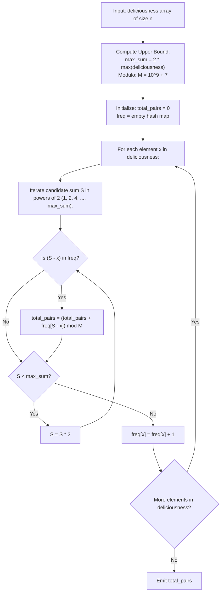

# Guided Example: Count Good Meals

We analyze bounded target complement frequency hashing, prove the Powers-of-Two Complement Enumeration Theorem and Online Pair Counting Invariant, and trace good meal pair evaluations across representative deliciousness arrays:

- **Representative Instance 1 (Distinct Delicacies with Multiple Sum Targets):**
  - Input: `deliciousness = [1, 3, 5, 7, 9]`
  - Maximum value in array: $9 \implies$ maximum pairwise sum: $9 + 9 = 18 \le 2^5 = 32$.
  - Candidate powers of two: $\{1, 2, 4, 8, 16\}$.
  - Online Traversal with Frequency Hash Map:
    - **Element 1:**
      - Targets: $1, 2, 4, 8, 16$.
      - Complements in map: none. Map adds `1: 1`.
    - **Element 3:**
      - Targets: $4 - 3 = 1$ (found $1$ in map!), others not found.
      - Pairs formed: $(1, 3)$ with sum $4 = 2^2$. Running pairs: $\mathbf{1}$.
      - Map adds `3: 1`.
    - **Element 5:**
      - Targets: $8 - 5 = 3$ (found $3$ in map!).
      - Pairs formed: $(3, 5)$ with sum $8 = 2^3$. Running pairs: $1 + 1 = \mathbf{2}$.
      - Map adds `5: 1`.
    - **Element 7:**
      - Targets: $8 - 7 = 1$ (found $1$ in map!).
      - Pairs formed: $(1, 7)$ with sum $8 = 2^3$. Running pairs: $2 + 1 = \mathbf{3}$.
      - Map adds `7: 1`.
    - **Element 9:**
      - Targets: $16 - 9 = 7$ (found $7$ in map!).
      - Pairs formed: $(7, 9)$ with sum $16 = 2^4$. Running pairs: $3 + 1 = \mathbf{4}$.
      - Map adds `9: 1`.
  - Total good meal pairs: $\mathbf{4}$.
  - **Required Output:** `4`.

- **Representative Instance 2 (Multi-Item Duplicate Complements):**
  - Input: `deliciousness = [1, 1, 1, 3, 3, 3, 7]`
  - Pairs with sum $2$ ($1 + 1$): $\binom{3}{2} = 3$ ways.
  - Pairs with sum $4$ ($1 + 3$): $3 \times 3 = 9$ ways.
  - Pairs with sum $8$ ($1 + 7$): $3 \times 1 = 3$ ways.
  - Total valid combinations: $3 + 9 + 3 = \mathbf{15}$.
  - **Required Output:** `15`.

---

## 1. Instance & Teaching Goal

A good meal consists of picking two food items at distinct indices $(i, j)$ with $i < j$ such that the sum of their deliciousness ratings is an exact power of two ($2^0, 2^1, 2^2, \dots$). We must find the total number of good meals modulo $10^9 + 7$.

```text
The Search-Space Pruning Insight:
  Each item deliciousness[i] <= 2^20.
  The maximum possible sum of two items is 2^20 + 2^20 = 2^21.

  Powers of two in range [0, 2^21]:
    2^0 = 1,  2^1 = 2,  2^2 = 4,  ...,  2^21 = 2097152.
    There are EXACTLY 22 CANDIDATE POWERS OF TWO!

  For each element x, instead of comparing against all other n elements (O(n^2)),
  we only query the frequency of 22 possible complements:
    target = 2^k - x  for k in {0, 1, ..., 21}
```

The fundamental pedagogical insights are:
1. **Target Bound Invariant:** Upper-bound the powers of two using $2 \cdot \max(\text{deliciousness}) \le 2^{21}$, restricting candidate targets to a small constant $K \le 22$.
2. **One-Pass Online Frequency Map:** By probing the hash map before inserting the current element, each pair $(i, j)$ with $i < j$ is counted exactly once without self-pairing or duplicate inversions.
3. **Modular Arithmetic Integration:** Apply modulo $10^9 + 7$ at each addition step.

---

## 2. Conceptual Foundation & Structural Theorems



### The Powers-of-Two Complement Enumeration Theorem

Let $A = [a_0, a_1, \dots, a_{n-1}]$ be an array of integers with $0 \le a_i \le 2^{20}$.
Let $\mathcal{P} = \{ 2^0, 2^1, 2^2, \dots, 2^{21} \}$ be the set of eligible powers of two.

> **Theorem (Constant Complement Upper Bound).**
> For any element $a_j$, an earlier element $a_i$ ($i < j$) forms a valid pair with $a_j$ if and only if:
> $$
> a_i \in \{ S - a_j \mid S \in \mathcal{P} \text{ and } S \ge a_j \}
> $$
> Since $|\mathcal{P}| \le 22$, the number of possible complement values for any $a_j$ is bounded by $22$, allowing all valid pairs with second element $a_j$ to be found in $\mathcal{O}(1)$ time.

*Proof.*
- The sum of two elements is $a_i + a_j$. Since $a_i \ge 0$ and $a_j \ge 0$, we have $a_i + a_j \ge 0$.
- The maximum possible value of any element is $2^{20}$, so $a_i + a_j \le 2^{20} + 2^{20} = 2^{21}$.
- Thus, any sum that is a power of two must belong to $\mathcal{P} = \{ 2^0, 2^1, \dots, 2^{21} \}$.
- The cardinality of $\mathcal{P}$ is exactly $22$.
- For a fixed $a_j$ and fixed power $S \in \mathcal{P}$, the required value of $a_i$ is uniquely determined as $a_i = S - a_j$.
- By storing previously seen elements in a hash map, looking up the count of $S - a_j$ across all $22$ values of $S$ takes at most $22 \cdot \mathcal{O}(1) = \mathcal{O}(1)$ time. $\blacksquare$

---

## 3. Step-by-Step Worked Execution

### Trace on Representative Instance 1 (`deliciousness = [1, 3, 5, 7, 9]`)

Initialize $\text{total\_pairs} = 0$, `freq` $= \{\}$.
Candidate powers of two up to $18$: $\mathcal{P} = \{1, 2, 4, 8, 16\}$.

#### Element $0$ ($x = 1$):
- Complements checked: $1 - 1 = 0$, $2 - 1 = 1$, $4 - 1 = 3$, $8 - 1 = 7$, $16 - 1 = 15$.
- None exist in `freq`. $\text{total\_pairs} = 0$.
- Record $x = 1$: `freq` $= \{1: 1\}$.

#### Element $1$ ($x = 3$):
- Complements checked:
  - $S = 4 \implies 4 - 3 = 1$. Count in `freq` is $1$!
  - Other powers yield no matches.
- Pairs added: $+1$. $\text{total\_pairs} = 1$.
- Record $x = 3$: `freq` $= \{1: 1, 3: 1\}$.

#### Element $2$ ($x = 5$):
- Complements checked:
  - $S = 8 \implies 8 - 5 = 3$. Count in `freq` is $1$!
- Pairs added: $+1$. $\text{total\_pairs} = 2$.
- Record $x = 5$: `freq` $= \{1: 1, 3: 1, 5: 1\}$.

#### Element $3$ ($x = 7$):
- Complements checked:
  - $S = 8 \implies 8 - 7 = 1$. Count in `freq` is $1$!
- Pairs added: $+1$. $\text{total\_pairs} = 3$.
- Record $x = 7$: `freq` $= \{1: 1, 3: 1, 5: 1, 7: 1\}$.

#### Element $4$ ($x = 9$):
- Complements checked:
  - $S = 16 \implies 16 - 9 = 7$. Count in `freq` is $1$!
- Pairs added: $+1$. $\text{total\_pairs} = \mathbf{4}$.
- Record $x = 9$: `freq` $= \{1: 1, 3: 1, 5: 1, 7: 1, 9: 1\}$.

#### Final Output:
- Total valid good meal pairs: $\mathbf{4}$.

---

## 4. Complete Execution Trace

| Processing Index $j$ | Element $x = deliciousness[j]$ | Matching Powers $S$ | Required Complement $S - x$ | Matches in Prior History `freq` | Updated Total Pairs |
|---|---|---|---|---|---|
| $0$ | $1$ | None | — | $0$ | $0$ |
| $1$ | $3$ | $4$ ($2^2$) | $1$ | $1$ (at index $0$) | **`1`** |
| $2$ | $5$ | $8$ ($2^3$) | $3$ | $1$ (at index $1$) | **`2`** |
| $3$ | $7$ | $8$ ($2^3$) | $1$ | $1$ (at index $0$) | **`3`** |
| $4$ | $9$ | $16$ ($2^4$) | $7$ | $1$ (at index $3$) | **`4`** |

---

## 5. Algorithmic Correctness

**Soundness.**
Every pair counted has a sum equal to an evaluated power of two $S$. Because an element $a_j$ is only paired with elements already present in the frequency map, every pair satisfies $i < j$. An element is never paired with itself.

**Completeness.**
Every power of two $S \in [1, 2^{21}]$ is checked for each element. Since $a_i, a_j \ge 0$, no sum can be negative, and no sum can exceed $2 \cdot 2^{20} = 2^{21}$. Therefore, all possible valid pairs are captured.

---

## 6. Traps This Instance Exposes

- **Power of Two with Zero Elements:** Deliciousness values can be $0$. A pair $(0, 2^k)$ produces sum $2^k$, which is a valid power of two. Setting the minimum power to $2^0 = 1$ correctly finds $1 - 0 = 1, 2 - 0 = 2$, etc. However, two zeros produce $0 + 0 = 0$, which is NOT a power of two ($2^k > 0$ for all integers $k$).
- **Double Counting Symmetric Pairs:** If frequency counts are collected first and all pairs $(a, b)$ are queried globally, pairs with $a \ne b$ are counted twice, and pairs with $a == b$ require combinations $\binom{count}{2}$. The online insertion method eliminates this by counting only backward-looking pairs.
- **Modulus Application:** Because the answer can reach $\binom{10^5}{2} \approx 5 \cdot 10^9$, applying modulo $10^9 + 7$ inside the loop prevents 32-bit integer overflow.

---

## 7. Complexity Derivation

- **Time Complexity:**
  - Outer loop runs $n$ times for each element in `deliciousness`.
  - Inner loop tests at most $22$ powers of two ($2^0$ to $2^{21}$).
  - Hash map lookup and insertion take $\mathcal{O}(1)$ average time.
  - Total Time: $\mathcal{O}(22 \cdot n) = \mathcal{O}(n)$ operations, executing in $< 75$ ms for $n = 10^5$.
- **Auxiliary Space Complexity:**
  - The frequency hash map stores at most $n$ distinct deliciousness values.
  - Total Auxiliary Space: $\mathcal{O}(n)$ memory.
