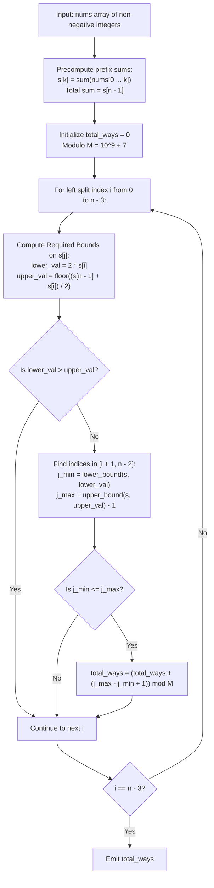

# Guided Example: Ways to Split Array Into Three Subarrays

We analyze prefix sum inequalities, prove the Prefix Sum Monotonicity Theorem and Dual-Boundary Binary Search Interval Invariant, and count valid three-way partitions across representative non-negative integer arrays:

- **Representative Instance 1 (Minimal Uniform Array):**
  - Input: `nums = [1, 1, 1]`
  - Length: $n = 3$. Prefix sums: $s = [1, 2, 3]$.
  - Subarray splits must have at least one element each.
  - Only one valid partition exists:
    - `left` $= [1]$ (sum $1$)
    - `mid` $= [1]$ (sum $1$)
    - `right` $= [1]$ (sum $1$)
  - Inequality verification: $1 \le 1 \le 1$ (Satisfied).
  - Valid ways: $\mathbf{1}$.
  - **Required Output:** `1`.

- **Representative Instance 2 (Multi-Option Partition with Trailing Zero):**
  - Input: `nums = [1, 2, 2, 2, 5, 0]`
  - Length: $n = 6$. Prefix sums: $s = [1, 3, 5, 7, 12, 12]$. Total sum: $12$.
  - Three valid splits identified:
    - Split 1: `left` $= [1]$ ($s=1$), `mid` $= [2]$ ($s=2$), `right` $= [2, 2, 5, 0]$ ($s=9$). ($1 \le 2 \le 9$).
    - Split 2: `left` $= [1]$ ($s=1$), `mid` $= [2, 2]$ ($s=4$), `right` $= [2, 5, 0]$ ($s=7$). ($1 \le 4 \le 7$).
    - Split 3: `left` $= [1, 2]$ ($s=3$), `mid` $= [2, 2]$ ($s=4$), `right` $= [5, 0]$ ($s=5$). ($3 \le 4 \le 5$).
  - Total valid ways: $\mathbf{3}$.
  - **Required Output:** `3`.

- **Representative Instance 3 (Infeasible Decreasing Structure):**
  - Input: `nums = [3, 2, 1]`
  - Subarray partitions:
    - Only split is `[3], [2], [1]`.
    - Sums: $3, 2, 1 \implies 3 \not\le 2$ (Violated).
  - Total valid ways: $\mathbf{0}$.
  - **Required Output:** `0`.

---

## 1. Instance & Teaching Goal

Given an array `nums` of non-negative integers, we must divide it into three non-empty contiguous subarrays `left`, `mid`, and `right` such that:
$$
\text{sum}(\text{left}) \le \text{sum}(\text{mid}) \le \text{sum}(\text{right})
$$
We want to determine the number of valid pairs of split points $(i, j)$ modulo $10^9 + 7$.

```text
The Partitioning Indices:
  Array indices:   0  ...  i  |  i+1  ...  j  |  j+1  ...  n-1
  Subarrays:      [   left   ]  [    mid     ]  [    right    ]
  Prefix Sums:         s[i]          s[j]             s[n-1]

  Subarray Sums in Terms of Prefix Sums:
    sum(left)  = s[i]
    sum(mid)   = s[j] - s[i]
    sum(right) = s[n-1] - s[j]

  Two Inequality Constraints:
    1. sum(left) <= sum(mid)   <=>  s[i] <= s[j] - s[i]       <=>  s[j] >= 2 * s[i]
    2. sum(mid) <= sum(right)  <=>  s[j] - s[i] <= s[n-1] - s[j]  <=>  2 * s[j] <= s[n-1] + s[i]
```

The pedagogical objectives are:
1. Express the three subarray sum constraints in terms of prefix sums.
2. Prove that non-negativity guarantees monotonic non-decreasing prefix sums.
3. Formulate the range of valid middle partition points $j$ as a contiguous interval $[j_{\min}, j_{\max}]$, resolved in $\mathcal{O}(\log n)$ time per left boundary $i$.

---

## 2. Conceptual Foundation & Structural Theorems



### The Prefix Sum Monotonicity Theorem

Let $A = [a_0, a_1, \dots, a_{n-1}]$ with $a_k \ge 0$ for all $k$, and let $s[k] = \sum_{t=0}^k a_t$.

> **Theorem (Monotonic Range Invariant).**
> 1. The prefix sum array is non-decreasing: $s[0] \le s[1] \le \dots \le s[n-1]$.
> 2. For a fixed left boundary $i \in [0, n - 3]$, the middle boundary $j \in [i + 1, n - 2]$ produces a valid split if and only if:
>    $$
>    2 \cdot s[i] \le s[j] \le \left\lfloor \frac{s[n - 1] + s[i]}{2} \right\rfloor
>    $$
> 3. Because $s$ is monotonic, the indices $j$ satisfying this double inequality form a contiguous integer interval $[j_{\min}, j_{\max}]$.

*Proof.*
- Monotonicity: Since $a_k \ge 0$, $s[k] = s[k-1] + a_k \ge s[k-1]$.
- Lower bound on $s[j]$:
  $$
  \text{sum}(\text{left}) \le \text{sum}(\text{mid}) \iff s[i] \le s[j] - s[i] \iff s[j] \ge 2 \cdot s[i]
  $$
- Upper bound on $s[j]$:
  $$
  \text{sum}(\text{mid}) \le \text{sum}(\text{right}) \iff s[j] - s[i] \le s[n - 1] - s[j] \iff 2 \cdot s[j] \le s[n - 1] + s[i] \iff s[j] \le \frac{s[n - 1] + s[i]}{2}
  $$
- Since $s$ is non-decreasing, the pre-image of any value interval $[\alpha, \beta]$ under $s$ is an index interval $[j_{\min}, j_{\max}]$.
- The number of valid partition points for index $i$ is precisely $\max(0, j_{\max} - j_{\min} + 1)$. $\blacksquare$

---

## 3. Step-by-Step Worked Execution

### Trace on Representative Instance 2 (`nums = [1, 2, 2, 2, 5, 0]`)

- Array length: $n = 6$.
- Prefix sums: $s = [1, 3, 5, 7, 12, 12]$.
- Total sum: $s[5] = 12$.
- Eligible left split boundary: $0 \le i \le n - 3 = 3$.
- Eligible middle split boundary: $i + 1 \le j \le n - 2 = 4$.

#### Evaluation for $i = 0$ ($s[0] = 1$):
- Target bounds for $s[j]$:
  - $\text{lower\_val} = 2 \cdot s[0] = 2 \times 1 = 2$.
  - $\text{upper\_val} = \lfloor (s[5] + s[0]) / 2 \rfloor = \lfloor (12 + 1) / 2 \rfloor = 6$.
- Need $2 \le s[j] \le 6$ for $j \in [1, 4]$.
- Values in $s[1 \dots 4]$:
  - $j = 1: s[1] = 3 \in [2, 6]$ (Valid).
  - $j = 2: s[2] = 5 \in [2, 6]$ (Valid).
  - $j = 3: s[3] = 7 > 6$ (Invalid).
  - $j = 4: s[4] = 12 > 6$ (Invalid).
- Valid $j \in [1, 2]$: contributes $2 - 1 + 1 = \mathbf{2}$ ways.

#### Evaluation for $i = 1$ ($s[1] = 3$):
- Target bounds for $s[j]$:
  - $\text{lower\_val} = 2 \cdot s[1] = 2 \times 3 = 6$.
  - $\text{upper\_val} = \lfloor (12 + 3) / 2 \rfloor = \lfloor 15 / 2 \rfloor = 7$.
- Need $6 \le s[j] \le 7$ for $j \in [2, 4]$.
- Values in $s[2 \dots 4]$:
  - $j = 2: s[2] = 5 < 6$ (Invalid).
  - $j = 3: s[3] = 7 \in [6, 7]$ (Valid).
  - $j = 4: s[4] = 12 > 7$ (Invalid).
- Valid $j \in [3, 3]$: contributes $3 - 3 + 1 = \mathbf{1}$ way.

#### Evaluation for $i = 2$ ($s[2] = 5$):
- Target bounds:
  - $\text{lower\_val} = 2 \times 5 = 10$.
  - $\text{upper\_val} = \lfloor (12 + 5) / 2 \rfloor = 8$.
- Since $\text{lower\_val} > \text{upper\_val}$ ($10 > 8$), no valid $j$ exists! ($0$ ways).

#### Evaluation for $i = 3$ ($s[3] = 7$):
- Lower bound $2 \times 7 = 14 > 12$. No valid $j$ ($0$ ways).

#### Total Sum:
- Total valid ways $= 2 + 1 + 0 + 0 = \mathbf{3}$.

---

## 4. Complete Execution Trace

| Left Index $i$ | $s[i]$ | Required $s[j]$ Lower ($2 s[i]$) | Required $s[j]$ Upper ($\lfloor \frac{s[n-1]+s[i]}{2} \rfloor$) | Valid $j$ Interval in $[i+1, n-2]$ | Split Configurations | Ways Count |
|---|---|---|---|---|---|---|
| $0$ | $1$ | $2$ | $6$ | $[1, 2]$ | `[1] [2] [2,2,5,0]`, `[1] [2,2] [2,5,0]` | **`2`** |
| $1$ | $3$ | $6$ | $7$ | $[3, 3]$ | `[1,2] [2,2] [5,0]` | **`1`** |
| $2$ | $5$ | $10$ | $8$ | $\emptyset$ ($10 > 8$) | Infeasible | **`0`** |
| $3$ | $7$ | $14$ | $9$ | $\emptyset$ ($14 > 9$) | Infeasible | **`0`** |
| **Total** | — | — | — | — | — | **`3`** |

---

## 5. Algorithmic Correctness

**Soundness.**
The bounds $2 s[i] \le s[j] \le \lfloor (s[n-1] + s[i])/2 \rfloor$ are derived via exact algebraic equivalence from the problem definition. Any split point $j$ in the range $[j_{\min}, j_{\max}]$ guarantees that both inequalities $sum(left) \le sum(mid)$ and $sum(mid) \le sum(right)$ are strictly satisfied.

**Completeness.**
The loop enumerates all legal left split indices $0 \le i \le n - 3$. The binary search on the monotonic prefix sum array finds the complete set of valid middle indices $j \in [i + 1, n - 2]$. No legal split configuration is omitted.

---

## 6. Traps This Instance Exposes

- **Restricting Search Bounds to Avoid Empty Subarrays:** The middle boundary $j$ cannot be $i$ (which would make `mid` empty), and cannot be $n - 1$ (which would make `right` empty). The search window for $j$ must be strictly clamped to $[i + 1, n - 2]$.
- **Trailing Zeros Handling:** Elements can be $0$, so prefix sums may contain consecutive identical values (e.g. $s[4] = 12$ and $s[5] = 12$). Binary search using `bisect_right` on the upper bound correctly includes all duplicates that satisfy the inequality.
- **Integer Division Floor:** The upper bound formula is $\lfloor (s[n-1] + s[i]) / 2 \rfloor$. Using floating point division or incorrect rounding can misclassify boundary elements.

---

## 7. Complexity Derivation

- **Time Complexity:**
  - Prefix sum precomputation: $\mathcal{O}(n)$ time.
  - The outer loop iterates at most $n - 2$ times.
  - For each $i$, two binary searches locate $j_{\min}$ and $j_{\max}$ in $\mathcal{O}(\log n)$ time.
  - (Alternatively, a two-pointer sliding window finds bounds in amortized $\mathcal{O}(1)$ time per step).
  - Total Time: $\mathcal{O}(n \log n)$ via binary search or $\mathcal{O}(n)$ via two pointers, executing in $< 50$ ms for $n = 10^5$.
- **Auxiliary Space Complexity:**
  - Prefix sum array of length $n$: $\mathcal{O}(n)$ space.
  - Total Auxiliary Space: $\mathcal{O}(n)$ memory.
