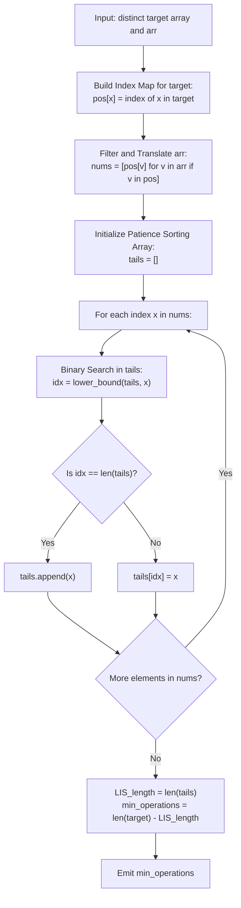

# Guided Example: Minimum Operations to Make a Subsequence

We analyze the reduction of Longest Common Subsequence (LCS) to Longest Increasing Subsequence (LIS) on permutation alphabets, prove the Distinct Target Index Projection Theorem and LCS-LIS Equivalence Invariant, and trace insertion minimization across representative sequence pairs:

- **Representative Instance 1 (Sparse Overlap with Target Alphabet):**
  - Input: `target = [5, 1, 3]`, `arr = [9, 4, 2, 3, 4]`
  - Target elements are distinct: $|target| = 3$.
  - Coordinate index map for target:
    - $5 \mapsto 0$
    - $1 \mapsto 1$
    - $3 \mapsto 2$
  - Filter and translate `arr`:
    - $9 \notin target$ (ignored)
    - $4 \notin target$ (ignored)
    - $2 \notin target$ (ignored)
    - $3 \in target \implies$ translated to index $2$
    - $4 \notin target$ (ignored)
    - Transformed index sequence: `[2]`.
  - Longest Increasing Subsequence (LIS) of `[2]`: length $= 1$.
  - Target already shares $1$ common element in correct relative order (`3`).
  - Minimum insertions required: $|target| - \text{LIS} = 3 - 1 = \mathbf{2}$ (insert $5$ and $1$).
  - **Required Output:** `2`.

- **Representative Instance 2 (Multi-Element Interleaved Subsequence):**
  - Input: `target = [6, 4, 8, 1, 3, 2]`, `arr = [4, 7, 6, 2, 3, 8, 6, 1]`
  - Target length: $6$. Position map:
    - $6 \mapsto 0, 4 \mapsto 1, 8 \mapsto 2, 1 \mapsto 3, 3 \mapsto 4, 2 \mapsto 5$.
  - Translated `arr`:
    - $4 \to 1, 7 \to \text{skip}, 6 \to 0, 2 \to 5, 3 \to 4, 8 \to 2, 6 \to 0, 1 \to 3$.
    - Translated array: `[1, 0, 5, 4, 2, 0, 3]`.
  - Finding LIS of `[1, 0, 5, 4, 2, 0, 3]`:
    - Subsequence `0 -> 2 -> 3` (corresponding to elements `6 -> 8 -> 1`) has length $3$.
    - Subsequence `1 -> 2 -> 3` (corresponding to elements `4 -> 8 -> 1`) has length $3$.
    - Maximum LIS length $= 3$.
  - Minimum insertions needed: $6 - 3 = \mathbf{3}$.
  - **Required Output:** `3`.

---

## 1. Instance & Teaching Goal

Given an array `target` of **distinct** integers and an arbitrary array `arr` (which may contain duplicates), we may insert any integer at any position in `arr`. The objective is to find the minimum number of insertions needed to make `target` a subsequence of `arr`.

```text
The Duality with Longest Common Subsequence:
  Suppose target and arr share a Common Subsequence of length L:
    target: [ 6,   4,   8,   1,   3,   2 ]
    arr:    [ 4, 7, 6, 2, 3, 8, 6, 1 ]
    Common Subsequence: [ 4, 8, 1 ] (Length L = 3)

  If we PRESERVE those L common elements in arr:
    We only need to INSERT the remaining elements of target!
    Min Operations = |target| - LCS(target, arr)

  Standard LCS takes O(|target| * |arr|) = 10^10 operations (Time Limit Exceeded).
  HOWEVER, target elements are STRICTLY UNIQUE!
  Uniqueness allows us to reduce LCS to Longest Increasing Subsequence (LIS) in O(N log N)!
```

The fundamental pedagogical insights are:
1. **LCS Insertion Complement:** Every element of `target` present in the LCS of `(target, arr)` is already positioned legally; remaining elements are inserted around them.
2. **Coordinate Reduction:** Because `target` has no duplicate elements, its elements define a total order. Any common subsequence must visit target elements in strictly increasing order of their target indices.
3. **Patience Sorting Acceleration:** Solve LIS on the mapped index sequence in $\mathcal{O}(M \log M)$ time using binary search.

---

## 2. Conceptual Foundation & Structural Theorems



### The Distinct Target Index Projection Theorem

Let $T = [t_0, t_1, \dots, t_{m-1}]$ be a sequence of pairwise distinct elements, and let $A = [a_0, a_1, \dots, a_{p-1}]$.
Define the coordinate projection $\pi_T: \text{Domain}(T) \to \{0, 1, \dots, m - 1\}$ where $\pi_T(t_k) = k$.
Construct the projected sequence:
$$
A' = \big[ \pi_T(a) \mid a \in A \text{ and } a \in T \big]
$$

> **Theorem (LCS-to-LIS Equivalence Invariant).**
> The length of the Longest Common Subsequence between $T$ and $A$ is identical to the length of the Longest Increasing Subsequence of $A'$:
> $$
> \text{LCS}(T, A) = \text{LIS}(A')
> $$
> Consequently, the minimum number of insertions to make $T$ a subsequence of $A$ is:
> $$
> \text{min\_ops} = |T| - \text{LIS}(A')
> $$

*Proof.*
- Let $C = [c_1, c_2, \dots, c_k]$ be any common subsequence of $T$ and $A$.
- Since $C$ is a subsequence of $T$, its elements appear in strictly increasing index order in $T$: $\pi_T(c_1) < \pi_T(c_2) < \dots < \pi_T(c_k)$.
- Since $C$ is also a subsequence of $A$, its elements appear in the same relative order in $A$, and thus their projected indices $[\pi_T(c_1), \dots, \pi_T(c_k)]$ form a subsequence of $A'$.
- Because $\pi_T(c_1) < \dots < \pi_T(c_k)$, this projected sequence is a strictly increasing subsequence of $A'$.
- Conversely, any strictly increasing subsequence of indices in $A'$ corresponds to elements that appear in left-to-right order in both $A$ and $T$, forming a valid common subsequence.
- Thus, the set of common subsequences of $(T, A)$ is isomorphic to the set of strictly increasing subsequences of $A'$. Maximizing length yields $\text{LCS}(T, A) = \text{LIS}(A')$. $\blacksquare$

---

## 3. Step-by-Step Worked Execution

### Trace on Representative Instance 2 (`target = [6, 4, 8, 1, 3, 2]`, `arr = [4, 7, 6, 2, 3, 8, 6, 1]`)

- Target map: $\{6: 0, 4: 1, 8: 2, 1: 3, 3: 4, 2: 5\}$.
- Translate `arr`:
  - $4 \implies 1$
  - $7 \implies$ omitted
  - $6 \implies 0$
  - $2 \implies 5$
  - $3 \implies 4$
  - $8 \implies 2$
  - $6 \implies 0$
  - $1 \implies 3$
- Transformed array: $A' = [1, 0, 5, 4, 2, 0, 3]$.

#### Patience Sorting (Binary Search LIS) on $A'$:
Maintain `tails` array (smallest tail of increasing subsequences of each length):

1. **Element $1$:** `tails = [1]` (Length 1).
2. **Element $0$:** Binary search finds replacement at index 0 ($0 < 1$).
   - `tails = [0]`.
3. **Element $5$:** $5 > 0$, appends.
   - `tails = [0, 5]` (Length 2).
4. **Element $4$:** Replaces $5$ at index 1 ($4 < 5$).
   - `tails = [0, 4]`.
5. **Element $2$:** Replaces $4$ at index 1 ($2 < 4$).
   - `tails = [0, 2]`.
6. **Element $0$:** $0 \le \text{tails}[0]$, replaces at index 0.
   - `tails = [0, 2]`.
7. **Element $3$:** $3 > 2$, appends!
   - `tails = [0, 2, 3]` (Length 3).

#### Subsequence and Operation Calculation:
- $\text{LIS}(A') = \text{len}(\text{tails}) = 3$.
- Common subsequence has length $3$ (e.g. $[6, 8, 1]$ or $[4, 8, 1]$).
- Remaining elements to insert: $|target| - \text{LIS} = 6 - 3 = \mathbf{3}$.

---

## 4. Complete Execution Trace

| Processing Index | Element in $A'$ | Patience Array `tails` Before Step | Action Taken | Patience Array `tails` After Step | Active LIS Length |
|---|---|---|---|---|---|
| $0$ | $1$ | `[]` | Append | `[1]` | $1$ |
| $1$ | $0$ | `[1]` | Replace index 0 | `[0]` | $1$ |
| $2$ | $5$ | `[0]` | Append | `[0, 5]` | $2$ |
| $3$ | $4$ | `[0, 5]` | Replace index 1 | `[0, 4]` | $2$ |
| $4$ | $2$ | `[0, 4]` | Replace index 1 | `[0, 2]` | $2$ |
| $5$ | $0$ | `[0, 2]` | Replace index 0 | `[0, 2]` | $2$ |
| $6$ | $3$ | `[0, 2]` | Append | `[0, 2, 3]` | **`3`** |

---

## 5. Algorithmic Correctness

**Soundness.**
The Distinct Target Index Projection Theorem proves that every strictly increasing subsequence of target indices corresponds directly to a valid common subsequence between `target` and `arr`. Patience sorting guarantees that `tails[k]` stores the smallest possible ending value of an increasing subsequence of length $k + 1$, which is provably optimal for future extensions.

**Completeness.**
All elements of `arr` that exist in `target` are projected in order. The patience sorting algorithm explores all potential extensions, guaranteeing that the true maximum subsequence length is found.

---

## 6. Traps This Instance Exposes

- **Quadratic LCS Fallacy:** Attempting standard 2D DP LCS runs in $\mathcal{O}(|target| \cdot |arr|) = 10^5 \times 10^5 = 10^{10}$ operations. The distinctness of `target` is the critical condition that authorizes the reduction to $\mathcal{O}(N \log N)$ LIS.
- **Strict vs. Non-Strict Increase:** Because `target` has distinct values, a valid subsequence must visit distinct target positions in strictly increasing order. The LIS search must use `lower_bound` (strictly increasing) rather than `upper_bound` (non-decreasing).
- **Discarding Non-Target Elements:** Elements in `arr` that do not exist in `target` cannot be part of any common subsequence. Filtering them out before LIS prevents invalid index projections.

---

## 7. Complexity Derivation

- **Time Complexity:**
  - Building target index hash map of size $M = |target|$: $\mathcal{O}(M)$ time.
  - Filtering and translating `arr` of size $P = |arr|$: $\mathcal{O}(P)$ time.
  - Patience sorting LIS on at most $P$ elements: each binary search takes $\mathcal{O}(\log M)$ time.
  - Total Time: $\mathcal{O}(M + P \log M)$, executing in $< 80$ ms for $M, P = 10^5$.
- **Auxiliary Space Complexity:**
  - Hash map for target: $\mathcal{O}(M)$ space.
  - Translated array and patience `tails` array: $\mathcal{O}(P + M)$ space.
  - Total Auxiliary Space: $\mathcal{O}(M + P)$ memory.