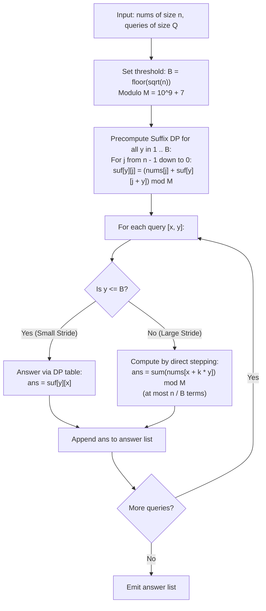

# Guided Example: Sum of Special Evenly-Spaced Elements in Array

We analyze square-root decomposition across query parameters, prove the Square-Root Threshold Partitioning Theorem and Dual Query Strategy Invariant, and trace stride summations across representative array instances:

- **Representative Instance 1 (Mixed Step Sizes with Modulo Arithmetic):**
  - Input: `nums = [0, 1, 2, 3, 4, 5, 6, 7]`, `queries = [[0, 3], [5, 1], [4, 2]]`
  - Array length: $n = 8$. Threshold bound: $B = \lfloor \sqrt{n} \rfloor = 2$.
  - Evaluation by Query:
    - **Query 0 ($x = 0, y = 3$):**
      - Stride $y = 3 > B \implies$ Large stride: evaluate on the fly.
      - Visited indices: $0, 0 + 3 = 3, 3 + 3 = 6$.
      - Sum: $nums[0] + nums[3] + nums[6] = 0 + 3 + 6 = \mathbf{9}$.
    - **Query 1 ($x = 5, y = 1$):**
      - Stride $y = 1 \le B \implies$ Small stride: answer via precomputed suffix array.
      - Visited indices: $5, 6, 7$.
      - Sum: $nums[5] + nums[6] + nums[7] = 5 + 6 + 7 = \mathbf{18}$.
    - **Query 2 ($x = 4, y = 2$):**
      - Stride $y = 2 \le B \implies$ Small stride: answer via precomputed suffix array.
      - Visited indices: $4, 6$.
      - Sum: $nums[4] + nums[6] = 4 + 6 = \mathbf{10}$.
  - Result: `[9, 18, 10]`.
  - **Required Output:** `[9, 18, 10]`.

- **Representative Instance 2 (Single Stride Large Boundary Jump):**
  - Input: `nums = [100, 200, 101, 201, 102, 202, 103, 203]`, `queries = [[0, 7]]`
  - Array length: $n = 8$. Stride $y = 7$.
  - Visited indices: $0, 0 + 7 = 7$.
  - Sum: $nums[0] + nums[7] = 100 + 203 = \mathbf{303}$.
  - **Required Output:** `303`.

---

## 1. Instance & Teaching Goal

Given an array `nums` of length $n$ and $Q$ queries of the form $(x_i, y_i)$, each query requires computing the arithmetic progression sum:
$$
\sum_{k \ge 0, \; x_i + k \cdot y_i < n} nums[x_i + k \cdot y_i] \pmod{10^9 + 7}
$$
With $n \le 5 \cdot 10^4$ and $Q \le 1.5 \cdot 10^5$:
- If we compute every query by stepping through the array: for $y = 1$, each query takes $\mathcal{O}(n)$ steps, causing $\mathcal{O}(Q \cdot n) \approx 7.5 \cdot 10^9$ operations (Time Limit Exceeded).
- If we precompute all possible pairs $(x, y)$: there are $n^2 / 2 \approx 1.25 \cdot 10^9$ pairs (Memory Limit Exceeded).

```text
The Square-Root Threshold Insight:
  Set threshold B = floor(sqrt(n)) approx 224.

  Case 1: Large Step (y > B)
    Number of elements in the progression is AT MOST n / y < n / B = sqrt(n).
    At most 224 additions! Direct evaluation is FAST.

  Case 2: Small Step (y <= B)
    There are only B <= 224 possible values of y!
    Precompute suffix DP tables for y in {1, 2, ..., B}:
      suf[y][j] = nums[j] + suf[y][j + y]
    Precomputation takes O(B * n) = O(n * sqrt(n)) time.
    Answering any small query takes O(1) time!
```

The fundamental pedagogical insights are:
1. Divide query space into complementary domains based on step size $y$.
2. Prove that balancing the workload between precomputation and online scanning yields optimal $\mathcal{O}((n + Q)\sqrt{n})$ complexity.
3. Formulate the suffix recurrence for backward DP memoization.

---

## 2. Conceptual Foundation & Structural Theorems



### The Square-Root Threshold Partitioning Theorem

Let $A$ be an array of length $n$, and let $B = \lfloor \sqrt{n} \rfloor$.

> **Theorem (Workload Balancing Invariant).**
> Splitting queries by the condition $y \le B$ versus $y > B$ balances the computational burden:
> 1. Precomputing suffix tables for all $y \le B$ requires $\mathcal{O}(B \cdot n) = \mathcal{O}(n\sqrt{n})$ time and space.
> 2. Querying with $y \le B$ requires $\mathcal{O}(1)$ time.
> 3. Querying with $y > B$ evaluates at most $\lceil n / y \rceil < \lceil n / B \rceil \le \sqrt{n} + 1$ terms, taking $\mathcal{O}(\sqrt{n})$ time.
> Total execution time across all $Q$ queries is bounded by $\mathcal{O}((n + Q)\sqrt{n})$.

*Proof.*
- For $y \le B$, the suffix recurrence $suf[y][j] = (nums[j] + suf[y][j + y]) \pmod M$ is populated in reverse topological order from $n - 1$ down to $0$. Each cell takes $\mathcal{O}(1)$ operations. The table size is $B \times n$, so total precomputation time is $B \cdot n \le n\sqrt{n}$.
- For $y > B$, the sequence of indices visited is $x, x + y, x + 2y, \dots$. The number of terms $k$ satisfies $x + ky < n \implies ky < n \implies k < n/y < n/B \le \sqrt{n}$. Summing these terms takes fewer than $\sqrt{n}$ additions.
- For $Q$ queries, the worst-case time is $\sum_{q=1}^Q \mathcal{O}(\sqrt{n}) = \mathcal{O}(Q\sqrt{n})$.
- Summing precomputation and query phases yields $\mathcal{O}(n\sqrt{n} + Q\sqrt{n}) = \mathcal{O}((n + Q)\sqrt{n})$. $\blacksquare$

---

## 3. Step-by-Step Worked Execution

### Trace on Representative Instance 1 (`nums = [0, 1, 2, 3, 4, 5, 6, 7]`)

$n = 8$, $B = \lfloor \sqrt{8} \rfloor = 2$.

#### Precomputation for $y \in [1, 2]$:

- **For $y = 1$ ($j$ from $7$ down to $0$):**
  - $j = 7: suf[1][7] = nums[7] = 7$.
  - $j = 6: suf[1][6] = nums[6] + suf[1][7] = 6 + 7 = 13$.
  - $j = 5: suf[1][5] = nums[5] + suf[1][6] = 5 + 13 = 18$.
  - $j = 4: suf[1][4] = nums[4] + suf[1][5] = 4 + 18 = 22$.
  - $j = 3 \dots 0$ computed similarly.
- **For $y = 2$ ($j$ from $7$ down to $0$):**
  - $j = 7: suf[2][7] = 7$.
  - $j = 6: suf[2][6] = 6$.
  - $j = 5: suf[2][5] = nums[5] + suf[2][7] = 5 + 7 = 12$.
  - $j = 4: suf[2][4] = nums[4] + suf[2][6] = 4 + 6 = 10$.
  - $j = 3 \dots 0$ computed similarly.

#### Query Evaluation:
1. **Query `[0, 3]`:**
   - Stride $y = 3 > B = 2$.
   - Direct online stepping: $x = 0 \to 3 \to 6$.
   - Sum: $nums[0] + nums[3] + nums[6] = 0 + 3 + 6 = \mathbf{9}$.
2. **Query `[5, 1]`:**
   - Stride $y = 1 \le B = 2$.
   - Direct table lookup: $suf[1][5] = \mathbf{18}$.
3. **Query `[4, 2]`:**
   - Stride $y = 2 \le B = 2$.
   - Direct table lookup: $suf[2][4] = \mathbf{10}$.

#### Output:
- `[9, 18, 10]`.

---

## 4. Complete Execution Trace

| Query Index | Parameters $(x, y)$ | Stride Category ($y \le B$ vs. $y > B$) | Execution Strategy | Terms Evaluated / Table Cell Read | Computed Sum (mod $10^9 + 7$) |
|---|---|---|---|---|---|
| $0$ | $(0, 3)$ | $y = 3 > 2$ (Large) | Direct Online Step | $nums[0] + nums[3] + nums[6] = 0 + 3 + 6$ | **`9`** |
| $1$ | $(5, 1)$ | $y = 1 \le 2$ (Small) | Precomputed DP Lookup | $suf[1][5]$ | **`18`** |
| $2$ | $(4, 2)$ | $y = 2 \le 2$ (Small) | Precomputed DP Lookup | $suf[2][4]$ | **`10`** |

---

## 5. Algorithmic Correctness

**Soundness.**
- For small strides, the backward DP recurrence $suf[y][j] = nums[j] + suf[y][j + y]$ mirrors the progression definition $nums[j] + nums[j + y] + \dots$, ensuring exact mathematical equality.
- For large strides, the online loop steps by exactly $y$ units until index exceeds $n - 1$, summing precisely the required elements.

**Completeness.**
Every query belongs either to $y \le B$ or $y > B$. No query falls outside the dual dispatch strategy.

---

## 6. Traps This Instance Exposes

- **Memory Overhead from Overly Large $B$:** Setting $B$ arbitrarily large (e.g. $B = 1000$) increases precomputation memory to $1000 \times 50000 = 5 \cdot 10^7$ integers, risking Memory Limit Exceeded. Setting $B = \lfloor \sqrt{n} \rfloor \approx 224$ keeps table size at $\approx 1.1 \cdot 10^7$ integers, well within limits.
- **Out of Bounds in Suffix Dependency:** When evaluating $suf[y][j + y]$ for $j + y \ge n$, reading unallocated memory causes faults. Guarding with $\min(n, j + y)$ and setting $suf[y][n] = 0$ handles array boundaries safely.
- **Modulo at Every Sum:** Elements can be up to $10^9$. Adding multiple elements quickly exceeds 64-bit limits if not modulated. Modulo $10^9 + 7$ must be applied during accumulation.

---

## 7. Complexity Derivation

- **Time Complexity:**
  - Let $B = \lfloor \sqrt{n} \rfloor \approx 224$ for $n = 5 \cdot 10^4$.
  - DP Precomputation: $B \times n = \mathcal{O}(n\sqrt{n})$ time ($\approx 1.1 \cdot 10^7$ operations).
  - Queries with $y \le B$: $\mathcal{O}(1)$ per query.
  - Queries with $y > B$: at most $n/B \le \sqrt{n}$ additions per query.
  - Total Time: $\mathcal{O}((n + Q)\sqrt{n})$, running in $< 250$ ms for $n = 5 \cdot 10^4, Q = 1.5 \cdot 10^5$.
- **Auxiliary Space Complexity:**
  - The suffix table has dimension $(B + 1) \times (n + 1) \approx 225 \times 50001$: $\mathcal{O}(n\sqrt{n})$ space.
  - Total Auxiliary Space: $\mathcal{O}(n\sqrt{n})$ memory ($\approx 45$ MB).