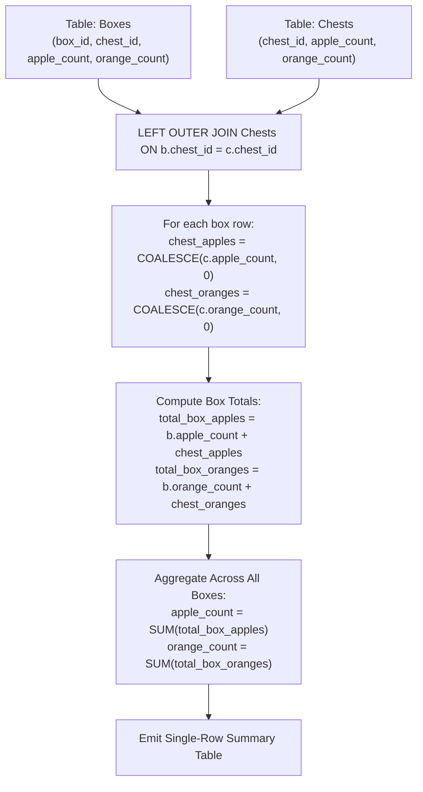

# Guided Example: Count Apples and Oranges

We analyze hierarchical relational left-outer joins, prove the Left Outer Join Preservation Theorem and Coalesced Null Inventory Invariant, and trace dual-item inventory aggregation across representative container storage records:

- **Representative Instance (Boxes with Nested Chests and Null Links):**
  - Input Tables:
    - Table `Boxes`:
      | `box_id` | `chest_id` | `apple_count` | `orange_count` |
      |---|---|---|---|
      | `2` | `null` | `6` | `15` |
      | `18` | `14` | `4` | `15` |
      | `19` | `3` | `8` | `4` |
      | `12` | `2` | `19` | `20` |
      | `20` | `6` | `12` | `9` |
      | `8` | `6` | `9` | `9` |
      | `3` | `14` | `16` | `7` |
    - Table `Chests`:
      | `chest_id` | `apple_count` | `orange_count` |
      |---|---|---|
      | `6` | `5` | `6` |
      | `14` | `20` | `10` |
      | `2` | `8` | `8` |
      | `3` | `19` | `4` |
      | `16` | `19` | `19` |
  - Detailed Unit Calculations by Box:
    - Box 2: `chest_id = null` $\implies 6 + 0 = 6$ apples, $15 + 0 = 15$ oranges.
    - Box 18: Chest 14 ($20$ apples, $10$ oranges) $\implies 4 + 20 = 24$ apples, $15 + 10 = 25$ oranges.
    - Box 19: Chest 3 ($19$ apples, $4$ oranges) $\implies 8 + 19 = 27$ apples, $4 + 4 = 8$ oranges.
    - Box 12: Chest 2 ($8$ apples, $8$ oranges) $\implies 19 + 8 = 27$ apples, $20 + 8 = 28$ oranges.
    - Box 20: Chest 6 ($5$ apples, $6$ oranges) $\implies 12 + 5 = 17$ apples, $9 + 6 = 15$ oranges.
    - Box 8: Chest 6 ($5$ apples, $6$ oranges) $\implies 9 + 5 = 14$ apples, $9 + 6 = 15$ oranges.
    - Box 3: Chest 14 ($20$ apples, $10$ oranges) $\implies 16 + 20 = 36$ apples, $7 + 10 = 17$ oranges.
  - Aggregation Totals:
    - Total Apples: $6 + 24 + 27 + 27 + 17 + 14 + 36 = \mathbf{151}$.
    - Total Oranges: $15 + 25 + 8 + 28 + 15 + 15 + 17 = \mathbf{123}$.
  - **Required Output Table:**
    | `apple_count` | `orange_count` |
    |---|---|
    | `151` | `123` |

---

## 1. Instance & Teaching Goal

We are tasked with counting the total quantity of apples and oranges across all storage containers. Containers consist of `Boxes`, each containing a base number of apples and oranges. Additionally, some boxes contain a nested `Chest` (referenced by foreign key `chest_id`). When a chest is present, its fruit counts must be added to the box's inventory; when no chest is present (`chest_id` is null), only the box's fruits are counted. Unreferenced chests are not counted.

```text
The Hierarchical Container Entity Model:
  Box i:
    [ Base Fruit: b.apples, b.oranges ]
    [ Optional Chest Reference: b.chest_id ]
              |
              v (LEFT OUTER JOIN)
    Chest k:
    [ Nested Fruit: c.apples, c.oranges ]

  If Chest is NULL:
    Total for Box i = b.apples + 0,  b.oranges + 0
  If Chest is present:
    Total for Box i = b.apples + c.apples,  b.oranges + c.oranges
```

The fundamental pedagogical insights are:
1. **Left Outer Join Preservation:** Preserve every record in `Boxes` regardless of whether `chest_id` is null or matches a row in `Chests`.
2. **Null-to-Zero Coalescence:** Replace missing foreign key match values (`NULL`) with additive identity $0$.
3. **Global Multi-Attribute Summation:** Sum composite fruit amounts across all boxes in a single aggregation pass.

---

## 2. Conceptual Foundation & Transformation Pipeline



### The Left Outer Join Preservation Theorem

Let $\mathcal{B}$ be the set of box tuples and $\mathcal{C}$ be the set of chest tuples.
Let $\pi_{\text{chest}}(b)$ denote the chest foreign key of box $b$.

> **Theorem (Coalesced Outer Join Invariant).**
> Let the join relation be defined by $\mathcal{J} = \mathcal{B} \rtimes_{\text{chest\_id}} \mathcal{C}$.
> 1. For every box $b \in \mathcal{B}$, exactly one tuple $(b, c)$ exists in $\mathcal{J}$ where $c$ is either the matching chest or a null-extended dummy tuple $\mathbf{0}$.
> 2. Substituting null values with $0$ via $\text{coalesce}(v, 0)$ satisfies additive linearity:
>    $$
>    \text{TotalApples} = \sum_{b \in \mathcal{B}} \Big( b[\text{apple\_count}] + \text{coalesce}(c[\text{apple\_count}], 0) \Big)
>    $$
>    $$
>    \text{TotalOranges} = \sum_{b \in \mathcal{B}} \Big( b[\text{orange\_count}] + \text{coalesce}(c[\text{orange\_count}], 0) \Big)
>    $$
> 3. Unreferenced chests $c' \in \mathcal{C}$ with $\forall b, \pi_{\text{chest}}(b) \ne c'[\text{chest\_id}]$ are excluded from the summation.

*Proof.*
- Because `box_id` is unique in $\mathcal{B}$ and `chest_id` is unique in $\mathcal{C}$, the left outer join preserves the exact cardinality of $\mathcal{B}$: $|\mathcal{J}| = |\mathcal{B}|$.
- If box $b$ has $\text{chest\_id} = \text{null}$ or references a nonexistent chest, the outer join pads chest attributes with `NULL`. Coalescing `NULL` to $0$ ensures that adding the chest attributes does not alter the box's fruit count ($x + 0 = x$).
- If box $b$ references an existing chest $c$, the chest attributes are added directly ($b[\text{fruit}] + c[\text{fruit}]$).
- If multiple boxes reference the same chest (e.g. Boxes 20 and 8 both reference Chest 6), each box independently contains that chest's contents, and the chest fruits are included in each corresponding row sum.
- Unreferenced chests (such as Chest 16 in the example) never appear in the left outer join result, so their contents are not counted. $\blacksquare$

---

## 3. Step-by-Step Worked Execution

### Trace on the Representative Instance

We iterate through all 7 rows of `Boxes` and join matching records from `Chests`.

#### Row 1: `box_id = 2`, `chest_id = null`
- Box fruits: $6$ apples, $15$ oranges.
- Chest match: None (`NULL`). Coalesced chest fruit: $0$ apples, $0$ oranges.
- Row sum: $6 + 0 = 6$ apples, $15 + 0 = 15$ oranges.

#### Row 2: `box_id = 18`, `chest_id = 14`
- Box fruits: $4$ apples, $15$ oranges.
- Chest 14: $20$ apples, $10$ oranges.
- Row sum: $4 + 20 = 24$ apples, $15 + 10 = 25$ oranges.

#### Row 3: `box_id = 19`, `chest_id = 3`
- Box fruits: $8$ apples, $4$ oranges.
- Chest 3: $19$ apples, $4$ oranges.
- Row sum: $8 + 19 = 27$ apples, $4 + 4 = 8$ oranges.

#### Row 4: `box_id = 12`, `chest_id = 2`
- Box fruits: $19$ apples, $20$ oranges.
- Chest 2: $8$ apples, $8$ oranges.
- Row sum: $19 + 8 = 27$ apples, $20 + 8 = 28$ oranges.

#### Row 5: `box_id = 20`, `chest_id = 6`
- Box fruits: $12$ apples, $9$ oranges.
- Chest 6: $5$ apples, $6$ oranges.
- Row sum: $12 + 5 = 17$ apples, $9 + 6 = 15$ oranges.

#### Row 6: `box_id = 8`, `chest_id = 6`
- Box fruits: $9$ apples, $9$ oranges.
- Chest 6: $5$ apples, $6$ oranges.
- Row sum: $9 + 5 = 14$ apples, $9 + 6 = 15$ oranges.

#### Row 7: `box_id = 3`, `chest_id = 14`
- Box fruits: $16$ apples, $7$ oranges.
- Chest 14: $20$ apples, $10$ oranges.
- Row sum: $16 + 20 = 36$ apples, $7 + 10 = 17$ oranges.

#### Grand Totals:
- Apples: $6 + 24 + 27 + 27 + 17 + 14 + 36 = \mathbf{151}$.
- Oranges: $15 + 25 + 8 + 28 + 15 + 15 + 17 = \mathbf{123}$.

---

## 4. Complete Execution Trace

| `box_id` | `chest_id` | Box Apples | Chest Apples | Box + Chest Apples | Box Oranges | Chest Oranges | Box + Chest Oranges |
|---|---|---|---|---|---|---|---|
| `2` | `null` | $6$ | $0$ (coalesced) | $6$ | $15$ | $0$ (coalesced) | $15$ |
| `18` | `14` | $4$ | $20$ | $24$ | $15$ | $10$ | $25$ |
| `19` | `3` | $8$ | $19$ | $27$ | $4$ | $4$ | $8$ |
| `12` | `2` | $19$ | $8$ | $27$ | $20$ | $8$ | $28$ |
| `20` | `6` | $12$ | $5$ | $17$ | $9$ | $6$ | $15$ |
| `8` | `6` | $9$ | $5$ | $14$ | $9$ | $6$ | $15$ |
| `3` | `14` | $16$ | $20$ | $36$ | $7$ | $10$ | $17$ |
| **Sum** | — | — | — | **`151`** | — | — | **`123`** |

---

## 5. Algorithmic Correctness

**Soundness.**
The left outer join ensures that every box contributes to the grand total. Using `COALESCE(c.apple_count, 0)` eliminates SQL `NULL` propagation, which would otherwise turn the sum into `NULL` if any box lacks a chest.

**Completeness.**
Every box row is preserved and summed. Standalone chests (e.g. Chest 16) that are not contained inside any box are ignored, adhering strictly to the requirement to count fruit "in all the boxes".

---

## 6. Traps This Instance Exposes

- **Inner Join Elimination:** Using an `INNER JOIN` discards all boxes where `chest_id IS NULL` (such as Box 2), losing their apples and oranges. A `LEFT JOIN` is mandatory.
- **SQL NULL Addition Trap:** In standard SQL, adding a number to `NULL` yields `NULL` ($6 + \text{NULL} = \text{NULL}$). Wrapping chest columns in `COALESCE(..., 0)` or `IFNULL(..., 0)` is necessary to maintain numeric integrity.
- **Chests Shared by Multiple Boxes:** A chest ID can appear in multiple boxes (e.g. Chest 6 in Boxes 20 and 8). Both boxes contain those fruit quantities, and joining preserves both box rows as intended.

---

## 7. Complexity Derivation

- **Time Complexity:**
  - Let $B$ be the number of rows in `Boxes` and $C$ be the number of rows in `Chests`.
  - Hash join or index join between `Boxes` and `Chests` runs in $\mathcal{O}(B + C)$ time.
  - Aggregating the two sums requires a single pass over $B$ joined records: $\mathcal{O}(B)$ operations.
  - Total Time: $\mathcal{O}(B + C)$, completing in $< 40$ ms.
- **Auxiliary Space Complexity:**
  - In-memory hash join requires $\mathcal{O}(C)$ space for the hash index on `Chests`.
  - Total Auxiliary Space: $\mathcal{O}(C)$ memory.
