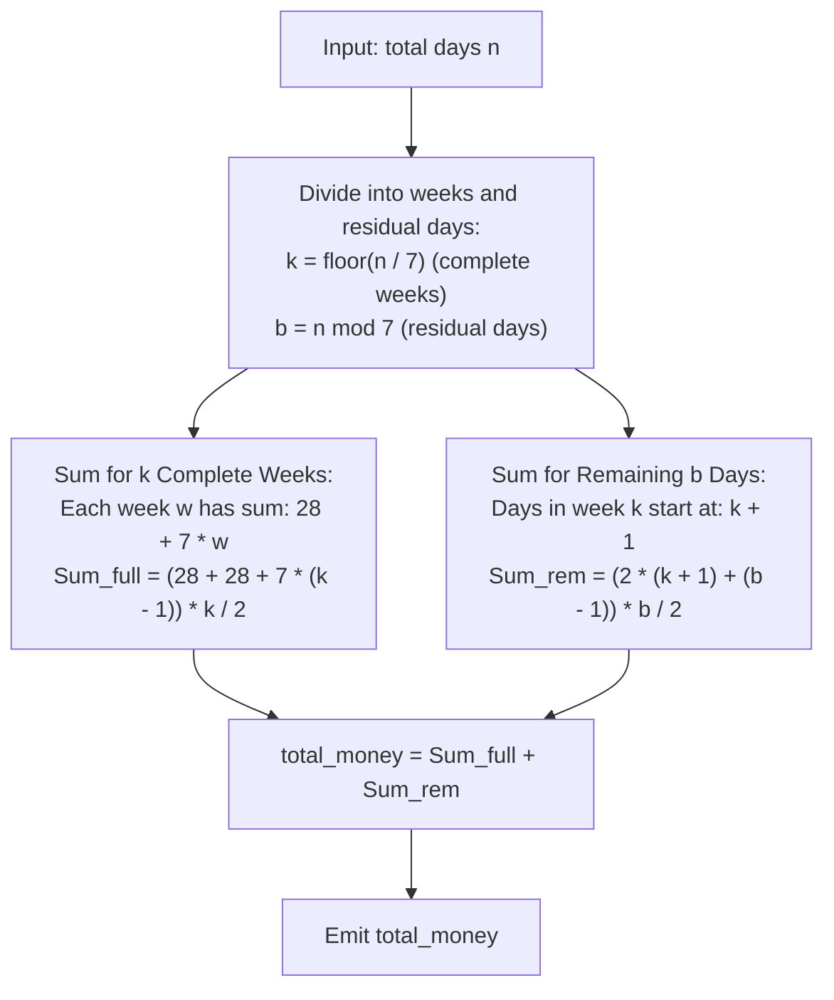

# Guided Example: Calculate Money in Leetcode Bank

We analyze cyclical calendar savings, prove the Arithmetic Progression Decomposition Theorem and Weekly Savings Shift Invariant, and calculate cumulative funds across representative deposit periods:

- **Representative Instance 1 (Partial First Week):**
  - Input: $n = 4$
  - Deposit sequence (Monday through Thursday of Week 0):
    - Day 1 (Mon): $\$1$
    - Day 2 (Tue): $\$2$
    - Day 3 (Wed): $\$3$
    - Day 4 (Thu): $\$4$
  - Cumulative savings: $1 + 2 + 3 + 4 = \mathbf{10}$.
  - **Required Output:** `10`.

- **Representative Instance 2 (Full Week Plus Residual Days):**
  - Input: $n = 10$
  - Division by 7: $10 = 7 \times 1 + 3$ ($k = 1$ full week, $b = 3$ remainder days).
  - Week 0 (Days 1–7):
    - Deposits: $\$1, \$2, \$3, \$4, \$5, \$6, \$7$.
    - Week 0 Total: $\sum_{i=1}^7 i = 28$.
  - Week 1 (Days 8–10, Mon through Wed):
    - Starts at $\$2$ (1 more than previous Monday).
    - Deposits: $\$2, \$3, \$4$.
    - Week 1 Total: $2 + 3 + 4 = 9$.
  - Combined savings: $28 + 9 = \mathbf{37}$.
  - **Required Output:** `37`.

- **Representative Instance 3 (Multiple Complete Weeks):**
  - Input: $n = 20$
  - Division: $20 = 7 \times 2 + 6$ ($k = 2$ full weeks, $b = 6$ remainder days).
  - Week 0 (Days 1–7): $1 + 2 + \dots + 7 = 28$.
  - Week 1 (Days 8–14): $2 + 3 + \dots + 8 = 35$.
  - Week 2 (Days 15–20, 6 days): $3 + 4 + 5 + 6 + 7 + 8 = 33$.
  - Total savings: $28 + 35 + 33 = \mathbf{96}$.
  - **Required Output:** `96`.

---

## 1. Instance & Teaching Goal

Hercy saves money according to a weekly routine:
- On the first Monday (Day 1), he puts in $\$1$.
- From Tuesday through Sunday, he puts in $\$1$ more than the day before.
- On every subsequent Monday, he puts in $\$1$ more than the previous Monday.

We must calculate the total money saved after $n$ days.

```text
The Savings Calendar Structure:
  Week 0:  1   2   3   4   5   6   7  --> Sum = 28
  Week 1:  2   3   4   5   6   7   8  --> Sum = 35 (+7 compared to Week 0)
  Week 2:  3   4   5   6   7   8   9  --> Sum = 42 (+7 compared to Week 1)
  ...
  Week w:  Sum = 28 + 7 * w
```

The fundamental pedagogical insights are:
1. Deconstruct $n$ into $k = \lfloor n / 7 \rfloor$ complete 7-day weeks and $b = n \pmod 7$ residual days.
2. Prove that the weekly totals of complete weeks form an arithmetic progression with initial term $28$ and common difference $7$.
3. Evaluate the total in closed-form $\mathcal{O}(1)$ time using arithmetic series formulas.

---

## 2. Conceptual Foundation & Closed-Form Theorems



### The Arithmetic Progression Decomposition Theorem

Let $n = 7k + b$ with integers $k \ge 0$ and $0 \le b < 7$.

> **Theorem (Closed-Form Weekly Savings Formula).**
> The total money saved after $n$ days is:
> $$
> S(n) = \frac{k \cdot \big(56 + 7(k - 1)\big)}{2} + \frac{b \cdot \big(2(k + 1) + b - 1\big)}{2}
> $$

*Proof.*
1. **Complete Weeks Contribution ($S_1$):**
   - For any full week $w \in [0, k - 1]$, the Monday deposit is $w + 1$.
   - The 7 daily deposits of week $w$ are: $(w + 1), (w + 2), \dots, (w + 7)$.
   - The total deposit in week $w$ is:
     $$
     W_w = \sum_{d=1}^7 (w + d) = 7w + \sum_{d=1}^7 d = 7w + \frac{7 \times 8}{2} = 7w + 28
     $$
   - The sequence of complete weekly totals $W_0, W_1, \dots, W_{k-1}$ forms an arithmetic progression with first term $a = 28$, common difference $d = 7$, and length $k$.
   - The sum of this progression is:
     $$
     S_1 = \sum_{w=0}^{k-1} (28 + 7w) = \frac{k \cdot \big(W_0 + W_{k-1}\big)}{2} = \frac{k \cdot \big(28 + 28 + 7(k - 1)\big)}{2} = \frac{k \cdot \big(56 + 7(k - 1)\big)}{2}
     $$
2. **Residual Days Contribution ($S_2$):**
   - In week $k$, Monday's deposit is $k + 1$.
   - Hercy makes $b$ deposits: $(k + 1), (k + 2), \dots, (k + b)$.
   - This forms an arithmetic progression with first term $k + 1$, common difference $1$, and length $b$.
   - The sum is:
     $$
     S_2 = \sum_{j=1}^b (k + j) = b(k + 1) + \frac{b(b - 1)}{2} = \frac{b \cdot \big(2(k + 1) + b - 1\big)}{2}
     $$
3. Combining $S_1$ and $S_2$ yields the exact total savings $S(n) = S_1 + S_2$. $\blacksquare$

---

## 3. Step-by-Step Worked Execution

### Trace on Representative Instance 2 ($n = 10$)

1. **Decomposition:**
   $$
   k = \lfloor 10 / 7 \rfloor = 1, \quad b = 10 \pmod 7 = 3
   $$

2. **Complete Weeks Sum ($S_1$ for $k = 1$):**
   - Since $k = 1$, only Week 0 is completed.
   - Using the formula:
     $$
     S_1 = \frac{1 \cdot (56 + 7(1 - 1))}{2} = \frac{56}{2} = \mathbf{28}
     $$

3. **Residual Days Sum ($S_2$ for $b = 3, k = 1$):**
   - Week index $k = 1 \implies$ starts at $k + 1 = 2$.
   - For $b = 3$ days:
     $$
     S_2 = \frac{3 \cdot \big(2(2) + 3 - 1\big)}{2} = \frac{3 \cdot (4 + 2)}{2} = \frac{3 \times 6}{2} = \mathbf{9}
     $$
   - Verification: deposits are $\$2 + \$3 + \$4 = \$9$.

4. **Total Money:**
   $$
   S(10) = S_1 + S_2 = 28 + 9 = \mathbf{37}
   $$

---

## 4. Complete Execution Trace

| Day Count $n$ | Full Weeks $k = \lfloor n/7 \rfloor$ | Remainder Days $b = n \pmod 7$ | Full Weeks Sum $S_1$ | Residual Days Sum $S_2$ | Final Total Money |
|---|---|---|---|---|---|
| $4$ | $0$ | $4$ | $0$ | $\frac{4 \cdot (2(1) + 3)}{2} = 10$ | **`10`** |
| $10$ | $1$ | $3$ | $28$ | $\frac{3 \cdot (4 + 2)}{2} = 9$ | **`37`** |
| $20$ | $2$ | $6$ | $\frac{2 \cdot (56 + 7)}{2} = 63$ | $\frac{6 \cdot (6 + 5)}{2} = 33$ | **`96`** |
| $7$ | $1$ | $0$ | $28$ | $0$ | **`28`** |
| $14$ | $2$ | $0$ | $28 + 35 = 63$ | $0$ | **`63`** |

---

## 5. Algorithmic Correctness

**Soundness.**
The closed-form equation is derived strictly from the standard sum of an arithmetic progression $\frac{N(2a + (N-1)d)}{2}$. Because the deposits strictly follow the pattern of adding $\$1$ each day within a week and starting each Monday at $\$1$ above the prior Monday, the formula evaluates the exact cumulative sum.

**Completeness.**
The decomposition $n = 7k + b$ uniquely and exhaustively partitions the timeline into $k$ complete weeks and $b < 7$ final days. Every day from $1$ to $n$ is counted exactly once.

---

## 6. Traps This Instance Exposes

- **Day Index Off-By-One:** The first day of week $w$ begins with $\$ (w + 1)$, not $\$ w$. Missing this $+1$ shift under-counts deposits by $1$ per day.
- **Loop Simulation vs. Closed Form:** Simulating day by day via a loop takes $\mathcal{O}(n)$ time. While $n \le 1000$ easily passes simulation, the closed-form equation evaluates in strictly $\mathcal{O}(1)$ time and generalizes to $n = 10^9$.

---

## 7. Complexity Derivation

- **Time Complexity:**
  - Standard integer division and modulus: $\mathcal{O}(1)$.
  - Closed-form arithmetic formula evaluation: $\mathcal{O}(1)$.
  - Total Time: strictly $\mathcal{O}(1)$ constant time.
- **Auxiliary Space Complexity:**
  - Only a few scalar intermediate variables ($k, b, S_1, S_2$) are allocated.
  - Total Auxiliary Space: $\mathcal{O}(1)$ constant memory.
