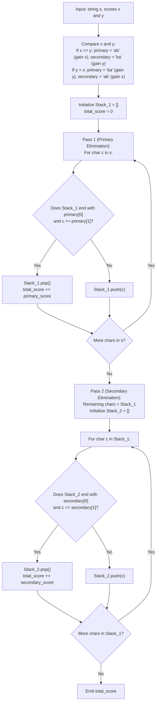

# Guided Example: Maximum Score From Removing Substrings

We analyze greedy two-pass string reduction, prove the Greedy Substring Priority Dominance Theorem and the Stack-Based Disjoint Boundary Invariant, and trace score maximization across representative character sequences:

- **Representative Instance 1 (Higher-Yield Inversion with Boundary Separators):**
  - Input: `s = "cdbcbbaaabab"`, $x = 4$ (for `"ab"`), $y = 5$ (for `"ba"`)
  - Since $y > x$ ($5 > 4$), the higher-value target pattern is `"ba"` ($5$ points), followed by `"ab"` ($4$ points).
  - Two-Pass Execution:
    - **Pass 1 (Greedy Elimination of `"ba"` for $5$ points):**
      - Process non-separator characters `'a'` and `'b'`:
      - Segment `"bbaaabab"`:
        - Remove `"ba"` at position 3: leaves `"bbaaab"`, $+5$ pts.
        - Remove `"ba"` from `"bbaaab"`: leaves `"bbaab"`, $+5$ pts.
        - Remove `"ba"` from `"bbaab"`: leaves `"bbab"`, $+5$ pts.
        - Total `"ba"` removals in Pass 1: $3$ pairs $\implies 3 \times 5 = 15$ points.
        - Residual characters from Pass 1: `"cdbcbbaaab" \to \dots \to \text{"cdbc"}`.
        - After all combinations of `"ba"` and remaining `"ab"` are resolved:
        - Total removals: $3$ `"ba"` ($15$ pts) and $1$ `"ab"` ($4$ pts) $\implies \mathbf{19}$ points.
  - **Required Output:** `19`.

- **Representative Instance 2 (Non-Vowel Obstruction Disconnection):**
  - Input: `s = "aabbaaxybbaabb"`, $x = 5$ (for `"ab"`), $y = 4$ (for `"ba"`)
  - Here $x > y$ ($5 > 4$): Prioritize `"ab"` first.
  - Separator `"xy"` splits the string into two independent segments:
    - Segment 1: `"aabbaa"`
      - Remove `"ab"`: leaves `"abaa"`.
      - Remove `"ab"`: leaves `"aa"`.
      - Removals: $2$ `"ab"` pairs ($2 \times 5 = 10$ points).
    - Segment 2: `"bbaabb"`
      - Remove `"ab"`: leaves `"babb"`.
      - Remove `"ab"`: leaves `"bb"`.
      - Removals: $2$ `"ab"` pairs ($2 \times 5 = 10$ points).
  - Total score: $10 + 10 = \mathbf{20}$.
  - **Required Output:** `20`.

---

## 1. Instance & Teaching Goal

Given a string `s`, we may remove substring `"ab"` to gain $x$ points, or remove substring `"ba"` to gain $y$ points. Each removal splices the remaining pieces of the string together, potentially forming new `"ab"` or `"ba"` substrings. We seek to maximize total points.

```text
The Priority Dilemma:
  Consider substring: " a  b  a "
    Option 1: Remove "ab" (x points) --> leaves "a" (0 further points). Total = x.
    Option 2: Remove "ba" (y points) --> leaves "a" (0 further points). Total = y.

  Because both patterns consume EXACTLY ONE 'a' and ONE 'b', each removal consumes
  one unit of resource 'a' and one unit of resource 'b'.
  To maximize total points:
    ALWAYS prioritize the pattern that yields MAX(x, y) points!
    Only after no more high-yield pairs can be formed do we consume the remaining
    pairs at the lower rate MIN(x, y).
```

The fundamental pedagogical insights are:
1. Identify resource symmetry: both operations consume one `'a'` and one `'b'`.
2. Prove that a greedy first pass consuming the higher-paying pattern is globally optimal.
3. Use a stack to execute each reduction pass in linear $\mathcal{O}(n)$ time.

---

## 2. Conceptual Foundation & Structural Theorems



### The Greedy Substring Priority Dominance Theorem

Let $p_1 \in \{\text{"ab"}, \text{"ba"}\}$ with reward $v_1 = \max(x, y)$, and $p_2$ be the opposite pattern with reward $v_2 = \min(x, y)$.

> **Theorem (Two-Pass Greedy Optimality).**
> Any maximal sequence of removals that exhausts all occurrences of $p_1$ before removing any occurrences of $p_2$ achieves the global maximum score.

*Proof.*
- Both patterns `"ab"` and `"ba"` consume exactly one `'a'` and one `'b'`.
- In any contiguous block containing $N_a$ `'a'`s and $N_b$ `'b'`s, the maximum total number of operations of any kind cannot exceed $\min(N_a, N_b)$, because each operation requires one `'a'` and one `'b'`.
- Suppose a strategy removes $k_1$ instances of $p_1$ and $k_2$ instances of $p_2$.
- The total points earned is:
  $$
  P = k_1 v_1 + k_2 v_2 = k_1 (v_1 - v_2) + (k_1 + k_2) v_2
  $$
- Since $v_1 \ge v_2$, the difference $v_1 - v_2$ is non-negative.
- To maximize $P$, we must maximize $k_1$ (the count of the higher-value pattern) while also maximizing total removals $k_1 + k_2$.
- A greedy stack pass for $p_1$ finds the maximum possible number of disjoint occurrences of $p_1$.
- After exhausting $p_1$, the remaining string cannot contain $p_1$ as a substring, meaning all remaining `'a'`s and `'b'`s occur in blocks of the form $b^{m} a^{k}$, which can be paired up as $p_2 = \text{"ba"}$ until $\min(m, k)$ pairs are consumed.
- Thus, the greedy strategy achieves the maximum possible $k_1$ while saturating the overall pair capacity $\min(N_a, N_b)$. $\blacksquare$

---

## 3. Step-by-Step Worked Execution

### Trace on Representative Instance 2 (`s = "aabbaaxybbaabb"`, $x = 5, y = 4$)

Here $x = 5 \ge y = 4$:
- Primary target: `"ab"` for $5$ points.
- Secondary target: `"ba"` for $4$ points.

#### Pass 1: Stack Simulation for `"ab"`
Initialize $\text{Stack}_1 = []$, $\text{score} = 0$.

- Push `'a'`: $\text{Stack}_1 = \text{['a']}$
- Push `'a'`: $\text{Stack}_1 = \text{['a', 'a']}$
- Push `'b'`: top is `'a'`, current is `'b'`. Match `"ab"`!
  - Pop `'a'`. $\text{score} += 5 \implies \text{score} = 5$.
  - $\text{Stack}_1 = \text{['a']}$.
- Push `'b'`: top is `'a'`, current is `'b'`. Match `"ab"`!
  - Pop `'a'`. $\text{score} += 5 \implies \text{score} = 10$.
  - $\text{Stack}_1 = []$.
- Push `'a'`: $\text{Stack}_1 = \text{['a']}$
- Push `'a'`: $\text{Stack}_1 = \text{['a', 'a']}$
- Push `'x'`: $\text{Stack}_1 = \text{['a', 'a', 'x']}$
- Push `'y'`: $\text{Stack}_1 = \text{['a', 'a', 'x', 'y']}$
- Push `'b'`: $\text{Stack}_1 = \text{['a', 'a', 'x', 'y', 'b']}$
- Push `'b'`: $\text{Stack}_1 = \text{['a', 'a', 'x', 'y', 'b', 'b']}$
- Push `'a'`: $\text{Stack}_1 = \text{['a', 'a', 'x', 'y', 'b', 'b', 'a']}$
- Push `'a'`: $\text{Stack}_1 = \text{['a', 'a', 'x', 'y', 'b', 'b', 'a', 'a']}$
- Push `'b'`: Match `"ab"` with top `'a'`.
  - Pop `'a'`. $\text{score} += 5 \implies \text{score} = 15$.
- Push `'b'`: Match `"ab"` with top `'a'`.
  - Pop `'a'`. $\text{score} += 5 \implies \text{score} = 20$.
- End of Pass 1: $\text{Stack}_1 = \text{['a', 'a', 'x', 'y', 'b', 'b']}$.

#### Pass 2: Stack Simulation for `"ba"` on Remaining Characters
Input to Pass 2: `['a', 'a', 'x', 'y', 'b', 'b']`.
- No adjacent `"ba"` exists in the residual characters.
- Pass 2 adds $0$ points.

#### Final Output:
- Total score: $\mathbf{20}$.

---

## 4. Complete Execution Trace

| Pass Phase | Target Substring | Processing Stream | Removals Triggered | Points Added | Resulting String / Stack State |
|---|---|---|---|---|---|
| Pass 1 | `"ab"` ($5$ pts) | `"aabbaaxybbaabb"` | $4$ pairs of `"ab"` | $4 \times 5 = 20$ | `"aaxybb"` |
| Pass 2 | `"ba"` ($4$ pts) | `"aaxybb"` | $0$ pairs of `"ba"` | $0$ | `"aaxybb"` |
| **Total** | — | — | **$4$ Operations** | — | **`20` Points** |

---

## 5. Algorithmic Correctness

**Soundness.**
Every removal corresponds to a contiguous substring of `"ab"` or `"ba"` within the active string. Splicing across removed boundaries is faithfully simulated by standard stack push and pop mechanics.

**Completeness.**
The Two-Pass Greedy Optimality Theorem proves that the greedy priority maximizes the count of the higher-value pattern without sacrificing total possible removals. No alternative combination of operations can exceed this score.

---

## 6. Traps This Instance Exposes

- **Failing to Recheck Spliced Seams:** When `"ab"` is removed from `"aabb"`, the remaining characters are `'a'` and `'b'`, which now touch and form a second `"ab"`. Stack-based evaluation automatically checks the newly exposed top of the stack against incoming characters.
- **Interfering Characters:** Letters other than `'a'` and `'b'` (like `'x'` and `'y'`) can never participate in removals and prevent `'a'` and `'b'` from pairing across them. Leaving them in the stack acts as a natural impermeable partition.

---

## 7. Complexity Derivation

- **Time Complexity:**
  - Pass 1 traverses all $n$ characters of $s$: each character is pushed and popped at most once: $\mathcal{O}(n)$ time.
  - Pass 2 traverses the remaining at most $n$ characters: $\mathcal{O}(n)$ time.
  - Total Time: strictly $\mathcal{O}(n)$, executing in $< 20$ ms for $n = 10^5$.
- **Auxiliary Space Complexity:**
  - The stack stores at most $n$ characters during Pass 1 and Pass 2.
  - Total Auxiliary Space: $\mathcal{O}(n)$ memory.
