## Solution

---

### Approach 1: Greedy Way (Stack)

#### Intuition

The fundamental insight here is that we should always try to remove the substring ('ab' or 'ba') that yields the higher points first.

To solve this problem, we use a two-pass approach to efficiently remove both substrings:
1. In the first pass, remove all instances of the higher-scoring substring.
2. In the second pass, remove all instances of the lower-scoring substring from the remaining text.

We implement this using a stack-based approach. As we iterate through the string, we push characters onto a stack. If the character at the top of the stack and the current character form the target substring, we pop the stack and move on without pushing the current character. This effectively removes the substring. If you are unfamiliar with such a technique, trying out [this](https://leetcode.com/problems/valid-parentheses/description/) problem first may help.

After the first pass, we reconstruct the remaining string by popping all characters from the stack into a new string and reversing it. We repeat this process for the lower-scoring substring.

We determine the total number of removed substrings by comparing the string's length before and after the removal process. The length difference, divided by 2 (since each substring is two characters long), gives the count of removed substrings. We then multiply this count by the point value of that substring to calculate the score for each pass.

<details>
<summary>Let us prove the greedy approach using the principle of contradiction:</summary>
<br>

Suppose $x \geq y$. Therefore, removing 'ab' yields higher or equal points compared to 'ba'. Assume there exists an optimal sequence where removing 'ba' is more optimal than removing 'ab'. This would imply removing 1 'ab' restricts us from removing 2 'ba's, i.e., the 'ab' is shared by 2 'ba's.

Consider the string 'baba'. If we remove 'ba' first, we are left with another 'ba', totaling $2 \cdot y$ points.

Conversely, if we remove 'ab' first, we are left with one 'ba', totaling $x + y$ points.

Since $x \geq y$, $2 \cdot y$ cannot be greater than $x + y$. Thus, our initial assumption is wrong.
</details>

#### Algorithm

Main Method `maximumGain`:

- Initialize `totalScore` to `0` to keep track of the accumulated points.
- Determine `highPriorityPair` based on which of `x` or `y` is larger. If `x` > `y`, it's "ab", otherwise "ba".
- Set `lowPriorityPair` as the opposite of `highPriorityPair`.
- Call `removeSubstring` with the original string and `highPriorityPair`.
- Calculate the number of removed pairs (`removedPairsCount`) by comparing the lengths of the original and processed strings, divided by 2.
- Add to `totalScore` the product of removed pairs and the higher of `x` and `y`.
- Call `removeSubstring` again with the result of the first pass and `lowPriorityPair`.
- Calculate the number of removed pairs in this second pass.
- Add to `totalScore` the product of removed pairs and the lower of `x` and `y`.
- Return `totalScore`.

Helper Method `removeSubstring`:

- Define a method `removeSubstring` which takes the input string `input` and the substring to remove `targetPair` as parameters.
- Initialize a stack `charStack` to store characters during processing.
- Iterate over each character in `input`:
  - If the top of the stack and the current character combine to form the target string, pop from the stack.
  - Else, push the current character onto the stack.
- Form a string by popping each character in the stack, reverse it, and return it.

#### Implementation

```python
class Solution:
    def maximumGain(self, s: str, x: int, y: int) -> int:
        total_score = 0
        high_priority_pair = "ab" if x > y else "ba"
        low_priority_pair = "ba" if high_priority_pair == "ab" else "ab"

        # First pass: remove high priority pair
        string_after_first_pass = self.remove_substring(s, high_priority_pair)
        removed_pairs_count = (len(s) - len(string_after_first_pass)) // 2

        # Calculate score from first pass
        total_score += removed_pairs_count * max(x, y)

        # Second pass: remove low priority pair
        string_after_second_pass = self.remove_substring(
            string_after_first_pass, low_priority_pair
        )
        removed_pairs_count = (
            len(string_after_first_pass) - len(string_after_second_pass)
        ) // 2

        # Calculate score from second pass
        total_score += removed_pairs_count * min(x, y)

        return total_score

    def remove_substring(self, input: str, target_pair: str) -> str:
        char_stack = []

        # Iterate through each character in the input string
        for current_char in input:
            # Check if current character forms the target pair with the top of the stack
            if (
                current_char == target_pair[1]
                and char_stack
                and char_stack[-1] == target_pair[0]
            ):
                char_stack.pop()  # Remove the matching character from the stack
            else:
                char_stack.append(current_char)

        # Reconstruct the remaining string after removing target pairs
        return "".join(char_stack)
```

#### Complexity Analysis

Let $n$ be the length of the string `s`.

- Time complexity: $O(n)$

    The `removeSubstring` method is called twice in the algorithm. In it, the algorithm iterates over each character in the `input` string, which has a time complexity of $O(n)$. Reconstructing the string from the stack also takes $O(n)$. Thus, the total time complexity of the algorithm is $2 \cdot ($\mathcal{O}(n)$+$\mathcal{O}(n)$)$, which simplifies to $O(n)$.

- Space complexity: $O(n)$

    The `stringAfterFirstPass` and `stringAfterSecondPass` variables can use an additional space of $O(n)$ in the worst case. In the `removeSubstring` method, the stack can store at most $n$ characters, and the reconstructed string can also store at most `n` characters, resulting in a space complexity of $O(n)$ for each. When considering all these individual complexities together, the space complexity of the algorithm amounts to $O(n)$.

---

### Approach 2: Greedy Way (Without Stack)

#### Intuition

Let's consider eliminating the stack to improve the space complexity of Approach 1. In the `removeSubstring` method, we search for occurrences of the `target` string and remove them. Why not just remove these occurrences from the string directly?

We maintain two indices: `readIndex` and `writeIndex`. `readIndex` iterates over each character in `input`, while `writeIndex` indicates where the next character should be written in the modified string. During each iteration, we copy the character at `readIndex` to `writeIndex`. We then check if the last two characters of the modified string match `target`. If they do, we remove the substring from `input` by moving `writeIndex` back by 2 (the length of `target`). Subsequent iterations continue to overwrite positions of the removed substring.

After processing all characters, we trim the modified `input` to remove any excess characters beyond `writeIndex`. The resulting string, now without any occurrences of `target`, can then be passed to the second call of the `removeSubstring` method.

Have a look at the slideshow to better understand this process. In this example, we consider `s = "cdbcbbaaabab"`, $x = 4$ and $y = 2$.

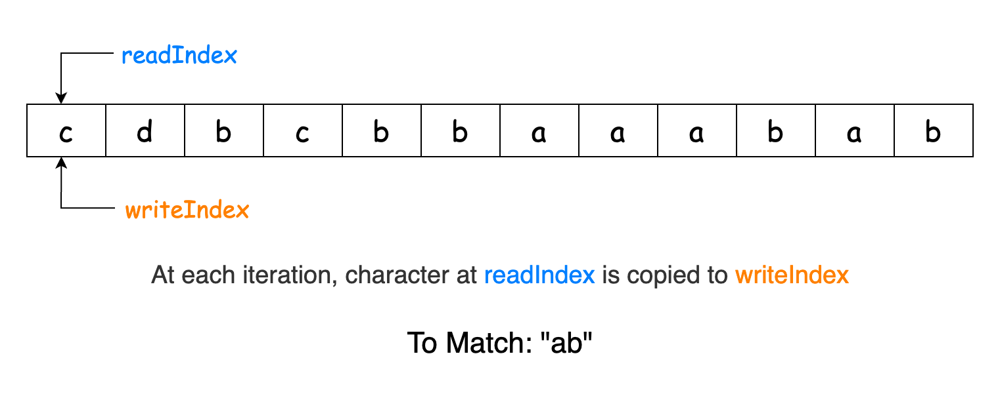

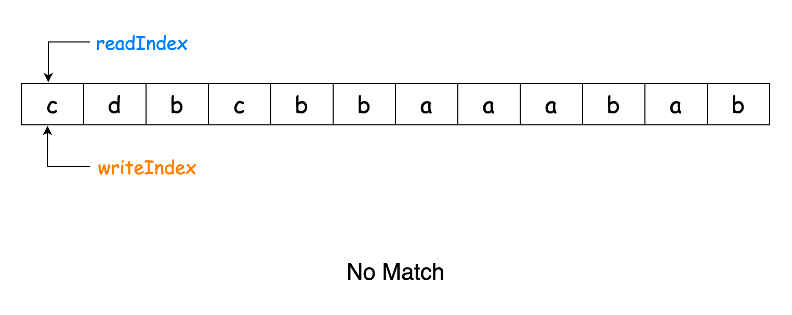

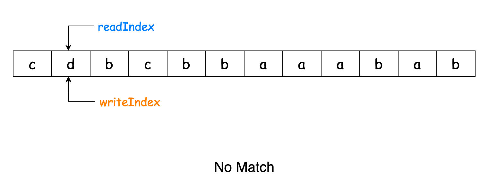

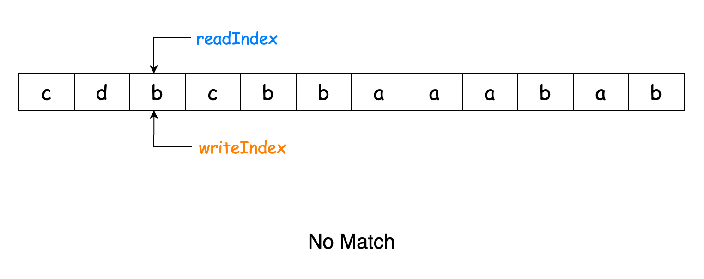

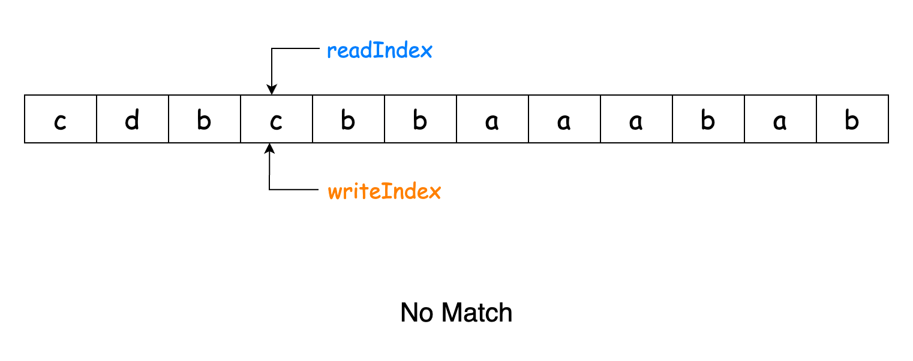

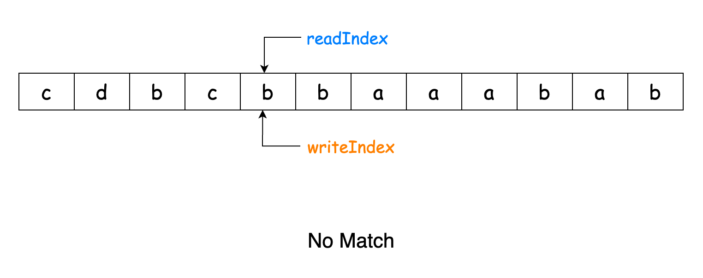

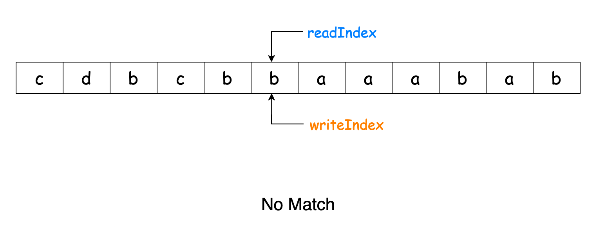

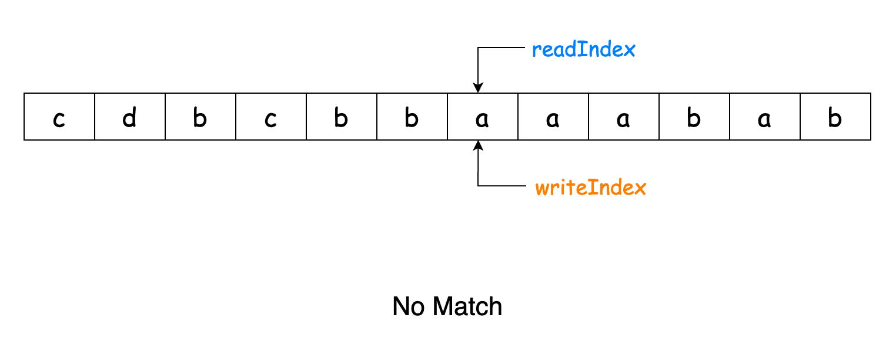

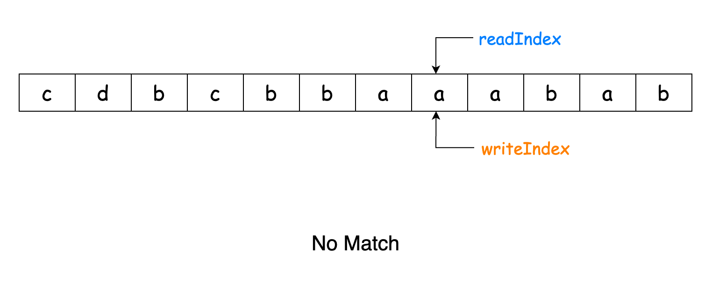

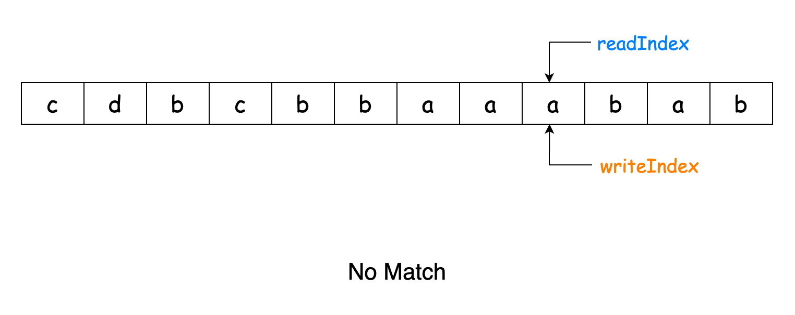

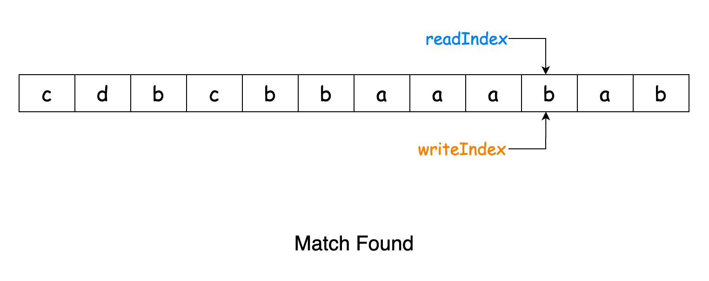

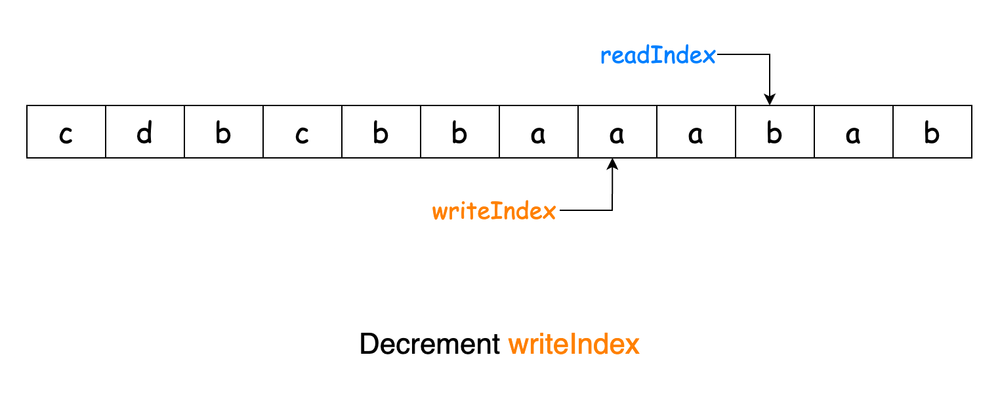

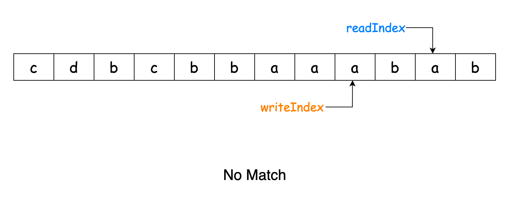

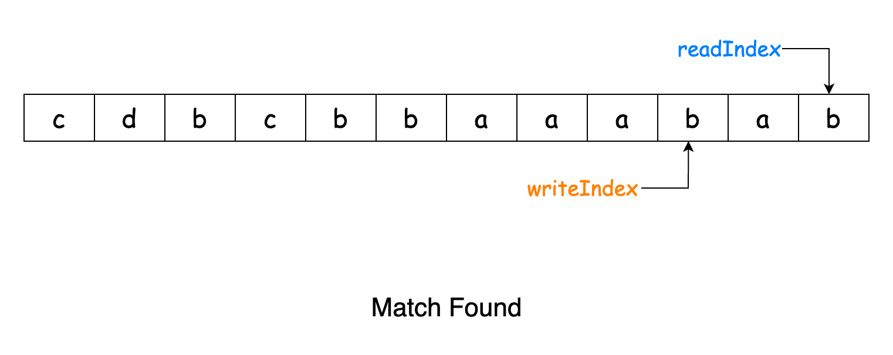

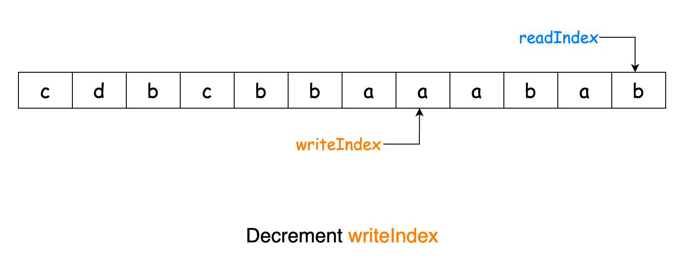

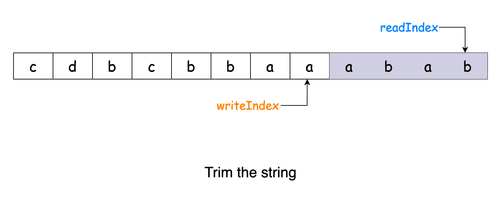

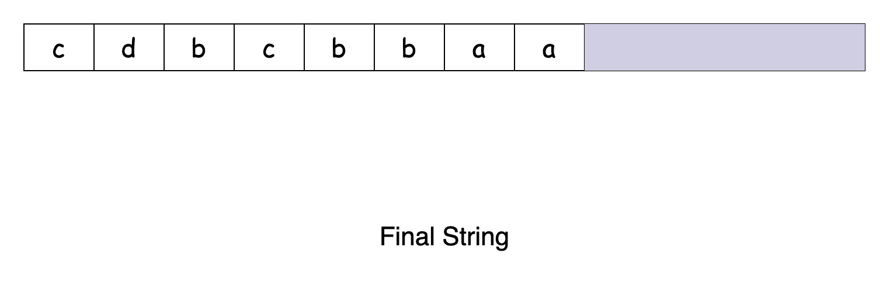

Note: The algorithm modifies the input string in place, which is feasible because strings are mutable in C++ but immutable in Java and Python3. Therefore, in Java, we convert the string to a StringBuilder object, and in Python3, to a list. This conversion increases the space complexity of the algorithm but avoids using a stack at each call of the `removeSubstring` method.

#### Algorithm

Main method `maximumGain`:

- Initialize `totalPoints` to keep track of the score.
- Compare `x` and `y` to determine which substring to remove first:
  - If `x > y`, call `removeSubstring` on "ab" first, then "ba".
  - Else, call `removeSubstring` on "ba" first, then "ab".
  - Add the value returned by `removeSubstring` after each call.
- Return `totalPoints`, which contains the maximum score from removing substrings.

Helper method `removeSubstring`:

- Define a method `removeSubstring` which takes the `inputString`, the `targetString` and `pointsPerRemoval` as parameters.
- Initialize `totalPoints` and `writeIndex` to `0`.
- Iterate through the input string using `readIndex`:
  - Copy the current character to the position at `writeIndex` and increment `writeIndex`.
  - Check if the last two written characters match the target substring:
- If so, decrement `writeIndex` by 2.
- Add `pointsPerRemoval` to `totalPoints`.
- Trim the string to remove all excess characters after `writeIndex`.
- Return `totalPoints` accumulated during this pass.

#### Implementation

```python
class Solution:

    def maximumGain(self, s: str, x: int, y: int) -> int:
        total_points = 0
        s = list(s)

        if x > y:
            # Remove "ab" first (higher points), then "ba"
            total_points += self.remove_substring(s, "ab", x)
            total_points += self.remove_substring(s, "ba", y)
        else:
            # Remove "ba" first (higher or equal points), then "ab"
            total_points += self.remove_substring(s, "ba", y)
            total_points += self.remove_substring(s, "ab", x)

        return total_points

    def remove_substring(
        self, input_string, target_substring, points_per_removal
    ):
        total_points = 0
        write_index = 0

        # Iterate through the string
        for read_index in range(0, len(input_string)):
            # Add the current character
            input_string[write_index] = input_string[read_index]
            write_index += 1

            # Check if we've written at least two characters and
            # they match the target substring
            if (
                write_index > 1
                and input_string[write_index - 2] == target_substring[0]
                and input_string[write_index - 1] == target_substring[1]
            ):
                write_index -= 2
                total_points += points_per_removal

        # Trim the list to remove any leftover characters
        del input_string[write_index:]

        return total_points
```

#### Complexity Analysis

Let $n$ be the length of the string `s`

* Time complexity: $O(n)$

    The algorithm calls `removeSubstring` twice, each iterating through the entire string once. All operations within the loop—such as character comparisons and index manipulations—are constant time. Thus, the time complexity is $2 \cdot O(n)$, which can be simplified to $O(n)$.

* Space complexity: $O(1)$ or $O(n)$

    In the C++ implementation of the algorithm, where strings are mutable, we do not use any additional data structures which scale with input size. Thus, the space complexity remains $O(1)$.

    In the Java and Python3 implementations, we use an additional data structure to bypass the caveat of immutable strings. This takes $O(n)$ space, which is the space complexity of the algorithm.

---

### Approach 3: Greedy Way (Counting)

#### Intuition

Notice that in previous approaches, removing substrings from the input string posed as the bottleneck to better performance. Instead of removing the substrings, can we count the number of substrings that can be potentially removed, and count the total score from there?

Let's consider a case where "ab" is the higher-scoring substring. To find the score, we need to form pairs of the characters `a` and `b`, where:

- If we encounter `b` and have previously seen an `a`, we can form an "ab" pair.
- If we encounter `a` and have previously seen a `b`, we can form a "ba" pair.

But, how do we ensure that the score is maximum? That's where the greedy strategy comes in:

Let's use `aCount` and `bCount` to keep track of unpaired 'a's and 'b's respectively.
1. When we come across an `a`, we simply increment `aCount`. We don't immediately pair it because a future 'b' might form a higher-scoring "ab" pair.
2. When we encounter a `b`, we have two choices. If there's an unpaired `a` available (`aCount` > 0), we immediately form an "ab" pair, decrement `aCount`, and add points, since this is the most profitable option. Otherwise, we increment `bCount` for potential future "ba" pairs.
3. When we encounter a non `a` or `b` character, it acts as a barrier. We form as many "ba" pairs as possible, add the points, and reset the counters. This segmentation ensures we don't incorrectly pair across these barriers.

The below slideshow gives a step-by-step demonstration of the entire algorithm. In this example, we consider `s = "cdbcbbaaabab"`, $x = 4$ and $y = 2$.

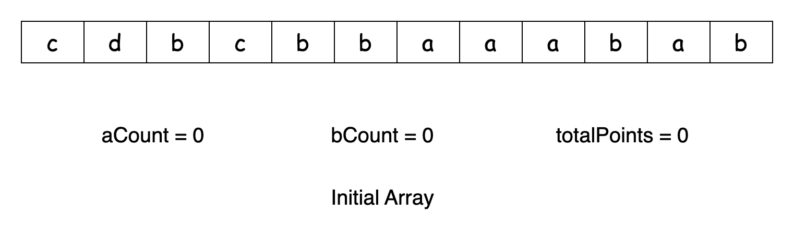

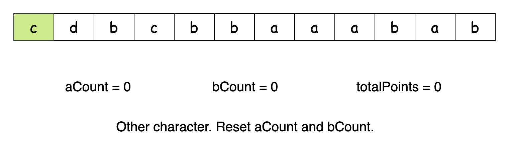

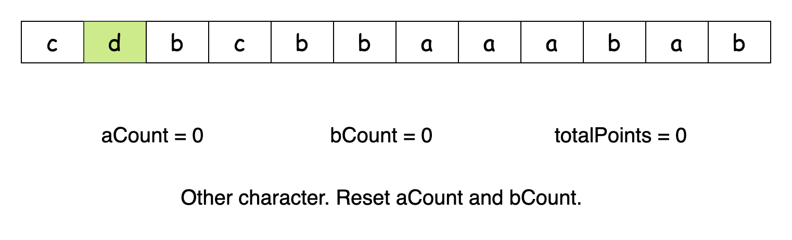

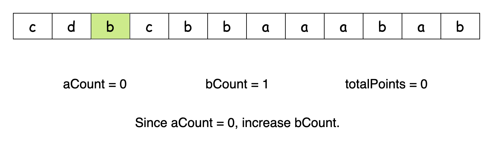

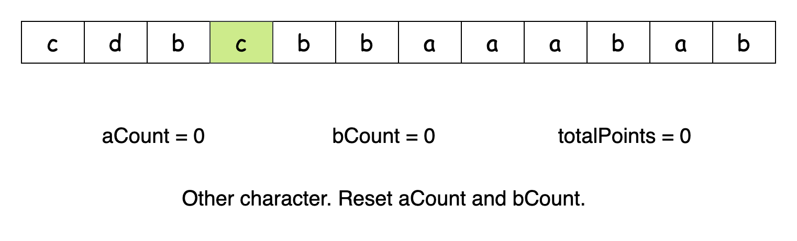

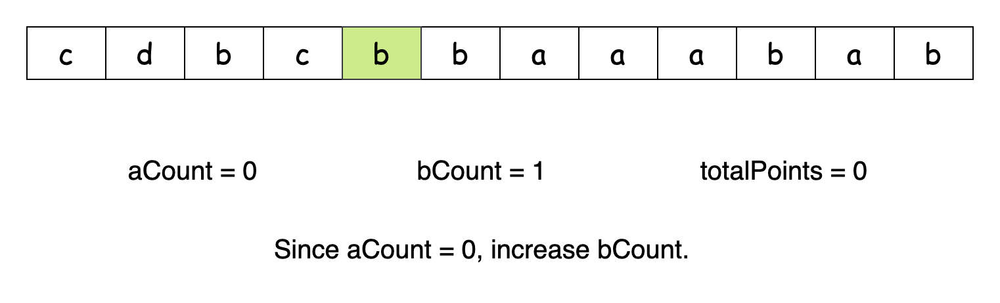

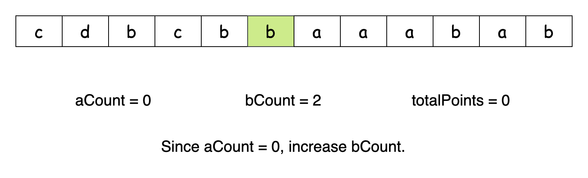

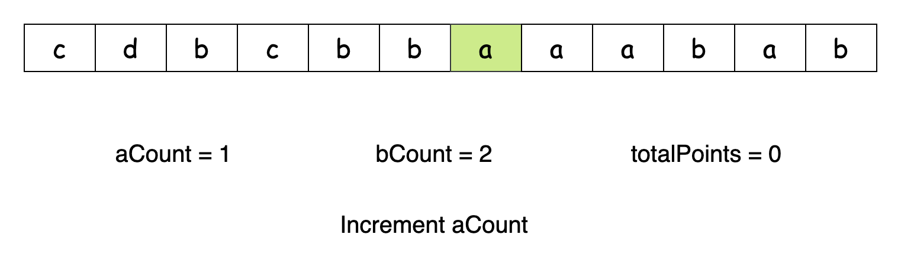

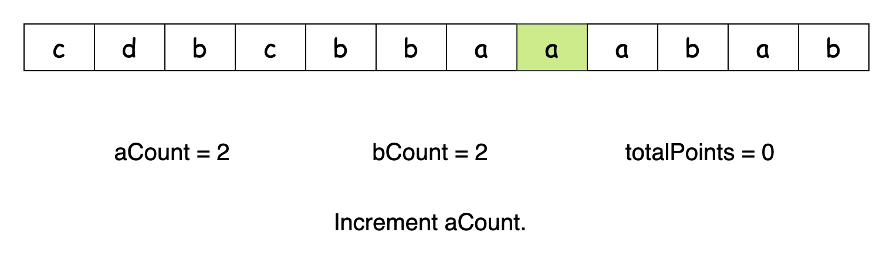

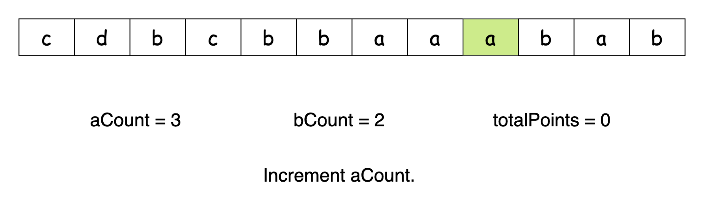

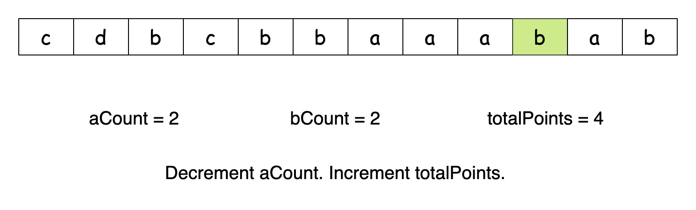

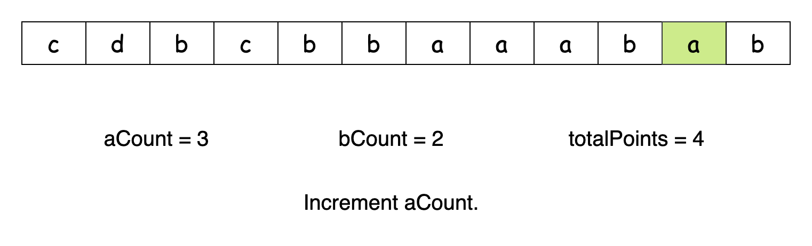

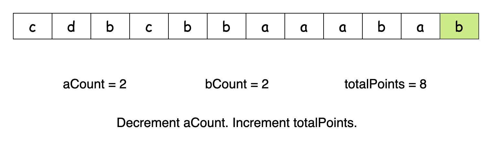

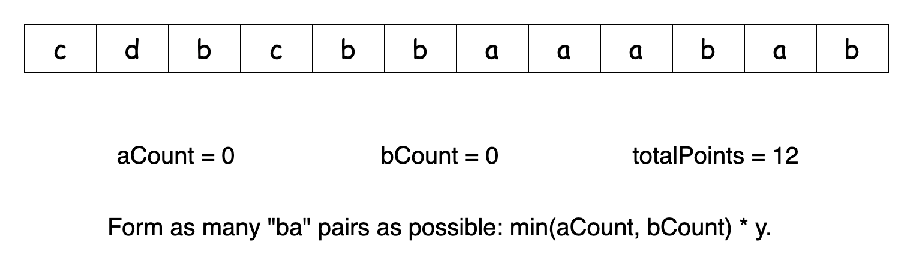

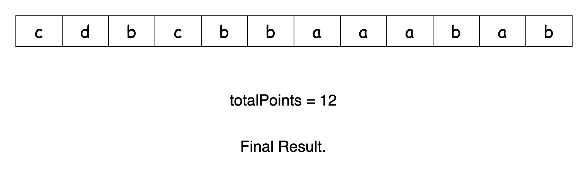

However, all of this is valid when "ab" is the higher-scoring substring. What if "ba" is the more profitable one? An easy trick to fix this is to simply reverse the given string `s` and flip the values of `x` and `y`. Since the order of counting does not matter, all "ba" substrings present in `s` are now "ab" and vice-versa.

#### Algorithm

- If `x` is less than `y`:
  - Swap the values of `x` and `y` to ensure "ab" always has higher points than "ba".
  - Reverse `s` to maintain the logic of the algorithm after swapping.
- Initialize variables:
  - `aCount` to count occurrences of 'a'.
  - `bCount` to count occurrences of 'b'.
  - `totalPoints` to accumulate the total score.
- Iterate through the string `s`. For each character:
  - If the character is 'a', increment `aCount`.
  - If the character is 'b':
- If `aCount` is greater than 0, decrement `aCount` and increment `totalPoints` by `x` (for removing "ab" and gaining points).
- Else, increment `bCount` (for potential future "ba" pairs).
  - If the character is neither `a` nor `b`:
- Increment `totalPoints` by the minimum of `aCount` and `bCount`, multiplied by `y` (for removing "ba" pairs and gaining points).
- Reset `aCount` and `bCount` to `0` to start counting for the next segment.
- Add any remaining "ba" pairs by incrementing `totalPoints` by the minimum of `aCount` and `bCount`, multiplied by `y`.
- Return `totalPoints`.

#### Implementation

```python
class Solution:
    def maximumGain(self, s: str, x: int, y: int) -> int:
        # Ensure "ab" always has higher points than "ba"
        if x < y:
            # Reverse the string to maintain logic
            s = s[::-1]
            # Swap points
            x, y = y, x

        a_count, b_count, total_points = 0, 0, 0

        for i in range(len(s)):
            if s[i] == "a":
                a_count += 1
            elif s[i] == "b":
                if a_count > 0:
                    # Can form "ab", remove it and add points
                    a_count -= 1
                    total_points += x
                else:
                    # Can't form "ab", keep 'b' for potential future "ba"
                    b_count += 1
            else:
                # Non 'a' or 'b' character encountered
                # Calculate points for any remaining "ba" pairs
                total_points += min(b_count, a_count) * y
                # Reset counters for next segment
                a_count = b_count = 0

        # Calculate points for any remaining "ba" pairs at the end
        total_points += min(b_count, a_count) * y

        return total_points
```

#### Complexity Analysis

Let $n$ be the length of the given string `s`.

* Time complexity: $O(n)$

    The algorithm reverses the string in the worst case and iterates over each character of the string exactly once, with each operation taking $O(n)$ time. Therefore, the time complexity of the algorithm is $O(n)$.

* Space complexity: $O(1)$ or $O(n)$

    In the C++ implementation of the algorithm, the string reversal takes constant space since `reverse()` flips the string in-place.

    For the Java and Python3 implementations, the string reversal requires $O(n)$ space.

    We do not use any other data structures that scale with the input size. Therefore, the space complexity of the algorithm is $O(1)$ for C++, and $O(n)$ for Java and Python3.

---