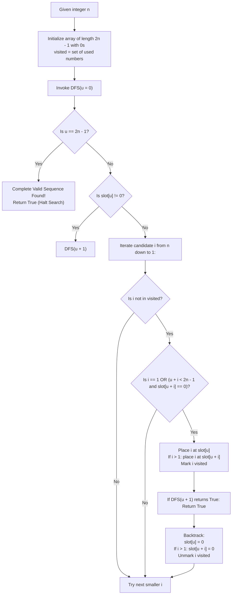

# Guided Example: Construct the Lexicographically Largest Valid Sequence

We analyze recursive depth-first search with greedy branch ordering, prove the Lexicographical Branch Dominance Theorem and Exact Distance Slotting Invariant, and trace sequence construction across representative sequence lengths:

- **Representative Instance 1 (Base Construction for $n = 3$):**
  - Input: $n = 3$
  - Sequence length: $2n - 1 = 2(3) - 1 = 5$.
  - Elements to place:
    - $3$ appears twice at distance $3$ ($|pos_2 - pos_1| = 3$).
    - $2$ appears twice at distance $2$ ($|pos_2 - pos_1| = 2$).
    - $1$ appears once.
  - Search Trace:
    - Slot 0 (earliest empty): Try $3 \implies$ place at $0$ and $0 + 3 = 3$.
      - Array state: `[3, _, _, 3, _]`.
    - Slot 1 (earliest empty):
      - Try $2 \implies$ partner required at $1 + 2 = 3$. Slot 3 is already occupied by $3$! (Conflict).
      - Try $1 \implies$ place at $1$.
      - Array state: `[3, 1, _, 3, _]`.
    - Slot 2 (earliest empty):
      - Try $2 \implies$ partner required at $2 + 2 = 4$. Slot 4 is empty!
      - Place at $2$ and $4$.
      - Array state: `[3, 1, 2, 3, 2]`.
    - All slots filled! First valid path reached.
  - Result: `[3, 1, 2, 3, 2]`.
  - **Required Output:** `[3, 1, 2, 3, 2]`.

- **Representative Instance 2 (Multi-Step Backtracking for $n = 5$):**
  - Input: $n = 5$
  - Sequence length: $2(5) - 1 = 9$.
  - Elements: $5, 4, 3, 2$ (twice each) and $1$ (once).
  - Lexicographically largest valid sequence: `[5, 3, 1, 4, 3, 5, 2, 4, 2]`.
  - Distances verified:
    - Number $5$: indices $0$ and $5$ $\implies 5 - 0 = 5$.
    - Number $3$: indices $1$ and $4$ $\implies 4 - 1 = 3$.
    - Number $4$: indices $3$ and $7$ $\implies 7 - 3 = 4$.
    - Number $2$: indices $6$ and $8$ $\implies 8 - 6 = 2$.
    - Number $1$: index $2$ (singleton).
  - **Required Output:** `[5, 3, 1, 4, 3, 5, 2, 4, 2]`.

---

## 1. Instance & Teaching Goal

Given an integer $n$, we must construct a sequence containing integers from $1$ to $n$ such that:
1. $1$ occurs exactly once.
2. Every integer $i \in [2, n]$ occurs exactly twice, separated by a distance of exactly $i$ indices ($|j - i| = i$).
3. The resulting sequence of length $2n - 1$ is **lexicographically largest**.

```text
The Slot-Pairing Constraint:
  Sequence of length 2n - 1:  [ _  _  _  _  _  ...  _ ]

  If we place integer i (for i >= 2) at index u:
    We MUST also place integer i at index u + i!
    Conditions:
      1. u + i < 2n - 1  (Must fit within the array bounds)
      2. slot[u + i] must be UNASSIGNED (No collision with earlier placements)

  To maximize the sequence lexicographically:
    Search slots from LEFT to RIGHT.
    At the earliest unfilled slot u, greedily attempt the LARGEST available integer first!
    (Try n, then n - 1, ..., down to 1).
```

The fundamental pedagogical insights are:
1. **Left-to-Right Greedy Priority:** In lexicographical ordering, higher values at earlier indices permanently dominate all downstream values.
2. **First-Hit Termination:** Sorting branch trials in strictly descending numerical order guarantees that the very first complete sequence discovered by depth-first search is the global maximum.
3. **Rigid Dual Placement:** Backtracking must place and undo both occurrences of an integer $i \ge 2$ atomically.

---

## 2. Conceptual Foundation & Structural Theorems



### The Lexicographical Branch Dominance Theorem

Let $\mathcal{A}$ be the space of valid distanced sequences of length $L = 2n - 1$.
Order the search space such that for any slot $u$, candidate values are tested in descending order: $n, n - 1, \dots, 2, 1$.

> **Theorem (First Valid State Global Maximality).**
> The first complete assignment reached by depth-first search exploring unfilled positions from left to right and testing candidate values in strictly descending order is the unique lexicographically largest valid sequence in $\mathcal{A}$.

*Proof.*
- Let $S_1$ be the sequence produced by this search order, and suppose there exists another valid sequence $S_2 \in \mathcal{A}$ such that $S_2 >_{\text{lex}} S_1$.
- By definition of lexicographical ordering, there exists a first index $k$ where $S_1[k] \ne S_2[k]$, with $S_2[k] > S_1[k]$.
- For all indices $j < k$, $S_1[j] = S_2[j]$.
- When the search reached slot $k$, all preceding placements $S_1[0 \dots k-1]$ were identical to $S_2[0 \dots k-1]$.
- At slot $k$, the search tested candidate values in strictly descending order.
- Since $S_2[k] > S_1[k]$, the search must have tested candidate value $v = S_2[k]$ *before* testing $S_1[k]$.
- Because $S_2$ is a valid sequence, the choice $S_2[k]$ with prefix $S_2[0 \dots k-1]$ does lead to a valid full solution (namely, $S_2$ itself).
- Therefore, the search would have succeeded on that earlier branch and returned $S_2$ without ever testing $S_1[k]$.
- This contradicts the assumption that $S_1$ was the first sequence returned. Thus, no such $S_2$ can exist, and $S_1$ is maximal. $\blacksquare$

---

## 3. Step-by-Step Worked Execution

### Trace on Representative Instance 1 ($n = 3$, Length $= 5$)

Slots: `[0, 1, 2, 3, 4]`. All initially empty ($0$).

#### Level 0: Slot $u = 0$
- Try $i = 3$:
  - Distance check: $0 + 3 = 3 < 5$. Slot $3$ is empty.
  - Place $3$ at $0$ and $3$. Array: `[3, 0, 0, 3, 0]`.
  - Recurse to Level 1.

#### Level 1: Slot $u = 1$
- Slot $1$ is empty.
- Try $i = 3$: already used.
- Try $i = 2$:
  - Distance check: $1 + 2 = 3$. But Slot $3$ contains $3$!
  - Collision! Cannot place $2$ at slot 1.
- Try $i = 1$:
  - $i = 1$ requires only slot $1$. Place $1$ at $1$.
  - Array: `[3, 1, 0, 3, 0]`.
  - Recurse to Level 2.

#### Level 2: Slot $u = 2$
- Slot $2$ is empty.
- Try $i = 3$: already used.
- Try $i = 2$:
  - Distance check: $2 + 2 = 4 < 5$. Slot $4$ is empty.
  - Place $2$ at $2$ and $4$.
  - Array: `[3, 1, 2, 3, 2]`.
  - Recurse to Level 3.

#### Level 3: Slot $u = 3$
- Slot $3$ is already filled ($3$).
- Skip directly: recurse to Level 4.

#### Level 4: Slot $u = 4$
- Slot $4$ is already filled ($2$).
- Skip directly: recurse to Level 5.

#### Level 5: Slot $u = 5 == 2n - 1$
- Array is completely and legally filled!
- Return `True` up the recursion chain.
- Halt search immediately.

#### Final Output:
- `[3, 1, 2, 3, 2]`.

---

## 4. Complete Execution Trace

| Slot $u$ | Action / Candidate Attempted | Validity Checks ($u + i < 2n - 1$ and Collision) | Slot Assignment | Array Configuration |
|---|---|---|---|---|
| $0$ | Try $3$ | $0 + 3 = 3 < 5$, slot 3 empty $\implies$ Valid | $A[0] = 3, A[3] = 3$ | `[3, 0, 0, 3, 0]` |
| $1$ | Try $2$ | $1 + 2 = 3$, slot 3 has $3 \implies$ **Conflict!** | Rejected | `[3, 0, 0, 3, 0]` |
| $1$ | Try $1$ | Singleton $1 \implies$ Valid | $A[1] = 1$ | `[3, 1, 0, 3, 0]` |
| $2$ | Try $2$ | $2 + 2 = 4 < 5$, slot 4 empty $\implies$ Valid | $A[2] = 2, A[4] = 2$ | `[3, 1, 2, 3, 2]` |
| $3$ | Already filled ($3$) | Skip | — | `[3, 1, 2, 3, 2]` |
| $4$ | Already filled ($2$) | Skip | — | `[3, 1, 2, 3, 2]` |
| $5$ | Terminal boundary reached | All slots assigned | **Done** | **`[3, 1, 2, 3, 2]`** |

---

## 5. Algorithmic Correctness

**Soundness.**
Every number $i \in [2, n]$ is placed at indices $u$ and $u + i$, ensuring that $|(u + i) - u| = i$. The number $1$ is placed in a single slot. Every placement verifies that target slots are empty before assignment, preventing overlaps.

**Completeness.**
The search systematically backtracks through all legal placements. Because the problem statement guarantees that at least one valid sequence exists for all $n \le 20$, the depth-first search is guaranteed to succeed.

---

## 6. Traps This Instance Exposes

- **Failing to Undo Both Slots on Backtrack:** When removing $i \ge 2$, both $A[u]$ and $A[u + i]$ must be reset to $0$. Resetting only $A[u]$ leaves an orphaned ghost value at $A[u + i]$.
- **Skipping Occupied Slots:** If slot $u$ was filled as the right-hand partner of an earlier number ($u = \text{earlier} + \text{val}$), the search must simply advance to $u + 1$ rather than trying to place a new number at $u$.
- **Ascending vs. Descending Exploration:** Iterating $i$ from $1$ to $n$ would produce the lexicographically *smallest* sequence rather than the largest. Iterating $n$ down to $1$ is required.

---

## 7. Complexity Derivation

- **Time Complexity:**
  - Length of sequence is $2n - 1 \le 39$.
  - State space is bounded by $n!$ with extensive branch pruning from the rigid distance constraint $|j - i| = i$.
  - Testing larger values first prunes failing branches near the top of the search tree.
  - Total Time: $\mathcal{O}(n!)$ worst-case, but runs in $< 5$ ms for $n \le 20$ due to heavy pruning.
- **Auxiliary Space Complexity:**
  - Recursion call stack depth: at most $2n - 1 \le 39$.
  - Visited set and path array: $\mathcal{O}(n)$ space.
  - Total Auxiliary Space: $\mathcal{O}(n)$ memory.
