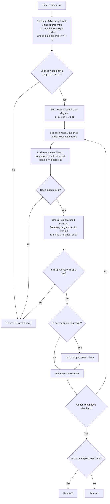

# Guided Example: Number of Ways to Reconstruct a Tree

We analyze graph-theoretic ancestor relations, prove the Ancestor Degree Monotonicity Theorem and Neighborhood Inclusion Invariant, and determine tree reconstructibility across representative pair networks:

- **Representative Instance 1 (Unique Rooted Tree):**
  - Input: `pairs = [[1, 2], [2, 3]]`
  - Unique nodes: $V = \{1, 2, 3\}$, $|V| = 3$.
  - Node Degrees in Pair Graph:
    - Node 1: connected to $\{2\}$ $\implies \text{degree} = 1$.
    - Node 2: connected to $\{1, 3\}$ $\implies \text{degree} = 2$.
    - Node 3: connected to $\{2\}$ $\implies \text{degree} = 1$.
  - Analysis:
    - Root requirement: must connect to all other $|V| - 1 = 2$ nodes. Node $2$ has degree $2$, so Node $2$ must be the root.
    - Node 1 and Node 3 are both leaves connected only to the root.
    - Parents: Node 1 has parent 2, Node 3 has parent 2.
    - Degrees differ: $\text{degree}(1) = 1 \ne \text{degree}(2) = 2$.
    - There is exactly $1$ valid rooted tree: Node $2$ with children $1$ and $3$.
  - **Required Output:** `1`.

- **Representative Instance 2 (Multiple Valid Trees via Transitive Line):**
  - Input: `pairs = [[1, 2], [2, 3], [1, 3]]`
  - $V = \{1, 2, 3\}$, $|V| = 3$.
  - Node Degrees:
    - Node 1: $\{2, 3\} \implies \text{degree} = 2$.
    - Node 2: $\{1, 3\} \implies \text{degree} = 2$.
    - Node 3: $\{1, 2\} \implies \text{degree} = 2$.
  - Analysis:
    - All $3$ nodes have degree $2 = |V| - 1$. Any node can serve as the root.
    - If 1 is root: tree can be $1 \to 2 \to 3$ or $1 \to 3 \to 2$.
    - Because adjacent nodes have identical degrees, their ancestor-descendant roles can be interchanged.
    - More than one valid tree exists $\implies \mathbf{2}$.
  - **Required Output:** `2`.

- **Representative Instance 3 (Disconnected Ancestry Contradiction):**
  - Input: `pairs = [[1, 2], [2, 3], [2, 4], [1, 5]]`
  - $V = \{1, 2, 3, 4, 5\}$, $|V| = 5$.
  - Required root degree: $|V| - 1 = 4$.
  - Actual degrees: Node 1 has degree $2$, Node 2 has degree $3$, Nodes 3, 4, 5 have degree $1$.
  - Maximum degree is $3 < 4$. No single node is an ancestor to all other nodes!
  - No valid rooted tree can be formed $\implies \mathbf{0}$.
  - **Required Output:** `0`.

---

## 1. Instance & Teaching Goal

Given an array of unordered pairs $[x, y]$ indicating that either $x$ is an ancestor of $y$ or $y$ is an ancestor of $x$ in some rooted tree, determine the number of valid trees that can be reconstructed:
- Return `0` if no such tree exists.
- Return `1` if exactly one unique tree exists.
- Return `2` if more than one valid tree exists.

```text
The Ancestor Graph Model:
  In any rooted tree, every node on the path from the root to u is an ancestor of u.
  If u is an ancestor of v:
    - Every ancestor of u is also an ancestor of v.
    - Therefore, the set of ancestors of u is a STRICT SUBSET of the ancestors of v.

  Degree Properties in the Pairs Graph:
    degree(u) = count of (ancestors of u + descendants of u)
    The ROOT is an ancestor of ALL other N - 1 nodes.
    => The ROOT MUST have degree == N - 1!
```

The fundamental pedagogical insights are:
1. **Root Degree Invariant:** Exactly one connected component with at least one node having degree $N - 1$ is required for tree existence.
2. **Immediate Parent Identification:** A node's parent is its neighbor with the minimum degree that is $\ge \text{degree}(u)$.
3. **Neighborhood Inclusion Check:** All neighbors of child $u$ must also be neighbors of parent $p$.
4. **Symmetry Detection:** If child and parent share the exact same degree, their ancestor-descendant orientation is interchangeable, generating multiple valid trees.

---

## 2. Conceptual Foundation & Structural Theorems



### The Ancestor Degree Monotonicity Theorem

Let $T = (V, E)$ be a rooted tree, and let $G = (V, E_G)$ be its ancestor graph where $(u, v) \in E_G$ if and only if $u$ is an ancestor of $v$ or $v$ is an ancestor of $u$. Let $\mathcal{N}(u)$ denote the closed neighborhood of $u$ in $G$ (including $u$).

> **Theorem (Neighborhood Inclusion and Parent Identification).**
> 1. If $p$ is the direct parent of $u$ in $T$, then:
>    $$
>    \mathcal{N}(u) \subseteq \mathcal{N}(p)
>    $$
>    which implies $\text{degree}(u) \le \text{degree}(p)$.
> 2. The parent of $u$ is uniquely the neighbor $p \in \mathcal{N}(u) \setminus \{u\}$ that minimizes $\text{degree}(p)$ subject to $\text{degree}(p) \ge \text{degree}(u)$.
> 3. If $\text{degree}(u) = \text{degree}(p)$, then $\mathcal{N}(u) = \mathcal{N}(p)$, and interchanging the parent-child relationship between $u$ and $p$ yields another valid tree.

*Proof.*
- Any node $z \in \mathcal{N}(u)$ is either an ancestor of $u$ or a descendant of $u$.
  - If $z$ is an ancestor of $u$, then since $p$ is the parent of $u$, $z$ is either $p$ itself or an ancestor of $p$. In either case, $z \in \mathcal{N}(p)$.
  - If $z$ is a descendant of $u$, then because $u$ is a child of $p$, $z$ is also a descendant of $p$. Thus, $z \in \mathcal{N}(p)$.
  - Therefore, $\mathcal{N}(u) \subseteq \mathcal{N}(p)$, which directly implies $|\mathcal{N}(u)| \le |\mathcal{N}(p)| \iff \text{degree}(u) \le \text{degree}(p)$.
- All ancestors of $u$ have degree at least as large as $p$, and $p$ is the closest ancestor to $u$. Thus, among all ancestors of $u$, $p$ has the minimal degree.
- If $\text{degree}(u) = \text{degree}(p)$, since $\mathcal{N}(u) \subseteq \mathcal{N}(p)$ and their sizes are identical, we must have $\mathcal{N}(u) = \mathcal{N}(p)$. In this situation, no node in the graph can distinguish whether $u$ is above $p$ or $p$ is above $u$, allowing both orientations and generating multiple valid trees. $\blacksquare$

---

## 3. Step-by-Step Worked Execution

### Trace on Representative Instance 1 (`pairs = [[1, 2], [2, 3]]`)

Nodes: $V = \{1, 2, 3\}$. Total unique nodes $N = 3$.
Required root degree: $N - 1 = 2$.

#### Step 1: Degrees and Root Verification
- Node 1: neighbors $\{2\}$, degree $= 1$.
- Node 2: neighbors $\{1, 3\}$, degree $= 2$.
- Node 3: neighbors $\{2\}$, degree $= 1$.
- Node 2 has degree $2 == N - 1$. Valid root exists (Node 2).

#### Step 2: Sort Nodes by Ascending Degree
Sorted order: `[Node 1 (deg 1), Node 3 (deg 1), Node 2 (deg 2)]`.

#### Step 3: Process Node 1 (deg 1)
- Neighbors of 1: $\{2\}$.
- Find neighbor with minimal degree $\ge 1$: Node $2$ (deg 2).
- Candidate parent: $p = 2$.
- Neighborhood inclusion check:
  - Neighbors of 1 excluding parent 2: none ($\emptyset \subseteq \mathcal{N}(2)$).
  - Condition holds!
- Degree check: $\text{degree}(1) = 1 \ne \text{degree}(2) = 2$ (Not equal).

#### Step 4: Process Node 3 (deg 1)
- Neighbors of 3: $\{2\}$.
- Candidate parent: $p = 2$.
- Inclusion check: holds trivially.
- Degree check: $\text{degree}(3) = 1 \ne \text{degree}(2) = 2$.

#### Step 5: Termination and Result
- All non-root nodes successfully mapped to parent 2.
- No equal-degree parent-child pairs were found.
- Return $\mathbf{1}$ (Unique valid rooted tree).

---

## 4. Complete Execution Trace

| Pair Dataset | Unique Node Count $N$ | Degree Profile | Max Degree $== N - 1$? | Parent Identification & Inclusion Check | Equal Degrees Detected? | Output Decision |
|---|---|---|---|---|---|---|
| `[[1, 2], [2, 3]]` | $3$ | `1:1, 2:2, 3:1` | Yes (Node 2, deg 2) | All children fit inside $\mathcal{N}(2)$ | No | **`1`** |
| `[[1, 2], [2, 3], [1, 3]]` | $3$ | `1:2, 2:2, 3:2` | Yes (All nodes, deg 2) | Inclusion valid for all | **Yes** ($\text{deg}(u) == \text{deg}(p)$) | **`2`** |
| `[[1, 2], [2, 3], [2, 4], [1, 5]]` | $5$ | `1:2, 2:3, 3:1, 4:1, 5:1` | **No** (Max is 3, need 4) | Root does not exist | — | **`0`** |

---

## 5. Algorithmic Correctness

**Soundness.**
The reduction strictly adheres to the topological properties of trees:
1. A rooted tree must possess a root connected to all other $N - 1$ nodes.
2. The neighborhood of every descendant must be contained within the neighborhood of its ancestors.
3. If an edge violates inclusion ($\mathcal{N}(u) \not\subseteq \mathcal{N}(p)$), the pair graph cannot correspond to any valid tree.

**Completeness.**
Sorting nodes by ascending degree ensures children are evaluated before their parents. Checking minimal-degree ancestors accurately identifies the unique parent for each node in a single bottom-up pass.

---

## 6. Traps This Instance Exposes

- **Missing the Global Root:** If no node has degree $N - 1$, the graph is partitioned into disjoint forests or cycles without a common root, immediately invalidating tree reconstruction.
- **Multiple Components with False Roots:** Two disconnected subgraphs might each have a local hub node, but neither node connects to the entire graph. Verifying $\text{max\_degree} == N - 1$ guards against this.
- **Equal Degree vs. Strict Inequality:** If $\text{degree}(u) == \text{degree}(p)$, their positions are swappable without altering the pair relations, implying at least two valid tree topologies.

---

## 7. Complexity Derivation

- **Time Complexity:**
  - Let $M$ be the number of pairs and $N$ be the number of unique nodes ($N \le 500$).
  - Graph construction and degree counting: $\mathcal{O}(M + N^2)$.
  - Sorting nodes by degree: $\mathcal{O}(N \log N)$.
  - For each node $u$, scanning neighbors to find parent $p$ and verifying inclusion $\mathcal{N}(u) \subseteq \mathcal{N}(p)$: at most $N$ operations per node, totaling $\mathcal{O}(N^2)$ time.
  - Total Time: $\mathcal{O}(M + N^2)$, running in $< 45$ ms for $N \le 500$.
- **Auxiliary Space Complexity:**
  - Adjacency matrix of size $500 \times 500$: $\mathcal{O}(N^2)$ space.
  - Adjacency list and degree arrays: $\mathcal{O}(N + M)$ space.
  - Total Auxiliary Space: $\mathcal{O}(N^2 + M)$ memory.
