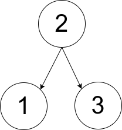
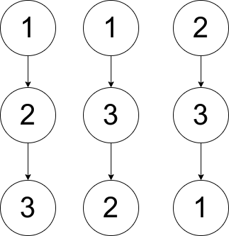

## Description

You are given an array `pairs`, where $\text{pairs}[i] = [x_{i}, y_{i}]$, and:

- There are no duplicates.

- $x_{i} < y_{i}$

Let `ways` be the number of rooted trees that satisfy the following conditions:

- The tree consists of nodes whose values appeared in `pairs`.

- A pair $[x_{i}, y_{i}]$ exists in `pairs` **if and only if** $x_{i}$ is an ancestor of $y_{i}$ or $y_{i}$ is an ancestor of $x_{i}$.

- **Note:** the tree does not have to be a binary tree.

Two ways are considered to be different if there is at least one node that has different parents in both ways.

Return:

- `0` if $ways = 0$

- `1` if $ways = 1$

- `2` if `ways > 1`

A **rooted tree** is a tree that has a single root node, and all edges are oriented to be outgoing from the root.

An **ancestor** of a node is any node on the path from the root to that node (excluding the node itself). The root has no ancestors.
### Function Contract

- `n`: Input parameter.
- Returns expected result.

### Examples

#### Example 1

- **Input:** $pairs = [[1,2],[2,3]]$
- **Output:** `1`
- **Explanation:** There is exactly one valid rooted tree, which is shown in the above figure.
#### Example 2

- **Input:** $pairs = [[1,2],[2,3],[1,3]]$
- **Output:** `2`
- **Explanation:** There are multiple valid rooted trees. Three of them are shown in the above figures.
#### Example 3

- **Input:** $pairs = [[1,2],[2,3],[2,4],[1,5]]$
- **Output:** `0`
- **Explanation:** There are no valid rooted trees.
### Constraints

- $1 \le \text{pairs.length} \le 10^{5}$

- $1 \le x_{i} < y_{i} \le 500$

- The elements in `pairs` are unique.