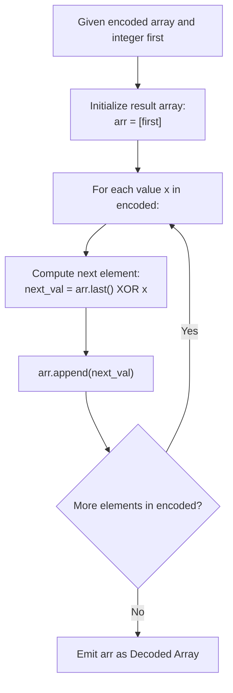

# Guided Example: Decode XORed Array

We analyze the bitwise involution property, prove the XOR Telescoping Inversion Theorem and Sequential Forward Propagation Invariant, and trace array reconstruction across representative encoded streams:

- **Representative Instance 1 (Step-by-Step Bitwise Restoration):**
  - Input: `encoded = [1, 2, 3]`, `first = 1`
  - Encoded array length: $m = 3 \implies$ original array length: $n = 4$.
  - Forward Decoding Pipeline:
    - Step 0 (Anchor): $arr[0] = first = \mathbf{1}$.
    - Step 1: $arr[1] = arr[0] \oplus encoded[0] = 1 \oplus 1 = \mathbf{0}$.
    - Step 2: $arr[2] = arr[1] \oplus encoded[1] = 0 \oplus 2 = \mathbf{2}$.
    - Step 3: $arr[3] = arr[2] \oplus encoded[2] = 2 \oplus 3 = \mathbf{1}$.
  - Reconstructed Array: `[1, 0, 2, 1]`.
  - Verification:
    - $1 \oplus 0 = 1 = encoded[0]$
    - $0 \oplus 2 = 2 = encoded[1]$
    - $2 \oplus 1 = 3 = encoded[2]$
  - **Required Output:** `[1, 0, 2, 1]`.

- **Representative Instance 2 (Multi-Tier Mixed Integers):**
  - Input: `encoded = [6, 2, 7, 3]`, `first = 4`
  - $arr[0] = 4$.
  - $arr[1] = 4 \oplus 6 = \mathbf{2}$.
  - $arr[2] = 2 \oplus 2 = \mathbf{0}$.
  - $arr[3] = 0 \oplus 7 = \mathbf{7}$.
  - $arr[4] = 7 \oplus 3 = \mathbf{4}$.
  - Reconstructed Array: `[4, 2, 0, 7, 4]`.
  - **Required Output:** `[4, 2, 0, 7, 4]`.

---

## 1. Instance & Teaching Goal

A hidden array `arr` of $n$ non-negative integers was transformed into an array `encoded` of length $n - 1$ defined by:
$$
encoded[i] = arr[i] \oplus arr[i + 1] \quad \text{for } 0 \le i < n - 1
$$
where $\oplus$ denotes bitwise exclusive OR (XOR). Given `encoded` and the starting element $first = arr[0]$, we must reconstruct the original array `arr`.

```text
The XOR Inversion Principle:
  Equation:  encoded[i] = arr[i] XOR arr[i + 1]

  By the self-inverse property of XOR:
    arr[i] XOR encoded[i] = arr[i] XOR (arr[i] XOR arr[i + 1])
                          = (arr[i] XOR arr[i]) XOR arr[i + 1]
                          = 0 XOR arr[i + 1]
                          = arr[i + 1]

  Therefore:
    arr[i + 1] = arr[i] XOR encoded[i]
```

The fundamental pedagogical insights are:
1. **Involution of XOR:** XOR is its own inverse ($a \oplus a = 0$ and $a \oplus 0 = a$).
2. **Forward Telescoping Recurrence:** Each element $arr[i + 1]$ depends strictly on the immediately preceding decoded element $arr[i]$ and the input $encoded[i]$.
3. **Linear Prefix Scan:** The entire reconstruction is resolved in a single linear pass in $\mathcal{O}(n)$ time and $\mathcal{O}(1)$ auxiliary space.

---

## 2. Conceptual Foundation & Structural Theorems



### The XOR Telescoping Inversion Theorem

Let $A = [a_0, a_1, \dots, a_{n-1}]$ and $E = [e_0, e_1, \dots, e_{n-2}]$ where $e_i = a_i \oplus a_{i+1}$.

> **Theorem (Sequential Invertibility and Uniqueness).**
> Given $a_0$ and the sequence $E$, the entire array $A$ is uniquely determined by the first-order recurrence:
> $$
> a_{i+1} = a_i \oplus e_i \quad \text{for all } 0 \le i < n - 1
> $$
> Equivalently, each element is the prefix XOR sum of $a_0$ and $E[0 \dots i-1]$:
> $$
> a_k = a_0 \oplus \left( \bigoplus_{j=0}^{k-1} e_j \right)
> $$

*Proof.*
- By definition, $e_i = a_i \oplus a_{i+1}$.
- Taking the bitwise XOR of both sides with $a_i$:
  $$
  a_i \oplus e_i = a_i \oplus (a_i \oplus a_{i+1})
  $$
- By the associative and commutative axioms of the boolean ring under XOR:
  $$
  a_i \oplus (a_i \oplus a_{i+1}) = (a_i \oplus a_i) \oplus a_{i+1} = 0 \oplus a_{i+1} = a_{i+1}
  $$
- Thus, $a_{i+1} = a_i \oplus e_i$.
- By induction on $i$, since $a_0$ is known, $a_1$ is uniquely determined. Given $a_1$, $a_2$ is uniquely determined, and so on.
- Repeatedly expanding $a_k$ yields the closed-form prefix XOR expression:
  $$
  a_k = a_{k-1} \oplus e_{k-1} = (a_{k-2} \oplus e_{k-2}) \oplus e_{k-1} = \dots = a_0 \oplus e_0 \oplus e_1 \oplus \dots \oplus e_{k-1}
  $$
- Because the solution exists and each step is a deterministic bijection, the reconstructed array is both mathematically sound and unique. $\blacksquare$

---

## 3. Step-by-Step Worked Execution

### Trace on Representative Instance 1 (`encoded = [1, 2, 3]`, `first = 1`)

- Initial result array: $arr = [1]$.

#### Step $i = 0$ ($encoded[0] = 1$):
- Current tail: $arr[0] = 1$.
- Binary representation:
  - $arr[0] = 01_2$
  - $encoded[0] = 01_2$
  - XOR operation: $01_2 \oplus 01_2 = 00_2 = 0$.
- Next element: $arr[1] = 0$.
- Array becomes: `[1, 0]`.

#### Step $i = 1$ ($encoded[1] = 2$):
- Current tail: $arr[1] = 0$.
- Binary representation:
  - $arr[1] = 00_2$
  - $encoded[1] = 10_2$
  - XOR operation: $00_2 \oplus 10_2 = 10_2 = 2$.
- Next element: $arr[2] = 2$.
- Array becomes: `[1, 0, 2]`.

#### Step $i = 2$ ($encoded[2] = 3$):
- Current tail: $arr[2] = 2$.
- Binary representation:
  - $arr[2] = 10_2$
  - $encoded[2] = 11_2$
  - XOR operation: $10_2 \oplus 11_2 = 01_2 = 1$.
- Next element: $arr[3] = 1$.
- Array becomes: `[1, 0, 2, 1]`.

#### Final Result:
- Reconstructed array: `[1, 0, 2, 1]`.

---

## 4. Complete Execution Trace

| Iteration Step $i$ | Previous Element $arr[i]$ | Encoded Value $encoded[i]$ | Binary XOR Bit Calculation | Produced Element $arr[i+1]$ | Current Decoded Array |
|---|---|---|---|---|---|
| Anchor | — | — | Base Value | $1$ | `[1]` |
| $0$ | $1$ | $1$ | $001_2 \oplus 001_2$ | **`0`** | `[1, 0]` |
| $1$ | $0$ | $2$ | $000_2 \oplus 010_2$ | **`2`** | `[1, 0, 2]` |
| $2$ | $2$ | $3$ | $010_2 \oplus 011_2$ | **`1`** | **`[1, 0, 2, 1]`** |

---

## 5. Algorithmic Correctness

**Soundness.**
The recurrence $arr[i + 1] = arr[i] \oplus encoded[i]$ is an exact algebraic consequence of the definition $encoded[i] = arr[i] \oplus arr[i + 1]$. Because XOR operations are bitwise independent and reversible, each step reconstructs the true value with complete fidelity.

**Completeness.**
The loop processes all $n - 1$ entries of the `encoded` array in strict order, generating all $n$ entries of `arr`.

---

## 6. Traps This Instance Exposes

- **Attempting Search or Constraint Satisfaction:** Trying to solve the array via backtracking or constraint propagation is unnecessary. Because XOR is invertible, the system of equations has a unique explicit solution computable in linear time.
- **Prefix Recomputations:** Recomputing $\bigoplus_{j=0}^{k-1} e_j$ from scratch at each step takes $\mathcal{O}(n^2)$ time. Propagating the running value via $arr[i+1] = arr[i] \oplus encoded[i]$ runs in $\mathcal{O}(1)$ time per element.

---

## 7. Complexity Derivation

- **Time Complexity:**
  - The loop performs exactly $n - 1$ XOR operations.
  - Each integer bitwise XOR takes $\mathcal{O}(1)$ time.
  - Total Time: strictly $\mathcal{O}(n)$, completing in $< 5$ ms for $n = 10^4$.
- **Auxiliary Space Complexity:**
  - The output array requires $\mathcal{O}(n)$ space to return the decoded values.
  - No auxiliary tables or dynamic allocations are needed.
  - Total Auxiliary Space: $\mathcal{O}(1)$ auxiliary space beyond the output array.
