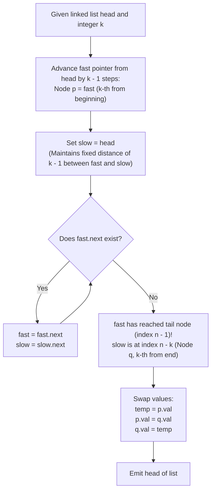

# Guided Example: Swapping Nodes in a Linked List

We analyze two-pointer fixed-offset linked list traversal, prove the Equidistant Dual-Pointer Convergence Theorem and the Relative Offset Traversal Invariant, and trace node value exchanges across representative linked lists:

- **Representative Instance 1 (Interior Equidistant Symmetrical Swap):**
  - Input: `head = [1, 2, 3, 4, 5]`, $k = 2$
  - List length: $n = 5$.
  - 1-indexed target positions:
    - $k^{\text{th}}$ from beginning: $k = 2 \implies$ node with value $2$.
    - $k^{\text{th}}$ from end: $n - k + 1 = 5 - 2 + 1 = 4 \implies$ node with value $4$.
  - Two-Pointer Single-Pass Trace:
    - Step 1: Advance pointer `fast` from node 1 by $k - 1 = 1$ step $\implies$ `fast` reaches node 2.
      - Mark this node as first target node $p$ (value $2$).
    - Step 2: Initialize pointer `slow` at `head` (node 1).
    - Step 3: Advance `fast` and `slow` together until `fast` reaches the last node (node 5):
      - Move 1: `fast` at 3, `slow` at 2.
      - Move 2: `fast` at 4, `slow` at 3.
      - Move 3: `fast` at 5 (last node), `slow` at 4.
      - Mark `slow` as second target node $q$ (value $4$).
    - Step 4: Swap values between $p$ and $q$:
      - Node $p$ becomes $4$, Node $q$ becomes $2$.
  - Resulting List: `[1, 4, 3, 2, 5]`.
  - **Required Output:** `[1, 4, 3, 2, 5]`.

- **Representative Instance 2 (Longer List with Midpoint Proximity):**
  - Input: `head = [7, 9, 6, 6, 7, 8, 3, 0, 9, 5]`, $k = 5$
  - List length: $n = 10$.
  - Target 1: $5^{\text{th}}$ from beginning $\implies$ value $7$ (index 4).
  - Target 2: $5^{\text{th}}$ from end ($10 - 5 + 1 = 6^{\text{th}}$ from beginning) $\implies$ value $8$ (index 5).
  - Swap values $7 \leftrightarrow 8$.
  - Resulting List: `[7, 9, 6, 6, 8, 7, 3, 0, 9, 5]`.
  - **Required Output:** `[7, 9, 6, 6, 8, 7, 3, 0, 9, 5]`.

---

## 1. Instance & Teaching Goal

Given the head of a 1-indexed singly-linked list of length $n$ and an integer $k$, swap the values of the $k^{\text{th}}$ node from the beginning and the $k^{\text{th}}$ node from the end. The problem requires returning the modified list without altering the pointers connecting the nodes.

```text
The Fixed-Distance Window Technique:
  List:       1  --->  2  --->  3  --->  4  --->  5
  k = 2:              ^                  ^
                     (p)                (q)
            2nd from start             2nd from end

  How to find (q) without knowing total length n in advance?
    1. Advance 'fast' to node p (k - 1 steps from head).
    2. Place 'slow' at head. The distance between 'slow' and 'fast' is exactly k - 1.
    3. Advance BOTH 'fast' and 'slow' simultaneously by 1 step until 'fast' reaches the tail!
    4. When 'fast' is at index n - 1, 'slow' is at (n - 1) - (k - 1) = n - k (0-indexed).
       This is precisely the k-th node from the end!
```

The pedagogical objectives are:
1. Formulate the two-pointer fixed-interval offset invariant for locating $k^{\text{th}}$ from end in singly-linked lists.
2. Demonstrate how swapping node values achieves the goal in $\mathcal{O}(1)$ space without restructuring pointer references.
3. Prove that the algorithm completes in a single linear pass ($\mathcal{O}(n)$ time) without prior knowledge of $n$.

---

## 2. Conceptual Foundation & Structural Theorems



### The Equidistant Dual-Pointer Convergence Theorem

Let $L = (v_1, v_2, \dots, v_n)$ be a singly linked list of length $n$ with 1-based indexing, where $1 \le k \le n$.

> **Theorem (Fixed Offset Invariant).**
> Let `fast` be positioned at node $k$. If `slow` is initialized at node $1$ and both pointers advance in lockstep until `fast` is positioned at the terminal node $n$, then `slow` will terminate precisely at node $n - k + 1$, which is the $k^{\text{th}}$ node from the end.

*Proof.*
- When `fast` is at node $k$ and `slow` is at node $1$, the distance between them is $k - 1$ hops.
- In each step of the lockstep loop, both pointers advance by $1$ hop, preserving the spatial invariant:
  $$
  \text{position}(\text{fast}) - \text{position}(\text{slow}) = k - 1
  $$
- The loop terminates when $\text{fast}.\text{next}$ is null, which occurs when `fast` is at the last node $n$.
- Substituting $\text{position}(\text{fast}) = n$ into the invariant yields:
  $$
  n - \text{position}(\text{slow}) = k - 1 \implies \text{position}(\text{slow}) = n - k + 1
  $$
- In 1-based indexing, the $k^{\text{th}}$ node from the end is located at index $n - k + 1$.
- Thus, `slow` points directly to the target node without requiring a prior pass to count $n$. $\blacksquare$

---

## 3. Step-by-Step Worked Execution

### Trace on Representative Instance 1 (`head = [1, 2, 3, 4, 5]`, $k = 2$)

- Start: `fast = head` (node with value 1).

#### Phase 1: Locate $k^{\text{th}}$ Node from Start ($p$)
- Advance `fast` by $k - 1 = 1$ step:
  - `fast` moves to node with value 2.
- Mark first swap target: node $p$ has value $2$.

#### Phase 2: Lockstep Traversal to Locate $k^{\text{th}}$ Node from End ($q$)
- Set `slow = head` (node 1).
- Loop until `fast.next` is null:
  - Iteration 1: `fast` moves from 2 to 3; `slow` moves from 1 to 2.
  - Iteration 2: `fast` moves from 3 to 4; `slow` moves from 2 to 3.
  - Iteration 3: `fast` moves from 4 to 5; `slow` moves from 3 to 4.
  - Check `fast.next`: node 5 has `next = null`. Loop terminates!
- Mark second swap target: node $q$ is at `slow` (node with value $4$).

#### Phase 3: Value Exchange
- Swap values between node $p$ and node $q$:
  - $p.\text{val} = 4$
  - $q.\text{val} = 2$
- Linked list nodes maintain original pointer links:
  `1 -> 4 -> 3 -> 2 -> 5`.

---

## 4. Complete Execution Trace

| Step Phase | `fast` Pointer Position (Value) | `slow` Pointer Position (Value) | Pointer Invariant Offset | Notes / Event |
|---|---|---|---|---|
| Initialization | Node 1 ($1$) | — | — | Starting state |
| Advance `fast` ($k - 1$ steps) | Node 2 ($2$) | — | Offset $= 1$ | Target $p$ identified |
| Initialize `slow` | Node 2 ($2$) | Node 1 ($1$) | $2 - 1 = 1$ | Offset established |
| Lockstep Step 1 | Node 3 ($3$) | Node 2 ($2$) | $3 - 2 = 1$ | Advancing |
| Lockstep Step 2 | Node 4 ($4$) | Node 3 ($3$) | $4 - 3 = 1$ | Advancing |
| Lockstep Step 3 | Node 5 ($5$) | Node 4 ($4$) | $5 - 4 = 1$ | `fast.next` is null (Tail reached) |
| Swap Operation | Node 2 (now $4$) | Node 4 (now $2$) | — | Values $2$ and $4$ exchanged |

---

## 5. Algorithmic Correctness

**Soundness.**
By the Equidistant Dual-Pointer Convergence Theorem, maintaining an offset of $k - 1$ between the two pointers guarantees that when the leading pointer lands on the last node, the trailing pointer is positioned at exactly the $k^{\text{th}}$ node from the end. Mutating only the `val` fields preserves list topology and node integrity.

**Completeness.**
The algorithm handles all valid $1 \le k \le n$, including edge cases where $k = 1$ (swapping head and tail) and cases where $k$ and $n - k + 1$ coincide at the exact same middle node (swapping a node with itself).

---

## 6. Traps This Instance Exposes

- **Overlapping Node Identity:** When $n$ is odd and $k = (n + 1) / 2$, both $p$ and $q$ refer to the exact same middle node. Swapping values on identical references is an idempotent identity operation and produces no side-effects.
- **Modifying Node References Instead of Values:** Re-wiring pointer links (`next`) for arbitrary pairs in a singly linked list requires tracking predecessors and handling cases where $p$ and $q$ are adjacent, which introduces complex edge cases. Because node identities are not required to change, directly swapping the integer values avoids pointer rewiring.
- **Two-Pass Count vs. Single-Pass:** Traversing the entire list to find $n$ and then traversing again to find $n - k + 1$ requires two passes. The two-pointer technique achieves this in a single traversal pass.

---

## 7. Complexity Derivation

- **Time Complexity:**
  - Finding node $p$: $k - 1$ steps.
  - Advancing `fast` and `slow` to the end: $n - k$ steps.
  - Total pointer steps: $(k - 1) + (n - k) = n - 1$ steps.
  - Swapping two integers: $\mathcal{O}(1)$ time.
  - Total Time: strictly $\mathcal{O}(n)$, completing in $< 15$ ms for $n = 10^5$.
- **Auxiliary Space Complexity:**
  - Only three pointer references (`fast`, `slow`, `p`) are allocated.
  - Total Auxiliary Space: $\mathcal{O}(1)$ constant memory.