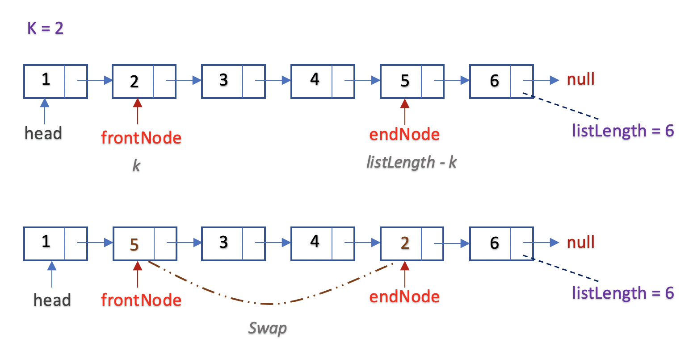
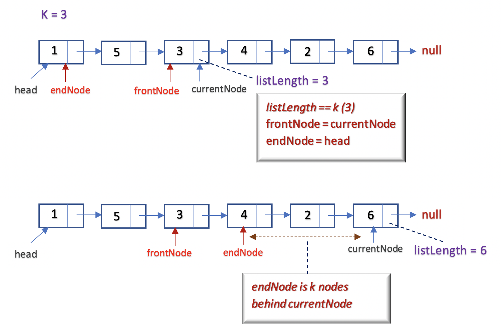

[TOC]

## Solution
---

#### Overview

This is a simple problem based on the [Linked List](https://en.wikipedia.org/wiki/Linked_list) data structure. If you have solved problems using a Linked List before and have a basic idea on how a Linked List is traversed and modified, this problem will be easy to implement.

The general idea behind the problem is that we have to find the $k^{th}$ node from the beginning and the $k^{th}$ node from the end of the _Linked List_. Once we have pointers to both of these nodes, we could simply swap their values.

> The problem description states that we have to swap the **values** of the nodes. Therefore, the actual nodes in the Linked List should remain unchanged and there is no need to change the actual list node pointers.

In this article, we're going to look at 3 different approaches. Each approach further reduces the number of passes we need to do through the list. Let's look at the approaches in detail.

---

#### Approach 1: Three Pass Approach

**Intuition**

Given the problem to swap $2$ nodes in the linked list at $k^{th}$ position, we need to position $2$ pointers. The first pointer would point to the $k^{th}$ node at the beginning of the list given by `frontNode`. The second pointer would point to the $k^{th}$ node at the end of the list given by `endNode`.

Finding the position of `frontNode` is simple. We can start traversing from the `head` node until we reach the $k^{th}$ node. But to find the `endNode`, we must first know the length of the Linked List. If the length of the Linked List is $\text{listLength}$, the $k^{th}$ node from the end would be the $\text{(listLength - k)}^{th}$ node.

The following figure illustrates the idea.



**Algorithm**

As explained above, we must implement the algorithm using 3 separate passes.

_Pass 1_: Find the length of the Linked List by traversing each node in the list from `head` node to last node and increment the counter by $1$. Let the counter used to find length be `listLength`.

_Pass 2_: Traverse until the $k^{th}$ node from the `head` node and set the `frontNode`.

_Pass 3_: Traverse until the $listLength - k$ node from the `head` node and set the `endNode`.

- Swap the values of `frontNode` and `endNode`  using temporary variable `temp`.

- Return the `head` node.

**Implementation**

```cpp
class Solution {
public:
    ListNode* swapNodes(ListNode* head, int k) {
        int listLength = 0;
        ListNode* currentNode = head;
        // find the length of linked list
        while (currentNode) {
            listLength++;
            currentNode = currentNode->next;
        }
        // set the front node at kth node
        ListNode* frontNode = head;
        for (int i = 1; i < k; i++) {
            frontNode = frontNode->next;
        }
        // set the end node at (listLength - k)th node
        ListNode* endNode = head;
        for (int i = 1; i <= listLength - k; i++) {
            endNode = endNode->next;
        }
        // swap the values of front node and end node
        swap(frontNode->val, endNode->val);
        return head;
    }
};
```

**Complexity Analysis**

- Time Complexity : $\mathcal{O}(n)$, where $n$ is the length of the Linked List. We are iterating over the Linked List thrice.

  In the first pass, we are finding the length of the Linked List which would take $\mathcal{O}(n)$ time.

  In second pass and third pass, we are iterating `k` and $n - k$ times respectively. This would take $\mathcal{O}(k + n - k)$ i.e $\mathcal{O}(n)$ time.

  Thus, the total time complexity would be $\mathcal{O}(n) + \mathcal{O}(n) = \mathcal{O}(n)$.

- Space Complexity: $\mathcal{O}(1)$, as we are using constant extra space to maintain list node pointers `frontNode`, `endNode` and `currentNode`.

---

#### Approach 2: Two Pass Approach

_Approach 1_ solved the problem with three passes, in $O(n)$ time. We can't do better than $O(n)$, because all valid solutions must count how many nodes there are in order to be able to find the $k^{th}$ last node. But while we know we can't do better than $O(n)$, it's still often preferable to minimize the number of loops needed for Linked List problems.

> **Interview Tip:** Reducing the number of passes/separate loops is a very common follow-up question for Linked List problems.

The first optimization we could think of over the three pass approach is that we could find the length of the Linked List as well as the position of `frontNode` in a single pass.

To find the length of the Linked List we are iterating from the `head` node until the end of the Linked List. On the way, we would also come across the $k^{th}$ node from the head of the list and we could set the `frontNode` pointer at the point.

**Algorithm**

The problem can be solved in two passes with the following steps:

- Iterate from the head of the Linked List until the end and store the length found in `listLength`. In the same loop, check if we have reached the $k^{th}$ node, and if so, set `frontNode` to point at that node.

- Iterate from `head` node until $listLength - k$ node and set the `endNode`.

- Swap the values of `frontNode` and `endNode` using temporary variable `temp`.

- Return the `head` node.

**Implementation**

```cpp
class Solution {
public:
    ListNode* swapNodes(ListNode* head, int k) {
        int listLength = 0;
        ListNode* frontNode;
        ListNode* endNode;
        ListNode* currentNode = head;
        while (currentNode) {
            listLength++;
            if (listLength == k) {
                frontNode = currentNode;
            }
            currentNode = currentNode->next;
        }
        endNode = head;
        for (int i = 1; i <= listLength - k; i++) {
            endNode = endNode->next;
        }
        // swap front node and end node values
        swap(frontNode->val, endNode->val);
        return head;
    }
};
```

**Complexity Analysis**

- Time Complexity : $\mathcal{O}(n)$, where $n$ is the length of the Linked List. We are iterating over the Linked List twice.

  In the first pass, we are finding the length of the Linked List and setting the `frontNode` which would take $\mathcal{O}(n)$ time.

  In the second pass, we are setting the `endNode` by iterating $n - k$ times.

  Thus, the total time complexity would be $\mathcal{O}(n) + \mathcal{O}(n - k)$ which is equivalent to $\mathcal{O}(n)$.

- Space Complexity: $\mathcal{O}(1)$, as we are using constant extra space to maintain list node pointers `frontNode`, `endNode` and `currentNode`.

---
#### Approach 3: Single Pass Approach

**Intuition**

_Can we implement the problem in a single pass?_
The problem is that to find the position of `endNode` we must know the length of the Linked List. And to find the length of the Linked List we must have iterated over the list before at least once.

However, we could use a trick to find the position of the pointer `endNode` in a single pass. The trick is:

_If `endNode` is `k` positions behind a certain node `currentNode`, when `currentNode` reaches the end of linked list i.e at $n^{th}$ node , the `endNode` would be at the $n - k^{th}$ node_.

> A similar trick is used in a few other Linked List problems like [Remove Nth Node From the End of List](https://leetcode.com/problems/remove-nth-node-from-end-of-list/solution/) and the _Fast and Slow Pointer Approach_ in [Find The Middle Of Linked List](https://leetcode.com/problems/middle-of-the-linked-list/solution/).

The following figure illustrates the idea.



Let's see how we can implement this approach.

**Algorithm**

The problem can be implemented in a single pass using the following steps,

- Start iterating from the `head` of the Linked List until the end using a pointer `currentNode`.

- Keep track of the number of nodes traversed so far using the variable `listLength`. The `listLength` is incremented by $1$ as each node is traversed.

- If `listLength` is equal to `k`, we know that `currentNode` is pointing to the $k^{th}$ node from the beginning. Set `frontNode` to point to the $k^{th}$ node. Also, at this point, initialize `endNode` to point at the `head` of the linked list. Now we know that `endNode` is `k` nodes behind the `head` node.

- If `endNode` is not null, we know that it is positioned `k` nodes behind the `currentNode` and so we increment `endNode` in addition to `currentNode`. When `currentNode` reaches the end of the list, `endNode` would be pointing at a node which is `k` nodes behind the last node.

- Swap the values of `frontNode` and `endNode` using temporary variable `temp`.

- Return the `head` node.

**Implementation**

```cpp
class Solution {
public:
    ListNode* swapNodes(ListNode* head, int k) {
        int listLength = 0;
        ListNode* frontNode = nullptr;
        ListNode* endNode = nullptr;
        ListNode* currentNode = head;
        // set the front node and end node in single pass
        while (currentNode) {
            listLength++;
             if(endNode != NULL) {
                endNode = endNode->next;
             }
            // check if we have reached kth node
            if (listLength == k) {
                frontNode = currentNode;
                endNode = head;
            }
            currentNode = currentNode->next;
        }
        // swap the values of front node and end node
        swap(frontNode->val, endNode->val);
        return head;
    }
};
```

**Complexity Analysis**

- Time Complexity : $\mathcal{O}(n)$, where $n$ is the size of Linked List. We are iterating over the entire Linked List once.

- Space Complexity: $\mathcal{O}(1)$, as we are using constant extra space to maintain list node pointers `frontNode`, `endNode` and `currentNode`.