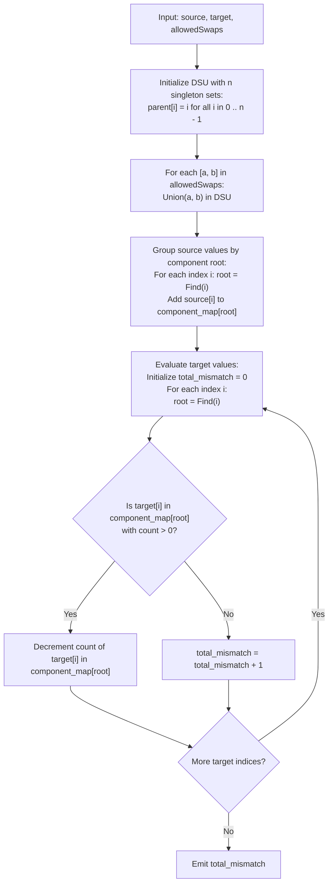

# Guided Example: Minimize Hamming Distance After Swap Operations

We analyze permutation equivalence classes under disjoint set union (DSU), prove the Symmetric Group Action Transitivity Theorem and Component Multiset Matching Invariant, and trace Hamming distance minimization across representative swap networks:

- **Representative Instance 1 (Disjoint Pairwise Swap Clusters):**
  - Input: `source = [1, 2, 3, 4]`, `target = [2, 1, 4, 5]`, `allowedSwaps = [[0, 1], [2, 3]]`
  - Index Graph Components:
    - Component A: indices $\{0, 1\}$
    - Component B: indices $\{2, 3\}$
  - Multiset Alignment:
    - **Component A (indices $\{0, 1\}$):**
      - `source` values: $\{1, 2\}$.
      - `target` values: $\{2, 1\}$.
      - Values match completely! Can swap indices $0$ and $1$ to yield $[2, 1]$.
      - Mismatches in Component A: $\mathbf{0}$.
    - **Component B (indices $\{2, 3\}$):**
      - `source` values: $\{3, 4\}$.
      - `target` values: $\{4, 5\}$.
      - Common elements: $\{4\}$ (can be placed at index 2).
      - Unmatched target value: $5$ has no corresponding $5$ in source.
      - Mismatches in Component B: $\mathbf{1}$.
  - Total minimum Hamming distance: $0 + 1 = \mathbf{1}$.
  - **Required Output:** `1`.

- **Representative Instance 2 (Zero Allowed Swaps Identity):**
  - Input: `source = [1, 2, 3, 4]`, `target = [1, 3, 2, 4]`, `allowedSwaps = []`
  - All indices form singleton components: $\{0\}, \{1\}, \{2\}, \{3\}$.
  - Differences evaluated at static positions:
    - Index 0: $1 == 1$ (Match).
    - Index 1: $2 \ne 3$ (Mismatch).
    - Index 2: $3 \ne 2$ (Mismatch).
    - Index 3: $4 == 4$ (Match).
  - Minimum Hamming distance: $\mathbf{2}$.
  - **Required Output:** `2`.

- **Representative Instance 3 (Full Transitive Component Permutation):**
  - Input: `source = [5, 1, 2, 4, 3]`, `target = [1, 5, 4, 2, 3]`, `allowedSwaps = [[0, 4], [4, 2], [1, 3], [1, 4]]`
  - The swap edges connect all 5 indices $\{0, 1, 2, 3, 4\}$ into a single connected component!
  - `source` multiset: $\{1, 2, 3, 4, 5\}$.
  - `target` multiset: $\{1, 2, 3, 4, 5\}$.
  - Complete multiset equivalence: every element in `target` is available in `source`.
  - Minimum Hamming distance: $\mathbf{0}$.
  - **Required Output:** `0`.

---

## 1. Instance & Teaching Goal

Given two arrays `source` and `target` of length $n$, and an array of index pairs `allowedSwaps`, we may swap values at allowed pairs of indices any number of times. The Hamming distance is the number of indices where $\text{source}[i] \ne \text{target}[i]$. We must find the minimum possible Hamming distance achievable.

```text
The Transitivity of Permutations:
  If we can swap index 0 with 4, and swap index 4 with 2:
    Then indices {0, 2, 4} form a CONNECTED COMPONENT!
  By standard group theory, any permutation of elements across a connected
  component of indices can be generated through repeated adjacent transpositions!

  Therefore:
    Values at indices in the same connected component can be REARRANGED FREELY!
    Values CANNOT jump between different connected components.
```

The fundamental pedagogical insights are:
1. Model `allowedSwaps` as undirected graph edges over index vertices $0 \dots n - 1$.
2. Use Disjoint Set Union (DSU) to group indices into disjoint connected components.
3. Solve each component independently as a multiset intersection problem between `source` and `target`.

---

## 2. Conceptual Foundation & Structural Theorems



### The Symmetric Group Action Transitivity Theorem

Let $G = (V, E)$ be an undirected graph where vertices $V = \{0, 1, \dots, n - 1\}$ and edges $E = \text{allowedSwaps}$.
Let $C_1, C_2, \dots, C_k$ be the connected components of $G$.

> **Theorem (Free Component Permutation Invariant).**
> 1. Elements situated at indices in component $C$ can be rearranged into **any arbitrary permutation** of those same elements using a finite sequence of transpositions from $E$.
> 2. No element can be moved outside its component.
> 3. The maximum number of matching positions achievable within component $C$ is the multiset intersection cardinality:
>    $$
>    \text{Matches}(C) = \sum_{v} \min\big( \text{count}_{source[C]}(v), \; \text{count}_{target[C]}(v) \big)
>    $$
> 4. The minimum Hamming distance is:
>    $$
>    \text{MinHamming} = n - \sum_{j=1}^k \text{Matches}(C_j) = \sum_{j=1}^k \big( |C_j| - \text{Matches}(C_j) \big)
>    $$

*Proof.*
- By Cayley's theorem and the theory of permutation groups, the transpositions corresponding to edges of a connected graph generate the entire symmetric group $\mathcal{S}_{|C|}$ on that vertex set. Thus, any bijection between the available elements and the component slots is physically reachable through swap operations.
- Since there are no edges connecting distinct components $C_a$ and $C_b$, no operation can transfer a value between components.
- For each distinct value $v$, component $C$ has $\text{count}_{source[C]}(v)$ occurrences in source and requires $\text{count}_{target[C]}(v)$ occurrences in target. The maximum number of slots in $C$ that can simultaneously be satisfied by value $v$ is $\min(\text{count}_{source[C]}(v), \text{count}_{target[C]}(v))$.
- Summing over all values yields the maximum number of matches in $C$. Subtracting total matches from $n$ gives the exact minimum number of mismatched positions. $\blacksquare$

---

## 3. Step-by-Step Worked Execution

### Trace on Representative Instance 1

`source = [1, 2, 3, 4]`, `target = [2, 1, 4, 5]`, `allowedSwaps = [[0, 1], [2, 3]]`.

#### Step 1: DSU Construction
- Union $(0, 1) \implies$ Component root: $0$, members $\{0, 1\}$.
- Union $(2, 3) \implies$ Component root: $2$, members $\{2, 3\}$.

#### Step 2: Ingest Source Values into Component Histograms
- Index $0$: root $0$, value $source[0] = 1 \implies \text{map}[0] = \{1: 1\}$.
- Index $1$: root $0$, value $source[1] = 2 \implies \text{map}[0] = \{1: 1, 2: 1\}$.
- Index $2$: root $2$, value $source[2] = 3 \implies \text{map}[2] = \{3: 1\}$.
- Index $3$: root $2$, value $source[3] = 4 \implies \text{map}[2] = \{3: 1, 4: 1\}$.

#### Step 3: Match Target Elements
Initialize $\text{mismatches} = 0$.

- **Index 0:** root $0$, $target[0] = 2$.
  - Check $\text{map}[0]$: has $2$ (count $1$).
  - Match! Decrement count: $\text{map}[0][2] = 0$.
- **Index 1:** root $0$, $target[1] = 1$.
  - Check $\text{map}[0]$: has $1$ (count $1$).
  - Match! Decrement count: $\text{map}[0][1] = 0$.
- **Index 2:** root $2$, $target[2] = 4$.
  - Check $\text{map}[2]$: has $4$ (count $1$).
  - Match! Decrement count: $\text{map}[2][4] = 0$.
- **Index 3:** root $2$, $target[3] = 5$.
  - Check $\text{map}[2]$: value $5$ not found!
  - Mismatch! Increment: $\text{mismatches} = 0 + 1 = \mathbf{1}$.

#### Final Answer:
- Minimum Hamming distance: $\mathbf{1}$.

---

## 4. Complete Execution Trace

| Component Root | Member Indices | `source` Multiset in Component | `target` Multiset in Component | Matched Values ($\min$) | Unmatched Target Values | Component Mismatches |
|---|---|---|---|---|---|---|
| $0$ | $\{0, 1\}$ | $\{1: 1, 2: 1\}$ | $\{1: 1, 2: 1\}$ | $1, 2$ ($2$ matches) | None | **`0`** |
| $2$ | $\{2, 3\}$ | $\{3: 1, 4: 1\}$ | $\{4: 1, 5: 1\}$ | $4$ ($1$ match) | $5$ | **`1`** |
| **Total** | — | — | — | **$3$ Matches** | **$1$ Unmatched** | **`1`** |

---

## 5. Algorithmic Correctness

**Soundness.**
The Symmetric Group Action Transitivity Theorem proves that any multiset alignment within a connected component is achievable. By decrementing frequency counts for each matched target element, only elements genuinely present in the source component are paired up.

**Completeness.**
Every index is processed through its unique DSU component root. Because components are disjoint, there is no cross-component interference, and the sum of component mismatches reflects the true global minimum.

---

## 6. Traps This Instance Exposes

- **Position-Specific Matching within Component:** Trying to track which specific index in the component should hold which value is unnecessary. As long as the multiset contains the required number, it can be steered to that index without disturbing other matched elements.
- **Handling Multi-Edge Components:** Components can be arbitrary trees, cycles, or dense cliques. A Disjoint Set Union structure with path compression collapses arbitrary edge configurations into their true equivalence classes in nearly linear time.

---

## 7. Complexity Derivation

- **Time Complexity:**
  - Initializing DSU of size $n$: $\mathcal{O}(n)$.
  - Processing $E = |\text{allowedSwaps}|$ swap pairs: $\mathcal{O}(E \cdot \alpha(n))$ time.
  - Grouping source values and probing target values: $2n$ hash map operations: $\mathcal{O}(n)$.
  - Total Time: $\mathcal{O}(n + E \cdot \alpha(n))$, executing in $< 80$ ms for $n, E = 10^5$.
- **Auxiliary Space Complexity:**
  - DSU parent array: $\mathcal{O}(n)$ space.
  - Component frequency hash maps: at most $n$ entries across all components.
  - Total Auxiliary Space: $\mathcal{O}(n)$ memory.
