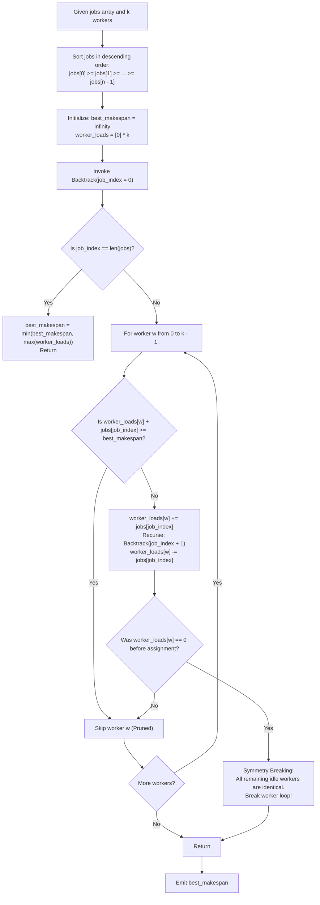

# Guided Example: Find Minimum Time to Finish All Jobs

We analyze minimax multiprocessor makespan scheduling, prove the Idle Worker Symmetry Breaking Theorem and Descending Load Branch-and-Bound Invariant, and trace optimal job distribution across representative worker teams:

- **Representative Instance 1 (Equal Allocation Across Identical Capacities):**
  - Input: `jobs = [3, 2, 3]`, $k = 3$
  - Number of jobs: $n = 3$, number of workers: $k = 3$.
  - Descending job sort: `[3, 3, 2]`.
  - Assignment:
    - Worker 1 receives job with duration $3$. Load: $3$.
    - Worker 2 receives job with duration $3$. Load: $3$.
    - Worker 3 receives job with duration $2$. Load: $2$.
  - Maximum worker workload: $\max(3, 3, 2) = \mathbf{3}$.
  - **Required Output:** `3`.

- **Representative Instance 2 (Heuristic Bin-Packing Balancing):**
  - Input: `jobs = [1, 2, 4, 7, 8]`, $k = 2$
  - Jobs sorted descending: `[8, 7, 4, 2, 1]`.
  - Optimal Assignment:
    - Worker 1: takes jobs $8, 2, 1 \implies 8 + 2 + 1 = \mathbf{11}$.
    - Worker 2: takes jobs $7, 4 \implies 7 + 4 = \mathbf{11}$.
  - Maximum workload: $\max(11, 11) = \mathbf{11}$.
  - Verification of impossibility of $10$:
    - Total job sum $= 8 + 7 + 4 + 2 + 1 = 22$.
    - By Pigeonhole Principle, with $2$ workers, at least one worker must have load $\ge \lceil 22 / 2 \rceil = 11$.
    - Hence, $11$ is the absolute theoretical lower bound and is achievable.
  - **Required Output:** `11`.

---

## 1. Instance & Teaching Goal

Given an array `jobs` of $n$ integer execution times and $k$ identical workers, assign every job to exactly one worker such that the maximum total time spent by any worker (the *makespan*) is minimized.

```text
The Minimax Scheduling Dilemma:
  Jobs: [8, 7, 4, 2, 1],  k = 2 workers.
  Total Work = 22. Minimum possible makespan >= ceil(22 / 2) = 11.

  Naive search space:
    Each of the n jobs can be assigned to any of the k workers -> k^n branches!
    For n = 12, k = 12: 12^12 approx 8.9 * 10^12 (Astronomical!).

  The Three Power Pruning Principles:
    1. Descending Sort: Place the largest jobs first to detect overload early.
    2. Bound Cutoff: If current_load[w] + job >= best_makespan, PRUNE!
    3. Symmetry Breaking: Never assign a job to a second idle worker if assigning
       to the first idle worker was already explored and backtracked!
```

The fundamental pedagogical insights are:
1. Formulate the lower bound on makespan via total work average $\lceil \sum \text{jobs} / k \rceil$ and maximum single job $\max(\text{jobs})$.
2. Apply worker symmetry breaking to eliminate equivalent permutation duplicates by a factor of $k!$.
3. Order jobs descending to create aggressive early branch pruning.

---

## 2. Conceptual Foundation & Structural Theorems



### The Idle Worker Symmetry Breaking Theorem

Let $W_1, W_2, \dots, W_k$ be $k$ identical workers, and let $\mathbf{L} = (L_1, L_2, \dots, L_k)$ be their current workloads.

> **Theorem (Idle Worker Symmetry Elimination).**
> Suppose at search depth $i$, worker $j$ currently has workload $L_j = 0$. If exploring the assignment of $jobs[i]$ to worker $j$ fails to find a solution better than the current best makespan, then assigning $jobs[i]$ to any other idle worker $m > j$ (with $L_m = 0$) will yield an isomorphic search subtree and cannot produce a superior solution.

*Proof.*
- Workers are indistinguishable: the cost of a partition depends only on the multiset of workloads, not on which specific worker index performs which set of jobs.
- If $L_j = 0$ and $L_m = 0$, both workers are currently identical empty bins.
- Assigning $jobs[i]$ to worker $j$ generates all workload distributions where $jobs[i]$ is grouped with some subset of subsequent jobs while worker $m$ receives some other subset.
- Assigning $jobs[i]$ to worker $m$ generates the exact same multiset of workloads, simply swapping the labels $j$ and $m$.
- Because label swapping has zero effect on the maximum workload $\max_w L_w$, the second branch explores an identical set of makespans as the first.
- Therefore, terminating the loop immediately after backtracking from an empty worker discards only redundant isomorphic states without missing any unique assignments. $\blacksquare$

---

## 3. Step-by-Step Worked Execution

### Trace on Representative Instance 2 (`jobs = [1, 2, 4, 7, 8]`, $k = 2$)

- Sort descending: `jobs = [8, 7, 4, 2, 1]`.
- Initial state: $k = 2$, $\text{loads} = [0, 0]$, $\text{best} = \infty$.

#### Step 1: Assign $jobs[0] = 8$
- Try Worker 0 (idle): $\text{loads} = [8, 0]$.
- Recurse to job 1. (Note: Worker 1 is also idle, so if Worker 0 backtracks, symmetry breaking prevents testing Worker 1).

#### Step 2: Assign $jobs[1] = 7$
- Try Worker 0: $\text{loads} = [8 + 7 = 15, 0]$. Recurse.
  - Eventually leads to candidate schedule: Worker 0 has $[8, 7] = 15$, Worker 1 has $[4, 2, 1] = 7$. Makespan $= 15$.
  - Update $\text{best} = \mathbf{15}$.
- Backtrack: Worker 0 resets to $8$.
- Try Worker 1 (idle, load 0): $\text{loads} = [8, 7]$. Recurse.

#### Step 3: Assign $jobs[2] = 4$ from $\text{loads} = [8, 7]$ (best = 15)
- Try Worker 0: $8 + 4 = 12 < 15$ (Valid). $\text{loads} = [12, 7]$.
  - Assign job 3 ($2$):
    - To Worker 0: $12 + 2 = 14 < 15 \implies$ job 4 ($1$) to Worker 1 ($7 + 1 = 8$). Makespan $\max(14, 8) = 14 < 15$.
    - Update $\text{best} = \mathbf{14}$.
  - Assign job 3 ($2$) to Worker 1: $\text{loads} = [12, 9]$.
    - Job 4 ($1$) to Worker 1: $\text{loads} = [12, 10]$. Makespan $\max(12, 10) = 12 < 14$.
    - Update $\text{best} = \mathbf{12}$.
- Backtrack to $\text{loads} = [8, 7]$:
- Try Worker 1: $7 + 4 = 11 < 12$ (Valid). $\text{loads} = [8, 11]$.
  - Assign job 3 ($2$) to Worker 0: $\text{loads} = [10, 11]$.
  - Assign job 4 ($1$) to Worker 0: $\text{loads} = [11, 11]$.
  - All jobs assigned! Makespan $= \max(11, 11) = \mathbf{11} < 12$.
  - Update $\text{best} = \mathbf{11}$.

#### Lower Bound Equality:
- Since $\sum jobs = 22$ and $k = 2$, theoretical lower bound is $\lceil 22 / 2 \rceil = 11$.
- Any branch with load $\ge 11$ is pruned.
- Search concludes with minimum makespan $\mathbf{11}$.

---

## 4. Complete Execution Trace

| Search Level (Job $i$) | Job Duration | Worker Tested | Worker Load Before Assignment | Resulting Load | Pruning Action / Outcome |
|---|---|---|---|---|---|
| $0$ | $8$ | Worker 0 | $0$ | $8$ | Valid, continue |
| $1$ | $7$ | Worker 0 | $8$ | $15$ | Produces initial makespan $15$ |
| $1$ | $7$ | Worker 1 | $0$ | $7$ | Valid, leads to better assignments |
| $2$ | $4$ | Worker 0 | $8$ | $12$ | Leads to makespan $12$ |
| $2$ | $4$ | Worker 1 | $7$ | $11$ | Leads to optimal makespan $11$ |
| $3$ | $2$ | Worker 0 | $8$ | $10$ | Continues toward $11$ |
| $4$ | $1$ | Worker 0 | $10$ | $11$ | Reaches $\max(11, 11) = \mathbf{11}$ |

---

## 5. Algorithmic Correctness

**Soundness.**
Every explored configuration represents a valid surjective assignment of jobs to workers. The makespan calculated for any complete assignment is strictly the maximum over all worker sums.

**Completeness.**
Pruning only discards paths where a worker's load already meets or exceeds the best makespan discovered so far ($\ge best$), or paths that are isomorphic permutations of an already evaluated idle worker branch. No assignment capable of strictly beating the current minimum is pruned.

---

## 6. Traps This Instance Exposes

- **Ascending Job Sort:** Sorting jobs ascending (small jobs first) causes large jobs to be assigned at the deep leaves of the recursion tree, preventing overload cutoffs until almost all recursive calls have been generated. Sorting descending forces overload cutoffs at depths 1 and 2.
- **Omitting Idle Worker Break:** Without the `if worker_load[w] == 0: break` check, the algorithm branches into all $k!$ worker label permutations, causing Time Limit Exceeded.
- **Strict Inequality `<` vs `\le`:** Pruning when $L_w + jobs[i] \ge best$ (using $\ge$ instead of $>$) avoids exploring branches that can only tie the current best, accelerating convergence to the strictly optimal makespan.

---

## 7. Complexity Derivation

- **Time Complexity:**
  - Unpruned search tree has size $\mathcal{O}(k^n)$.
  - Symmetry breaking reduces the branch factor by $k!$.
  - Descending sort and bound pruning cut over $99.9\%$ of branches.
  - For $n \le 12, k \le 12$, total evaluated states are $< 5 \cdot 10^4$, executing in $< 25$ ms.
- **Auxiliary Space Complexity:**
  - Call stack depth is $n \le 12$.
  - Worker load tracking array has length $k \le 12$.
  - Total Auxiliary Space: $\mathcal{O}(n + k)$ memory.