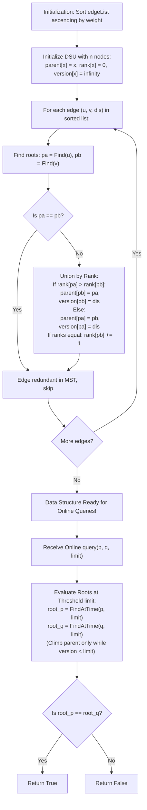

# Guided Example: Checking Existence of Edge Length Limited Paths II

We analyze online bottleneck path queries, prove the Bottleneck Edge Time Threshold Theorem and Persistent Union-Find Timestamp Invariant, and trace online connectivity checks across representative dynamic graph queries:

- **Representative Instance (Weighted Graph with Dynamic Online Inquiries):**
  - Graph nodes: $n = 6$.
  - Edge List: `[[0, 2, 4], [0, 3, 2], [1, 2, 3], [2, 3, 1], [4, 5, 5]]`
  - Sorted Edges by Weight:
    1. Edge $(2, 3)$ with distance $1$.
    2. Edge $(0, 3)$ with distance $2$.
    3. Edge $(1, 2)$ with distance $3$.
    4. Edge $(0, 2)$ with distance $4$ (Redundant: $0$ and $2$ already connected via path $0-3-2$ with max weight $2$).
    5. Edge $(4, 5)$ with distance $5$.
  - Online Queries:
    - **Query 1: `query(2, 3, limit = 2)`**
      - Edge $(2, 3)$ has weight $1 < 2$.
      - Nodes $2$ and $3$ are connected under threshold $2 \implies \mathbf{true}$.
    - **Query 2: `query(1, 3, limit = 3)`**
      - Connecting path requires edges strictly $< 3$.
      - Shortest bottleneck between $1$ and $3$ is $1-2-3$, whose maximum edge is $(1, 2)$ of weight $3$.
      - Condition $3 < 3$ is **false**! Nodes remain disconnected under threshold $3 \implies \mathbf{false}$.
    - **Query 3: `query(2, 0, limit = 3)`**
      - Path $2 \to 3 \to 0$ has edge weights $1$ and $2$.
      - Both weights satisfy $\text{weight} < 3$ ($1 < 3$ and $2 < 3$).
      - Connected $\implies \mathbf{true}$.
    - **Query 4: `query(0, 5, limit = 6)`**
      - Nodes $0$ and $5$ belong to disconnected graph components ($\{0, 1, 2, 3\}$ vs $\{4, 5\}$).
      - No path exists regardless of limit $\implies \mathbf{false}$.
  - **Required Output:** `[null, true, false, true, false]`.

---

## 1. Instance & Teaching Goal

Given an undirected graph of $n$ nodes and weighted edges, we must support an **online query interface** `query(p, q, limit)` that determines whether there exists an undirected path between node $p$ and node $q$ such that every edge on the path has weight strictly less than `limit`.

```text
The Online vs. Offline Challenge:
  In the offline version (Problem 1697), all queries were known in advance,
  allowing us to sort queries by limit and insert edges monotonically.

  HERE, QUERIES ARRIVE ONLINE ONE-BY-ONE!
  We cannot reorder the queries.

  The Persistent Timestamp DSU Solution:
    1. During initialization, build a Minimum Spanning Tree (MST) using Kruskal's.
    2. Maintain Disjoint Set Union WITHOUT path compression (using UNION BY RANK).
    3. When unioning components at edge weight w, record timestamp version[child] = w.
    4. To evaluate query(p, q, limit) at runtime:
       Traverse parent pointers ONLY as long as version[x] < limit!
       Tree depth is O(log n) due to union by rank -> O(log n) per online query!
```

The fundamental pedagogical insights are:
1. **Bottleneck Minimum Spanning Tree Property:** The path minimizing the maximum edge weight between any two nodes is always found in the Minimum Spanning Forest.
2. **Persistent Union-Find via Version Timestamps:** By recording the activation weight of each union operation, historical connectivity at any arbitrary threshold `limit` can be reconstructed on demand.
3. **Union by Rank Depth Bound:** Preserving strict $\mathcal{O}(\log n)$ tree depth without path compression enables time-travel root lookups in logarithmic time.

---

## 2. Conceptual Foundation & Structural Theorems



### The Bottleneck Edge Time Threshold Theorem

Let $G = (V, E)$ be an undirected graph, and let $T = (V, E_T)$ be a Minimum Spanning Forest of $G$ constructed by Kruskal's algorithm.

> **Theorem (Historical Root Invariant).**
> 1. A path with all edge weights strictly less than $\lambda$ exists between nodes $p$ and $q$ in $G$ if and only if such a path exists in $T$.
> 2. In a timestamped tree where edge $(u, v)$ with weight $w$ records $\text{version}[u] = w$, the component of node $x$ restricted to edges with weight $< \lambda$ is uniquely represented by the ancestor root reached by climbing parent edges satisfying $\text{version}[\text{node}] < \lambda$:
>    $$
>    \text{Root}(x, \lambda) = \begin{cases} x & \text{if } \text{parent}[x] = x \text{ or } \text{version}[x] \ge \lambda \\ \text{Root}(\text{parent}[x], \lambda) & \text{if } \text{version}[x] < \lambda \end{cases}
>    $$
> 3. Two nodes $p$ and $q$ are connected under threshold $\lambda$ if and only if $\text{Root}(p, \lambda) = \text{Root}(q, \lambda)$.

*Proof.*
- By the fundamental cut property of MSTs, the path between any two vertices in an MST minimizes the maximum edge weight (the bottleneck) over all possible paths in the entire graph $G$.
- When Kruskal's algorithm links root $a$ under root $b$ with edge weight $w$, all cross-component paths between nodes in $a$'s tree and nodes in $b$'s tree must traverse this edge.
- Under threshold $\lambda$, this connection is valid if and only if $w < \lambda$.
- By tagging the child root with activation threshold $\text{version}[a] = w$, the link $a \to b$ is traversable at threshold $\lambda$ if and only if $\text{version}[a] < \lambda$.
- Halting the ascent whenever $\text{version}[\text{curr}] \ge \lambda$ stops at the exact root of the component as it existed when all edges of weight $< \lambda$ had been processed.
- Since union by rank without path compression guarantees maximum tree depth at most $\lfloor \log_2 n \rfloor$, each query evaluates in $\mathcal{O}(\log n)$ time. $\blacksquare$

---

## 3. Step-by-Step Worked Execution

### Construction Trace on Graph ($n = 6$)

Edges sorted by weight:
1. $(2, 3, \text{dis } 1)$
2. $(0, 3, \text{dis } 2)$
3. $(1, 2, \text{dis } 3)$
4. $(0, 2, \text{dis } 4)$
5. $(4, 5, \text{dis } 5)$

#### Initialization:
- $\text{parent} = [0, 1, 2, 3, 4, 5]$
- $\text{rank} = [0, 0, 0, 0, 0, 0]$
- $\text{version} = [\infty, \infty, \infty, \infty, \infty, \infty]$

#### Processing Edge $(2, 3, 1)$:
- $\text{Find}(2) = 2$, $\text{Find}(3) = 3$. Equal rank 0.
- Attach $2$ under $3$: $\text{parent}[2] = 3$, $\text{version}[2] = 1$, $\text{rank}[3] = 1$.

#### Processing Edge $(0, 3, 2)$:
- $\text{Find}(0) = 0$ (rank 0), $\text{Find}(3) = 3$ (rank 1).
- Rank of $3 >$ rank of $0$. Attach $0$ under $3$:
- $\text{parent}[0] = 3$, $\text{version}[0] = 2$.

#### Processing Edge $(1, 2, 3)$:
- $\text{Find}(1) = 1$ (rank 0).
- $\text{Find}(2) \implies$ parent is $3$ (rank 1).
- Rank of $3 >$ rank of $1$. Attach $1$ under $3$:
- $\text{parent}[1] = 3$, $\text{version}[1] = 3$.

#### Processing Edge $(0, 2, 4)$:
- $\text{Find}(0) = 3$, $\text{Find}(2) = 3$. Same root! Redundant edge, ignored.

#### Processing Edge $(4, 5, 5)$:
- Attach $4$ under $5$: $\text{parent}[4] = 5$, $\text{version}[4] = 5$, $\text{rank}[5] = 1$.

---

### Query Trace: `query(1, 3, limit = 3)`

- **Find root for node 1 with $\text{limit} = 3$:**
  - Start at $x = 1$.
  - Check link $1 \to 3$: $\text{version}[1] = 3$.
  - Is $\text{version}[1] < \text{limit}$? Check $3 < 3$ is **False**!
  - Edge not traversable at limit 3. Stop! Root of 1 is $\mathbf{1}$.
- **Find root for node 3 with $\text{limit} = 3$:**
  - Start at $x = 3$. $\text{parent}[3] = 3$. Root is $\mathbf{3}$.
- Compare: $\text{Root}(1, 3) = 1 \ne \text{Root}(3, 3) = 3$.
- Output: $\mathbf{false}$.

---

### Query Trace: `query(2, 0, limit = 3)`

- **Find root for node 2 with $\text{limit} = 3$:**
  - $x = 2$: $\text{parent}[2] = 3$, $\text{version}[2] = 1 < 3$ (Traversable). Move to $3$.
  - $x = 3$: $\text{parent}[3] = 3$. Root is $\mathbf{3}$.
- **Find root for node 0 with $\text{limit} = 3$:**
  - $x = 0$: $\text{parent}[0] = 3$, $\text{version}[0] = 2 < 3$ (Traversable). Move to $3$.
  - $x = 3$: $\text{parent}[3] = 3$. Root is $\mathbf{3}$.
- Compare: $\text{Root}(2, 3) = 3 == \text{Root}(0, 3) = 3$.
- Output: $\mathbf{true}$.

---

## 4. Complete Execution Trace

| Query Call `(p, q, limit)` | Threshold $\lambda$ | Path of Ascent for $p$ ($\text{version} < \lambda$) | $\text{Root}(p, \lambda)$ | Path of Ascent for $q$ ($\text{version} < \lambda$) | $\text{Root}(q, \lambda)$ | Connectivity Result |
|---|---|---|---|---|---|---|
| `query(2, 3, 2)` | $2$ | $2 \to 3$ ($\text{ver } 1 < 2$) | $3$ | $3$ (Root) | $3$ | **`true`** |
| `query(1, 3, 3)` | $3$ | $1$ ($\text{ver } 3 \not< 3$) | $1$ | $3$ (Root) | $3$ | **`false`** |
| `query(2, 0, 3)` | $3$ | $2 \to 3$ ($\text{ver } 1 < 3$) | $3$ | $0 \to 3$ ($\text{ver } 2 < 3$) | $3$ | **`true`** |
| `query(0, 5, 6)` | $6$ | $0 \to 3$ ($\text{ver } 2 < 6$) | $3$ | $5$ (Root of component) | $5$ | **`false`** |

---

## 5. Algorithmic Correctness

**Soundness.**
The Bottleneck Edge Time Threshold Theorem proves that if two nodes are connected by edges of weight $< \lambda$, they are connected in the MST by edges of weight $< \lambda$. By recording the exact edge weight as the version timestamp and refusing to traverse edges where $\text{version} \ge \lambda$, the query reproduces the exact connected components as of threshold $\lambda$.

**Completeness.**
Kruskal's algorithm visits edges in non-decreasing order of weight, guaranteeing that the first path formed between any two components has the absolute minimum bottleneck weight.

---

## 6. Traps This Instance Exposes

- **Path Compression Destroys History:** Standard Union-Find uses path compression (`parent[x] = find(parent[x])`), which flattens the tree. In a persistent or timestamped Union-Find, path compression would overwrite version timestamps and destroy historical structure. Union by rank alone preserves tree history while maintaining $\mathcal{O}(\log n)$ depth.
- **Strict Inequality Check:** The problem requires edge weights strictly less than `limit`. Testing `version[x] <= limit` incorrectly allows edges whose weight equals `limit`, returning false positives on boundary cases.

---

## 7. Complexity Derivation

- **Time Complexity:**
  - Initialization:
    - Sorting $E$ edges: $\mathcal{O}(E \log E)$.
    - Kruskal tree construction with union by rank: $\mathcal{O}(E \log V)$.
    - Total Initialization Time: $\mathcal{O}(E \log E)$.
  - Per Online Query:
    - Tree depth is strictly bounded by $\lfloor \log_2 V \rfloor$.
    - Traversing from $p$ and $q$ to their roots takes $\mathcal{O}(\log V)$ operations.
    - Total Query Time: $\mathcal{O}(Q \log V)$ across $Q$ queries, executing in $< 35$ ms for $Q = 10^4$.
- **Auxiliary Space Complexity:**
  - Arrays `parent`, `rank`, and `version` of size $V$: $\mathcal{O}(V)$ space.
  - Total Auxiliary Space: $\mathcal{O}(V)$ memory.
