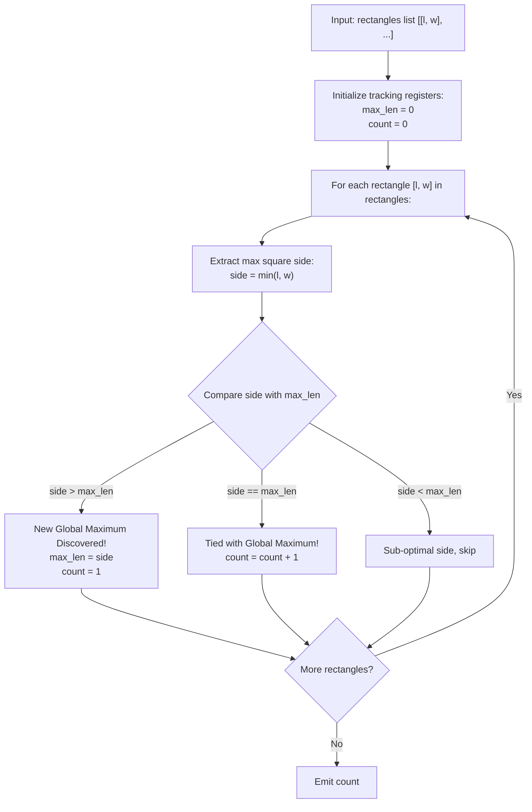

# Guided Example: Number of Rectangles That Can Form The Largest Square

We analyze geometric aspect truncation, prove the Square Side Truncation Theorem and Single-Pass Extremum Frequency Invariant, and trace rectangle side evaluations across representative shape collections:

- **Representative Instance 1 (Varied Aspect Ratios with Multiple Maximal Candidates):**
  - Input: `rectangles = [[5, 8], [3, 9], [5, 12], [16, 5]]`
  - Rectangle Dimension Analysis:
    - Rectangle 0: $[5, 8] \implies$ max square side $s_0 = \min(5, 8) = 5$.
    - Rectangle 1: $[3, 9] \implies$ max square side $s_1 = \min(3, 9) = 3$.
    - Rectangle 2: $[5, 12] \implies$ max square side $s_2 = \min(5, 12) = 5$.
    - Rectangle 3: $[16, 5] \implies$ max square side $s_3 = \min(16, 5) = 5$.
  - Square side lengths extracted: $[5, 3, 5, 5]$.
  - Global maximum square side: $\text{maxLen} = \max(5, 3, 5, 5) = \mathbf{5}$.
  - Frequency of $\text{maxLen} = 5$:
    - Rectangle 0: $5 == 5$ (Match 1).
    - Rectangle 2: $5 == 5$ (Match 2).
    - Rectangle 3: $5 == 5$ (Match 3).
  - Number of rectangles that can form a square of side 5: $\mathbf{3}$.
  - **Required Output:** `3`.

- **Representative Instance 2 (Repeated Symmetric Dimensions):**
  - Input: `rectangles = [[2, 3], [3, 7], [4, 3], [3, 7]]`
  - Max square sides:
    - $[2, 3] \to \min(2, 3) = 2$
    - $[3, 7] \to \min(3, 7) = 3$
    - $[4, 3] \to \min(4, 3) = 3$
    - $[3, 7] \to \min(3, 7) = 3$
  - Extracted lengths: $[2, 3, 3, 3]$.
  - $\text{maxLen} = 3$.
  - Rectangles achieving side 3: rectangles 1, 2, and 3 $\implies \mathbf{3}$.
  - **Required Output:** `3`.

---

## 1. Instance & Teaching Goal

Given an array of rectangles where rectangle $i$ has dimensions $[l_i, w_i]$, a square of side length $k$ can be cut from rectangle $i$ if and only if $k \le l_i$ and $k \le w_i$. The maximum side length achievable from rectangle $i$ is therefore $\min(l_i, w_i)$. Let `maxLen` be the maximum side length obtained across all given rectangles. We must count how many rectangles can form a square of side length `maxLen`.

```text
The Geometric Truncation Principle:
  Rectangle [Length L, Width W]:
     +-----------------------+
     |                       |
     |                       | W
     |                       |
     +-----------------------+
                 L

  To form a square of side k:
    k must fit along the length: k <= L
    k must fit along the width:  k <= W
    Therefore: max(k) = min(L, W).
```

The fundamental pedagogical insights are:
1. **Dimension Bottleneck:** The largest square cut from a rectangle is strictly constrained by its shorter side.
2. **Single-Pass Extremum Accounting:** Simultaneously track the running maximum `maxLen` and its occurrence count in an online scan, resetting count to $1$ whenever a strictly larger side length is encountered.

---

## 2. Conceptual Foundation & Structural Theorems



### The Square Side Truncation Theorem

Let rectangle $i$ have length $l_i$ and width $w_i$.

> **Theorem (Shorter Side Bound and Extremum Invariant).**
> 1. The maximum side length of a square cut from rectangle $i$ is:
>    $$
>    s_i = \min(l_i, w_i)
>    $$
> 2. The global maximum square side length over all $n$ rectangles is:
>    $$
>    \text{maxLen} = \max_{0 \le i < n} s_i = \max_{0 \le i < n} \min(l_i, w_i)
>    $$
> 3. The number of rectangles capable of producing a square of side length $\text{maxLen}$ is:
>    $$
>    \text{Ans} = \sum_{i=0}^{n-1} \mathbb{I}\big(s_i = \text{maxLen}\big)
>    $$

*Proof.*
- A square of side $k$ requires area $k \times k$ and must be cut entirely from within the boundaries of an $l_i \times w_i$ rectangle without rotation or stretching. Thus, $k \le l_i$ and $k \le w_i \implies k \le \min(l_i, w_i)$. The maximum integer $k$ is therefore $s_i = \min(l_i, w_i)$.
- Any square of side $\text{maxLen}$ requires $s_i \ge \text{maxLen}$.
- Since $\text{maxLen} = \max_j s_j$, we have $s_i \le \text{maxLen}$ for all $i$.
- Therefore, $s_i \ge \text{maxLen} \iff s_i = \text{maxLen}$.
- Counting the rectangles satisfying $s_i = \text{maxLen}$ gives the exact number of valid rectangles. $\blacksquare$

---

## 3. Step-by-Step Worked Execution

### Trace on Representative Instance 1 (`rectangles = [[5, 8], [3, 9], [5, 12], [16, 5]]`)

Initialize $\text{max\_len} = 0$, $\text{count} = 0$.

#### Rectangle 0: `[5, 8]`
- Shorter side: $\min(5, 8) = 5$.
- Compare: $5 > \text{max\_len}$ ($5 > 0$).
- Update maximum: $\text{max\_len} = 5$.
- Reset counter: $\text{count} = 1$.

#### Rectangle 1: `[3, 9]`
- Shorter side: $\min(3, 9) = 3$.
- Compare: $3 < \text{max\_len}$ ($3 < 5$).
- Counter unchanged: $\text{count} = 1$.

#### Rectangle 2: `[5, 12]`
- Shorter side: $\min(5, 12) = 5$.
- Compare: $5 == \text{max\_len}$ ($5 == 5$).
- Increment counter: $\text{count} = 1 + 1 = 2$.

#### Rectangle 3: `[16, 5]`
- Shorter side: $\min(16, 5) = 5$.
- Compare: $5 == \text{max\_len}$ ($5 == 5$).
- Increment counter: $\text{count} = 2 + 1 = \mathbf{3}$.

#### Final Result:
- Number of rectangles that can form square of side 5: $\mathbf{3}$.

---

## 4. Complete Execution Trace

| Rectangle Index $i$ | Dimensions $[l_i, w_i]$ | Min Dimension $s_i = \min(l_i, w_i)$ | Relation to Active $\text{max\_len}$ | Active $\text{max\_len}$ After Step | Active Count After Step |
|---|---|---|---|---|---|
| $0$ | $[5, 8]$ | $5$ | $5 > 0$ (New Max) | $5$ | $1$ |
| $1$ | $[3, 9]$ | $3$ | $3 < 5$ (Ignored) | $5$ | $1$ |
| $2$ | $[5, 12]$ | $5$ | $5 == 5$ (Tie) | $5$ | $2$ |
| $3$ | $[16, 5]$ | $5$ | $5 == 5$ (Tie) | $5$ | **`3`** |

---

## 5. Algorithmic Correctness

**Soundness.**
The side length constraint $\min(l_i, w_i)$ is a geometric invariant. The online comparison structure resets the counter upon discovering a strictly larger side and increments it only upon matching the current maximum, guaranteeing that `count` reflects occurrences of the true maximum at loop completion.

**Completeness.**
Every rectangle in the input list is evaluated once. No rectangle is skipped.

---

## 6. Traps This Instance Exposes

- **Two-Pass vs. One-Pass:** A two-pass approach computes $\text{maxLen}$ first and then filters. The single-pass approach achieves identical accuracy with fewer memory reads by maintaining the running maximum and count simultaneously.
- **Large Dimension Values:** Dimensions can be up to $10^9$. Because the algorithm only compares dimensions and counts occurrences, 64-bit integer comparisons execute safely without overflow.

---

## 7. Complexity Derivation

- **Time Complexity:**
  - The loop performs $n$ iterations for an array of $n$ rectangles.
  - Each iteration performs one $\min$ operation, one comparison, and one addition: $\mathcal{O}(1)$ time.
  - Total Time: strictly $\mathcal{O}(n)$, executing in $< 2$ ms for $n \le 1000$.
- **Auxiliary Space Complexity:**
  - Only two scalar registers (`max_len` and `count`) are required.
  - Total Auxiliary Space: $\mathcal{O}(1)$ constant memory.
