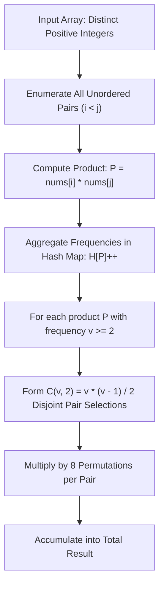

# Guided Example: Tuple with Same Product

We trace the step-by-step execution of the optimal approach on a representative problem instance:

- **Input:** `nums = [2, 3, 4, 6]`
- **Required Output:** `8`

This instance contains four distinct positive integers where exactly two disjoint pairs share a common product, demonstrating how pairwise frequency hashing and combinatorial permutation multipliers determine the answer in optimal quadratic time without generating invalid overlaps.

---

## 1. Instance & Teaching Goal

Given an array `nums` of **distinct** positive integers, we seek the number of 4-tuples $(a, b, c, d)$ such that:
1. $a \cdot b = c \cdot d$
2. $a, b, c, d$ are distinct elements from `nums` ($a \neq b \neq c \neq d$)

A brute-force search over all possible 4-tuples checks $\mathcal{O}(n^4)$ configurations, which becomes infeasible for arrays of size up to $n = 1000$. 

The optimal insight shifts the viewpoint from four individual numbers to pairs of numbers:
- If two unordered pairs $\{a, b\}$ and $\{c, d\}$ satisfy $a \cdot b = c \cdot d$, and the elements are distinct positive integers, they automatically share zero common elements.
- Each unordered combination of two distinct pairs with identical products generates exactly $8$ ordered 4-tuples.

---

## 2. Conceptual Foundation & Invariants

### State Representation

We map each unique product of two distinct array elements to its frequency:

| Component | Definition | Initial State |
|---|---|---|
| Pairwise Product Table $H$ | Hash table mapping integer product $p \mapsto \text{count}$ | Empty map $\emptyset$ |
| Total Disjoint Pair Matches | Combinatorial accumulation $\sum \binom{\text{count}(p)}{2}$ | $0$ |
| Final Tuples | Scaled count $8 \times \sum \binom{\text{count}(p)}{2}$ | $0$ |

### Mathematical Invariants

> **Pairwise Product Disjointness Theorem.**
> Let $S \subset \mathbb{Z}^+$ be a set of strictly distinct positive integers. Suppose $\{a, b\}$ and $\{c, d\}$ are distinct unordered pairs chosen from $S$ such that $a \cdot b = c \cdot d$. Then:
> $$\{a, b\} \cap \{c, d\} = \emptyset$$
>
> *Proof.* Suppose for contradiction that the pairs share an element, say $a = c$. Then $a \cdot b = a \cdot d$. Since $a > 0$, we can divide both sides by $a$, yielding $b = d$. This implies $\{a, b\} = \{c, d\}$, which contradicts the assumption that the two unordered pairs are distinct. Hence, distinct pairs yielding identical products must be disjoint.

> **Tuple Permutation Factor.**
> Every set of two disjoint pairs $\{\{a, b\}, \{c, d\}\}$ with $a \cdot b = c \cdot d$ generates exactly:
> $$2 \times 2 \times 2 = 8$$
> valid ordered tuples $(u_1, u_2, u_3, u_4)$ such that $u_1 \cdot u_2 = u_3 \cdot u_4$. Specifically:
> - $2$ choices for which pair occupies $(u_1, u_2)$ versus $(u_3, u_4)$
> - $2$ internal arrangements for $(u_1, u_2)$ ($a, b$ or $b, a$)
> - $2$ internal arrangements for $(u_3, u_4)$ ($c, d$ or $d, c$)

---

## 3. Step-by-Step Worked Execution

For `nums = [2, 3, 4, 6]`, array length is $n = 4$. Total unordered pairs is $\binom{4}{2} = 6$.

### Step 1: Enumerate Unordered Pairs and Record Products

We iterate over all index pairs $(i, j)$ with $0 \le i < j < n$:

| Index Pair $(i, j)$ | Values $(nums[i], nums[j])$ | Product $P$ | Hash Table State $H$ after Insertion |
|---|---|---|---|
| $(0, 1)$ | $(2, 3)$ | $2 \times 3 = 6$ | $\{6: 1\}$ |
| $(0, 2)$ | $(2, 4)$ | $2 \times 4 = 8$ | $\{6: 1, 8: 1\}$ |
| $(0, 3)$ | $(2, 6)$ | $2 \times 6 = 12$ | $\{6: 1, 8: 1, 12: 1\}$ |
| $(1, 2)$ | $(3, 4)$ | $3 \times 4 = 12$ | $\{6: 1, 8: 1, 12: 2\}$ |
| $(1, 3)$ | $(3, 6)$ | $3 \times 6 = 18$ | $\{6: 1, 8: 1, 12: 2, 18: 1\}$ |
| $(2, 3)$ | $(4, 6)$ | $4 \times 6 = 24$ | $\{6: 1, 8: 1, 12: 2, 18: 1, 24: 1\}$ |

### Step 2: Evaluate Combinatorial Combinations for Each Product Group

We inspect the frequency $v$ of each product in $H$:

| Product $P$ | Frequency $v$ | Valid Pair Combinations $\binom{v}{2} = \frac{v(v-1)}{2}$ | Contribution to Tuples ($8 \times \binom{v}{2}$) |
|---|---|---|---|
| $6$ | $1$ | $\binom{1}{2} = 0$ | $0$ |
| $8$ | $1$ | $\binom{1}{2} = 0$ | $0$ |
| $12$ | $2$ | $\binom{2}{2} = 1$ | $1 \times 8 = 8$ |
| $18$ | $1$ | $\binom{1}{2} = 0$ | $0$ |
| $24$ | $1$ | $\binom{1}{2} = 0$ | $0$ |

### Step 3: Explicit Expansion of the 8 Valid Tuples

The single matching pair combination for product $12$ comes from pairs $\{2, 6\}$ and $\{3, 4\}$.
By varying pair assignments and internal element orders, we obtain the full set of 8 distinct tuples:

1. Pair $\{2, 6\}$ first, $\{3, 4\}$ second:
   - $(2, 6, 3, 4)$
   - $(2, 6, 4, 3)$
   - $(6, 2, 3, 4)$
   - $(6, 2, 4, 3)$
2. Pair $\{3, 4\}$ first, $\{2, 6\}$ second:
   - $(3, 4, 2, 6)$
   - $(3, 4, 6, 2)$
   - $(4, 3, 2, 6)$
   - $(4, 3, 6, 2)$

Every tuple consists of distinct integers and satisfies $a \cdot b = c \cdot d = 12$.

---

## 4. Complete Execution Trace

| Phase | Action | Detail / Calculation | State Summary |
|---|---|---|---|
| Initialization | Initialize Hash Map | $H \leftarrow \emptyset$, total tuples $\leftarrow 0$ | Empty map |
| Pair Scan | Process $(0, 1)$ | $nums[0] \times nums[1] = 2 \times 3 = 6$ | $H[6] = 1$ |
| Pair Scan | Process $(0, 2)$ | $nums[0] \times nums[2] = 2 \times 4 = 8$ | $H[8] = 1$ |
| Pair Scan | Process $(0, 3)$ | $nums[0] \times nums[3] = 2 \times 6 = 12$ | $H[12] = 1$ |
| Pair Scan | Process $(1, 2)$ | $nums[1] \times nums[2] = 3 \times 4 = 12$ | $H[12] = 2$ |
| Pair Scan | Process $(1, 3)$ | $nums[1] \times nums[3] = 3 \times 6 = 18$ | $H[18] = 1$ |
| Pair Scan | Process $(2, 3)$ | $nums[2] \times nums[3] = 4 \times 6 = 24$ | $H[24] = 1$ |
| Aggregation | Scan Product Frequencies | Only $P = 12$ has $v = 2 \ge 2$; $\binom{2}{2} = 1$ | 1 matching pair set |
| Scaling | Apply 8-Tuple Multiplier | $1 \times 8 = 8$ | Total = 8 |
| Conclusion | Final Output Return | Return integer total | Result: 8 |

---

## 5. Algorithmic Mastery & Edge Surfacing

### Boundary and Edge Cases

| Scenario | Input Example | Expected Output | Strategic Handling |
|---|---|---|---|
| Minimum Array Length ($n = 4$) with No Matching Products | `[1, 2, 3, 5]` | `0` | All products distinct ($\{2, 3, 5, 6, 10, 15\}$ all count 1); sum of $\binom{1}{2}$ correctly yields $0$. |
| Minimum Array Length with One Match | `[1, 2, 4, 8]` | `8` | Pairs $(1, 8)$ and $(2, 4)$ have product 8; single matching pair set yields 8. |
| Multiple Disjoint Pairs Sharing Same Product ($v = 3$) | `[1, 2, 3, 4, 6, 12]` with $P = 12$ | Multi-group sum | $(1, 12), (2, 6), (3, 4)$ all give 12. $\binom{3}{2} = 3$ pairs of pairs, yielding $3 \times 8 = 24$ tuples from product 12 alone. |
| Large Values | `nums[i] \le 10^4` | Arbitrary valid combinations | Max pairwise product is $10^8$, safely fitting within standard 32-bit and 64-bit integer types without overflow. |

### Invariant Maintenance & Why It Works

1. **Why No Overlap Checks Are Required:**
   Because all elements in `nums` are strictly distinct positive integers, if two different pairs had an element in common (e.g., $a \cdot b = a \cdot c$), dividing by $a \neq 0$ implies $b = c$, making the pairs identical. Thus, counting distinct pairs with the same product guarantees pairwise disjointness of elements.
2. **Double-Counting Avoidance:**
   By strictly enumerating index pairs with $i < j$, each unordered pair is visited exactly once. Using $\binom{v}{2}$ counts unordered combinations of pairs, and the final multiplication by $8$ accounts for all orderings without redundant enumeration.

### Complexity Analysis

- **Time Complexity:** $\mathcal{O}(n^2)$ where $n$ is the number of elements in `nums`. There are $\binom{n}{2} = \frac{n(n-1)}{2}$ pairs. Inserting each product into the hash table takes $\mathcal{O}(1)$ average time, and iterating over the entries of the hash table takes at most $\mathcal{O}(n^2)$ time.
- **Space Complexity:** $\mathcal{O}(n^2)$ auxiliary space to store at most $\frac{n(n-1)}{2}$ unique products in the frequency hash map.
