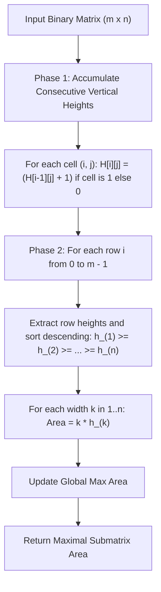

# Guided Example: Largest Submatrix With Rearrangements

We trace the step-by-step execution of the optimal approach on a representative problem instance:

- **Input:** `matrix = [[0, 0, 1], [1, 1, 1], [1, 0, 1]]`
- **Required Output:** `4`

This instance features non-uniform vertical runs of ones across multiple columns, demonstrating how column height transformation combined with greedy row-wise sorting identifies the maximal contiguous rectangular area under arbitrary column permutations.

---

## 1. Instance & Teaching Goal

Given an $m \times n$ binary matrix where column positions can be permuted arbitrarily in any global order, we seek the maximum area of an all-ones submatrix.

In a standard submatrix problem without rearrangements (such as Largest Rectangle in Histogram), columns must remain strictly contiguous in their original array order, requiring monotonic stack techniques. However, when columns can be rearranged:
- Any subset of $k$ columns can be gathered side-by-side.
- If each of those $k$ columns contains a vertical streak of consecutive ones of length at least $h$ ending at row $i$, they can be placed adjacently to form a rectangle of dimension $h \times k$ and area $h \cdot k$.
- To maximize the area ending at row $i$, we simply sort the available column heights at row $i$ in descending order and inspect all widths $k \in \{1, \dots, n\}$.

---

## 2. Conceptual Foundation & Invariants

### State Representation

| Component | Definition | Initial State |
|---|---|---|
| Column Run Length $H[i][j]$ | Number of consecutive $1$s in column $j$ ending at row $i$ | $H[0][j] = \text{matrix}[0][j]$ |
| Sorted Row Heights $S_i$ | Heights of row $i$ sorted descending: $h_{(1)} \ge h_{(2)} \ge \dots \ge h_{(n)}$ | Computed per row |
| Running Max Area | $\max_{i, k} (k \times h_{(k)})$ across all rows $i$ and widths $k$ | $0$ |

### Mathematical Invariants

> **Consecutive Vertical Run Recurrence.**
> For any column $j \in \{0, \dots, n-1\}$, the vertical run length of consecutive $1$s ending at row $i$ satisfies:
> $$H[i][j] = \begin{cases} H[i-1][j] + 1 & \text{if } \text{matrix}[i][j] = 1 \\ 0 & \text{if } \text{matrix}[i][j] = 0 \end{cases}$$
> with base case $H[0][j] = \text{matrix}[0][j]$.

> **Permutation Dominance Theorem.**
> Because columns can be permuted freely, any set of columns having height at least $h$ can be grouped together consecutively. For a fixed base row $i$, if the column heights sorted in descending order are $h_{(1)} \ge h_{(2)} \ge \dots \ge h_{(n)}$, the maximum rectangular area with its bottom edge on row $i$ spanning $k$ columns is achieved by choosing the $k$ tallest columns:
> $$\text{Area}(i, k) = k \times h_{(k)}$$
> The global maximum submatrix area over the entire grid is:
> $$\text{MaxArea} = \max_{0 \le i < m} \max_{1 \le k \le n} \left( k \times h_{(k)} \right)$$

---

## 3. Step-by-Step Worked Execution

Given `matrix = [[0, 0, 1], [1, 1, 1], [1, 0, 1]]` with dimensions $m = 3$ rows and $n = 3$ columns.

### Phase 1: Compute Consecutive Vertical Heights

We calculate the consecutive vertical runs column-by-column across each row:

#### Row 0 (Base Row)
- $\text{matrix}[0][0] = 0 \implies H[0][0] = 0$
- $\text{matrix}[0][1] = 0 \implies H[0][1] = 0$
- $\text{matrix}[0][2] = 1 \implies H[0][2] = 1$
Row heights: $[0, 0, 1]$

#### Row 1
- $\text{matrix}[1][0] = 1 \implies H[1][0] = H[0][0] + 1 = 0 + 1 = 1$
- $\text{matrix}[1][1] = 1 \implies H[1][1] = H[0][1] + 1 = 0 + 1 = 1$
- $\text{matrix}[1][2] = 1 \implies H[1][2] = H[0][2] + 1 = 1 + 1 = 2$
Row heights: $[1, 1, 2]$

#### Row 2
- $\text{matrix}[2][0] = 1 \implies H[2][0] = H[1][0] + 1 = 1 + 1 = 2$
- $\text{matrix}[2][1] = 0 \implies H[2][1] = 0$ (streak broken)
- $\text{matrix}[2][2] = 1 \implies H[2][2] = H[1][2] + 1 = 2 + 1 = 3$
Row heights: $[2, 0, 3]$

Full height matrix:
$$\begin{pmatrix} 0 & 0 & 1 \\ 1 & 1 & 2 \\ 2 & 0 & 3 \end{pmatrix}$$

---

### Phase 2: Row-by-Row Permutation and Area Maximization

For each row, we sort the heights descending and test widths $k \in \{1, 2, 3\}$:

#### Row 0 Evaluation
- Raw Heights: $[0, 0, 1]$
- Sorted Descending: $[1, 0, 0]$
- Test width $k = 1$: Area $= 1 \times 1 = 1$
- Test width $k = 2$: Area $= 2 \times 0 = 0$
- Test width $k = 3$: Area $= 3 \times 0 = 0$
- Max Area at Row 0: $1$. Running Best $= 1$.

#### Row 1 Evaluation
- Raw Heights: $[1, 1, 2]$
- Sorted Descending: $[2, 1, 1]$
- Test width $k = 1$: Area $= 1 \times 2 = 2$
- Test width $k = 2$: Area $= 2 \times 1 = 2$
- Test width $k = 3$: Area $= 3 \times 1 = 3$
- Max Area at Row 1: $3$. Running Best $= \max(1, 3) = 3$.

#### Row 2 Evaluation
- Raw Heights: $[2, 0, 3]$
- Sorted Descending: $[3, 2, 0]$
- Test width $k = 1$: Area $= 1 \times 3 = 3$
- Test width $k = 2$: Area $= 2 \times 2 = 4$
- Test width $k = 3$: Area $= 3 \times 0 = 0$
- Max Area at Row 2: $4$. Running Best $= \max(3, 4) = 4$.

Selecting columns $2$ and $0$ (with heights $3$ and $2$) across rows $1$ and $2$ creates an all-ones rectangle of height $2$ and width $2$, achieving the maximal area of $4$.

---

## 4. Complete Execution Trace

| Row $i$ | Column Raw Heights $[c_0, c_1, c_2]$ | Sorted Heights $[h_{(1)}, h_{(2)}, h_{(3)}]$ | Candidate Width Calculations | Row Max | Global Best |
|---|---|---|---|---|---|
| $0$ | $[0, 0, 1]$ | $[1, 0, 0]$ | $1 \times 1 = 1$, $2 \times 0 = 0$, $3 \times 0 = 0$ | $1$ | $1$ |
| $1$ | $[1, 1, 2]$ | $[2, 1, 1]$ | $1 \times 2 = 2$, $2 \times 1 = 2$, $3 \times 1 = 3$ | $3$ | $3$ |
| $2$ | $[2, 0, 3]$ | $[3, 2, 0]$ | $1 \times 3 = 3$, $2 \times 2 = 4$, $3 \times 0 = 0$ | $4$ | $4$ |

---

## 5. Algorithmic Mastery & Edge Surfacing

### Boundary and Edge Cases

| Scenario | Input Example | Expected Output | Strategic Handling |
|---|---|---|---|
| All Zeros Matrix | `[[0, 0], [0, 0]]` | `0` | All heights remain $0$; $k \times 0 = 0$ throughout. |
| All Ones Matrix | `[[1, 1], [1, 1]]` | $m \times n$ | At row $m-1$, all heights equal $m$; sorted list is $[m, m]$; max area is $n \times m$. |
| Single Row Matrix ($m = 1$) | `[[1, 0, 1, 1]]` | `3` | Heights are simply original row; sorted heights $[1, 1, 1, 0]$; width $3$ yields $3 \times 1 = 3$. |
| Single Column Matrix ($n = 1$) | `[[1], [1], [0], [1]]` | `2` | Consecutive heights are $[1, 2, 0, 1]$; max height directly gives max area $2$. |

### Invariant Maintenance & Why It Works

1. **Why Phase Separation Matters:**
   All column heights across all rows must be computed using fixed column alignments before any sorting takes place. If row $i-1$ were sorted in place before computing row $i$, the column identities would be scrambled, destroying the vertical continuity of column streaks.
2. **Why Independent Row Sorting Is Optimal:**
   The problem allows columns to be permuted globally. Evaluating each row $i$ independently as a prospective bottom boundary corresponds to choosing a column permutation tailored to row $i$. Because the optimal submatrix has some bottom row $i^*$, sorting row $i^*$ guarantees discovery of that optimal rectangle.

### Complexity Analysis

- **Time Complexity:** $\mathcal{O}(m \cdot n \log n)$. Phase 1 scans all $m \times n$ cells once in $\mathcal{O}(m \cdot n)$ time. Phase 2 sorts $m$ rows of length $n$, taking $\mathcal{O}(n \log n)$ per row, totaling $\mathcal{O}(m \cdot n \log n)$. (Counting sort on heights bounded by $m$ can achieve $\mathcal{O}(m \cdot n)$ if desired).
- **Space Complexity:** $\mathcal{O}(1)$ auxiliary space if modifying the input matrix in place, or $\mathcal{O}(m \cdot n)$ to store run-length heights in a separate buffer.
