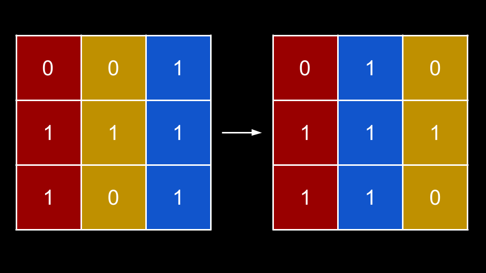
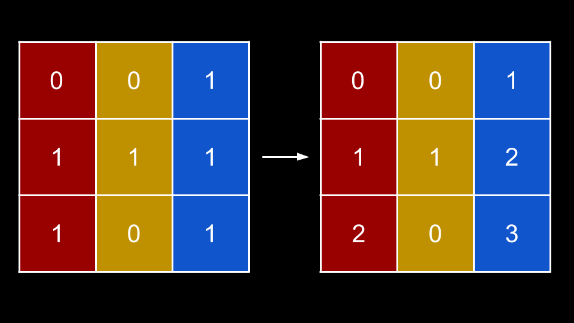
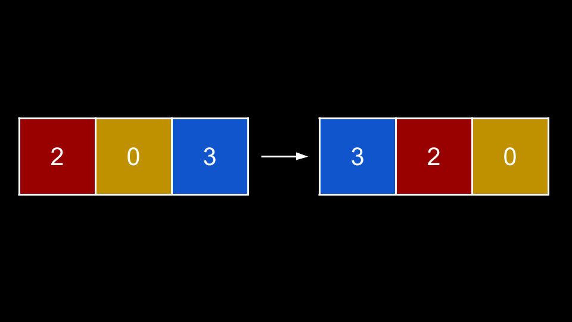
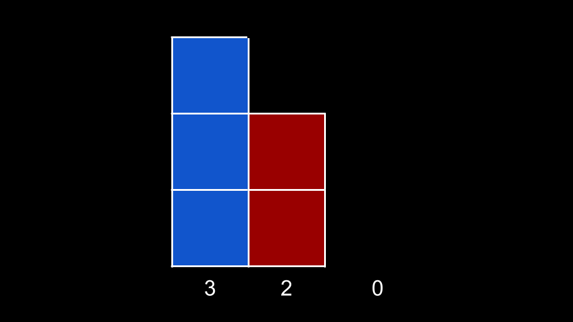

[TOC]

## Solution

---

### Approach 1: Sort By Height On Each Baseline Row

**Intuition**

A submatrix is just a rectangle - what is the area of a rectangle? It's $B * H$, where `B` is the base (width) and `H` is the height of the rectangle. As we are looking for the largest submatrix, we would prefer larger values for `B` and `H`.

While we can freely rearrange columns, we cannot do anything to change the order of the rows. Let's start by considering what effect rearranging columns has.


<br>

Using the example from the problem description, we see that by rearranging some columns, we can "connect" two 1s in the bottom row, thus increasing the base of the submatrix. Note that rearranging the columns has no effect on height.

If we were allowed to rearrange the rows, then that would affect the height because some 1s could "connect" vertically. Because we can freely rearrange columns, we have good control of the base, but no control on the height. As such, a good first step would be to determine how much height each column contributes on its own.

Let's modify `matrix` so that each $\text{matrix}[row][col]$ represents the following value: "how many consecutive 1s are there if we start from $\text{matrix}[row][col]$ and move upward?"


<br>

In the above image, consider the bottom right square `(2, 2)`. The value of this square is `3` because there are `3` consecutive ones in this column up to this point. The bottom middle square `(2, 1)` has a value of `0` because $\text{matrix}[2][1] = 0$, so any streak "resets".

What is the point of this modification? Now, we can consider how much height each column can contribute at a given row. Take a look at the bottom row `[2, 0, 3]`. What happens if we sort it descending?


<br>

This sorted row `[3, 2, 0]` is saying:

- At column `0`, we have seen three consecutive ones.
- At column `1`, we have seen two consecutive ones.
- At column `2`, we have seen zero consecutive ones.

Visually, this sorted row represents the following image:


<br>

Now, let's iterate over this sorted row and consider the largest submatrix we can make.

- At column `0`, we have a height of `3`. What is our base? We only have one column, so the base is `1`. Thus, we have an area of `3`.
- At column `1`, we have a height of `2`. What is our base? Every column must have a height of at least `2` for us to have a valid submatrix. Because we sorted descending, every column to the left must have a height of **at least** `2`. Thus, we have a base of `2`, and an area of $2 * 2 = 4$.
- At column `2`, we have a height of `0` and a base of `3`. The area is `0`.

Now, hopefully, the idea is clear: at each column `col`, we know every column to its left has a height greater than or equal to the current height. Thus, we can treat the number of columns $col + 1$ as the base to form a submatrix with the current height.

We iterate over the input `matrix` and keep track of how many consecutive ones each column has seen. To do this, for a given `row, col`, we first check if $\text{matrix}[row][col] \neq 0$. If so, we add the value of $matrix[row - 1][col]$ to it. If $\text{matrix}[row][col] = 0$, we do nothing, which effectively resets the streak for the current column since the next iteration at $matrix[row + 1][col]$ will reference $\text{matrix}[row][col]$, which is `0`. If we have a streak, then $\text{matrix}[row][col]$ will continually increase by `1` for each row.

Once we have finished updating a row, we sort it descending and iterate over it to find the largest submatrix we can make if we treat the current row as the bottom of the submatrix. For a sorted `currRow`, we treat $\text{currRow}[i]$ as the height and $i + 1$ as the base. The reason we are allowed to sort each row is because sorting each row is equivalent to rearranging the columns, which we are allowed to do freely.

**Algorithm**

1. Initialize $m = \text{matrix.length}$, $n = \text{matrix}[0].length$, and the answer $ans = 0$.
2. Iterate `row` from `0` to `m`:
- Iterate `col` from `0` to `n`:
- If $\text{matrix}[row][col] \neq 0$ and `row > 0`:
- Add $matrix[row - 1][col]$ to $\text{matrix}[row][col]$.
- Create a copy of $\text{matrix}[row]$ as `currRow`, then sort `currRow` in descending order.
- Iterate `i` over the indiecs of `currRow`:
- Update `ans` with $\text{currRow}[i] * (i + 1)$ if it is larger.
3. Return `ans`.

**Implementation**

> Note that in Java, we can't conveniently sort `int[]` in descending order, so we sort it in ascending order and consider the base to the right of each column instead. For each column `i`, every column to its right has a height greater than or equal to the current height. Thus, we can treat the number of columns $n - i$ as the base to form a submatrix with the current height.

```python
class Solution:
    def largestSubmatrix(self, matrix: List[List[int]]) -> int:
        m = len(matrix)
        n = len(matrix[0])
        ans = 0

        for row in range(m):
            for col in range(n):
                if matrix[row][col] != 0 and row > 0:
                    matrix[row][col] += matrix[row - 1][col]

            curr_row = sorted(matrix[row], reverse=True)
            for i in range(n):
                ans = max(ans, curr_row[i] * (i + 1))

        return ans
```

**Complexity Analysis**

Given $m$ as the number of rows in `matrix` and $n$ as the number of columns in `matrix`,

* Time complexity: $O(m \cdot n \cdot \log{}n)$

    We iterate over $m$ rows. For each row, we update the values which costs $O(n)$. Then, we sort the row, which costs $O(n \cdot \log{}n)$. Finally, we iterate over the row to calculate submatrix areas, which costs $O(n)$.

    Overall, each of the $m$ iterations costs $O(n \cdot \log{}n)$.

* Space complexity: $O(m \cdot n)$

    Although we are only allocating `currRow` which has a size of $O(n)$, we are modifying `matrix`. It is generally considered a bad practice to modify the input and when you do, you should count it as part of the space complexity.

<br/>

---

### Approach 2: Without Modifying Input

**Intuition**

Generally, it is not considered a good practice to modify the input, especially if the input is something passed by reference like an array. Also, many people will argue that when you modify the input, you must include it as part of the space complexity.

You may notice in the previous approach, as we iterate on a `row` and modify $\text{matrix}[row]$, we only depend on values from the previous row $matrix[row - 1]$. As such, instead of modifying the array, we will allocate a few arrays of size $n$ to avoid modifying the input.

- `currRow`. This is analogous to $\text{matrix}[row]$ from the previous approach. Therefore, $\text{currRow}[col] = \text{matrix}[row][col]$ from the previous approach.
- `prevRow`. This is analogous to $matrix[row - 1]$ from the previous approach. We will initialize it will all `0`.
- `sortedRow`. This is analogous to `currRow` from the previous approach. It is simply the copy of the current row that we will sort.

At the start of each outer for-loop iteration, we will set `currRow` as a copy of $\text{matrix}[row]$. Then, we iterate over each column `col` and add $\text{prevRow}[col]$ to $\text{currRow}[col]$ if $\text{currRow}[col] \neq 0$, similar to the previous approach.

Once we have calculated `currRow`, we create the sorted copy `sortedRow` and iterate over it, calculating the answer in the same manner as the previous approach. Finally, before moving to the next row, we update $prevRow = currRow$.

**Algorithm**

1. Initialize $m = \text{matrix.length}$, $n = \text{matrix}[0].length$, `prevRow` as an array of length `n` with values of `0`, and the answer $ans = 0$.
2. Iterate `row` from `0` to `m`:
- Set `currRow` as a copy of $\text{matrix}[row]$.
- Iterate `col` from `0` to `n`:
- If $\text{currRow}[col] \neq 0$:
- Add $\text{prevRow}[col]$ to $\text{currRow}[col]$.
- Create a copy of `currRow` as `sortedRow`, then sort `sortedRow` in descending order.
- Iterate `i` over the indiecs of `sortedRow`:
- Update `ans` with $\text{sortedRow}[i] * (i + 1)$ if it is larger.
- Update $prevRow = currRow$.
3. Return `ans`.

**Implementation**

> Note that in Java, we can't conveniently sort `int[]` in descending order, so we sort it in ascending order and consider the base to the right of each column instead. For each column `i`, every column to its right has a height greater than or equal to the current height. Thus, we can treat the number of columns $n - i$ as the base to form a submatrix with the current height.

```python
class Solution:
    def largestSubmatrix(self, matrix: List[List[int]]) -> int:
        m = len(matrix)
        n = len(matrix[0])
        prev_row = [0] * n
        ans = 0

        for row in range(m):
            curr_row = matrix[row][:]
            for col in range(n):
                if curr_row[col] != 0:
                    curr_row[col] += prev_row[col]

            sorted_row = sorted(curr_row, reverse=True)
            for i in range(n):
                ans = max(ans, sorted_row[i] * (i + 1))

            prev_row = curr_row

        return ans
```

**Complexity Analysis**

Given $m$ as the number of rows in `matrix` and $n$ as the number of columns in `matrix`,

* Time complexity: $O(m \cdot n \cdot \log{}n)$

    We iterate over $m$ rows. For each row, we update the values which costs $O(n)$. Then, we sort the row, which costs $O(n \cdot \log{}n)$. Finally, we iterate over the row to calculate submatrix areas, which costs $O(n)$. There is also some $O(n)$ copying work.

    Overall, each of the $m$ iterations costs $O(n \cdot \log{}n)$.

* Space complexity: $O(n)$

    We are using three arrays, all of size $n$.

<br/>

---

### Approach 3: No Sort

**Intuition**

In fact, we don't actually need to sort each row to implement the idea from the first two approaches!

Here, we will use the exact same idea: track the height that each column can contribute, then iterate over these heights in descending order to calculate the maximum area. The only question is, how do we iterate over the heights in descending order without sorting?

Let's think about a hypothetical list `heights`. In this list, we will store pairs of values: `(height, col)`. For each row, each pair represents: the column `col` has seen `height` consecutive ones. This hypothetical list will be sorted descending by the `height` values.

Let's say we also have a list `prevHeights`, which functions identically to `heights`, except it represents the previous row. Note that this relationship is the same as the one from the previous approach between `prevRow` and `currRow`.

For a given `row`, how do we compute `heights` out of `prevHeights`? First, we should only consider adding a column `col` to `heights` if $\text{matrix}[row][col] = 1$. Because if $\text{matrix}[row][col] = 0$, it means the current streak length is 0, and this column will contribute 0 to the area. Therefore, we don't need to add it to `heights` for traversal.

If $\text{matrix}[row][col] = 1$, there are two scenarios:

1. We are currently on a consecutive streak for `col`. In this case, some pair with `col` must already exist in `prevHeights`.
2. We are starting a new streak for `col`, that is, $matrix[row - 1][col]$ was `0`. We can simply add `(1, col)` to `heights`.

Here's what we'll do: we iterate over each `(height, col)` pair in `prevHeights`. If $\text{matrix}[row][col] = 1$, then we have the first scenario and can extend the streak. We add $(height + 1, col)$ to `heights`. Because we assume `prevHeights` is sorted descending already, we iterate over each `(height, col)` pair in sorted order as well. When we add a pair $(height + 1, col)$ to `heights`, because the increment is **fixed at `1`**, `heights` must also be sorted.

Next, we iterate over each `col` and check if $\text{matrix}[row][col] = 1$. If it is, **AND** `col` is not already in `heights`, then we should start a new streak by adding `(1, col)` to `heights`. How can we tell if `col` is already in `heights`? For each `row`, we can maintain a boolean array `seen`, where $\text{seen}[col]$ indicates we have already added `col` to `heights`. We can set $\text{seen}[col] = true$ for each `col` that gets added to `heights` in the previous step (iterating over `prevHeights`). Because we are iterating over each `col` **after** iterating over the elements of `prevHeights`, we will not lose the sorted order of `heights`, since `1` is the minimum height possible that can be in `heights`.

Thus, `heights` will remain sorted as long as our assumption that `prevHeights` was sorted is true. Initially on our first iteration, `prevHeights` is an empty list. As an empty list is technically sorted, the assumption is true, and at every iteration `heights` will be sorted!

Finally, we can perform the same process to calculate the answer: iterate over `heights` with an index variable `i` and treat $i + 1$ as the base.

**Algorithm**

1. Initialize $m = \text{matrix.length}$, $n = \text{matrix}[0].length$, `prevHeights` as an empty list, and the answer $ans = 0$.
2. Iterate `row` from `0` to `m`:
- Initialize `heights` as an empty list.
- Initialize `seen` as a boolean array of length `n` with values `false`.
- Iterate over each `(height, col)` in `prevHeights`:
- If $\text{matrix}[row][col] = 1$:
- Add $(height + 1, col)$ to `heights`.
- Set $\text{seen}[col] = true$.
- Iterate `col` from `0` to `n`:
- If $\text{seen}[col] = false$ and $\text{matrix}[row][col] = 1$:
- Add `(1, col)` to `heights`.
- Iterate `i` over the indices of `heights`:
- Update `ans` with $\text{heights}[i][0] * (i + 1)$ if it is larger.
- Update $prevHeights = heights$.
3. Return `ans`.

**Implementation**

```python
class Solution:
    def largestSubmatrix(self, matrix: List[List[int]]) -> int:
        m = len(matrix)
        n = len(matrix[0])
        prev_heights = []
        ans = 0

        for row in range(m):
            heights = []
            seen = [False] * n

            for height, col in prev_heights:
                if matrix[row][col] == 1:
                    heights.append((height + 1, col))
                    seen[col] = True

            for col in range(n):
                if seen[col] == False and matrix[row][col] == 1:
                    heights.append((1, col))

            for i in range(len(heights)):
                ans = max(ans, heights[i][0] * (i + 1))

            prev_heights = heights

        return ans
```

**Complexity Analysis**

Given $m$ as the number of rows in `matrix` and $n$ as the number of columns in `matrix`,

* Time complexity: $O(m \cdot n)$

    We iterate over $m$ rows. For each row, we iterate over `prevHeights` which cannot have a length greater than $n$. We also iterate over $n$ columns and `heights`, which similarly cannot have a length greater than $n$.

    Thus, each of the $m$ iterations costs $O(n)$.

* Space complexity: $O(n)$

    We use `prevHeights` and `heights`, neither of which could possibly exceed a size of $n$.

<br/>

---