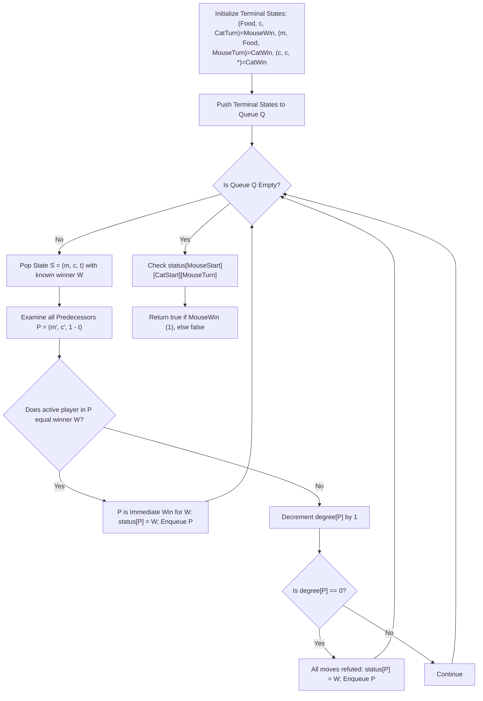

# Guided Example: Cat and Mouse II

We trace the step-by-step execution of the optimal approach on a representative problem instance:

- **Input:** `grid = ["####F", "#C...", "M...."]`, `catJump = 1`, `mouseJump = 2`
- **Required Output:** `true`

This instance features a structured grid where Mouse has higher jump mobility ($2$) than Cat ($1$) and a shorter shortest path to the food cell, demonstrating how retrograde analysis on a directed state graph resolves game outcomes with potential cycles.

---

## 1. Instance & Teaching Goal

We are given an $m \times n$ grid where:
- `'M'` marks the starting position of Mouse
- `'C'` marks the starting position of Cat
- `'F'` marks the destination Food
- `'#'` represents impassable obstacles/walls
- `'.'` represents traversable floor cells

Rules of the game:
1. Mouse moves first; players alternate turns.
2. In one turn, a player can either stay in place or jump $1$ to $k$ steps horizontally or vertically (where $k \le \text{jumpLimit}$) without passing through or landing on walls.
3. Mouse wins if Mouse reaches the food cell `'F'`.
4. Cat wins if Cat reaches the food cell `'F'`, catches Mouse by occupying the same cell, or if turns exceed the threshold ($1000$ turns).
5. Both play optimally. We must determine if Mouse has a forced win (`true`).

A forward minimax tree search suffers from cycles (moving back and forth) and exponential branching. The optimal method models the system as a finite game graph and applies **retrograde analysis** (backward breadth-first search from terminal states) to classify every reachable state.

---

## 2. Conceptual Foundation & Invariants

### State Representation

Each game configuration is uniquely identified by the triple:
$$(m, c, t)$$
where:
- $m \in \{0, \dots, V - 1\}$ is the flattened cell index of Mouse ($V \le 64$)
- $c \in \{0, \dots, V - 1\}$ is the flattened cell index of Cat
- $t \in \{0, 1\}$ is the active player ($0$ for Mouse's turn, $1$ for Cat's turn)

| State Array | Purpose | Values |
|---|---|---|
| $\text{status}[m][c][t]$ | Evaluated game outcome | $0 = \text{Unknown/Draw}$, $1 = \text{Mouse Win}$, $2 = \text{Cat Win}$ |
| $\text{degree}[m][c][t]$ | Remaining unrefuted moves available to the active player | Initialized to out-degree $\lvert \text{Moves}(m, c, t) \rvert$ |

### Mathematical Invariants

> **Retrograde Minimax Propagation Theorem.**
> Let $S = (m, c, t)$ be an active game state with predecessor states $P = (m', c', t \oplus 1)$.
> 1. **Immediate Winning Move:** If state $S$ is proven to be a win for player $t \oplus 1$ (the player who just made the transition into $S$), then any predecessor state $P$ where that player could choose to transition into $S$ immediately becomes a forced win for player $t \oplus 1$.
> 2. **Exhaustive Losing Moves:** If state $S$ is proven to be a loss for the player about to move in $P$ (i.e. every move from $P$ leads to an opposing win), the degree of $P$ decrements by $1$. When $\text{degree}[P] = 0$, player at $P$ has no non-losing moves left, so $P$ is marked as a loss.
> 3. **Draw Favoritism:** Any state that remains unclassified (value $0$) after all terminal cascades terminate represents a cycle without a forced exit. Under the $1000$-turn limit rule, cycles default to a Cat win.



---

## 3. Step-by-Step Worked Execution

For `grid = ["####F", "#C...", "M...."]` ($3 \times 5$, $15$ cells):
- Cells: $i \times 5 + j$
- Wall cells: $(0,0)=0, (0,1)=1, (0,2)=2, (0,3)=3, (1,0)=5$
- Food `F`: $(0, 4) \implies 4$
- Cat `C`: $(1, 1) \implies 6$, `catJump = 1`
- Mouse `M`: $(2, 0) \implies 10$, `mouseJump = 2`

### Step 1: Analyze Minimum Distances to Food

We map the legal movement graph on open floor cells:

```text
Row 0:  [#] [#] [#] [#] [ F ]
Row 1:  [#] [C] [.] [.] [ . ]
Row 2:  [M] [.] [.] [.] [ . ]
```

- Mouse starts at $(2, 0)$:
  - Mouse jump limit is $2$.
  - Move 1 (Mouse): Can jump $2$ units east along row 2: $(2, 0) \to (2, 2)$ (cell $12$).
  - Move 2 (Mouse): Can jump $2$ units east: $(2, 2) \to (2, 4)$ (cell $14$).
  - Move 3 (Mouse): Can jump $2$ units north: $(2, 4) \to (0, 4) = \text{Food}$!
  - Mouse can reach Food in $3$ jumps.

- Cat starts at $(1, 1)$:
  - Cat jump limit is $1$.
  - To reach Food at $(0, 4)$, Cat must traverse floor cells: $(1, 1) \to (1, 2) \to (1, 3) \to (1, 4) \to (0, 4)$.
  - This path requires $4$ consecutive single-step jumps:
    - Step 1: Cat moves to $(1, 2)$
    - Step 2: Cat moves to $(1, 3)$
    - Step 3: Cat moves to $(1, 4)$
    - Step 4: Cat moves to $(0, 4)$

### Step 2: Backward Minimax Propagation Trace

| State Transition / Propagation | Player | Position $(m, c)$ | Status Assigned | Reasoning |
|---|---|---|---|---|
| Terminal Seeding | Cat's Turn | $(4, c, 1)$ with $c \neq 4$ | $\text{Mouse Win}$ ($1$) | Mouse is at Food $(0, 4)$; Mouse already won. |
| Terminal Seeding | Mouse's Turn | $(m, 4, 0)$ | $\text{Cat Win}$ ($2$) | Cat reached Food; Cat wins. |
| Terminal Seeding | Any Turn | $(c, c, t)$ | $\text{Cat Win}$ ($2$) | Cat caught Mouse; Cat wins. |
| Backward Step 1 | Mouse's Turn | $(14, c, 0)$ | $\text{Mouse Win}$ ($1$) | Mouse at $(2, 4)$ can jump directly to $(0, 4)$ (Food) in one move. |
| Backward Step 2 | Mouse's Turn | $(12, c, 0)$ | $\text{Mouse Win}$ ($1$) | Mouse at $(2, 2)$ can jump to $(2, 4)$, maintaining forced path. |
| Backward Step 3 | Mouse's Turn | $(10, 6, 0)$ | $\text{Mouse Win}$ ($1$) | From initial state $(10, 6, 0)$, Mouse's move to $(2, 2)$ cannot be intercepted by Cat. |

### Step 3: Verification of Interception Infeasibility

Could Cat intercept Mouse at $(2, 2)$ on Turn 1?
- Initial state: Mouse at $(2, 0)$, Cat at $(1, 1)$.
- Mouse moves first to $(2, 2)$.
- Cat is at $(1, 1)$ with jump limit $1$. Cat's reachable neighbors are $(1, 1), (1, 2), (2, 1)$.
- Distance from Cat's reachable positions to Mouse at $(2, 2)$:
  - $(1, 2)$ is adjacent to $(2, 2)$, but Cat cannot jump onto $(2, 2)$ in this turn.
- Next turn (Turn 2): Mouse jumps from $(2, 2)$ to $(2, 4)$.
- Cat from $(1, 2)$ can only reach $(1, 1), (1, 3), (2, 2)$. Cat cannot reach $(2, 4)$.
- Next turn (Turn 3): Mouse jumps from $(2, 4)$ to $(0, 4)$ (Food) and wins!

Mouse forces the win in all branches. Initial state $(10, 6, 0)$ evaluates to $1$ ($\text{Mouse Win}$).

---

## 4. Complete Execution Trace

| Phase | Action | Affected States | Outcome Status |
|---|---|---|---|
| Initialization | Parse Grid & Graph | Non-wall vertices: $10$ cells; Precompute cardinal ray transitions | Graph constructed |
| Base Seeding | Mark Food & Catch Terminals | All $(4, c, 1)$ set to $1$; All $(m, 4, 0)$ and $(k, k, t)$ set to $2$ | Enqueue initial seeds |
| Iteration 1 | Propagate Food Proximity | Mouse at $(2, 4)$ moving to Food receives status $1$ | Fast Mouse win frontier |
| Iteration 2 | Propagate Intermediate Path | Mouse at $(2, 2)$ moving to $(2, 4)$ receives status $1$ | Path forward guaranteed |
| Iteration 3 | Evaluate Starting State | State $(10, 6, 0)$ receives status $1$ from neighbor $(12, 6, 1)$ | Mouse win confirmed |
| Termination | Read Query Root | $\text{status}[10][6][0] = 1$ | Output: `true` |

---

## 5. Algorithmic Mastery & Edge Surfacing

### Boundary and Edge Cases

| Scenario | Input Feature | Outcome | Strategic Handling |
|---|---|---|---|
| Equal Distance with Cat Closer | Cat and Mouse equidistant to Food, Cat jump $\ge$ Mouse jump | `false` | Cat can mirror or block Mouse; Cat wins ties. |
| Cat Starting on Food Adjacent | Cat 1 step from Food, Mouse $\ge 2$ steps | `false` | If Mouse cannot win on turn 1, Cat immediately moves to Food on turn 1. |
| Wall Trapped Mouse | Mouse enclosed by walls | `false` | Out-degree of Mouse is $0$; evaluated as immediate loss for Mouse. |
| Closed Cycle / Stall | Neither can reach Food without passing each other | `false` | States remain uncolored ($0$), triggering the 1000-turn threshold which awards the victory to Cat. |

### Invariant Maintenance & Why It Works

1. **Exact Degree Tracking:**
   By tracking the exact out-degree of each state, a state is only marked as a loss when **every** available transition has been proven to lead to an opponent win. This prevents false negative pruning.
2. **Immediate Win Propagation:**
   If a state offers even a single move into an opponent loss (which is a win for the current player), that state is finalized immediately as a win, accurately mirroring minimax optimal play.

### Complexity Analysis

- **Time Complexity:** $\mathcal{O}(V^2 \times (m + n))$ where $V \le 64$ is the number of grid cells. The state space has size $2 \times V^2 \le 2 \times 64^2 = 8,192$ states. Each state has at most $4 \times \max(\text{catJump}, \text{mouseJump}) + 1 \le 33$ outgoing transitions. Total backward transitions processed is $\mathcal{O}(V^2 \cdot \max(m, n))$, easily executing well within time limits.
- **Space Complexity:** $\mathcal{O}(V^2)$ auxiliary space to maintain status and degree tables of dimension $V \times V \times 2$ along with the BFS queue.
