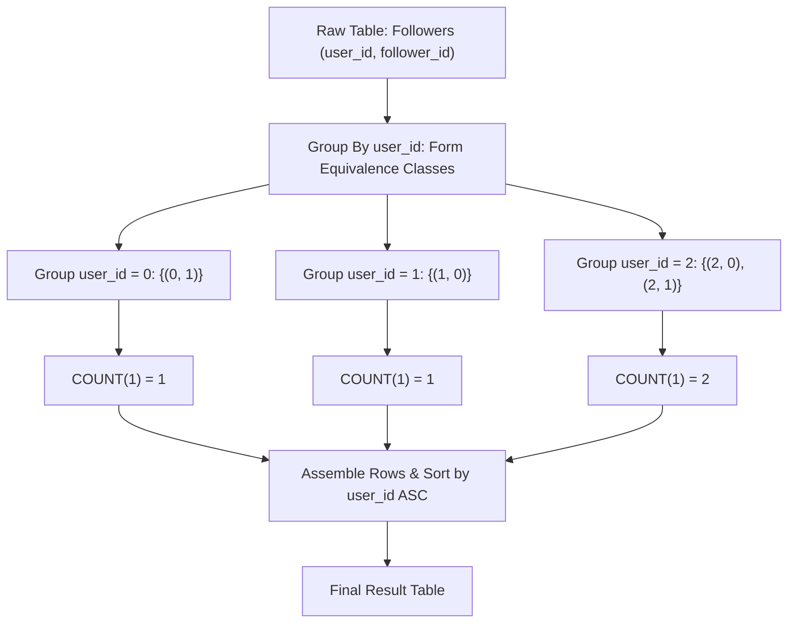

# Guided Example: Find Followers Count

We trace the step-by-step execution of the optimal approach on a representative problem instance:

- **Input Table (`Followers`):**
  | `user_id` | `follower_id` |
  |---|---|
  | `0` | `1` |
  | `1` | `0` |
  | `2` | `0` |
  | `2` | `1` |
- **Required Output:**
  | `user_id` | `followers_count` |
  |---|---|
  | `0` | `1` |
  | `1` | `1` |
  | `2` | `2` |

This instance contains multiple users with differing numbers of followers, including single-follower users and multi-follower users, illustrating how relational partitioning and aggregation operate on a composite-keyed table.

---

## 1. Instance & Teaching Goal

We are given a relational table `Followers` with schema:
$$( \text{user\_id} : \text{INT}, \text{follower\_id} : \text{INT} )$$
where the composite pair $(\text{user\_id}, \text{follower\_id})$ forms the primary key.

Our goal is to compute the total number of followers for each user and return the result ordered strictly by `user_id` in ascending order.

A naive conceptual approach might attempt nested subqueries or manual deduplication. Because the schema enforces that $(\text{user\_id}, \text{follower\_id})$ is the primary key, each row in `Followers` already denotes a unique user-follower pairing. Thus, a direct grouping by `user_id` followed by cardinality counting $\text{COUNT}(1)$ and sorting yields the exact result.

---

## 2. Conceptual Foundation & Invariants

### State Representation

| Relational Phase | Algebraic Operator | Target Output Structure |
|---|---|---|
| Grouping | $\gamma_{\text{user\_id}}$ | Partitioned subsets by distinct followed user |
| Aggregation | $\text{COUNT}(1) \to \text{followers\_count}$ | Scalar cardinality per user partition |
| Ordering | $\tau_{\text{user\_id} \uparrow}$ | Deterministically sorted rows by primary identifier |

### Mathematical Invariants

> **Composite Primary Key Uniqueness Theorem.**
> Let $R \subseteq \mathcal{U} \times \mathcal{F}$ be a relation where $(\text{user\_id}, \text{follower\_id})$ is the designated primary key.
> For any user $u \in \mathcal{U}$, the fiber $R_u = \{ (u, f) \in R \}$ contains strictly distinct follower elements $f$. Consequently, the number of distinct followers of user $u$ is identically equal to the row cardinality:
> $$|\{ f : (u, f) \in R \}| = |R_u| = \sum_{(u, f) \in R} 1$$
> No explicit `DISTINCT` keyword is required in the aggregation.

---

## 3. Step-by-Step Worked Execution

We process the input rows:
$$R = \{ (0, 1), (1, 0), (2, 0), (2, 1) \}$$

### Step 1: Partition Relation into Equivalence Classes by `user_id`

We partition all tuples $(u, f) \in R$ based on the equality relation $u_1 = u_2$:

1. **Partition $G_0$ ($\text{user\_id} = 0$):**
   - Matching tuples: $[(0, 1)]$
2. **Partition $G_1$ ($\text{user\_id} = 1$):**
   - Matching tuples: $[(1, 0)]$
3. **Partition $G_2$ ($\text{user\_id} = 2$):**
   - Matching tuples: $[(2, 0), (2, 1)]$

All 4 source rows are accounted for across the 3 distinct groups.

### Step 2: Evaluate Group Aggregations

We compute the aggregate count for each group partition:

| Partition Group | Elements in Partition | Count Calculation | Derived Attribute `followers_count` |
|---|---|---|---|
| $\text{user\_id} = 0$ | $\{(0, 1)\}$ | $|G_0| = 1$ | $1$ |
| $\text{user\_id} = 1$ | $\{(1, 0)\}$ | $|G_1| = 1$ | $1$ |
| $\text{user\_id} = 2$ | $\{(2, 0), (2, 1)\}$ | $|G_2| = 2$ | $2$ |

### Step 3: Order by `user_id` Ascending

The target specification mandates ordering by `user_id` ascending:
- $\text{user\_id} = 0 < 1 < 2$

Sorting the partitioned rows yields the exact sequence:
1. `(0, 1)`
2. `(1, 1)`
3. `(2, 2)`

---

## 4. Complete Execution Trace

| Step | Operation | Intermediate State | Comment |
|---|---|---|---|
| $1$ | Table Scan | $4$ tuples read from `Followers` | Complete input ingestion |
| $2$ | Group By $\text{user\_id}$ | $3$ groups formed: $\{0, 1, 2\}$ | Unique users established |
| $3$ | Aggregate $\text{COUNT}(1)$ | $(0 \mapsto 1), (1 \mapsto 1), (2 \mapsto 2)$ | Direct primary key counting |
| $4$ | Sort by $\text{user\_id}$ ASC | $[(0, 1), (1, 1), (2, 2)]$ | Monotonic ordering enforced |

---

## 5. Algorithmic Mastery & Edge Surfacing

### Boundary and Edge Cases

| Scenario | Input Feature | Outcome | Strategic Handling |
|---|---|---|---|
| Single User with Multiple Followers | All rows have identical `user_id` | Single row output with total count | Single partition formed; all rows aggregated into one. |
| Multiple Users with One Follower Each | Distinct `user_id` on every row | As many output rows as input rows, all with count $1$ | Each partition has size $1$. |
| Non-Consecutive User Identifiers | `user_id` values like $10, 100, 5$ | Ordered as $5, 10, 100$ | Standard integer ascending sort comparator applies. |
| User Who Follows but Has No Followers | User only appears in `follower_id` column | User does not appear in output | The problem asks for followers *of each user* in the table; only users present in `user_id` are grouped. |

### Invariant Maintenance & Why It Works

1. **Why `COUNT(1)` vs `COUNT(follower_id)` vs `COUNT(DISTINCT follower_id)`:**
   Because $(\text{user\_id}, \text{follower\_id})$ is the primary key, `follower_id` cannot be null and duplicate follower pairings cannot exist for a given `user_id`. Therefore, `COUNT(1)` evaluates identically to distinct count with lower computational overhead.
2. **Order Determinism:**
   An explicit `ORDER BY user_id` guarantees deterministic output order across all database engines regardless of storage engine partition layouts.

### Complexity Analysis

- **Time Complexity:** $\mathcal{O}(N \log N)$ where $N$ is the number of rows in `Followers`. Scanning and hashing into groups takes $\mathcal{O}(N)$ average time. Sorting $U \le N$ unique users takes $\mathcal{O}(U \log U)$ time.
- **Space Complexity:** $\mathcal{O}(U)$ auxiliary memory where $U$ is the number of distinct `user_id` values, required to maintain group aggregation states before projection.
